# WebSocket Authentication Bug Fix Report
**Date:** September 7, 2025  
**Issue:** WebSocket connections failing with HTTP 403 Forbidden in staging environment  
**Severity:** ULTRA CRITICAL - Blocking all staging tests  
**Status:** 🔍 **INVESTIGATING**

## Executive Summary

All WebSocket connections to `wss://api.staging.netrasystems.ai/ws` are immediately failing with HTTP 403 Forbidden, while REST API endpoints using the same JWT tokens work perfectly. This is blocking 6 critical staging tests and preventing proper staging environment validation.

## FIVE WHYS ROOT CAUSE ANALYSIS

### WHY #1: Why do WebSocket connections get 403 while REST works?

**Finding:** WebSocket and REST endpoints use **completely different authentication mechanisms**:

- **REST endpoints:** Use `FastAPIAuthMiddleware` which validates JWT tokens via the `validate_token_with_resilience()` function
- **WebSocket endpoints:** Are **explicitly excluded** from FastAPI auth middleware and handle authentication separately using `extract_websocket_user_context()` function

**Evidence:**
```python
# In netra_backend/app/core/middleware_setup.py:114-124
app.add_middleware(
    FastAPIAuthMiddleware,
    excluded_paths=[
        "/health", "/metrics", "/", "/docs", "/openapi.json", "/redoc",
        "/ws", "/websocket", "/ws/test", "/ws/config", "/ws/health", "/ws/stats",  # ← EXCLUDED!
        "/api/v1/auth", "/api/auth", "/auth"
    ]
)
```

### WHY #2: Why does WebSocket authentication fail when REST authentication succeeds?

**Finding:** WebSocket authentication uses `UserContextExtractor` which calls `get_unified_jwt_secret()` from `shared.jwt_secret_manager`, but this may be resolving to a **different JWT secret** than what the REST auth middleware uses.

**Evidence:**
```python
# In netra_backend/app/websocket_core/user_context_extractor.py:84-87
try:
    from shared.jwt_secret_manager import get_unified_jwt_secret
    secret = get_unified_jwt_secret()
    logger.debug("Using unified JWT secret manager for consistent secret resolution")
    return secret
except Exception as e:
    logger.error(f"Failed to use unified JWT secret manager: {e}")
    # Falls back to different resolution logic!
```

### WHY #3: Why would JWT secrets differ between REST and WebSocket authentication?

**Finding:** The **JWT secret resolution logic is different**:

1. **REST middleware** (`FastAPIAuthMiddleware`) uses `validate_token_with_resilience()` which eventually calls the auth service's JWT secret resolution
2. **WebSocket authentication** (`UserContextExtractor`) uses `shared.jwt_secret_manager.get_unified_jwt_secret()` directly

**Critical Issue:** These two paths may resolve different JWT secrets in the staging environment, causing signature validation failures.

### WHY #4: Why would staging environment have different JWT secret resolution?

**Finding:** Staging environment has specific JWT secret requirements and the unified JWT secret manager has complex fallback logic:

```python
# Priority order in shared/jwt_secret_manager.py:
# 1. JWT_SECRET_STAGING (environment-specific)
# 2. JWT_SECRET_KEY (generic)
# 3. JWT_SECRET (legacy)
# 4. GCP Secret Manager fallbacks
# 5. Development fallbacks (not allowed in staging)
```

**Hypothesis:** The auth service and WebSocket authentication are resolving different secrets due to environment variable configuration or GCP Secret Manager access issues.

### WHY #5: Why would environment variables or Secret Manager cause inconsistent resolution?

**Finding:** Multiple potential causes identified:

1. **GCP Secret Manager Access:** WebSocket code may not have proper GCP credentials or project access
2. **Environment Variable Priority:** Different services may have different environment variables set
3. **Caching Issues:** JWT secret manager uses caching that may be stale or inconsistent
4. **Service Deployment Timing:** Auth service may be using cached secrets while backend uses fresh resolution

## MERMAID DIAGRAMS

### IDEAL WebSocket Authentication Flow


### CURRENT Failing WebSocket Authentication Flow

```mermaid
sequenceDiagram
    participant Client
    participant WSEndpoint as WebSocket Endpoint
    participant Extractor as UserContextExtractor
    participant JWTManager as JWT Secret Manager
    participant AuthService as Auth Service

    Client->>WSEndpoint: Connect with Authorization: Bearer <token>
    WSEndpoint->>Extractor: extract_websocket_user_context()
    Extractor->>JWTManager: get_unified_jwt_secret()
    JWTManager->>JWTManager: ❌ Resolves DIFFERENT secret
    JWTManager-->>Extractor: ❌ Wrong secret vs auth service
    Extractor->>Extractor: ❌ jwt.decode() fails - signature mismatch
    Extractor-->>WSEndpoint: ❌ HTTPException(401)  
    WSEndpoint-->>Client: ❌ 403 Connection Rejected

    Note over JWTManager: Possible causes:<br/>- Different env vars<br/>- GCP access issues<br/>- Caching problems<br/>- Service timing
```


## SYSTEM-WIDE IMPACT ANALYSIS

### Files That Need Investigation/Updates:

1. **WebSocket Authentication:**
   - `netra_backend/app/websocket_core/user_context_extractor.py` - JWT extraction and validation
   - `netra_backend/app/routes/websocket.py` - WebSocket endpoint authentication logic

2. **JWT Secret Management:**
   - `shared/jwt_secret_manager.py` - Unified JWT secret resolution
   - Environment variable configuration in staging
   - GCP Secret Manager configuration

3. **Middleware Configuration:**
   - `netra_backend/app/core/middleware_setup.py` - WebSocket exclusions
   - `netra_backend/app/middleware/fastapi_auth_middleware.py` - REST authentication

4. **Configuration and Deployment:**
   - Staging environment variable setup
   - GCP Secret Manager permissions
   - Service deployment configurations

## HYPOTHESES FOR TESTING

### Primary Hypothesis: JWT Secret Mismatch
**Test:** Compare the actual JWT secrets being used by:
1. Auth service token generation
2. REST endpoint token validation  
3. WebSocket endpoint token validation

### Secondary Hypothesis: GCP Secret Manager Access
**Test:** Check if WebSocket authentication can access GCP Secret Manager in staging environment

### Tertiary Hypothesis: Environment Variable Configuration
**Test:** Verify that `JWT_SECRET_STAGING` or `JWT_SECRET_KEY` are properly set and consistent

## NEXT STEPS

1. **Immediate Diagnosis:**
   - Add debug logging to WebSocket authentication to log actual JWT secret being used
   - Compare JWT secret hashes between REST and WebSocket authentication
   - Check GCP Secret Manager access from WebSocket context

2. **Root Cause Verification:**
   - Create test that reproduces the 403 error
   - Validate JWT token generation vs validation using same test token

3. **Fix Implementation:**
   - Ensure WebSocket and REST authentication use identical JWT secret resolution
   - Add comprehensive error handling and logging for staging environment

## BUSINESS IMPACT

- **Critical:** All staging tests are blocked, preventing deployment validation
- **Revenue Impact:** Cannot validate $50K MRR WebSocket functionality in staging
- **Development Velocity:** Team cannot validate changes in staging environment
- **Customer Impact:** Potential production issues if staging validation is bypassed

## EXPECTED FIX TIMELINE

- **Diagnosis:** 2-4 hours (comprehensive logging and testing)
- **Fix Implementation:** 1-2 hours (JWT secret consistency)  
- **Validation:** 1-2 hours (staging test verification)
- **Total:** 4-8 hours for complete resolution

## STATUS LOG

- **2025-09-07 Initial Investigation:** Identified separate auth mechanisms for REST vs WebSocket
- **2025-09-07 Five Whys Analysis:** Completed root cause analysis focusing on JWT secret resolution
- **Next:** Add comprehensive logging and create reproduction test

---
*This report will be updated as investigation progresses and fixes are implemented.*