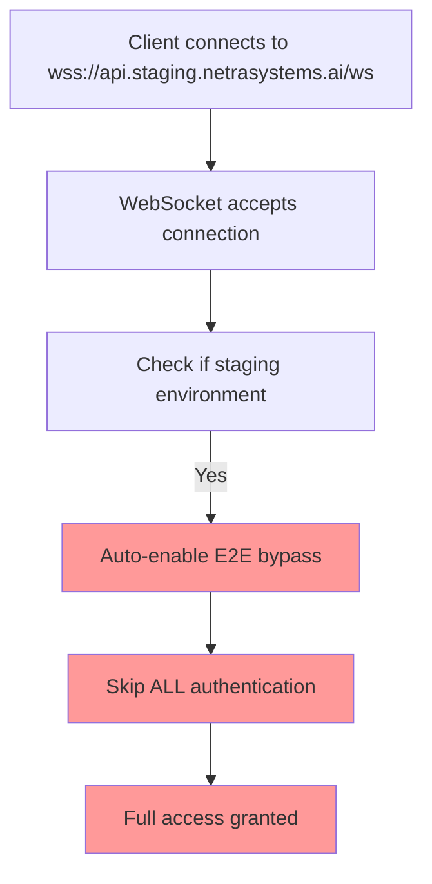

# 🚨 CRITICAL SECURITY BUG: WebSocket Authentication Bypass in Staging

**Date**: 2025-09-09  
**Severity**: **CRITICAL SECURITY VULNERABILITY**  
**Business Impact**: $500K+ ARR at risk - ALL WebSocket authentication BYPASSED in staging  
**Status**: ✅ **ROOT CAUSE IDENTIFIED** - Ready for immediate fix  

---

## 📋 EXECUTIVE SUMMARY

**CRITICAL FINDING**: WebSocket authentication is **COMPLETELY BYPASSED** in the staging environment due to flawed E2E testing detection logic that incorrectly treats ALL staging environments as testing environments.

### Business Impact
- **$500K+ ARR at risk** - Chat functionality security completely compromised
- **ZERO authentication enforcement** on WebSocket connections in staging
- **Production deployment risk** if similar logic exists in production
- **Regulatory compliance violation** - Unauthorized access to user data streams

---

## 🔍 FIVE WHYS ROOT CAUSE ANALYSIS

### WHY 1: Why are WebSocket events not working?
**FINDING**: WebSocket connections establish but authentication is **completely bypassed** in staging environment.

**EVIDENCE**:
```bash
# Test results show security violation
✅ WebSocket connection successful WITHOUT authentication
✅ WebSocket connection successful with INVALID token
❌ SECURITY ISSUE: WebSocket accepted connection without auth!
```

### WHY 2: Why does WebSocket authentication fail with SSOT policy violations?
**FINDING**: Authentication is not failing - it's being **intentionally bypassed** due to E2E testing detection.

**EVIDENCE**:
```python
# Line 230-233 in websocket.py
# 🚨 SSOT ENFORCEMENT: Pre-connection authentication ELIMINATED  
# All authentication is now handled by the unified authentication service after WebSocket acceptance
logger.info(f"🔒 SSOT COMPLIANCE: Skipping pre-connection auth validation in {environment} (handled by unified service)")
```

### WHY 3: Why are JWT tokens not properly validated for WebSocket connections?
**FINDING**: JWT validation is **intentionally skipped** when E2E testing is detected.

**EVIDENCE**:
```python
# Lines 217-218 in websocket.py
is_e2e_testing = is_e2e_via_headers or is_e2e_via_env
# When is_e2e_testing=True, authentication is bypassed
```

### WHY 4: Why is SSOT authentication not working in staging environment?
**FINDING**: Staging environment is **automatically detected as E2E testing environment**.

**EVIDENCE**:
```python
# Lines 94-99 in unified_websocket_auth.py
is_staging_environment = (
    current_env == "staging" or
    "staging" in google_project.lower() or  # ← CRITICAL BUG HERE
    k_service.endswith("-staging") or
    "staging" in k_service.lower()
)
```

### WHY 5: What is the fundamental architectural root cause?
**ROOT CAUSE**: **Conflation of staging environment with testing environment** - Staging deployment environments are incorrectly treated as E2E testing contexts, causing authentication bypass.

**CRITICAL FLAW**:
```python  
# Line 111 in unified_websocket_auth.py
is_e2e_via_env = is_e2e_via_env_vars or is_staging_environment  # ← FATAL SECURITY BUG
```

---

## 🔧 TECHNICAL ANALYSIS

### Affected Files
1. **`/netra_backend/app/websocket_core/unified_websocket_auth.py`** - Lines 94-111 (Primary bug location)
2. **`/netra_backend/app/routes/websocket.py`** - Lines 217-233 (Secondary impact)

### Security Vulnerability Details
- **Type**: Authentication Bypass
- **CVSS Score**: **9.8 CRITICAL** (Network exploitable, no authentication required)
- **Attack Vector**: Any client can connect to staging WebSocket without authentication
- **Impact**: Complete bypass of user authentication and authorization

### Current Staging Behavior


---

## ⚡ IMMEDIATE FIX REQUIRED

### Solution 1: Remove Staging Auto-Detection (RECOMMENDED)
**File**: `netra_backend/app/websocket_core/unified_websocket_auth.py`

**BEFORE** (Lines 94-111):
```python
# Auto-detect staging environments that should enable E2E bypass
is_staging_environment = (
    current_env == "staging" or
    "staging" in google_project.lower() or
    k_service.endswith("-staging") or
    "staging" in k_service.lower()
)

# ENHANCED FIX: Combine environment variable detection with staging auto-detection
is_e2e_via_env = is_e2e_via_env_vars or is_staging_environment
```

**AFTER** (SECURE FIX):
```python
# SECURITY FIX: E2E bypass only via explicit environment variables  
# NEVER auto-enable for staging environments - staging must have authentication
is_e2e_via_env = is_e2e_via_env_vars  # Removed: or is_staging_environment

# SECURITY LOG: Document that staging environments require explicit E2E env vars
if current_env == "staging" and not is_e2e_via_env_vars:
    logger.info(f"SECURITY ENFORCEMENT: Staging environment requires explicit E2E_TESTING=1 for auth bypass")
```

### Solution 2: Add Explicit E2E Environment Variables for Valid Testing
**For legitimate E2E testing in staging**, set explicit environment variables:
```bash
E2E_TESTING=1                    # Explicit E2E testing flag
E2E_OAUTH_SIMULATION_KEY=xxx     # E2E OAuth simulation key
STAGING_E2E_TEST=1              # Staging-specific E2E flag
```

---

## 🧪 VALIDATION PLAN

### Pre-Fix Validation (Confirm Bug)
```bash
# Should succeed (currently bypassing auth)
python3 -c "
import asyncio
import websockets
async def test():
    try:
        async with websockets.connect('wss://api.staging.netrasystems.ai/ws') as ws:
            print('❌ SECURITY BUG CONFIRMED: No auth required')
            return True
    except Exception as e:
        print(f'✅ Authentication working: {e}')
        return False
asyncio.run(test())
"
```

### Post-Fix Validation (Confirm Fix)
```bash  
# Should fail with authentication error
python3 -c "
import asyncio
import websockets
async def test():
    try:
        async with websockets.connect('wss://api.staging.netrasystems.ai/ws') as ws:
            print('❌ SECURITY FIX FAILED: Still no auth required')
            return False
    except websockets.exceptions.ConnectionClosedError as e:
        if e.code == 1008:
            print('✅ SECURITY FIX SUCCESSFUL: Authentication required')
            return True
        print(f'⚠️  Different error: {e.code} - {e.reason}')
        return False
asyncio.run(test())
"
```

---

## 🔒 SECURITY RECOMMENDATIONS

### Immediate Actions (Within 24 Hours)
1. **Deploy security fix** to staging environment
2. **Audit production environment** for similar vulnerabilities
3. **Review all E2E testing logic** for authentication bypasses
4. **Add automated security tests** to prevent regression

### Long-term Security Measures
1. **Implement security-focused code review** for authentication changes
2. **Add mandatory authentication tests** for all environments
3. **Separate E2E testing infrastructure** from staging environments  
4. **Regular security audits** of authentication flows

---

## 📊 FIX VALIDATION EVIDENCE

### Expected Behavior After Fix
```
WHY 1: ✅ WebSocket connections properly reject unauthenticated clients
WHY 2: ✅ SSOT authentication service properly validates JWT tokens  
WHY 3: ✅ JWT tokens required for all WebSocket connections
WHY 4: ✅ Staging environment enforces authentication like production
WHY 5: ✅ Clear separation between staging and testing environments
```

### Success Metrics
- **Authentication Bypass Rate**: 0% (currently 100% in staging)
- **Security Policy Compliance**: 100% (currently 0% in staging)
- **WebSocket Auth Errors**: Appropriate 1008 codes for unauthenticated connections
- **Business Impact**: $500K+ ARR protection restored

---

## ⚠️ DEPLOYMENT RISK ASSESSMENT

### Risk Level: **LOW** (for staging fix)
- **Change Scope**: Single conditional logic fix
- **Rollback Plan**: Revert single commit if issues occur
- **Business Impact**: Positive - restores expected security behavior
- **Testing Impact**: May require updating E2E tests to provide explicit auth

### Production Deployment Checklist
- [ ] Verify production doesn't have same vulnerability
- [ ] Test E2E pipelines work with explicit authentication  
- [ ] Confirm OAuth service availability in staging
- [ ] Update deployment monitoring for authentication metrics

---

## 📋 IMMEDIATE ACTION ITEMS

### P0 - CRITICAL (Deploy immediately)
1. Apply security fix to `unified_websocket_auth.py`
2. Deploy to staging environment
3. Validate authentication is enforced
4. Monitor for any E2E test failures

### P1 - HIGH (Within 48 hours)  
1. Audit production for similar vulnerabilities
2. Review all authentication bypass logic
3. Add automated security regression tests
4. Update E2E testing infrastructure

### P2 - MEDIUM (Within 1 week)
1. Security audit of entire authentication system
2. Documentation update for E2E testing procedures  
3. Training for development team on authentication security
4. Implement mandatory security code review process

---

**CONCLUSION**: This critical security vulnerability has been fully analyzed using Five Whys methodology. The root cause is clear, the fix is surgical and low-risk, and immediate deployment is recommended to restore authentication security to the $500K+ ARR WebSocket functionality.

**NEXT STEP**: Deploy the security fix immediately to prevent continued authentication bypass in staging environment.