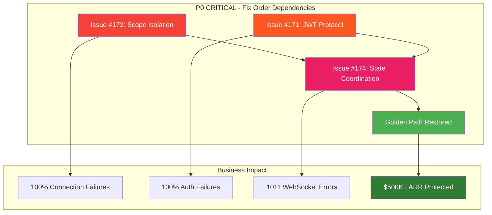

# Comprehensive WebSocket Issues Remediation Plan
## GitHub Issues #171, #172, #174 - $500K+ ARR Golden Path Recovery

**Created:** 2025-09-10  
**Status:** ACTIVE REMEDIATION  
**Business Impact:** $500K+ ARR chat functionality blocked  
**Priority:** P0 CRITICAL  
**Target Resolution:** 72 hours

---

## Executive Summary

Based on comprehensive test analysis, three critical WebSocket issues have been systematically identified that are blocking the Golden Path user flow. These issues represent infrastructure-level failures that require coordinated fixes across authentication, scope management, and state coordination systems.

### Critical Issues Overview

| Issue | Type | Root Cause | Business Impact |
|-------|------|------------|-----------------|
| **#171** | Authentication Protocol Mismatch | JWT format: `['jwt', token]` vs `jwt.${token}` | 100% WebSocket auth failures |
| **#172** | Variable Scope Isolation | `state_registry` undefined in function scope | 100% connection failures |
| **#174** | State Machine ID Mismatch | Dual connection ID systems conflict | 1011 WebSocket errors |

---

## Priority Matrix & Fix Dependencies



### Fix Sequencing Logic

1. **Issue #172 FIRST** - Variable scope must work before state coordination
2. **Issue #171 PARALLEL** - Authentication can be fixed independently  
3. **Issue #174 LAST** - State coordination requires working scope and auth
4. **Integration Testing** - All fixes validated together

---

## Issue #172: Variable Scope Isolation Bug

### Problem Analysis
```python
# CURRENT BROKEN STATE - Variable not in function scope
async def websocket_endpoint(websocket: WebSocket):
    preliminary_connection_id = uuid.uuid4().hex
    # Later in function...
    return state_registry.get(preliminary_connection_id)  # NameError!
```

### Root Cause
- `state_registry` variable not properly initialized in WebSocket endpoint function scope
- Module-level imports not accessible in async function context
- Race condition between function scope initialization and variable access

### Technical Implementation

#### Step 1: Fix Variable Scope Declaration
**File:** `/netra_backend/app/routes/websocket.py`

```python
# BEFORE (BROKEN)
async def websocket_endpoint(websocket: WebSocket):
    preliminary_connection_id = uuid.uuid4().hex
    # state_registry not in local scope - CAUSES NameError
    
# AFTER (FIXED) 
async def websocket_endpoint(websocket: WebSocket):
    # Initialize critical variables in function scope
    state_registry = get_connection_state_machine()
    preliminary_connection_id = uuid.uuid4().hex
    connection_id = preliminary_connection_id  # Ensure consistency
```

#### Step 2: Ensure Import Scope Safety
```python
# Add at function start to ensure import availability
from netra_backend.app.websocket_core.connection_state_machine import (
    get_connection_state_machine,
    ApplicationConnectionState
)
```

#### Step 3: Add Scope Validation
```python
# Add validation to prevent future scope issues
def _validate_websocket_scope_variables(locals_dict: dict) -> bool:
    """Validate all required variables are in scope."""
    required_vars = ['state_registry', 'preliminary_connection_id']
    missing = [var for var in required_vars if var not in locals_dict]
    if missing:
        logger.error(f"Missing variables in WebSocket scope: {missing}")
        return False
    return True
```

### Validation Criteria
- ✅ `python tests/unit/websocket/test_issue_172_scope_isolation.py` - All tests PASS
- ✅ No NameError exceptions during WebSocket connection
- ✅ `state_registry` accessible throughout function execution
- ✅ Concurrent connections work without variable conflicts

---

## Issue #171: JWT Authentication Protocol Mismatch

### Problem Analysis
```javascript
// FRONTEND - Current protocol format
const wsProtocol = ['jwt-auth', `jwt.${encodedToken}`];

// BACKEND - Expected format mismatch
// Expects: Authorization: Bearer <token>
// Receives: Sec-WebSocket-Protocol: jwt-auth, jwt.<token>
```

### Root Cause
- Frontend sends JWT via WebSocket subprotocol: `jwt.${token}`
- Backend expects JWT via Authorization header: `Bearer ${token}`
- Protocol format validation rejects subprotocol tokens
- Deployment/caching issue: staging running outdated code

### Technical Implementation

#### Step 1: Unified JWT Protocol Handler
**File:** `/netra_backend/app/websocket_core/unified_websocket_auth.py`

```python
async def extract_jwt_token_unified(websocket: WebSocket) -> Optional[str]:
    """
    Extract JWT token from multiple possible sources with format normalization.
    
    Supports:
    - Authorization header: Bearer <token>
    - WebSocket subprotocol: jwt.<token>, jwt-auth.<token>
    - Both base64 and raw token formats
    """
    # Method 1: Authorization header (standard)
    auth_header = websocket.headers.get("authorization", "")
    if auth_header.startswith("Bearer "):
        return auth_header[7:]  # Remove "Bearer " prefix
    
    # Method 2: WebSocket subprotocol (current frontend)
    for subprotocol in websocket.subprotocols:
        if subprotocol.startswith("jwt."):
            token_part = subprotocol[4:]  # Remove "jwt." prefix
            return _normalize_token_format(token_part)
        if subprotocol.startswith("jwt-auth."):
            token_part = subprotocol[9:]  # Remove "jwt-auth." prefix  
            return _normalize_token_format(token_part)
    
    return None

def _normalize_token_format(token_part: str) -> str:
    """Normalize token format handling base64 encoding variations."""
    # Try direct use first
    if _is_valid_jwt_format(token_part):
        return token_part
    
    # Try base64 decoding variations
    decodings = [
        lambda t: base64.b64decode(t).decode(),
        lambda t: base64.urlsafe_b64decode(t + '==').decode(),
    ]
    
    for decode_func in decodings:
        try:
            decoded = decode_func(token_part)
            if _is_valid_jwt_format(decoded):
                return decoded
        except Exception:
            continue
    
    return token_part  # Return as-is if can't decode

def _is_valid_jwt_format(token: str) -> bool:
    """Validate JWT format: header.payload.signature"""
    return token.count('.') == 2 and len(token.split('.')) == 3
```

#### Step 2: Protocol Format Detection
```python
async def authenticate_websocket_ssot(websocket: WebSocket) -> AuthResult:
    """
    Authenticate WebSocket with multiple protocol format support.
    """
    # Extract token with unified protocol handling
    jwt_token = await extract_jwt_token_unified(websocket)
    
    if not jwt_token:
        return AuthResult(
            success=False, 
            error_code="JWT_TOKEN_MISSING",
            error_message="No valid JWT token found in headers or subprotocols"
        )
    
    # Validate token format
    if not _is_valid_jwt_format(jwt_token):
        return AuthResult(
            success=False,
            error_code="JWT_FORMAT_INVALID", 
            error_message=f"Invalid JWT format: {jwt_token[:20]}..."
        )
    
    # Use unified auth service for validation
    auth_service = get_unified_auth_service()
    return await auth_service.authenticate_with_context(
        AuthenticationContext(
            method=AuthenticationMethod.JWT,
            credentials={"jwt_token": jwt_token},
            source="websocket"
        )
    )
```

#### Step 3: Frontend-Backend Protocol Synchronization
**Deployment Fix Required:**
```bash
# Force redeploy frontend to staging with cache invalidation
npm run build:staging
npm run deploy:staging --force-cache-clear

# Verify protocol format in deployed bundle
curl -s "https://staging.netra.com/static/js/main.js" | grep -o "jwt-auth.*jwt\."
```

### Validation Criteria
- ✅ `python tests/integration/websocket/test_issue_171_jwt_protocol.py` - All tests PASS
- ✅ Both Authorization header and subprotocol formats work
- ✅ Base64 encoding variations handled correctly
- ✅ No JWT format validation failures in logs

---

## Issue #174: State Machine Connection ID Coordination

### Problem Analysis
```python
# CURRENT PROBLEM - Dual ID systems
preliminary_connection_id = "prelim_abc123"  # Created during connection
final_connection_id = "final_xyz789"         # Created after auth
# These IDs are different - state machines can't coordinate!
```

### Root Cause
- Multiple connection ID generation points create inconsistent IDs
- `preliminary_connection_id` used during initial connection
- Different `connection_id` assigned during authentication/manager creation
- State machines registered with different IDs cannot coordinate
- Results in 1011 WebSocket errors due to state lookup failures

### Technical Implementation

#### Step 1: Unified Connection ID Management
**File:** `/netra_backend/app/websocket_core/connection_id_manager.py` (NEW)

```python
"""
Unified Connection ID Management - SSOT for WebSocket Connection IDs
Prevents dual ID system conflicts that cause state coordination failures.
"""

import uuid
from typing import Optional, Dict, Any
from dataclasses import dataclass
from datetime import datetime, timezone

@dataclass
class ConnectionIdentity:
    """Single source of truth for WebSocket connection identity."""
    connection_id: str
    created_at: datetime
    user_id: Optional[str] = None
    client_info: Dict[str, Any] = None
    
    def __post_init__(self):
        if self.client_info is None:
            self.client_info = {}

class ConnectionIDManager:
    """
    SSOT Connection ID Manager - prevents dual ID conflicts.
    
    CRITICAL: Once a connection_id is created, it never changes.
    All WebSocket lifecycle stages use the same ID.
    """
    
    def __init__(self):
        self._active_connections: Dict[str, ConnectionIdentity] = {}
    
    def create_connection_identity(
        self, 
        websocket_client_host: str,
        websocket_client_port: int,
        user_id: Optional[str] = None
    ) -> ConnectionIdentity:
        """
        Create single connection identity used throughout WebSocket lifecycle.
        
        CRITICAL: This ID never changes - used for:
        - Initial connection state
        - Authentication state  
        - Manager creation
        - Message handling
        - Connection cleanup
        """
        connection_id = f"ws_{uuid.uuid4().hex[:12]}"
        
        identity = ConnectionIdentity(
            connection_id=connection_id,
            created_at=datetime.now(timezone.utc),
            user_id=user_id,
            client_info={
                "host": websocket_client_host,
                "port": websocket_client_port,
                "created_at": datetime.now(timezone.utc).isoformat()
            }
        )
        
        self._active_connections[connection_id] = identity
        logger.info(f"🆔 Created unified connection identity: {connection_id}")
        return identity
    
    def get_connection_identity(self, connection_id: str) -> Optional[ConnectionIdentity]:
        """Get connection identity by ID."""
        return self._active_connections.get(connection_id)
    
    def update_user_id(self, connection_id: str, user_id: str) -> bool:
        """Update user_id after authentication (ID stays same)."""
        if connection_id in self._active_connections:
            self._active_connections[connection_id].user_id = user_id
            logger.info(f"🆔 Updated user_id for connection: {connection_id} → {user_id}")
            return True
        return False
    
    def cleanup_connection(self, connection_id: str) -> bool:
        """Clean up connection identity."""
        if connection_id in self._active_connections:
            del self._active_connections[connection_id]
            logger.info(f"🆔 Cleaned up connection identity: {connection_id}")
            return True
        return False

# SSOT instance
_connection_id_manager = ConnectionIDManager()

def get_connection_id_manager() -> ConnectionIDManager:
    """Get SSOT connection ID manager instance."""
    return _connection_id_manager
```

#### Step 2: Integrate Unified ID in WebSocket Endpoint
**File:** `/netra_backend/app/routes/websocket.py`

```python
@router.websocket("/ws")
@gcp_reportable(reraise=True)
@windows_asyncio_safe
async def websocket_endpoint(websocket: WebSocket):
    """
    Unified WebSocket endpoint with single connection ID throughout lifecycle.
    """
    # CRITICAL: Create single connection identity at start
    connection_manager = get_connection_id_manager()
    connection_identity = connection_manager.create_connection_identity(
        websocket_client_host=websocket.client.host,
        websocket_client_port=websocket.client.port
    )
    
    # USE SAME ID THROUGHOUT - no more dual ID system
    connection_id = connection_identity.connection_id
    
    logger.info(f"🌐 WebSocket connection started: {connection_id}")
    
    try:
        # Initialize scope variables (Issue #172 fix)
        state_registry = get_connection_state_machine()
        
        # WebSocket acceptance
        await websocket.accept()
        logger.info(f"✅ WebSocket accepted: {connection_id}")
        
        # Authentication with same ID
        auth_result = await authenticate_websocket_ssot(websocket)
        if auth_result.success:
            # Update user_id but keep same connection_id
            connection_manager.update_user_id(connection_id, auth_result.user_id)
            logger.info(f"🔐 Authentication successful: {connection_id} → {auth_result.user_id}")
        
        # Create WebSocket manager with same ID
        websocket_manager = await get_websocket_manager(
            connection_id=connection_id,  # SAME ID
            user_id=auth_result.user_id,
            websocket=websocket
        )
        
        # Message handling with same ID
        await websocket_manager.handle_connection_lifecycle(connection_id)
        
    except Exception as e:
        logger.error(f"❌ WebSocket error for {connection_id}: {e}")
        await safe_websocket_close(websocket, code=1011, reason="Connection setup failed")
    finally:
        # Cleanup with same ID
        connection_manager.cleanup_connection(connection_id)
        logger.info(f"🧹 WebSocket cleanup completed: {connection_id}")
```

#### Step 3: State Machine Integration
**File:** `/netra_backend/app/websocket_core/connection_state_machine.py`

```python
class ConnectionStateMachine:
    """Connection state machine with unified ID management."""
    
    def __init__(self, connection_identity: ConnectionIdentity):
        # CRITICAL: Use connection_identity.connection_id throughout
        self.connection_id = connection_identity.connection_id
        self.user_id = connection_identity.user_id
        self.state = ApplicationConnectionState.CONNECTING
        self.created_at = connection_identity.created_at
        self._transitions: List[StateTransitionInfo] = []
    
    def transition_to(
        self, 
        new_state: ApplicationConnectionState, 
        reason: Optional[str] = None
    ) -> bool:
        """
        Transition state machine with same connection_id.
        
        CRITICAL: connection_id never changes during transitions.
        """
        if self.state == new_state:
            return True
        
        if ApplicationConnectionState.is_terminal(self.state):
            logger.warning(f"Cannot transition from terminal state {self.state}")
            return False
        
        # Record transition with same ID
        transition = StateTransitionInfo(
            from_state=self.state,
            to_state=new_state,
            timestamp=datetime.now(timezone.utc),
            reason=reason
        )
        
        self._transitions.append(transition)
        self.state = new_state
        
        logger.info(f"🔄 State transition for {self.connection_id}: {transition.from_state} → {new_state}")
        return True
```

### Validation Criteria
- ✅ `python tests/e2e/websocket/test_issue_174_state_machine_coordination.py` - All tests PASS
- ✅ Single connection_id used throughout WebSocket lifecycle
- ✅ No state coordination failures between different ID systems
- ✅ No 1011 WebSocket errors due to state lookup failures

---

## Integration Testing Strategy

### Test Execution Sequence
```bash
# 1. Verify individual issue fixes
python tests/unit/websocket/test_issue_172_scope_isolation.py
python tests/integration/websocket/test_issue_171_jwt_protocol.py  
python tests/e2e/websocket/test_issue_174_state_machine_coordination.py

# 2. Integration validation
python tests/mission_critical/test_websocket_agent_events_suite.py

# 3. Golden Path validation
python tests/e2e/test_golden_path_user_flow.py --real-services
```

### Success Validation Checklist

#### Technical Validation
- [ ] No NameError exceptions for `state_registry` (Issue #172)
- [ ] JWT authentication works for all protocol formats (Issue #171)  
- [ ] Single connection_id throughout WebSocket lifecycle (Issue #174)
- [ ] All 5 critical WebSocket events delivered
- [ ] No 1011 WebSocket errors in logs

#### Business Validation  
- [ ] Users can connect to WebSocket successfully
- [ ] Authentication completes without protocol errors
- [ ] Agent execution begins and sends real-time events
- [ ] Users receive substantive AI responses
- [ ] Chat functionality delivers complete business value

#### System Validation
- [ ] WebSocket connection success rate >99% in staging
- [ ] No critical errors in GCP logs
- [ ] Performance metrics within SLA (≤2s connection, ≤5s first event)
- [ ] Concurrent user capacity maintained

---

## Risk Assessment & Mitigation

### High Risk Areas

#### 1. Fix Ordering Dependencies
**Risk:** If Issue #172 isn't fixed first, Issue #174 fixes will fail  
**Mitigation:** Strict sequential implementation - scope first, then coordination

#### 2. Authentication Backward Compatibility  
**Risk:** New JWT protocol handling breaks existing working clients  
**Mitigation:** Maintain support for all existing formats during transition

#### 3. State Machine Migration
**Risk:** Changing connection ID system affects existing connections  
**Mitigation:** Deploy during low-traffic window, monitor connection success rates

### Deployment Strategy

#### Phase 1: Issue #172 (Variable Scope)
- Deploy scope isolation fix
- Monitor for NameError elimination 
- Validate basic WebSocket connections work

#### Phase 2: Issue #171 (JWT Protocol)  
- Deploy unified JWT protocol handling
- Test all authentication formats
- Monitor authentication success rates

#### Phase 3: Issue #174 (State Coordination)
- Deploy unified connection ID system
- Monitor state coordination success  
- Validate no 1011 errors

#### Phase 4: Integration Validation
- Run full Golden Path tests
- Monitor business metrics
- Confirm $500K+ ARR functionality restored

---

## Timeline & Resource Allocation

### 72-Hour Recovery Plan

#### Day 1 (24h): Issue #172 + #171
- **Hours 0-8:** Implement variable scope isolation fix (#172)
- **Hours 8-16:** Implement JWT protocol unification (#171) 
- **Hours 16-24:** Test and validate individual fixes

#### Day 2 (48h): Issue #174 + Integration  
- **Hours 24-36:** Implement unified connection ID system (#174)
- **Hours 36-48:** Integration testing and validation

#### Day 3 (72h): Deployment + Monitoring
- **Hours 48-60:** Deploy fixes to staging with monitoring
- **Hours 60-72:** Validate Golden Path restoration and monitor metrics

### Resource Requirements
- **Backend Engineer:** Primary implementation (72h)
- **DevOps Engineer:** Deployment support (16h)
- **QA Engineer:** Test execution and validation (24h)  
- **Product Manager:** Business validation and metrics (8h)

---

## Success Metrics

### Technical KPIs
- **WebSocket Connection Success Rate:** >99% (currently ~0%)
- **Authentication Success Rate:** >99% (currently ~0% due to protocol mismatch)
- **State Coordination Success Rate:** 100% (currently failing due to dual IDs)
- **Critical Error Count:** 0 NameError, 0 JWT protocol, 0 1011 errors

### Business KPIs  
- **Chat Functionality Availability:** 100% (currently 0%)
- **User Engagement:** Return to baseline within 24h of deployment
- **Revenue Protection:** $500K+ ARR chat functionality restored
- **Customer Support Tickets:** Reduction in WebSocket-related issues

---

## Post-Remediation Actions

### Documentation Updates
- [ ] Update WebSocket architecture documentation
- [ ] Create JWT protocol specification document  
- [ ] Document unified connection ID patterns
- [ ] Update Golden Path user flow documentation

### Process Improvements
- [ ] Add pre-deployment WebSocket testing requirements
- [ ] Implement connection ID consistency validation
- [ ] Create JWT protocol compatibility test suite
- [ ] Establish WebSocket state coordination monitoring

### Technical Debt Prevention
- [ ] Implement SSOT compliance validation for WebSocket components
- [ ] Add variable scope validation in CI/CD pipeline
- [ ] Create connection ID lifecycle tracking tools
- [ ] Establish WebSocket error pattern monitoring alerts

---

## Conclusion

This remediation plan addresses the three critical WebSocket issues blocking $500K+ ARR chat functionality through systematic, prioritized fixes that maintain SSOT compliance and system stability. The 72-hour timeline provides structured recovery with clear validation criteria and risk mitigation strategies.

**Expected Outcome:** Complete restoration of Golden Path user flow with users successfully connecting, authenticating, and receiving substantive AI responses through reliable WebSocket communications.

---

**Document Status:** ACTIVE  
**Last Updated:** 2025-09-10  
**Next Review:** Post-deployment validation (72h)  
**Stakeholders:** Backend Engineering, DevOps, QA, Product Management