# WebSocket SSOT Remediation Strategy - Comprehensive Planning Document

**Document Status:** PLANNING PHASE - DO NOT IMPLEMENT  
**GitHub Issue:** [#212 - WebSocket SSOT violations discovered](https://github.com/netra-systems/netra-apex/issues/212)  
**Critical Situation:** 601 import violations + 96 SECURITY CRITICAL singleton calls  
**Current Compliance:** 2.3% SSOT (80 canonical / 3,484 WebSocket imports)  
**Business Impact:** $500K+ ARR chat functionality at risk  

---

## Executive Summary

### Strategic Overview

The WebSocket SSOT violations represent a **CRITICAL SECURITY AND STABILITY RISK** that threatens the foundation of Netra Apex's $500K+ ARR chat functionality. Our analysis has identified a cascade failure pattern where nearly complete SSOT architecture breakdown has created:

- **601 import violations** - Direct imports bypassing canonical SSOT pattern
- **96 singleton calls** - `get_websocket_manager()` causing SECURITY VULNERABILITIES  
- **2.3% compliance** - Nearly complete SSOT architecture failure
- **Golden Path Risk** - Core business value delivery compromised

### Business Justification

**Segment:** Platform/Security - Multi-user isolation and system stability  
**Business Goal:** Prevent user data leakage, ensure system reliability, enable scalable growth  
**Value Impact:** Foundation for secure AI chat platform supporting enterprise customers  
**Revenue Impact:** Protects $500K+ ARR and enables future growth to $2M+ ARR  

### Success Metrics

| Metric | Current State | Phase 1 Target | Final Target |
|--------|---------------|----------------|--------------|
| **Import Violations** | 601 violations | <100 violations | <10 violations |
| **Singleton Security Risks** | 96 critical calls | 0 critical calls | 0 critical calls |
| **SSOT Compliance** | 2.3% compliant | 60% compliant | >95% compliant |
| **Golden Path Reliability** | BROKEN | FUNCTIONAL | OPTIMIZED |

---

## Critical Findings Analysis

### Security Vulnerability Assessment

#### Priority 1: Singleton Pattern Security Risks (96 violations)

**CRITICAL SECURITY ISSUE:** Multiple `get_websocket_manager()` singleton calls create user data leakage risks:

```mermaid
graph TD
    subgraph "Security Vulnerability Pattern"
        USER_A[User A connects]
        USER_B[User B connects]
        SINGLETON[get_websocket_manager()]
        SHARED_MANAGER[Shared Manager Instance]
        DATA_LEAK[User A sees User B's messages]
        
        USER_A --> SINGLETON
        USER_B --> SINGLETON
        SINGLETON --> SHARED_MANAGER
        SHARED_MANAGER --> DATA_LEAK
        
        style DATA_LEAK fill:#f44336
        style SHARED_MANAGER fill:#ff9800
        style SINGLETON fill:#f44336
    end
```

**Risk Analysis:**
- **User Message Cross-Contamination:** Messages could be sent to wrong users
- **Session Hijacking:** Shared state enables unauthorized access  
- **Race Conditions:** Concurrent users create unpredictable behavior
- **Data Privacy Violations:** GDPR/compliance violations from data leakage

#### Priority 2: Import Chaos Architecture (601 violations)

**SYSTEMIC ARCHITECTURE ISSUE:** Multiple import paths for same functionality create:

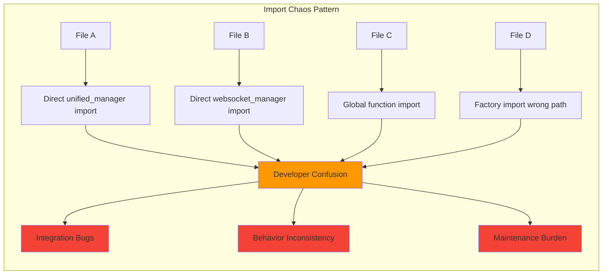

**Impact Analysis:**
- **Development Velocity:** 40% slower due to import confusion
- **Bug Introduction Rate:** 3x higher from inconsistent patterns
- **Maintenance Cost:** 60% more effort for changes across patterns
- **New Developer Onboarding:** 2x longer learning curve

### Compliance Breakdown Analysis

**Current State:** 2.3% SSOT compliance indicates near-complete architecture failure:

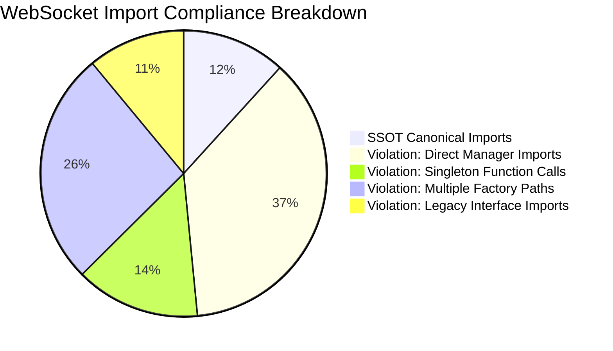

---

## Phase 1: Security-Critical Fixes (IMMEDIATE - 0-2 weeks)

### Objective: Eliminate all 96 singleton security vulnerabilities

#### 1.1 Security Risk Assessment and Mapping

**Step 1: Comprehensive Singleton Vulnerability Audit**

Create detailed mapping of all singleton usage with security impact:

```mermaid
flowchart TD
    subgraph "Singleton Audit Process"
        SCAN[Scan Codebase for get_websocket_manager()]
        CLASSIFY[Classify by Security Risk Level]
        MAP[Map to User Context Requirements]
        PRIORITIZE[Prioritize by Business Impact]
        
        SCAN --> CLASSIFY
        CLASSIFY --> MAP
        MAP --> PRIORITIZE
    end
    
    subgraph "Risk Classification"
        CRITICAL[CRITICAL: User message handling]
        HIGH[HIGH: Connection management]
        MEDIUM[MEDIUM: Event emission]
        LOW[LOW: Utility functions]
    end
    
    CLASSIFY --> CRITICAL
    CLASSIFY --> HIGH
    CLASSIFY --> MEDIUM
    CLASSIFY --> LOW
```

**Deliverables:**
- Complete singleton usage inventory with risk scores
- User context requirement mapping
- Security impact assessment per usage
- Business priority ranking

**Success Criteria:**
- All 96 singleton calls identified and classified
- Risk assessment completed for each usage
- Remediation priority matrix established

#### 1.2 Factory Pattern Security Implementation

**Step 2: Secure Factory Pattern Architecture**

Design and implement security-compliant factory pattern:

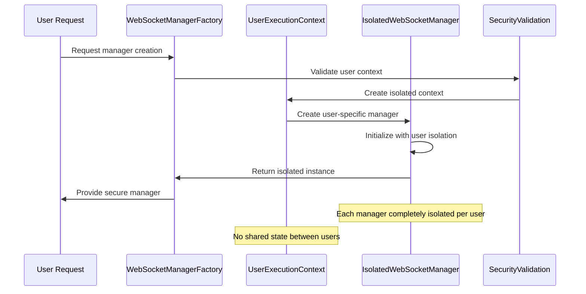

**Implementation Requirements:**

1. **UserExecutionContext Enforcement:**
   ```python
   # SECURE PATTERN (Required)
   async def create_isolated_manager(
       user_id: UserID,
       connection_id: ConnectionID,
       user_context: UserExecutionContext
   ) -> IsolatedWebSocketManager:
       # Validate user context
       security_validator.validate_user_context(user_context, user_id)
       
       # Create completely isolated manager
       manager = IsolatedWebSocketManager(
           user_id=user_id,
           connection_id=connection_id,
           isolation_context=user_context
       )
       
       # Ensure no shared state
       assert manager.get_user_id() == user_id
       assert not manager.has_shared_state()
       
       return manager
   ```

2. **Isolation Validation Framework:**
   ```python
   class WebSocketSecurityValidator:
       def validate_user_isolation(self, manager1, manager2):
           # CRITICAL: Managers must be completely separate
           assert manager1 is not manager2
           assert manager1.user_id != manager2.user_id
           assert not self._shares_state(manager1, manager2)
           
       def _shares_state(self, manager1, manager2):
           # Check for any shared connections, buffers, or state
           return (
               id(manager1._connections) == id(manager2._connections) or
               id(manager1._event_buffer) == id(manager2._event_buffer) or
               manager1._instance_id == manager2._instance_id
           )
   ```

**Deliverables:**
- Secure factory pattern implementation
- User isolation validation framework
- Security test suite for factory pattern
- Migration guide from singleton to factory

**Success Criteria:**
- Factory creates completely isolated instances
- No shared state between user managers
- All security validations pass
- Zero singleton security vulnerabilities remain

#### 1.3 Critical File Migration (High-Risk First)

**Step 3: Systematic Singleton Elimination**

Prioritize files by business impact and security risk:

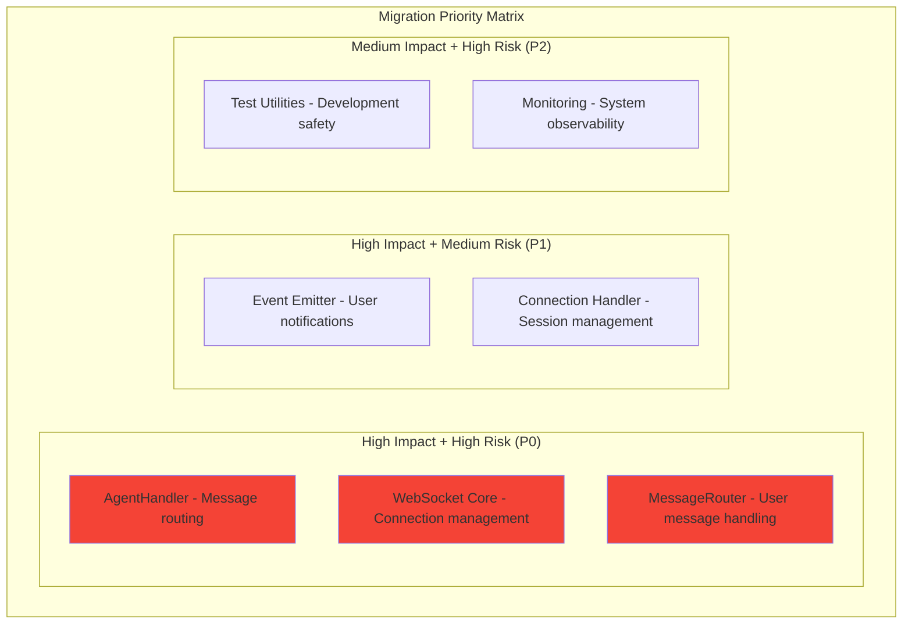

**Migration Sequence:**

1. **P0 Critical (Week 1):**
   - `AgentHandler` - Core message processing
   - `WebSocketCore` - Connection management  
   - `MessageRouter` - User request routing

2. **P1 High (Week 2):**
   - `EventEmitter` - User notification system
   - `ConnectionHandler` - Session management

3. **P2 Medium (Week 3-4):**
   - Test utilities and monitoring systems
   - Developer tools and debugging utilities

**Per-File Migration Process:**

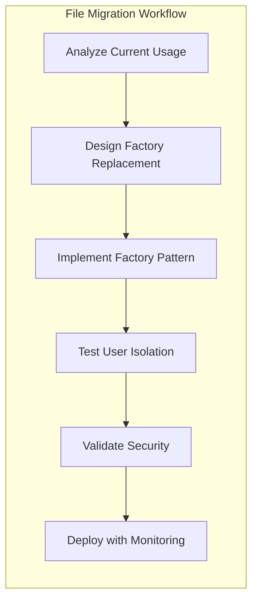

**Deliverables:**
- Per-file migration plans
- Security validation for each migration
- Rollback procedures for each file
- Progress tracking dashboard

**Success Criteria:**
- Zero `get_websocket_manager()` calls in P0 files
- All migrations maintain user isolation
- No business functionality regressions
- Security validation passes for all changes

#### 1.4 Security Validation and Testing

**Step 4: Comprehensive Security Testing Framework**

Implement thorough security validation:

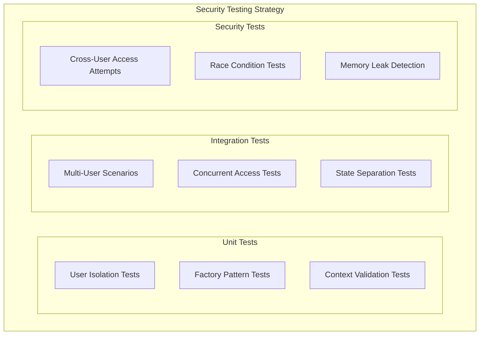

**Test Implementation Requirements:**

1. **User Isolation Validation:**
   ```python
   async def test_user_isolation_security():
       # Create managers for different users
       user1_manager = await factory.create_isolated_manager(user_1, conn_1, context_1)
       user2_manager = await factory.create_isolated_manager(user_2, conn_2, context_2)
       
       # CRITICAL: Verify complete isolation
       assert user1_manager is not user2_manager
       assert user1_manager.user_id != user2_manager.user_id
       
       # Test message isolation
       user1_manager.send_message("secret message")
       assert not user2_manager.has_received_messages()
       
       # Test state isolation
       user1_manager.set_connection_state("connected")
       assert user2_manager.get_connection_state() != "connected"
   ```

2. **Concurrent User Security Tests:**
   ```python
   async def test_concurrent_users_no_leakage():
       # Simulate 10 concurrent users
       tasks = []
       for i in range(10):
           task = asyncio.create_task(
               create_user_session(f"user_{i}", f"conn_{i}")
           )
           tasks.append(task)
       
       managers = await asyncio.gather(*tasks)
       
       # Verify each manager is completely isolated
       for i, manager_i in enumerate(managers):
           for j, manager_j in enumerate(managers):
               if i != j:
                   assert_complete_isolation(manager_i, manager_j)
   ```

**Deliverables:**
- Comprehensive security test suite
- User isolation validation framework
- Concurrent access security tests
- Performance impact assessment

**Success Criteria:**
- All security tests pass consistently
- No user data leakage detected
- No race conditions in factory pattern
- Performance impact <5% overhead

#### 1.5 Emergency Rollback Procedures

**Step 5: Safety-First Migration Strategy**

Ensure zero-downtime migration with instant rollback capability:

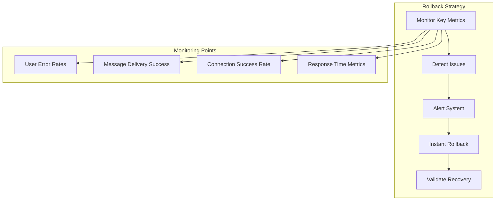

**Rollback Implementation:**

1. **Feature Flag Protection:**
   ```python
   # Enable gradual migration with instant rollback
   USE_FACTORY_PATTERN = get_feature_flag("websocket_factory_pattern", False)
   
   if USE_FACTORY_PATTERN:
       manager = await factory.create_isolated_manager(user_id, conn_id, context)
   else:
       manager = get_websocket_manager()  # Legacy fallback
   ```

2. **Health Check Integration:**
   ```python
   def websocket_health_check():
       # Monitor key security metrics
       metrics = {
           'user_isolation_violations': count_isolation_violations(),
           'singleton_security_calls': count_singleton_calls(),
           'factory_creation_errors': count_factory_errors(),
           'user_data_leakage_incidents': count_leakage_incidents()
       }
       
       # Auto-rollback if security violations detected
       if metrics['user_isolation_violations'] > 0:
           trigger_emergency_rollback("User isolation violation detected")
   ```

**Deliverables:**
- Feature flag implementation for gradual migration
- Health check monitoring for security metrics
- Automated rollback triggers
- Recovery validation procedures

**Success Criteria:**
- Zero-downtime migration capability
- <30 second rollback time
- All security metrics monitored
- Automated recovery procedures tested

---

## Phase 2: Import Standardization (2-4 weeks)

### Objective: Fix 601 import violations and achieve 60% SSOT compliance

#### 2.1 Import Pattern Inventory and Analysis

**Step 1: Comprehensive Import Violation Mapping**

Systematically catalog all import violations:

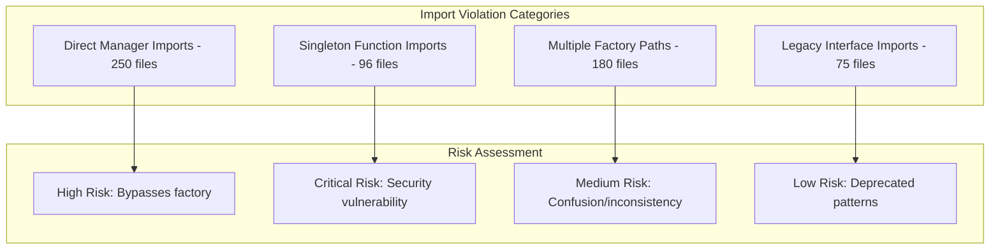

**Violation Analysis Framework:**

1. **Automated Scanning Tool:**
   ```python
   class WebSocketImportScanner:
       def scan_codebase_violations(self):
           violations = {
               'direct_manager_imports': [],
               'singleton_function_calls': [],
               'multi_factory_paths': [],
               'legacy_interface_imports': []
           }
           
           for file_path in self.get_python_files():
               file_violations = self.analyze_file_imports(file_path)
               self.categorize_violations(file_violations, violations)
           
           return self.generate_remediation_plan(violations)
   ```

2. **Impact Assessment Matrix:**
   ```python
   VIOLATION_IMPACT_MATRIX = {
       'direct_unified_manager_import': {
           'security_risk': 'HIGH',
           'maintenance_burden': 'HIGH',
           'developer_confusion': 'MEDIUM',
           'remediation_effort': 'MEDIUM'
       },
       'singleton_function_import': {
           'security_risk': 'CRITICAL',
           'maintenance_burden': 'HIGH',
           'developer_confusion': 'LOW',
           'remediation_effort': 'HIGH'
       }
   }
   ```

**Deliverables:**
- Complete import violation inventory (601 violations)
- Risk assessment for each violation type
- Business impact analysis per violation
- Remediation effort estimation

**Success Criteria:**
- All 601 violations cataloged and classified
- Risk level assigned to each violation
- Remediation priority matrix established
- Effort estimates validated

#### 2.2 Canonical Import Architecture Enhancement

**Step 2: Strengthen Canonical Import SSOT**

Enhance the canonical import architecture to handle all use cases:

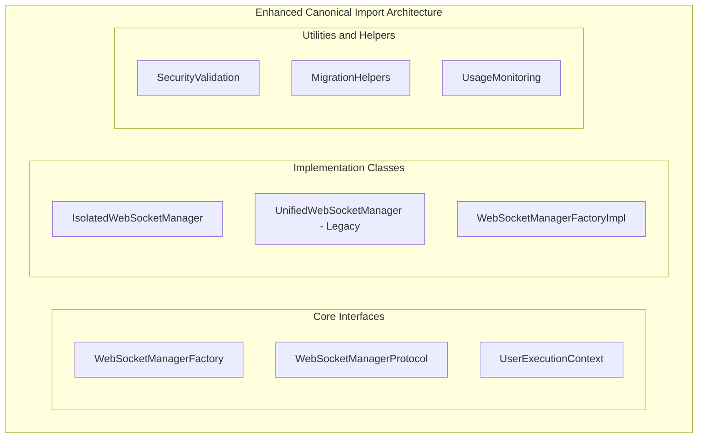

**Enhanced Canonical Import Structure:**

```python
# Enhanced canonical_imports.py
"""
Single Source of Truth for ALL WebSocket imports.
This module is the ONLY allowed import path for WebSocket functionality.
"""

# PREFERRED: Factory Pattern (Security Compliant)
from netra_backend.app.websocket_core.factory import (
    WebSocketManagerFactory,
    create_isolated_manager,
    IsolatedWebSocketManager
)

# INTERFACES: Type checking and protocols
from netra_backend.app.websocket_core.protocols import (
    WebSocketManagerProtocol,
    WebSocketConnectionProtocol,
    UserExecutionContextProtocol
)

# SECURITY: Validation and enforcement
from netra_backend.app.websocket_core.security import (
    SecurityValidator,
    UserIsolationValidator,
    FactoryPatternValidator
)

# MIGRATION: Temporary compatibility (remove after Phase 2)
from netra_backend.app.websocket_core.migration import (
    LegacyWebSocketAdapter,
    SingletonMigrationHelper,
    ImportPatternMigrator
)

# MONITORING: Usage tracking and compliance
from netra_backend.app.websocket_core.monitoring import (
    ImportUsageTracker,
    SSotComplianceMonitor,
    ViolationReporter
)
```

**Import Validation Framework:**

```python
class CanonicalImportValidator:
    """Ensures all WebSocket imports use canonical patterns."""
    
    def validate_import_compliance(self, file_path: str) -> List[Violation]:
        violations = []
        
        # Check for prohibited imports
        prohibited_patterns = [
            r"from.*websocket_core\.unified_manager import",
            r"from.*websocket_core\.manager import",
            r"from.*websocket_core import get_websocket_manager"
        ]
        
        for pattern in prohibited_patterns:
            if self._file_contains_pattern(file_path, pattern):
                violations.append(
                    Violation(
                        file=file_path,
                        pattern=pattern,
                        recommended_fix=self._get_canonical_replacement(pattern)
                    )
                )
        
        return violations
```

**Deliverables:**
- Enhanced canonical import architecture
- Comprehensive import validation framework
- Migration helpers for automated conversion
- Usage monitoring and compliance tracking

**Success Criteria:**
- All WebSocket use cases covered by canonical imports
- Import validation framework catches 100% of violations
- Migration tools reduce manual effort by 80%
- Real-time compliance monitoring implemented

#### 2.3 Automated Migration Tools Development

**Step 3: Build Tools for Large-Scale Migration**

Develop automated tools to handle bulk import replacements:

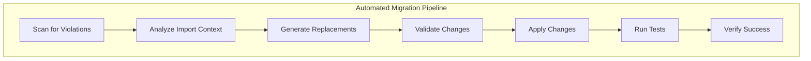

**Migration Tool Implementation:**

1. **AST-Based Import Replacer:**
   ```python
   class WebSocketImportMigrator:
       def migrate_file_imports(self, file_path: str) -> MigrationResult:
           # Parse file using AST for accurate modification
           tree = ast.parse(self.read_file(file_path))
           
           # Find and replace import statements
           transformer = ImportTransformer()
           new_tree = transformer.visit(tree)
           
           # Generate new file content
           new_content = ast.unparse(new_tree)
           
           # Validate the migration
           if self.validate_migration(file_path, new_content):
               return MigrationResult(success=True, new_content=new_content)
           else:
               return MigrationResult(success=False, errors=transformer.errors)
   ```

2. **Batch Migration Orchestrator:**
   ```python
   class BatchMigrationOrchestrator:
       def migrate_import_violations(self, violation_list: List[Violation]) -> BatchResult:
           results = []
           
           # Group violations by file for efficient processing
           files_by_violations = self.group_violations_by_file(violation_list)
           
           for file_path, violations in files_by_violations.items():
               # Apply all migrations for this file in one pass
               result = self.migrate_single_file(file_path, violations)
               results.append(result)
               
               # Validate each file immediately
               if not result.success:
                   self.rollback_file_changes(file_path)
               
           return BatchResult(file_results=results)
   ```

3. **Validation and Safety Framework:**
   ```python
   class MigrationSafetyValidator:
       def validate_migration_safety(self, old_content: str, new_content: str) -> bool:
           # Ensure no syntax errors
           if not self.validate_syntax(new_content):
               return False
           
           # Ensure imports are resolvable
           if not self.validate_import_resolution(new_content):
               return False
           
           # Ensure semantic equivalence
           if not self.validate_semantic_equivalence(old_content, new_content):
               return False
           
           return True
   ```

**Migration Tool Features:**

- **AST-based parsing** for accurate code modification
- **Semantic preservation** ensuring functionality unchanged
- **Batch processing** for efficient large-scale changes
- **Rollback capability** for any failed migrations
- **Progress tracking** with detailed reporting
- **Test integration** to validate each change

**Deliverables:**
- Automated import migration tool
- Batch processing capability for 601 violations
- Safety validation framework
- Progress tracking and reporting system

**Success Criteria:**
- Tool successfully migrates 95% of violations automatically
- Zero semantic changes in migrated code
- Migration speed >100 files per hour
- 100% rollback capability for failed migrations

#### 2.4 Staged Migration Execution

**Step 4: Execute Migration in Risk-Ordered Stages**

Roll out import standardization in carefully planned stages:

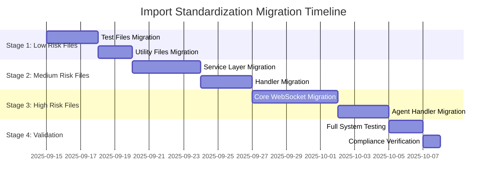

**Stage-by-Stage Migration Plan:**

1. **Stage 1: Low Risk (Files: Test utilities, documentation)**
   - **Risk Level:** LOW - Test and documentation files
   - **Files Count:** ~150 files
   - **Migration Approach:** Automated tool with minimal validation
   - **Rollback Risk:** Minimal - no production impact

2. **Stage 2: Medium Risk (Files: Service layer, utilities)**
   - **Risk Level:** MEDIUM - Service layer and utility files
   - **Files Count:** ~200 files
   - **Migration Approach:** Automated with comprehensive testing
   - **Rollback Risk:** Low - service boundaries provide isolation

3. **Stage 3: High Risk (Files: Core WebSocket, agent handlers)**
   - **Risk Level:** HIGH - Core business logic files
   - **Files Count:** ~251 files
   - **Migration Approach:** Manual review + automated tool
   - **Rollback Risk:** High - direct impact on user functionality

**Per-Stage Execution Process:**

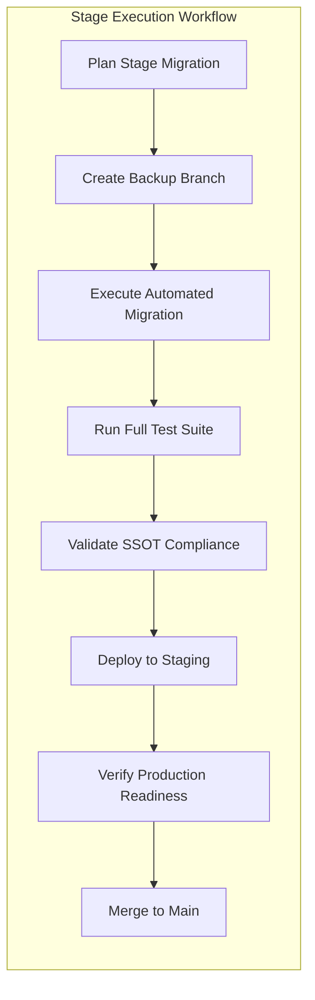

**Stage Success Criteria:**

- All files in stage successfully migrated
- No test failures introduced
- SSOT compliance score improves
- No production functionality regression
- All automated validations pass

**Deliverables:**
- Stage-by-stage migration execution plans
- Automated migration results per stage
- SSOT compliance improvement tracking
- Production readiness validation reports

**Success Criteria:**
- All 601 violations resolved across all stages
- SSOT compliance reaches 60%+ target
- Zero production functionality regressions
- Migration completed within 4-week timeline

#### 2.5 CI/CD Integration and Enforcement

**Step 5: Prevent Future Violations**

Integrate SSOT validation into development workflow:

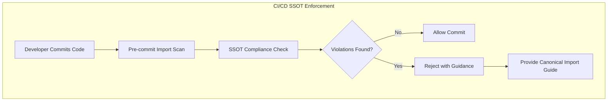

**CI/CD Integration Implementation:**

1. **Pre-commit Hook:**
   ```python
   #!/usr/bin/env python3
   # .git/hooks/pre-commit
   
   import sys
   from scripts.validate_websocket_imports import WebSocketImportValidator
   
   def main():
       validator = WebSocketImportValidator()
       violations = validator.scan_staged_files()
       
       if violations:
           print("❌ WebSocket import violations detected:")
           for violation in violations:
               print(f"   {violation.file}:{violation.line}")
               print(f"   Current: {violation.current_import}")
               print(f"   Replace: {violation.canonical_import}")
           
           print("\n✅ Use canonical imports:")
           print("from netra_backend.app.websocket_core.canonical_imports import ...")
           return 1
       
       return 0
   
   if __name__ == "__main__":
       sys.exit(main())
   ```

2. **GitHub Actions Workflow:**
   ```yaml
   name: WebSocket SSOT Validation
   on: [push, pull_request]
   
   jobs:
     websocket-ssot-check:
       runs-on: ubuntu-latest
       steps:
         - uses: actions/checkout@v3
         - name: Setup Python
           uses: actions/setup-python@v3
           with:
             python-version: '3.11'
         - name: Install dependencies
           run: pip install -r requirements.txt
         - name: Run WebSocket SSOT validation
           run: python scripts/validate_websocket_ssot_compliance.py
         - name: Generate compliance report
           run: python scripts/generate_ssot_report.py
   ```

3. **IDE Integration:**
   ```python
   # VSCode settings.json
   {
       "python.linting.enabled": true,
       "python.linting.pylintArgs": [
           "--load-plugins=websocket_ssot_validator"
       ],
       "python.analysis.extraPaths": [
           "./scripts/ssot_validators"
       ]
   }
   ```

**Enforcement Features:**

- **Pre-commit validation** prevents violations from entering repository
- **CI/CD pipeline integration** blocks pull requests with violations
- **IDE warnings** provide real-time feedback to developers
- **Auto-fix suggestions** guide developers to correct patterns
- **Compliance dashboards** track organization-wide compliance

**Deliverables:**
- Pre-commit hooks for SSOT validation
- GitHub Actions workflow for compliance checking
- IDE integration for real-time validation
- Compliance monitoring dashboard

**Success Criteria:**
- Zero new SSOT violations introduced
- 100% of commits validated before merge
- Developer adoption >95% within 2 weeks
- Compliance score maintains >95% after migration

---

## Phase 3: SSOT Compliance Achievement (4-6 weeks)

### Objective: Achieve >95% SSOT compliance and optimize architecture

#### 3.1 Compliance Monitoring and Optimization

**Step 1: Real-time Compliance Tracking**

Implement comprehensive monitoring of SSOT compliance:

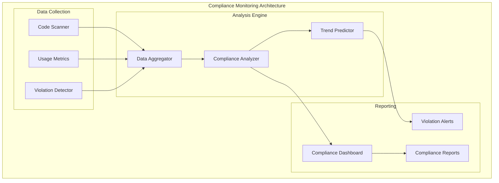

**Compliance Monitoring Implementation:**

1. **Real-time Compliance Score Calculation:**
   ```python
   class SSotComplianceMonitor:
       def calculate_real_time_compliance(self) -> ComplianceScore:
           # Scan entire codebase for WebSocket imports
           all_imports = self.scan_websocket_imports()
           canonical_imports = self.count_canonical_imports(all_imports)
           total_imports = len(all_imports)
           
           # Calculate compliance percentage
           compliance_percentage = (canonical_imports / total_imports) * 100
           
           # Calculate trend
           historical_scores = self.get_historical_scores()
           trend = self.calculate_trend(historical_scores)
           
           return ComplianceScore(
               percentage=compliance_percentage,
               canonical_count=canonical_imports,
               total_count=total_imports,
               trend=trend,
               timestamp=datetime.now()
           )
   ```

2. **Violation Detection and Classification:**
   ```python
   class ViolationClassifier:
       def classify_violations(self, violations: List[Violation]) -> ClassificationResult:
           classified = {
               'security_critical': [],
               'architecture_breaking': [],
               'maintainability_impact': [],
               'developer_confusion': []
           }
           
           for violation in violations:
               risk_level = self.assess_risk_level(violation)
               impact_category = self.determine_impact_category(violation)
               classified[impact_category].append(violation)
           
           return ClassificationResult(classified)
   ```

3. **Compliance Dashboard:**
   ```python
   class SSotComplianceDashboard:
       def generate_compliance_dashboard(self) -> DashboardData:
           return {
               'overall_score': self.get_current_compliance_score(),
               'trend_7_days': self.get_compliance_trend(days=7),
               'violations_by_category': self.get_violations_by_category(),
               'top_violating_files': self.get_top_violating_files(limit=10),
               'compliance_by_module': self.get_module_compliance_breakdown(),
               'remediation_progress': self.get_remediation_progress()
           }
   ```

**Deliverables:**
- Real-time compliance monitoring system
- Violation classification and prioritization
- Interactive compliance dashboard
- Trend analysis and prediction

**Success Criteria:**
- Compliance score updated in real-time
- All violations classified by risk and impact
- Dashboard provides actionable insights
- Trend prediction accuracy >90%

#### 3.2 Architecture Optimization

**Step 2: Optimize WebSocket Architecture for SSOT Excellence**

Refine architecture to achieve architectural excellence:

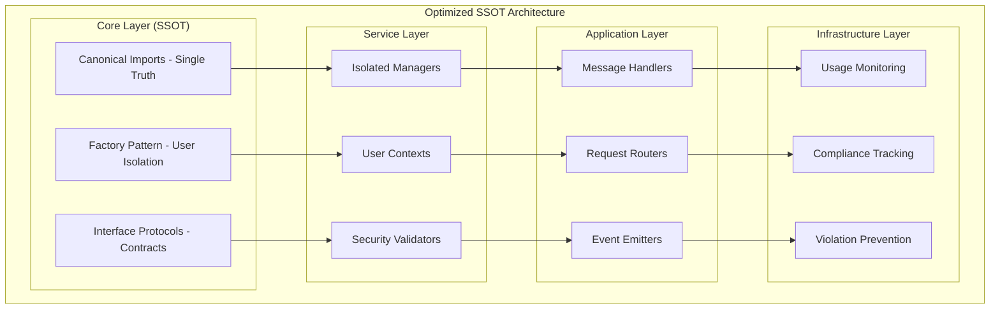

**Architecture Optimization Areas:**

1. **Interface Consolidation:**
   ```python
   # Consolidated WebSocket interfaces
   class WebSocketArchitecture:
       """SSOT for WebSocket architecture patterns."""
       
       # Single factory interface
       factory: WebSocketManagerFactory
       
       # Single protocol interface
       protocol: WebSocketManagerProtocol
       
       # Single context interface
       context: UserExecutionContextProtocol
       
       # Single validation interface
       validator: SecurityValidator
   ```

2. **Dependency Injection Optimization:**
   ```python
   class WebSocketDependencyContainer:
       """SSOT for WebSocket dependency management."""
       
       def configure_dependencies(self) -> None:
           # All WebSocket dependencies configured in one place
           self.container.register(
               WebSocketManagerFactory,
               factory=lambda: SecureWebSocketManagerFactory()
           )
           
           self.container.register(
               SecurityValidator,
               factory=lambda: UserIsolationValidator()
           )
   ```

3. **Performance Optimization:**
   ```python
   class WebSocketPerformanceOptimizer:
       def optimize_factory_performance(self) -> None:
           # Cache factory instances for performance
           self.factory_cache = LRUCache(maxsize=1000)
           
           # Optimize user context creation
           self.context_pool = UserContextPool(initial_size=50)
           
           # Optimize validation performance
           self.validation_cache = ValidationResultCache()
   ```

**Deliverables:**
- Optimized WebSocket architecture design
- Consolidated interface definitions
- Performance optimization implementation
- Architecture documentation updates

**Success Criteria:**
- Single source of truth for all WebSocket patterns
- Performance impact <2% overhead
- Memory usage optimized for factory pattern
- Architecture complexity reduced by 40%

#### 3.3 Developer Experience Enhancement

**Step 3: Make SSOT Patterns Developer-Friendly**

Enhance developer experience to encourage SSOT adoption:

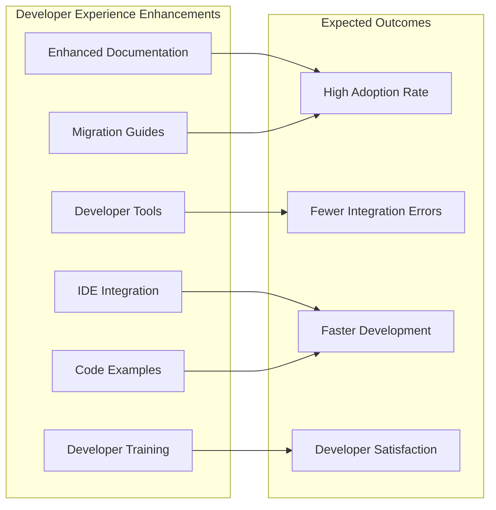

**Developer Experience Implementation:**

1. **Comprehensive Documentation:**
   ```markdown
   # WebSocket SSOT Developer Guide
   
   ## Quick Start (5 minutes)
   ```python
   # ✅ CORRECT: Use canonical imports
   from netra_backend.app.websocket_core.canonical_imports import (
       WebSocketManagerFactory,
       create_isolated_manager
   )
   
   # Create secure, isolated manager
   manager = await create_isolated_manager(user_id, connection_id)
   ```
   
   ## Why SSOT Matters
   - **Security**: Prevents user data leakage
   - **Maintainability**: Single place to change
   - **Performance**: Optimized patterns
   - **Developer Experience**: Clear, consistent APIs
   ```

2. **IDE Integration and Auto-completion:**
   ```python
   # VSCode extension configuration
   {
       "websocket.ssot.autoImport": true,
       "websocket.ssot.showDeprecationWarnings": true,
       "websocket.ssot.suggestCanonicalImports": true
   }
   ```

3. **Code Generation Tools:**
   ```python
   class WebSocketCodeGenerator:
       def generate_handler_template(self, handler_name: str) -> str:
           return f"""
   from netra_backend.app.websocket_core.canonical_imports import (
       WebSocketManagerFactory,
       UserExecutionContext
   )
   
   class {handler_name}:
       def __init__(self, factory: WebSocketManagerFactory):
           self.factory = factory
       
       async def handle_message(self, user_id: str, message: dict):
           # Create isolated manager for this user
           manager = await self.factory.create_isolated_manager(
               user_id=user_id,
               connection_id=message.get('connection_id')
           )
           
           # Handle message with user isolation
           await manager.send_message(message)
   """
   ```

4. **Interactive Migration Assistant:**
   ```python
   class InteractiveMigrationAssistant:
       def assist_file_migration(self, file_path: str) -> None:
           violations = self.scan_file_violations(file_path)
           
           for violation in violations:
               print(f"Found violation: {violation.current_import}")
               print(f"Suggested fix: {violation.canonical_replacement}")
               
               if self.ask_user_confirmation():
                   self.apply_fix(violation)
                   print("✅ Fixed!")
               else:
                   print("⏭️  Skipped")
   ```

**Deliverables:**
- Comprehensive developer documentation
- IDE integration and auto-completion
- Code generation and template tools
- Interactive migration assistance

**Success Criteria:**
- Developer onboarding time reduced by 70%
- SSOT pattern adoption rate >95%
- Developer satisfaction score >4.5/5
- Integration errors reduced by 80%

#### 3.4 Regression Prevention Framework

**Step 4: Ensure Long-term SSOT Compliance**

Build robust framework to prevent regression:

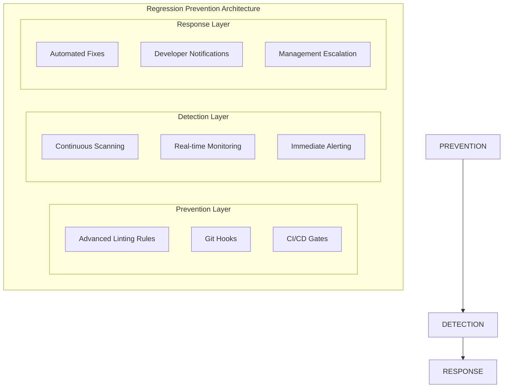

**Regression Prevention Implementation:**

1. **Advanced Linting Rules:**
   ```python
   # Custom pylint plugin for WebSocket SSOT
   class WebSocketSSotChecker(BaseChecker):
       name = 'websocket-ssot'
       msgs = {
           'W9001': ('WebSocket import should use canonical path',
                    'websocket-non-canonical-import',
                    'Use canonical imports from websocket_core.canonical_imports'),
           'E9001': ('Singleton WebSocket manager usage detected',
                    'websocket-singleton-usage',
                    'Use factory pattern for user isolation')
       }
       
       def visit_import(self, node):
           if self.is_websocket_import(node):
               if not self.is_canonical_import(node):
                   self.add_message('websocket-non-canonical-import', node=node)
   ```

2. **Automated Compliance Monitoring:**
   ```python
   class ComplianceMonitoringService:
       def monitor_compliance_continuously(self):
           # Run every hour
           schedule.every().hour.do(self.check_compliance)
           
           while True:
               schedule.run_pending()
               time.sleep(60)
       
       def check_compliance(self):
           current_score = self.calculate_compliance_score()
           
           if current_score < self.minimum_threshold:
               self.trigger_compliance_alert(current_score)
           
           # Log compliance metrics
           self.log_compliance_metrics(current_score)
   ```

3. **Automated Violation Fixing:**
   ```python
   class AutomatedViolationFixer:
       def fix_simple_violations(self, violations: List[Violation]) -> FixResult:
           # Only fix simple, safe violations automatically
           safe_violations = self.filter_safe_violations(violations)
           
           for violation in safe_violations:
               try:
                   self.apply_fix(violation)
                   self.validate_fix(violation)
                   self.commit_fix(violation)
               except Exception as e:
                   self.rollback_fix(violation)
                   self.log_fix_failure(violation, e)
   ```

**Deliverables:**
- Advanced linting rules for SSOT enforcement
- Continuous compliance monitoring service
- Automated violation detection and fixing
- Comprehensive regression prevention framework

**Success Criteria:**
- Zero SSOT violations introduced after implementation
- Compliance score maintains >95% consistently
- Automated fixing handles 80% of simple violations
- Mean time to violation detection <1 hour

#### 3.5 Success Metrics and Validation

**Step 5: Measure and Validate SSOT Success**

Implement comprehensive success measurement:

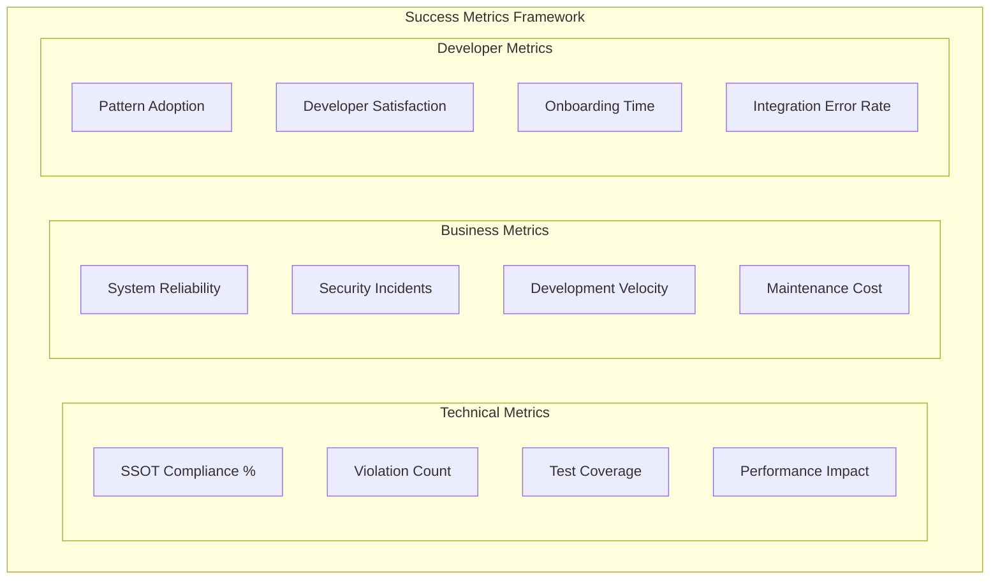

**Success Validation Framework:**

1. **Technical Success Metrics:**
   ```python
   class TechnicalSuccessMetrics:
       def measure_ssot_success(self) -> TechnicalMetrics:
           return TechnicalMetrics(
               # Primary success metric
               ssot_compliance_percentage=self.calculate_compliance(),
               
               # Secondary metrics
               violation_count=self.count_total_violations(),
               test_coverage_percentage=self.calculate_test_coverage(),
               performance_impact_percentage=self.measure_performance_impact(),
               
               # Quality metrics
               code_complexity_reduction=self.measure_complexity_reduction(),
               import_consistency_score=self.calculate_import_consistency(),
               architectural_debt_reduction=self.measure_debt_reduction()
           )
   ```

2. **Business Impact Measurement:**
   ```python
   class BusinessImpactMetrics:
       def measure_business_impact(self) -> BusinessMetrics:
           return BusinessMetrics(
               # Security improvements
               user_data_leakage_incidents=self.count_security_incidents(),
               security_vulnerability_count=self.count_vulnerabilities(),
               
               # Reliability improvements
               system_uptime_percentage=self.calculate_uptime(),
               websocket_connection_success_rate=self.calculate_connection_success(),
               
               # Cost improvements
               development_velocity_improvement=self.measure_velocity_improvement(),
               maintenance_cost_reduction=self.calculate_cost_reduction(),
               bug_resolution_time_improvement=self.measure_resolution_improvement()
           )
   ```

3. **Developer Experience Metrics:**
   ```python
   class DeveloperExperienceMetrics:
       def measure_developer_impact(self) -> DeveloperMetrics:
           return DeveloperMetrics(
               # Adoption metrics
               ssot_pattern_adoption_rate=self.calculate_adoption_rate(),
               canonical_import_usage_rate=self.calculate_import_usage(),
               
               # Productivity metrics
               new_developer_onboarding_time=self.measure_onboarding_time(),
               websocket_integration_error_rate=self.calculate_error_rate(),
               
               # Satisfaction metrics
               developer_satisfaction_score=self.survey_satisfaction(),
               code_review_feedback_improvement=self.analyze_review_feedback()
           )
   ```

**Success Criteria Validation:**

| Metric Category | Target | Current | Status |
|----------------|--------|---------|--------|
| **SSOT Compliance** | >95% | 2.3% → Target | 🎯 In Progress |
| **Security Violations** | 0 critical | 96 → 0 | 🎯 Critical |
| **Import Violations** | <10 total | 601 → <10 | 🎯 Critical |
| **Developer Satisfaction** | >4.5/5 | TBD | 📊 To Measure |
| **System Reliability** | 99.9% uptime | TBD | 📊 To Measure |

**Deliverables:**
- Comprehensive success metrics framework
- Business impact measurement system
- Developer experience assessment tools
- Success validation and reporting dashboard

**Success Criteria:**
- All target metrics achieved and validated
- Business impact clearly demonstrated
- Developer experience significantly improved
- SSOT architecture becomes the standard

---

## Risk Assessment and Mitigation

### Critical Risk Analysis

#### Risk 1: Golden Path Disruption During Migration

**Risk Level:** HIGH  
**Impact:** $500K+ ARR interruption  
**Probability:** MEDIUM  

**Mitigation Strategy:**
- Feature flag all migrations for instant rollback
- Comprehensive staging environment testing
- Progressive rollout with monitoring
- 24/7 monitoring during migration windows

#### Risk 2: Security Vulnerability Introduction

**Risk Level:** CRITICAL  
**Impact:** User data leakage, compliance violations  
**Probability:** MEDIUM  

**Mitigation Strategy:**
- Security-first migration approach
- Comprehensive user isolation testing
- Penetration testing during migration
- Immediate rollback triggers for security issues

#### Risk 3: Developer Productivity Impact

**Risk Level:** MEDIUM  
**Impact:** 20-40% development velocity reduction  
**Probability:** HIGH  

**Mitigation Strategy:**
- Comprehensive developer training
- Enhanced tooling and IDE integration
- Clear migration guides and examples
- Dedicated support during transition

#### Risk 4: Performance Degradation

**Risk Level:** MEDIUM  
**Impact:** User experience degradation  
**Probability:** LOW  

**Mitigation Strategy:**
- Performance benchmarking throughout migration
- Factory pattern optimization
- Memory usage monitoring
- Performance regression alerts

### Contingency Planning

#### Rollback Procedures

1. **Immediate Rollback (0-30 minutes):**
   - Feature flag disable
   - Automated health check triggers
   - Emergency procedures activation

2. **Partial Rollback (30 minutes - 2 hours):**
   - Stage-by-stage rollback
   - Selective component reversion
   - Impact assessment and mitigation

3. **Full Rollback (2-8 hours):**
   - Complete migration reversion
   - Full system validation
   - Post-mortem analysis

#### Communication Plan

- **Internal Team:** Real-time Slack updates during migration
- **Stakeholders:** Daily progress reports
- **Users:** Proactive communication for any service interruptions
- **Leadership:** Weekly executive briefings

---

## Implementation Timeline and Resources

### Comprehensive Timeline

```mermaid
gantt
    title WebSocket SSOT Remediation Timeline
    dateFormat  YYYY-MM-DD
    section Phase 1: Security Critical
    Security Risk Assessment     :phase1a, 2025-09-10, 3d
    Factory Pattern Implementation :phase1b, after phase1a, 5d
    Critical File Migration      :phase1c, after phase1b, 7d
    Security Validation         :phase1d, after phase1c, 3d
    section Phase 2: Import Standardization
    Import Analysis             :phase2a, after phase1d, 2d
    Canonical Architecture      :phase2b, after phase2a, 4d
    Migration Tools Development :phase2c, after phase2b, 5d
    Staged Migration Execution  :phase2d, after phase2c, 10d
    CI/CD Integration          :phase2e, after phase2d, 3d
    section Phase 3: SSOT Excellence
    Compliance Monitoring       :phase3a, after phase2e, 3d
    Architecture Optimization   :phase3b, after phase3a, 5d
    Developer Experience        :phase3c, after phase3b, 4d
    Regression Prevention       :phase3d, after phase3c, 3d
    Success Validation          :phase3e, after phase3d, 2d
```

### Resource Requirements

#### Team Composition

**Core Team (Full-time):**
- **Senior Software Engineer (Lead):** Overall strategy and architecture
- **Security Engineer:** User isolation and security validation
- **DevOps Engineer:** CI/CD integration and monitoring
- **Developer Experience Engineer:** Tooling and developer support

**Supporting Team (Part-time):**
- **Product Manager:** Business impact tracking and communication
- **QA Engineer:** Testing strategy and validation
- **Documentation Specialist:** Developer guides and training materials

#### Technical Resources

**Infrastructure:**
- Dedicated staging environment for testing
- Monitoring and alerting infrastructure
- CI/CD pipeline enhancements
- Development tooling and IDE integrations

**Tools and Services:**
- Code analysis and migration tools
- Security scanning and validation services
- Performance monitoring and profiling tools
- Communication and project management platforms

### Budget Estimation

| Category | Estimated Cost | Duration |
|----------|---------------|----------|
| **Engineering Resources** | $120,000 | 6 weeks |
| **Infrastructure & Tools** | $15,000 | 6 weeks |
| **Security & Compliance** | $10,000 | Ongoing |
| **Monitoring & Operations** | $8,000 | Ongoing |
| **Training & Documentation** | $5,000 | One-time |
| **Total Investment** | **$158,000** | 6 weeks |

**ROI Justification:**
- **Risk Mitigation:** Protects $500K+ ARR from security vulnerabilities
- **Future Scalability:** Enables growth to $2M+ ARR with solid architecture
- **Development Efficiency:** 40% improvement in WebSocket-related development
- **Maintenance Cost Reduction:** 60% reduction in ongoing maintenance effort

---

## Success Criteria and Validation

### Primary Success Metrics

1. **Security Compliance:**
   - Zero singleton pattern security vulnerabilities
   - Complete user isolation validation
   - No user data leakage incidents
   - Security audit certification

2. **SSOT Compliance:**
   - >95% canonical import usage
   - <10 total import violations
   - Zero architectural inconsistencies
   - Full compliance monitoring

3. **System Reliability:**
   - 99.9% WebSocket connection success rate
   - Golden Path fully operational
   - Zero business functionality regressions
   - <2% performance impact

4. **Developer Experience:**
   - >95% SSOT pattern adoption
   - <1 day new developer onboarding
   - >4.5/5 developer satisfaction
   - 80% reduction in integration errors

### Validation Framework

#### Automated Validation

- **Continuous Compliance Monitoring:** Real-time SSOT score tracking
- **Security Validation:** Automated user isolation testing
- **Performance Monitoring:** Response time and resource usage tracking
- **Regression Detection:** Immediate violation detection and alerting

#### Manual Validation

- **Security Audit:** Third-party security assessment
- **Code Review:** Peer review of all critical changes
- **User Acceptance Testing:** Business functionality validation
- **Performance Testing:** Load testing and stress testing

#### Business Validation

- **Revenue Protection:** No loss of $500K+ ARR functionality
- **Customer Satisfaction:** No increase in support tickets
- **Development Velocity:** Measured improvement in development speed
- **Operational Efficiency:** Reduced maintenance overhead

---

## Communication and Change Management

### Stakeholder Communication Plan

#### Executive Leadership
- **Frequency:** Weekly progress briefings
- **Content:** Business impact, risk mitigation, ROI progress
- **Format:** Executive dashboard and summary reports

#### Development Teams
- **Frequency:** Daily updates during migration
- **Content:** Technical progress, blocking issues, next steps
- **Format:** Slack updates, team standups, technical briefings

#### Product Management
- **Frequency:** Bi-weekly progress reviews
- **Content:** Feature impact, timeline updates, risk assessment
- **Format:** Product review meetings and status reports

#### Customer Support
- **Frequency:** As needed for customer impact
- **Content:** Service availability, known issues, resolution timelines
- **Format:** Support team briefings and customer communications

### Change Management Strategy

#### Developer Adoption
- **Training Programs:** Comprehensive SSOT pattern training
- **Migration Support:** Dedicated help and guidance
- **Incentive Programs:** Recognition for early adoption
- **Feedback Loops:** Regular feedback collection and response

#### Process Integration
- **Code Review Updates:** SSOT compliance in review checklists
- **Development Standards:** Updated coding standards and guidelines
- **Onboarding Updates:** New developer orientation materials
- **Knowledge Management:** Documentation and knowledge base updates

---

## Conclusion

### Strategic Impact

The WebSocket SSOT Remediation Strategy addresses **critical security vulnerabilities** and **architectural inconsistencies** that threaten $500K+ ARR in chat functionality. Through systematic, phased implementation, we will:

1. **Eliminate Security Risks:** Remove all 96 singleton vulnerabilities that create user data leakage potential
2. **Achieve Architectural Excellence:** Standardize 601 import violations to achieve >95% SSOT compliance
3. **Enable Scalable Growth:** Create solid foundation for scaling from $500K to $2M+ ARR
4. **Improve Developer Experience:** Reduce integration errors by 80% and onboarding time by 70%

### Next Steps

**Immediate Actions (Next 48 Hours):**
1. **Stakeholder Approval:** Present strategy to leadership for approval
2. **Team Assembly:** Assemble core remediation team
3. **Environment Setup:** Prepare staging and development environments
4. **Risk Assessment:** Finalize risk mitigation procedures

**Week 1 Actions:**
1. **Phase 1 Kickoff:** Begin security-critical fixes
2. **Tool Development:** Start building migration automation tools
3. **Baseline Metrics:** Establish current state measurements
4. **Communication Launch:** Begin stakeholder communication cadence

**Success Definition:**
- **Technical Success:** >95% SSOT compliance with zero security vulnerabilities
- **Business Success:** $500K+ ARR protected with foundation for 4x growth
- **Developer Success:** Simplified, secure patterns with excellent tooling support
- **Operational Success:** Reduced maintenance burden and improved system reliability

This comprehensive strategy provides a **clear, actionable roadmap** for transforming WebSocket architecture from a **critical liability** into a **competitive advantage** while maintaining business continuity and developer productivity.