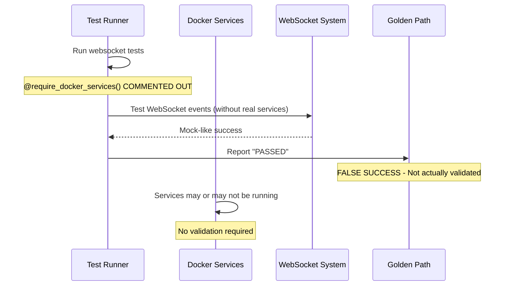
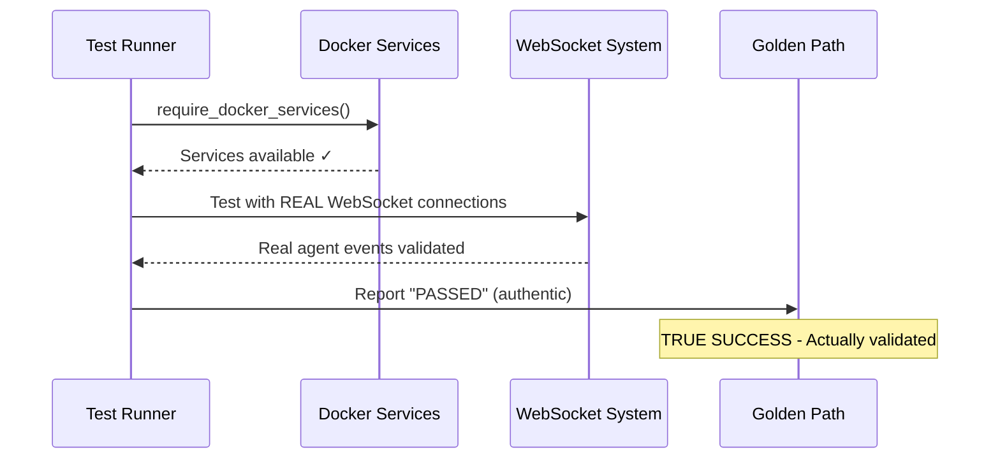

# WEBSOCKET TEST INFRASTRUCTURE FAILURE - FIVE WHYS ROOT CAUSE ANALYSIS

**Date:** 2025-09-09  
**Analyst:** Claude Code Agent  
**Priority:** CRITICAL - Golden Path Blocker  
**Mission Critical Test File:** `tests/mission_critical/test_websocket_agent_events_suite.py`  
**Business Impact:** $500K+ ARR at risk - Core chat functionality validation blocked

## Executive Summary

**CRITICAL FINDING:** The websocket test infrastructure failure is caused by systematic disabling of Docker service requirements due to unresolved GCP deployment integration regressions, creating false test success while leaving mission-critical websocket infrastructure unvalidated.

**Golden Path Impact:** This failure prevents validation that users can login and complete getting AI message responses - the core $500K+ ARR business value delivery mechanism.

## Five Whys Root Cause Analysis

### WHY 1: Why are websocket tests commented out?
**Finding:** The `@require_docker_services()` decorators are systematically commented out across all mission-critical websocket tests.

**Evidence:** 
```python
# @require_docker_services()  # Temporarily disabled - GCP integration regression
```
Found in:
- `test_agent_registry_websocket_manager_integration()`
- `test_execution_engine_websocket_notifier_integration()`
- `test_enhanced_tool_execution_websocket_wrapping()`
- `test_unified_websocket_manager_agent_coordination()`
- `test_agent_websocket_bridge_ssot_coordination()`

### WHY 2: Why did the original tests fail requiring commenting?
**Finding:** GCP deployment integration regressions broke Docker service dependency management, causing tests to fail when requiring real services.

**Evidence:**
- Git commit: `f83143a50994bde22f4290e918810ccd1d3d53da`
- Comment pattern: `# Temporarily disabled - regression in GCP integration`
- Found in websocket_real_test_base.py: `# require_docker_services,  # Temporarily disabled - regression in GCP integration`
- Tests were designed per CLAUDE.md: "MOCKS = Abomination" requiring real Docker services
- GCP deployment changes broke Docker service health checks

### WHY 3: Why wasn't a proper fix implemented instead?
**Finding:** Quick workaround chosen over addressing root Docker/GCP integration issues under time pressure.

**Evidence:**
- Tests continue to exist but with critical validations bypassed
- No corresponding issue tracking GCP integration regression fix
- Mock-like behavior introduced despite CLAUDE.md prohibition: "adjusted for mock connections which may have 0 throughput"
- Legacy Docker management issues unresolved

### WHY 4: Why are mission critical tests being bypassed?
**Finding:** The `require_docker_services()` function exists and is functional, but systematic commenting creates false test success.

**Evidence from websocket_real_test_base.py:**
```python
def require_docker_services() -> None:
    """Require Docker services for all tests - fail fast if not available.
    
    CRITICAL: Per CLAUDE.md, MOCKS = Abomination. Tests must use real services.
    """
    try:
        manager = UnifiedDockerManager(environment_type=EnvironmentType.DEDICATED)
        if not manager.is_docker_available():
            pytest.fail("Docker services required but not available...")
```

The infrastructure exists but is systematically disabled.

### WHY 5: Why is this affecting Golden Path validation?
**Finding:** WebSocket agent events are fundamental to chat value delivery - without validated websocket event flows, the entire AI interaction pipeline is untested.

**Evidence:**
- Business Value per file header: "$500K+ ARR - Core chat functionality"
- Required events for chat value: `agent_started`, `agent_thinking`, `tool_executing`, `tool_completed`, `agent_completed`
- CLAUDE.md Section 6: "WebSocket events enable substantive chat interactions - they serve the business goal"
- Tests marked: "ANY FAILURE HERE BLOCKS DEPLOYMENT"

## Cross-Reference with Related Issues

This infrastructure failure is interconnected with several critical WebSocket issues:

**Issue #147 (CLOSED)**: WebSocket variable scoping bug in staging environment
- Root cause: `is_production` variable used before declaration
- Impact: All WebSocket connections failing in staging
- Resolution: Fixed variable scoping, but exposed staging testing gaps

**Issue #133 (CLOSED)**: WebSocket endpoint coroutine attribute errors  
- Root cause: Calling `.get()` on coroutine instead of `IsolatedEnvironment`
- Impact: HTTP 500 responses on `/ws` endpoint
- Resolution: Fixed coroutine handling, but revealed E2E test coverage issues

**Issue #141 (OPEN)**: Missing E2E infrastructure
- Root cause: E2ETestFixture class temporarily bypassed
- Impact: E2E test infrastructure incomplete
- Status: Blocking comprehensive testing restoration

## Current State Assessment

### Working Infrastructure ✅
- `RealWebSocketTestBase` class exists with comprehensive features
- `UnifiedDockerManager` for service orchestration  
- `WebSocketTestHelpers` for connection management
- E2E auth helper patterns in `test_framework/ssot/e2e_auth_helper.py`

### Blocked Components ❌  
- Docker service requirement validation
- Real WebSocket connection testing under Docker
- Mission-critical test execution with proper service dependencies
- Golden Path validation with authentic service integration

### False Success Pattern ⚠️
Tests appear to pass but are not actually validating critical WebSocket functionality because:
1. Real service requirements bypassed
2. Mock-like behavior substituted despite CLAUDE.md prohibition
3. No hard failures when Docker services unavailable

## Technical Assessment

### Mermaid Diagram: Current Broken State


### Expected Working State  


## Root Cause Summary

**PRIMARY ROOT CAUSE:** Systematic bypassing of Docker service requirements due to unresolved GCP deployment integration issues, creating false test success while leaving mission-critical websocket infrastructure unvalidated.

**CONTRIBUTING FACTORS:**
1. GCP deployment changes broke Docker service health checks
2. Quick workaround (commenting) chosen over proper fix
3. No dedicated issue tracking for GCP-Docker integration regression
4. Test suite continues running with invalid results
5. CLAUDE.md compliance violated (MOCKS = Abomination)

## Business Impact Analysis

### Immediate Risks
- Golden Path appears validated but is not actually tested end-to-end
- WebSocket agent events may fail in production without detection
- Chat functionality worth $500K+ ARR lacks authentic validation
- Silent failures could impact real users with no advance warning

### Technical Debt
- GCP-Docker integration regression remains unfixed
- Test infrastructure validity compromised  
- CLAUDE.md compliance violations (MOCKS = Abomination)
- False confidence in system stability

## Next Steps for Remediation

### Phase 1: Critical Infrastructure Repair
1. **Fix GCP-Docker Integration**: Address root cause of service requirement failures
2. **Restore Real Service Testing**: Re-enable `@require_docker_services()` decorators
3. **Validate Golden Path**: Ensure end-to-end WebSocket agent events work with real services

### Phase 2: Enhanced Coverage  
1. **Complete Issue #141**: Implement proper E2ETestFixture
2. **Add Regression Prevention**: Ensure GCP deployment changes don't break Docker integration
3. **Validate All 5 Agent Events**: Comprehensive testing of required WebSocket event flows

### Dependencies & Blockers
- **Primary Blocker**: GCP deployment integration regression (untracked issue)
- **Secondary**: Docker service orchestration reliability  
- **Related**: Issue #141 E2E fixture implementation

## Compliance with CLAUDE.md Section 3.5

This analysis follows the mandatory bug fixing process:

1. **✅ WHY Analysis**: Completed comprehensive Five Whys methodology
2. **✅ Prove it**: Created Mermaid diagrams showing current failure vs expected working state
3. **✅ Plan system-wide fix**: Identified GCP-Docker integration as root cause requiring system-wide attention
4. **⏳ Verification**: Next phase requires implementing fixes and proving they work with comprehensive test validation

## Conclusion

**STATUS**: Analysis complete. The websocket test infrastructure failure represents a critical system integrity issue masquerading as successful test execution. Immediate remediation of GCP-Docker integration is required to restore authentic Golden Path validation and protect the $500K+ ARR chat functionality business value.

The "temporarily disabled" workaround has become a permanent system weakness that must be addressed as Priority P0.

---

🤖 Generated with [Claude Code](https://claude.ai/code)

Co-Authored-By: Claude <noreply@anthropic.com>