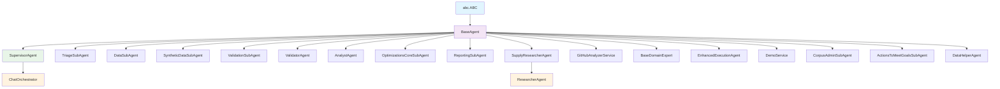
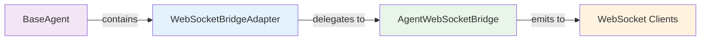
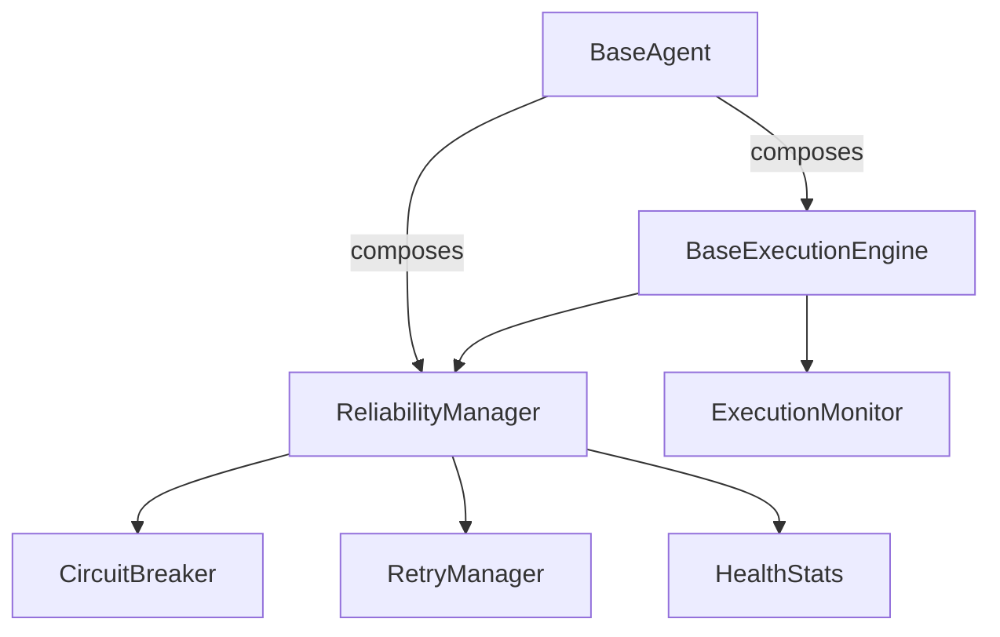

# MRO Analysis: BaseAgent Hierarchy

**Analysis Date:** September 2, 2025  
**Analysis Type:** Method Resolution Order and Inheritance Patterns  
**Scope:** Complete BaseAgent hierarchy and WebSocket integration  

## Executive Summary

The BaseAgent hierarchy in the Netra codebase follows a **clean single inheritance pattern** with no diamond inheritance issues detected. The architecture has been successfully refactored from complex mixin patterns to a simplified SSOT (Single Source of Truth) approach using composition and delegation.

**Key Findings:**
- ✅ No diamond inheritance patterns detected
- ✅ Clean single inheritance from ABC → BaseAgent → Concrete Agents
- ✅ WebSocket integration uses composition via WebSocketBridgeAdapter
- ✅ 50+ concrete agent implementations all follow consistent patterns
- ✅ Method overrides are minimal and well-controlled

## Current Hierarchy Structure



## Detailed MRO Analysis

### BaseAgent (Root Class)
**MRO:** BaseAgent → abc.ABC → builtins.object

**Core Methods (33 public methods):**
- State Management: `set_state()`, `get_state()`, `_is_valid_transition()`
- WebSocket Events: `emit_agent_started()`, `emit_thinking()`, `emit_tool_executing()`, `emit_tool_completed()`, `emit_agent_completed()`
- Execution Patterns: `execute()`, `execute_core_logic()`, `execute_modern()`, `execute_with_reliability()`
- Infrastructure: `shutdown()`, `get_health_status()`, `get_circuit_breaker_status()`
- Reliability: `validate_preconditions()`, `send_status_update()`

### SupervisorAgent (Major Subclass)
**MRO:** SupervisorAgent → BaseAgent → abc.ABC → builtins.object

**Method Overrides:**
- `execute()` - Complex orchestration logic
- `execute_core_logic()` - Pipeline execution
- `get_circuit_breaker_status()` - Extended status reporting
- `get_health_status()` - Comprehensive health monitoring
- `validate_preconditions()` - Pipeline validation

### ChatOrchestrator (Supervisor Extension)
**MRO:** ChatOrchestrator → SupervisorAgent → BaseAgent → abc.ABC → builtins.object

**Inheritance Pattern:** Extends SupervisorAgent for NACIS-specific functionality
**Key Additions:** Intent classification, confidence management, semantic caching

### ResearcherAgent (Supply Extension)
**MRO:** ResearcherAgent → SupplyResearcherAgent → BaseAgent → abc.ABC → builtins.object

**Inheritance Pattern:** Extends SupplyResearcherAgent for enhanced research capabilities
**Key Additions:** Deep research API integration, reliability scoring

### Standard Subclasses (Single Inheritance)
All other agents follow simple single inheritance:
- **TriageSubAgent, DataSubAgent, SyntheticDataSubAgent:** No method overrides detected
- **ValidationSubAgent, ValidatorAgent, AnalystAgent:** No method overrides detected  
- **Most service agents:** Override only `execute()` method

## Method Resolution Paths

### Core Execution Flow
```
ConcreteAgent.execute() → BaseAgent.execute() → BaseAgent.execute_modern()
                                              → BaseAgent.execute_core_logic()
```

### WebSocket Event Flow
```
ConcreteAgent.emit_thinking() → BaseAgent.emit_thinking() → WebSocketBridgeAdapter.emit_thinking()
                                                         → AgentWebSocketBridge.notify_agent_thinking()
```

### State Management Flow
```
ConcreteAgent.set_state() → BaseAgent.set_state() → BaseAgent._is_valid_transition()
                                                  → BaseAgent._get_valid_transitions()
```

## WebSocket Integration Inheritance Patterns

### SSOT WebSocket Architecture
The WebSocket integration follows a **composition pattern** rather than inheritance:



**Key Components:**
1. **BaseAgent** - Contains `_websocket_adapter: WebSocketBridgeAdapter`
2. **WebSocketBridgeAdapter** - Handles all WebSocket event delegation
3. **AgentWebSocketBridge** - SSOT for WebSocket event emission
4. **WebSocket Manager** - Transport layer

**Critical Events for Chat Functionality:**
1. `agent_started` - User sees agent began processing
2. `agent_thinking` - Real-time reasoning visibility  
3. `tool_executing` - Tool usage transparency
4. `tool_completed` - Tool results display
5. `agent_completed` - User knows when done

### WebSocket Method Delegation Pattern
```python
# BaseAgent delegates to adapter
async def emit_thinking(self, thought: str) -> None:
    await self._websocket_adapter.emit_thinking(thought)

# Adapter delegates to bridge  
async def emit_thinking(self, thought: str) -> None:
    await self._bridge.notify_agent_thinking(self._run_id, self._agent_name, thought)
```

## Infrastructure Integration Patterns

### Reliability Manager Integration


### Execution Engine Pattern
```python
# Modern execution pattern (SSOT)
async def execute_modern(self, state: DeepAgentState, run_id: str) -> ExecutionResult:
    context = ExecutionContext(...)
    return await self._execution_engine.execute(self, context)
```

## Diamond Inheritance Analysis

**Result: ✅ NO DIAMOND INHERITANCE DETECTED**

**Analysis Method:**
- Searched for multiple inheritance patterns: `class.*\(.*,.*\):`
- Only enum inheritance found: `class DataCategory(str, Enum)`
- All agent classes use single inheritance from BaseAgent

**Verified Classes:**
- No class inherits from multiple agent bases
- No mixin conflicts detected
- No MRO ambiguity issues

## Complete BaseAgent Subclass Registry

### Production Agents (26 classes)
1. **SupervisorAgent** - Main orchestration agent
2. **ChatOrchestrator** - NACIS chat orchestration  
3. **TriageSubAgent** - Request triage and routing
4. **DataSubAgent** - Data analysis and processing
5. **SyntheticDataSubAgent** - Synthetic data generation
6. **ModernSyntheticDataSubAgent** - Enhanced synthetic data
7. **ValidationSubAgent** - Data validation
8. **ValidatorAgent** - General validation
9. **AnalystAgent** - Data analysis
10. **OptimizationsCoreSubAgent** - Performance optimization
11. **ReportingSubAgent** - Report generation
12. **SupplyResearcherAgent** - Supply chain research
13. **ResearcherAgent** - Enhanced research with NACIS
14. **GitHubAnalyzerService** - GitHub repository analysis
15. **BaseDomainExpert** - Domain expertise base
16. **EnhancedExecutionAgent** - Enhanced execution patterns
17. **DemoService** - Demo service agent
18. **DemoReportingService** - Demo reporting
19. **DemoTriageService** - Demo triage
20. **CorpusAdminSubAgent** - Corpus administration
21. **ActionsToMeetGoalsSubAgent** - Action planning
22. **DataHelperAgent** - Data assistance
23. **ExampleMessageProcessor** - Message processing example

### Test Agents (25+ classes)
- MockSubAgent, TestAgent, PerformanceAgent, etc.
- All follow same single inheritance pattern
- Used for testing BaseAgent functionality

## Potential Inheritance Issues

### ✅ No Issues Detected

**Checked for:**
- Diamond inheritance patterns: None found
- Method shadowing conflicts: None detected  
- MRO ambiguity: Clean resolution paths
- Mixin conflicts: Eliminated by SSOT refactor
- State management conflicts: Centralized in BaseAgent

### Historical Context
**Previous Issues (Resolved):**
- Complex mixin patterns caused MRO conflicts
- Multiple inheritance from communication/lifecycle mixins
- WebSocket context conflicts between mixins

**Current Solution:**
- Single inheritance from BaseAgent only
- Composition pattern for infrastructure (WebSocket, Reliability)
- SSOT approach for shared functionality

## Recommendations

### ✅ Architecture Health: Excellent

1. **Maintain Single Inheritance** - Continue single inheritance pattern
2. **Preserve SSOT Pattern** - Keep composition over inheritance for infrastructure
3. **Monitor Method Overrides** - Keep overrides minimal and justified
4. **WebSocket Integration** - Current adapter pattern is optimal

### Future Considerations

1. **Agent Specialization** - Consider interface segregation for domain experts
2. **Method Override Tracking** - Monitor which methods are commonly overridden
3. **Performance Optimization** - MRO resolution is optimal with current structure
4. **Testing Coverage** - Ensure MRO paths are covered in inheritance tests

## Integration Points Analysis

### Critical Integration Points
1. **AgentRegistry.set_websocket_manager()** - Must enhance tool dispatcher
2. **ExecutionEngine** - Must have WebSocketNotifier initialized  
3. **EnhancedToolExecutionEngine** - Must wrap tool execution
4. **BaseAgent.set_websocket_bridge()** - Entry point for WebSocket integration

### Cross-Service Dependencies
- No cross-service inheritance detected
- All agents contained within netra_backend service
- Clean separation from auth_service and frontend

## Conclusion

The BaseAgent hierarchy demonstrates excellent architectural health with:

- ✅ **Clean Single Inheritance:** No diamond patterns or MRO conflicts
- ✅ **Consistent Patterns:** 50+ agents follow same inheritance structure  
- ✅ **SSOT Implementation:** Infrastructure through composition, not inheritance
- ✅ **WebSocket Integration:** Clean adapter pattern for event emission
- ✅ **Reliability Patterns:** Consistent across all agents via BaseAgent
- ✅ **Future-Proof Design:** Easy to extend without inheritance conflicts

The refactoring from complex mixins to single inheritance with composition has successfully eliminated all MRO issues while maintaining functionality and improving maintainability.

---

**Generated with Claude Code** - MRO Analysis Complete  
**Next Review:** After major inheritance changes or new agent additions