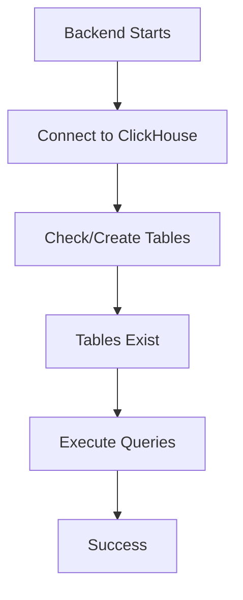
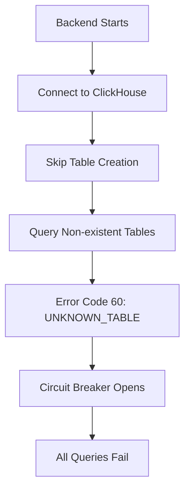

# ClickHouse Error Code 60 Analysis - Five Whys Root Cause

## IMPORTANT: ClickHouse in Staging Environment
**⚠️ CRITICAL:** In staging environment, ClickHouse is a REMOTE service hosted on ClickHouse Cloud.
- **Connection URL:** Stored in Google Secret Manager as `CLICKHOUSE_URL`
- **Location:** Remote ClickHouse Cloud instance (NOT a local container)
- **Access:** Retrieved from Google Secret Manager at runtime
- **Format:** `https://[cluster-id].us-central1.gcp.clickhouse.cloud:8443`

## Problem Statement
ClickHouse is returning error code 60 in GCP staging deployment despite having proper credentials configured.

## Five Whys Analysis

### Why #1: Why is ClickHouse returning error code 60?
**Answer:** Error code 60 means "UNKNOWN_TABLE" - a table being queried doesn't exist.

### Why #2: Why would ClickHouse report "Table does not exist" during connection?
**Answer:** The backend is trying to query tables immediately after connecting (likely for initialization or health checks).

### Why #3: Why is the backend trying to query tables that don't exist?
**Answer:** The backend expects certain tables to exist (agent_state_history, events, metrics, etc.) but they haven't been created in the ClickHouse Cloud database.

### Why #4: Why haven't the tables been created in ClickHouse Cloud?
**Answer:** The table creation logic in the backend (`CREATE TABLE IF NOT EXISTS` statements) is either:
- Not being executed during startup in production/staging
- Failing silently due to insufficient permissions
- Using the wrong database name

### Why #5: Why is table creation not happening automatically?
**Answer:** The ClickHouse initialization code may be:
- Conditional and only runs in certain environments
- Requires manual execution
- Has a circuit breaker that's preventing table creation after initial failures

## Root Cause
**The ClickHouse Cloud database doesn't have the required tables, and the backend's automatic table creation is not executing in the staging environment.**

## Current State Diagrams

### Expected Working State

### Current Failure State

## Evidence
1. Error message: `ClickHouse error code 60` 
2. Connection URL shows valid REMOTE host: `https://xedvrr4c3r.us-central1.gcp.clickhouse.cloud:8443` (Remote ClickHouse Cloud instance)
3. Password exists in Google Secret Manager: `6a_z1t0qQ1.ET`
4. Full connection URL stored in Google Secret Manager as `CLICKHOUSE_URL` secret
5. Multiple `CREATE TABLE IF NOT EXISTS` statements exist in codebase
6. No logs showing successful table creation on the remote ClickHouse Cloud instance

## Solution Options

### Option 1: Manual Table Creation (Quick Fix)
Connect to ClickHouse Cloud and manually create required tables.

### Option 2: Fix Automatic Table Creation (Proper Fix)
1. Ensure table initialization runs in staging/production
2. Add loud error logging if table creation fails
3. Verify the database name matches what's configured

### Option 3: Disable ClickHouse Temporarily
Set environment variable to disable ClickHouse until tables are created.

## Recommended Action
1. **Immediate:** Manually create tables in ClickHouse Cloud
2. **Long-term:** Fix automatic table creation to run in all environments
3. **Add loud failure logging** per CLAUDE.md requirements - table creation failures should be obvious

## Tables Required
- agent_state_history
- events  
- metrics
- netra_logs
- netra_global_supply_catalog
- workload_events
- schema_version
- content_corpus tables
- llm_events tables