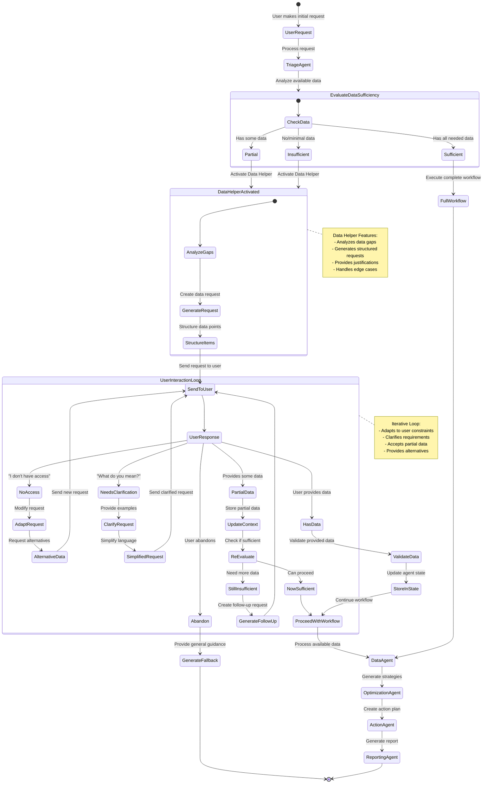
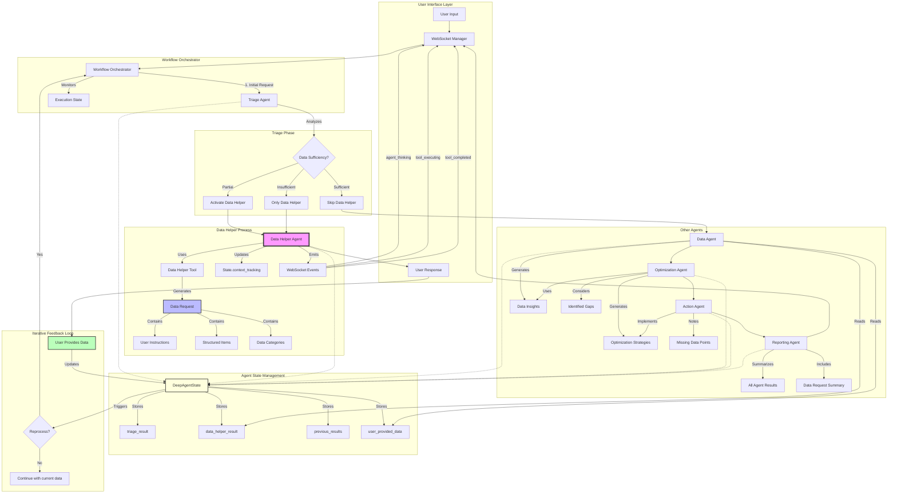
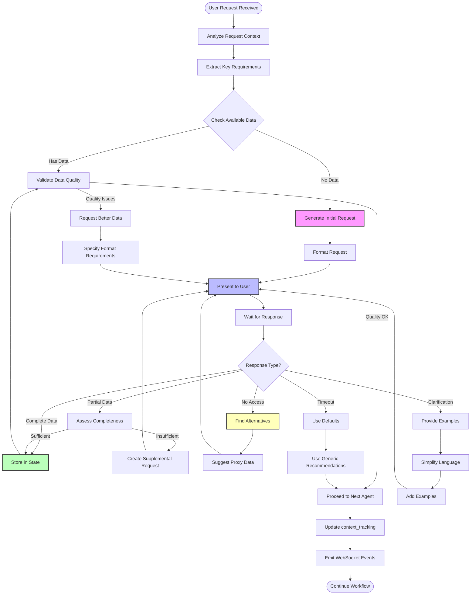

# Data Helper Agent - Iterative Loop and Interaction Diagrams

## 1. Data Helper Agent Iterative Loop with User Interactions

This diagram shows how the Data Helper Agent can perform an iterative loop based on user interactions, particularly when users don't have access to requested data or need clarification.

## 2. Data Helper Agent Interactions with Other Agent Processes

This diagram illustrates how the Data Helper Agent interacts with other agents in the system, showing data flow and decision points.

## 3. Detailed Data Helper Iterative Decision Flow

This diagram shows the detailed decision-making process within the Data Helper's iterative loop:

## Key Features of the Data Helper Agent's Iterative Loop

### 1. **Adaptive Request Generation**
- Analyzes triage results and previous agent outputs
- Identifies specific data gaps
- Generates contextual data requests

### 2. **User Interaction Handling**
- **No Access Scenario**: Suggests alternative data sources or proxy metrics
- **Clarification Needed**: Provides examples and simplified explanations
- **Partial Data**: Accepts what's available and adapts recommendations
- **Timeout/Abandon**: Falls back to generic guidance

### 3. **State Management**
- Stores all interactions in `state.context_tracking`
- Maintains data request history
- Tracks user-provided data for downstream agents

### 4. **Integration Points**
- **Triage Agent**: Receives data sufficiency assessment
- **Data Agent**: Provides collected data for analysis
- **Optimization Agent**: Considers data gaps in strategy generation
- **Reporting Agent**: Includes data request summary in final report

### 5. **WebSocket Events**
The Data Helper emits real-time events for transparency:
- `agent_thinking`: Shows reasoning process
- `tool_executing`: Indicates data request generation
- `tool_completed`: Confirms request creation
- `agent_completed`: Signals readiness for user interaction

### 6. **Iterative Refinement**
The system can loop through multiple iterations:
1. Initial data request
2. User provides partial data or indicates constraints
3. Data Helper adapts request
4. Process repeats until sufficient data or user abandons
5. Workflow continues with available data

This iterative approach ensures the system remains helpful even when users have limited data access, providing value through adaptive recommendations based on available information.