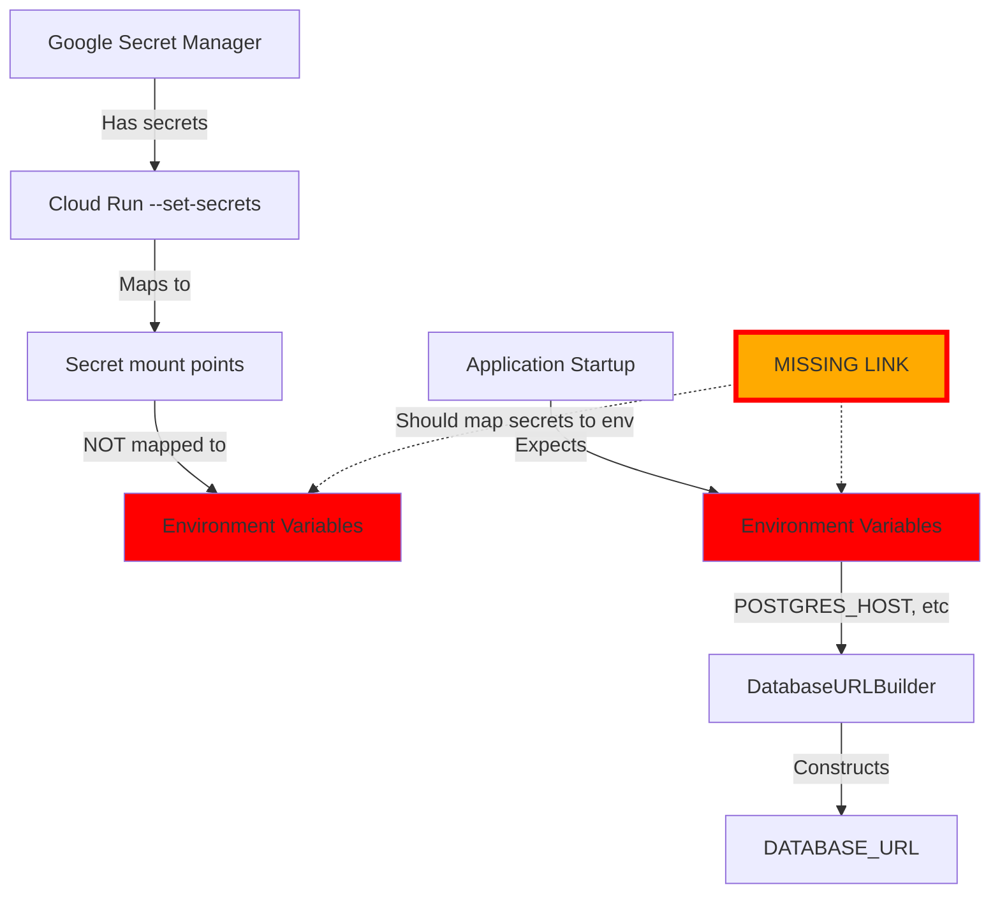

# Comprehensive Regression Audit Report
Date: 2025-09-05 11:49:30 PDT
Severity: P0 CRITICAL - Multiple Configuration Mismatches Found

## Executive Summary

**CRITICAL REGRESSION IDENTIFIED**: The staging deployment is failing due to a fundamental mismatch between what the deployment script provides and what the application expects. This is NOT just missing secrets - it's a **systemic configuration architecture failure**.

## Primary Regression: Database URL Construction Failure

### The Fatal Disconnect

1. **Deployment Script Behavior** (`scripts/deploy_to_gcp.py`):
   - Sets environment variables like `ENVIRONMENT=staging`
   - Configures secrets via Google Secret Manager references
   - Does NOT set individual `POSTGRES_*` environment variables

2. **Application Expectation** (`StagingConfig`):
   - Calls `DatabaseURLBuilder` to construct database URL
   - `DatabaseURLBuilder.staging.auto_url` expects:
     - `POSTGRES_HOST` (e.g., `/cloudsql/project:region:instance`)
     - `POSTGRES_USER`
     - `POSTGRES_PASSWORD`
     - `POSTGRES_DB`
     - `POSTGRES_PORT`

3. **The Gap**:
   - GSM provides secrets but NOT as individual `POSTGRES_*` variables
   - `DatabaseURLBuilder` fails to construct URL
   - Application raises: `"DatabaseURLBuilder failed to construct URL for staging environment"`

## Secondary Regressions Identified

### 1. OAuth Configuration Mismatch (From Previous Analysis)
- **Issue**: Environment-specific OAuth credentials required but missing
- **Impact**: 503 errors on OAuth login attempts
- **Root Cause**: Strict SSOT enforcement without proper credential setup

### 2. SupplyDatabaseManager Missing Implementation
- **Issue**: Code imports non-existent `SupplyDatabaseManager` class
- **Impact**: Module import failures
- **Root Cause**: Class referenced but never implemented

### 3. Secret Loading Chain Broken
- **Issue**: GSM secrets not properly mapped to environment variables
- **Impact**: Critical secrets like `JWT_SECRET_KEY` not available at runtime
- **Root Cause**: Deployment script uses `--set-secrets` but doesn't map to env vars

## Root Cause Analysis: Architectural Mismatch

### The Core Problem
There's a fundamental architectural mismatch in how configuration flows from deployment to runtime:



### Why This Happened

1. **SSOT Over-Enforcement**: The drive for Single Source of Truth led to removing "duplicate" configuration without understanding the deployment context
2. **GSM Integration Incomplete**: Secrets are referenced but not properly injected as environment variables
3. **Testing Gap**: Local tests use `.env` files, staging uses GSM - different configuration paths
4. **Documentation Mismatch**: Deployment docs assume env vars are set, code assumes they exist

## Critical Configuration Dependencies

### What the Application NEEDS at Runtime

```yaml
# TIER 1 - BLOCKS STARTUP (From DatabaseURLBuilder)
POSTGRES_HOST: /cloudsql/project:region:instance  # For Cloud SQL
POSTGRES_USER: netra_user
POSTGRES_PASSWORD: <from-gsm>
POSTGRES_DB: netra_staging
POSTGRES_PORT: 5432

# TIER 2 - BLOCKS FEATURES (From StagingConfig)
JWT_SECRET_KEY: <from-gsm>
SERVICE_SECRET: <from-gsm>
REDIS_HOST: <memorystore-ip>
REDIS_PORT: 6379
```

### What the Deployment Script PROVIDES

```yaml
# Environment variables set directly
ENVIRONMENT: staging
PYTHONUNBUFFERED: 1
AUTH_SERVICE_URL: https://auth.staging.netrasystems.ai
# ... other URLs ...

# Secrets referenced via --set-secrets (NOT as env vars!)
JWT_SECRET_STAGING: /secret/jwt-secret-staging
SECRET_KEY: /secret/secret-key-staging
# ... but these are mount points, NOT environment variables!
```

## The Fix Required

### Option 1: Fix Deployment Script (Recommended)
Modify `deploy_to_gcp.py` to set environment variables FROM secret values:

```python
# In deploy_service() method, after line 896:
cmd.extend([
    "--set-env-vars", f"POSTGRES_HOST={postgres_host_from_secret}",
    "--set-env-vars", f"POSTGRES_USER={postgres_user_from_secret}",
    "--set-env-vars", f"POSTGRES_PASSWORD={postgres_password_from_secret}",
    "--set-env-vars", f"POSTGRES_DB={postgres_db_from_secret}",
    "--set-env-vars", f"DATABASE_URL={constructed_url}",
])
```

### Option 2: Fix Application Configuration
Modify `StagingConfig` to read from secret mount points instead of env vars:

```python
def _load_database_url_from_unified_config_staging(self, data: dict) -> None:
    # Read from /secret/postgres-host-staging instead of env var
    with open('/secret/postgres-host-staging', 'r') as f:
        postgres_host = f.read().strip()
    # ... etc for other secrets
```

### Option 3: Use DATABASE_URL Directly
Skip component construction and set `DATABASE_URL` directly in deployment:

```python
# In deployment script
database_url = f"postgresql://user:pass@/db?host=/cloudsql/instance"
cmd.extend(["--set-env-vars", f"DATABASE_URL={database_url}"])
```

## Validation Failures

The deployment script's validation (`validate_secrets_before_deployment`) likely passes because it checks if secrets EXIST in GSM, not whether they're properly mapped to environment variables the application can access.

## Business Impact

1. **Complete Staging Outage**: No testing possible
2. **Deployment Pipeline Blocked**: Can't validate changes
3. **Customer Impact Risk**: Issues not caught in staging go to production
4. **Developer Velocity**: Team blocked on testing features

## Immediate Actions Required

1. **CRITICAL**: Choose and implement one of the three fix options above
2. **Verify GSM secrets exist** with correct values
3. **Test configuration flow** from GSM → Cloud Run → Application
4. **Update deployment validation** to check runtime availability, not just GSM existence
5. **Document the configuration flow** clearly

## Lessons for Prevention

1. **Test Deployment Paths**: Test the EXACT deployment method used in production
2. **Configuration Flow Documentation**: Document how configs flow from source to runtime
3. **Environment Parity**: Ensure local, staging, and production use similar config mechanisms
4. **Validation at Runtime**: Don't just check if secrets exist, check if app can ACCESS them
5. **Regression Tests**: Add tests that verify configuration availability at each stage

## Conclusion

This is a **critical architectural regression** where the deployment infrastructure and application configuration have diverged. The fix requires either:
- Teaching the deployment script to properly map secrets to environment variables
- Teaching the application to read from secret mount points
- Simplifying to use a complete DATABASE_URL instead of components

Priority: **P0 CRITICAL - Staging is completely down until this is fixed**