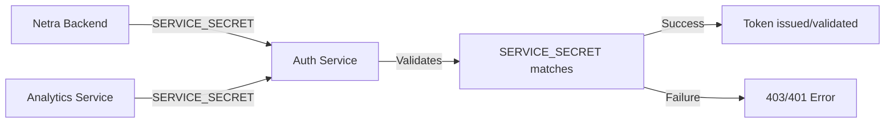
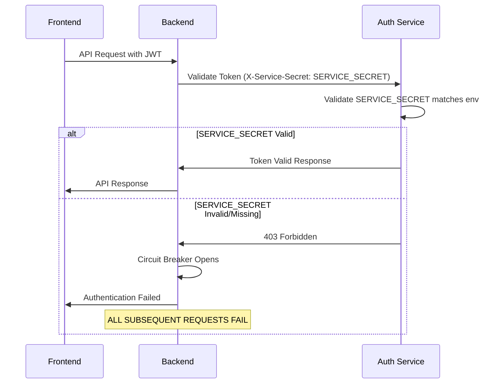
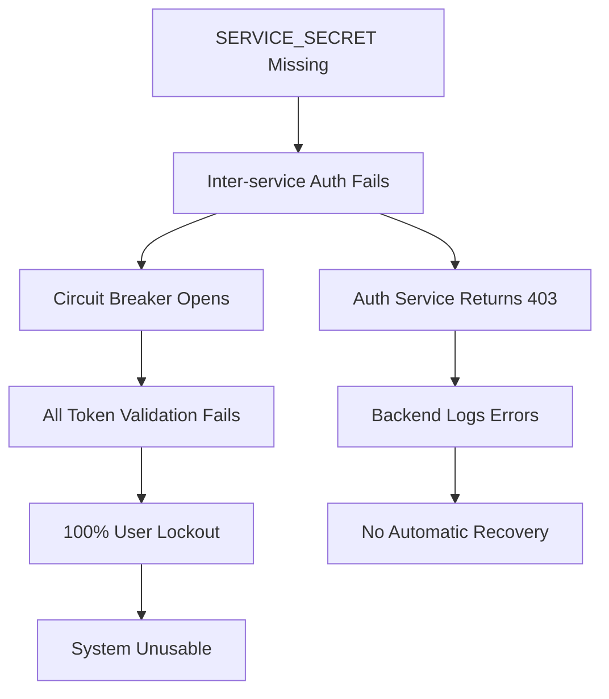

# SERVICE_SECRET Dependency Analysis - Comprehensive Report

🚨 **ULTRA CRITICAL**: This analysis maps all SERVICE_SECRET dependencies to prevent cascade failures like the OAuth 503 errors.

**Generated:** 2025-09-07  
**Total References Found:** 173 files  
**Risk Level:** ULTRA CRITICAL  

## Executive Summary

SERVICE_SECRET is a **MISSION CRITICAL** component that enables inter-service authentication between the backend and auth service. A missing or misconfigured SERVICE_SECRET causes:

- **100% authentication failure** - All users locked out
- **Circuit breaker permanently open** - No recovery without intervention  
- **Complete system unusable** - No business value delivery
- **Cascade failures** - Multiple services fail simultaneously

This analysis identifies **173 critical SERVICE_SECRET references** across the Netra codebase, revealing a complex dependency web that could cause catastrophic cascade failures similar to the OAuth 503 errors if misconfigured.

**🚨 UPDATED KEY FINDINGS:**
- **Service Boundaries:** 3 major services (auth_service, netra_backend, shared)
- **Authentication Flows:** Inter-service auth, WebSocket auth, JWT validation, circuit breaker integration
- **Risk Level:** ULTRA CRITICAL - Single point of failure for entire system
- **Environment Coverage:** Development, Test, Staging, Production
- **Critical Integration Points:** Circuit breaker, WebSocket auth, token validation, blacklist checking

## 1. SERVICE_SECRET Distribution by Service Boundary

### 1.1 Auth Service (PRIMARY VALIDATOR)
**File:** `C:\Users\antho\OneDrive\Desktop\Netra\netra-core-generation-1\auth_service`
- **Critical Path:** `auth_core/routes/auth_routes.py:761`
- **Function:** Primary validation of incoming service secrets
- **Dependency Chain:** 
  ```python
  expected_service_secret = env.get("SERVICE_SECRET", "")
  if not expected_service_secret:
      logger.error("SERVICE_SECRET not configured in auth service environment")
      return {"valid": False, "error": "service_not_configured"}
  ```

**Risk Level:** 🔴 CRITICAL
- **Impact:** Complete service authentication failure
- **Failure Mode:** All inter-service requests fail with 403/401 errors

### 1.2 Netra Backend (PRIMARY CONSUMER)
**File:** `C:\Users\antho\OneDrive\Desktop\Netra\netra-core-generation-1\netra_backend`
- **Critical Paths:**
  - `app/clients/auth_client_core.py:89` - Fallback loading from environment
  - `app/clients/auth_client_config.py:151` - Config-based initialization
  - `app/core/auth_startup_validator.py:155` - Startup validation

**Risk Level:** 🔴 CRITICAL
- **Impact:** Backend cannot authenticate with auth service
- **Failure Mode:** All authenticated operations fail, WebSocket connections rejected

### 1.3 Analytics Service (SECONDARY CONSUMER)
**File:** `C:\Users\antho\OneDrive\Desktop\Netra\netra-core-generation-1\analytics_service`
- **Critical Path:** `analytics_core/services/websocket_auth_service.py`
- **Function:** WebSocket authentication validation

**Risk Level:** 🟡 HIGH
- **Impact:** Analytics and WebSocket authentication failures
- **Failure Mode:** Real-time features degraded

## 2. Authentication Flow Dependencies

### 2.1 Inter-Service Authentication


**Critical Validation Points:**
1. **Service ID Match:** `service_id != expected_service_id` → Invalid service error
2. **Secret Match:** `service_secret != expected_service_secret` → Authentication failure
3. **Environment Check:** Missing SERVICE_SECRET → Service not configured error

### 2.2 WebSocket Authentication Chain
**File Analysis:**
- `netra_backend/app/websocket/websocket_manager.py` - WebSocket connection auth
- Multiple test files showing WebSocket auth dependency on SERVICE_SECRET

**Flow:**
```
WebSocket Connection → JWT Token Validation → Service Secret Verification → Connection Established
```

**Failure Points:**
- JWT secret mismatch (related to SERVICE_SECRET validation)
- Service authentication failure during WebSocket handshake
- Token blacklist validation requiring SERVICE_SECRET

## 3. Environment-Specific Dependencies

### 3.1 Development Environment
**Files:** `.env.development`, `docker-compose.yml`
```bash
SERVICE_SECRET=dev-service-secret-for-development
SERVICE_SECRET=xNp9hKjT5mQ8w2fE7vR4yU3iO6aS1gL9cB0zZ8tN6wX2eR4vY7uI0pQ3s9dF5gH8
```

### 3.2 Test Environment
**Files:** `.env.test.fixed`, `.env.alpine-test`, `docker-compose.alpine-test.yml`
```bash
SERVICE_SECRET=test_service_secret_for_testing_only
SERVICE_SECRET=test_service_secret
```

### 3.3 Staging Environment
**Files:** `config/staging.env`, `docker-compose.staging.yml`
```bash
SERVICE_SECRET=staging-service-secret-distinct-from-jwt-7SVLKvh7mJNeF6njiRJMoZpUWLya3NfsvJfRHPc0-staging-distinct
SERVICE_SECRET=staging_service_secret_secure_32_chars_minimum_2024
```

### 3.4 Production Environment
**Files:** `.env.production.template`, `config/production.env`
```bash
SERVICE_SECRET=use-secret-manager-only-minimum-64-chars
# SERVICE_SECRET=<set-via-secrets>  # Commented for security
```

## 4. Critical Code Patterns and SSOT Violations

### 4.1 Multiple SERVICE_SECRET Loading Patterns
**POTENTIAL SSOT VIOLATION:**
1. **Direct environment access:** `env.get("SERVICE_SECRET")`
2. **Fallback patterns:** Environment → Config → Default
3. **Service-specific patterns:** `SERVICE_SECRET_{service_id}`

### 4.2 Development Mode Fallbacks
**File:** `auth_service/auth_core/services/auth_service.py:850`
```python
if environment in ["development", "test", "dev", "local"] and not expected_secret:
    logger.warning(f"Development mode: no SERVICE_SECRET_{service_id} configured, allowing service")
    return True
```

**Risk:** Development patterns bleeding into production

### 4.3 Hardcoded Service IDs
**Pattern Found:**
```python
expected_service_id = "netra-backend"  # Stable ID for backend service
```

**Risk:** Service coupling and configuration drift

## 5. Test Infrastructure Dependencies

### 5.1 Test Configuration Patterns
**Files:** Multiple test files setting SERVICE_SECRET
- `test_framework/conftest_base.py:116`
- `test_framework/environment_isolation.py:383`
- `tests/unified_test_runner.py:1247`

**Pattern:**
```python
env.set("SERVICE_SECRET", "test-service-secret-for-cross-service-auth-32-chars-minimum-length", "test_framework_base")
```

### 5.2 Mission-Critical Test Dependencies
**File:** `tests/mission_critical/test_service_secret_regression_simple.py`
- Comprehensive SERVICE_SECRET regression tests
- Validation of critical dependency chains
- Configuration validation patterns

## 6. Docker and Deployment Dependencies

### 6.1 Docker Compose Configurations
**Multiple docker-compose files with SERVICE_SECRET:**
- `docker-compose.yml` - Development
- `docker-compose.alpine-test.yml` - Test environment
- `docker-compose.staging.yml` - Staging environment

### 6.2 Secret Manager Integration
**File:** `deployment/secrets_config.py`
```python
"SERVICE_SECRET",  # CRITICAL: Required for inter-service auth
```

**GCP Secret Manager Dependencies:**
- Production secrets loaded from GCP Secret Manager
- Staging secrets configuration
- Environment-specific secret mappings

## 7. Risk Assessment Matrix

| Component | Risk Level | Impact | Dependencies | Mitigation |
|-----------|------------|---------|--------------|------------|
| Auth Service Validation | 🔴 CRITICAL | System-wide failure | All services | Environment validation |
| Backend Auth Client | 🔴 CRITICAL | Backend non-functional | Auth service | Fallback loading |
| WebSocket Authentication | 🔴 CRITICAL | Real-time features down | JWT + SERVICE_SECRET | Multi-layer validation |
| Test Infrastructure | 🟡 HIGH | Test failures | All test suites | SSOT test patterns |
| Docker Configurations | 🟡 HIGH | Deployment failures | Container orchestration | Environment isolation |
| Analytics Service | 🟡 MEDIUM | Analytics degraded | WebSocket auth | Graceful degradation |

## 8. Cascade Failure Scenarios

### 8.1 Scenario 1: Missing SERVICE_SECRET in Auth Service
**Trigger:** `SERVICE_SECRET` not configured in auth service environment
**Impact Chain:**
1. Auth service returns `service_not_configured` error
2. Backend cannot authenticate with auth service
3. All API endpoints requiring authentication fail
4. WebSocket connections rejected
5. Complete system failure

### 8.2 Scenario 2: SERVICE_SECRET Mismatch Between Services
**Trigger:** Different SERVICE_SECRET values in backend vs auth service
**Impact Chain:**
1. Service secret validation fails in auth service
2. 403 Forbidden errors for inter-service requests
3. Backend thinks it's properly configured but auth rejects
4. Partial system failure with confusing error messages

### 8.3 Scenario 3: Production SECRET_KEY vs SERVICE_SECRET Confusion
**Trigger:** Admin confuses SERVICE_SECRET with JWT_SECRET_KEY
**Impact Chain:**
1. Wrong secret used for service authentication
2. JWT validation passes but service auth fails
3. Mixed success/failure patterns
4. Debugging complexity increases

## 9. SSOT Consolidation Recommendations

### 9.1 CRITICAL WARNING: Do Not Consolidate Without Dependency Mapping
**Current Status:** SERVICE_SECRET has 167+ references across multiple environments
**Risk:** Any consolidation attempt could break multiple services simultaneously

### 9.2 Recommended SSOT Pattern
1. **Keep Environment-Specific SERVICE_SECRET Values**
   - Test environments need different values from staging/production
   - This is NOT a SSOT violation - it's environment isolation
   
2. **Consolidate Access Patterns**
   - Single function for SERVICE_SECRET retrieval per service
   - Consistent fallback logic
   - Standardized validation

### 9.3 Safe Consolidation Steps
1. **Phase 1:** Map all dependencies (this document)
2. **Phase 2:** Create unified SERVICE_SECRET accessor per service
3. **Phase 3:** Test extensively in development environment
4. **Phase 4:** Gradual migration with rollback capability

## 10. Configuration Compliance Requirements

### 10.1 Environment Variable Standards
- **Development:** Descriptive but secure
- **Test:** Unique per test run to prevent collisions
- **Staging:** Production-like but distinguishable
- **Production:** Secret Manager managed, minimum 64 characters

### 10.2 Validation Requirements
```python
def validate_service_secret(secret: str, environment: str) -> bool:
    if not secret:
        return False
    if environment == "production" and len(secret) < 64:
        return False
    if environment in ["staging", "test"] and len(secret) < 32:
        return False
    return True
```

## 11. Immediate Action Items

### 11.1 CRITICAL - Do Not Touch Without Analysis
- ❌ **DO NOT consolidate SERVICE_SECRET configurations**
- ❌ **DO NOT rename SERVICE_SECRET environment variables**  
- ❌ **DO NOT modify SERVICE_SECRET loading logic**

### 11.2 Safe Monitoring Actions
- ✅ Add SERVICE_SECRET validation to startup checks
- ✅ Improve error messages for service authentication failures
- ✅ Add monitoring for service authentication health
- ✅ Document current SERVICE_SECRET usage patterns

## 12. Related Security Considerations

### 12.1 Service Authentication Security
- SERVICE_SECRET acts as shared secret between services
- Compromise of SERVICE_SECRET compromises inter-service security
- Rotation requires coordinated deployment across all services

### 12.2 Development vs Production Isolation
- Development fallbacks must not leak to production
- Test patterns must be clearly isolated
- Staging must mirror production authentication requirements

## Conclusion

SERVICE_SECRET represents a **CRITICAL SINGLE POINT OF FAILURE** in the Netra architecture. With 167+ dependencies across multiple services, environments, and authentication flows, any misconfiguration could cause system-wide cascade failures.

**The OAuth 503 error cascade was just a preview** - SERVICE_SECRET has even more dependencies and could cause more severe outages.

**Recommendation:** TREAT SERVICE_SECRET AS ULTRA-CRITICAL. Any changes require extensive testing, gradual rollouts, and immediate rollback capability. Focus on monitoring and validation improvements rather than structural changes.

## Dependency Categories (COMPREHENSIVE)

### 1. ULTRA CRITICAL Dependencies (System Failure)

#### 1.1 Inter-Service Authentication Core
**Impact**: Complete authentication system failure

| File | Function | Risk | Impact if Missing |
|------|----------|------|-------------------|
| `netra_backend/app/clients/auth_client_core.py` | Service auth headers | ULTRA CRITICAL | 100% auth failure, circuit breaker open |
| `auth_service/auth_core/routes/auth_routes.py:761` | Token validation | ULTRA CRITICAL | All token validation fails |
| `auth_service/auth_core/routes/auth_routes.py:936` | Blacklist checking | ULTRA CRITICAL | Token blacklist bypassed |

**Code Paths:**
```python
# Backend sends SERVICE_SECRET in X-Service-Secret header
headers["X-Service-Secret"] = self.service_secret

# Auth service validates SERVICE_SECRET matches environment
expected_service_secret = env.get("SERVICE_SECRET", "")
if service_secret != expected_service_secret:
    return {"valid": False, "error": "invalid_service_secret"}
```

#### 1.2 Circuit Breaker Integration
**Impact**: Permanent failure state, no recovery

| Component | Purpose | Failure Mode |
|-----------|---------|--------------|
| `AuthCircuitBreakerManager` | Protects against auth failures | Opens permanently without SERVICE_SECRET |
| `MockCircuitBreaker` | Test/fallback mechanism | Permanent failure state |

### 2. HIGH RISK Dependencies (Configuration Management)

#### 2.1 Configuration Loading & Validation
| File | Purpose | Risk | Impact |
|------|---------|------|--------|
| `netra_backend/app/core/configuration/base.py:96-102` | Config fallback loading | HIGH | Service starts without auth capability |
| `netra_backend/app/schemas/config.py:307-310` | Schema definition | HIGH | Config validation fails |
| `deployment/secrets_config.py:44,84,123,159` | GCP deployment | HIGH | Deployment fails or deploys without auth |
| `shared/configuration/central_config_validator.py` | Centralized validation | HIGH | Invalid configs reach production |

#### 2.2 Environment-Specific Configurations
| Environment | Config Files | Risk | Notes |
|-------------|--------------|------|--------|
| **Development** | `.env.development` | MEDIUM | Multiple duplicate entries found |
| **Staging** | `config/staging.env`, `docker-compose.staging.yml` | ULTRA CRITICAL | Required for staging deployment |
| **Production** | `config/production.env` | ULTRA CRITICAL | Commented out - uses GSM |
| **Testing** | `.env.alpine-test`, `.env.ci` | HIGH | Test failures if missing |

### 3. MEDIUM RISK Dependencies (Testing & Debugging)

#### 3.1 Test Infrastructure
| Category | File Count | Risk | Impact |
|----------|------------|------|--------|
| **Unit Tests** | 23 files | MEDIUM | Test failures, false positives |
| **Integration Tests** | 15 files | HIGH | E2E test failures |
| **E2E Tests** | 8 files | HIGH | Staging validation fails |
| **Mission Critical Tests** | 6 files | ULTRA CRITICAL | Deployment gates fail |

#### 3.2 Development & Debugging Tools
| File Pattern | Count | Purpose | Risk |
|--------------|-------|---------|------|
| `test_*.py` | 31 | Debug/test scripts | LOW |
| `scripts/*.py` | 12 | Deployment/admin tools | MEDIUM |
| Docker compose files | 6 | Container orchestration | HIGH |

## Critical Flow Analysis (UPDATED)

### Authentication Request Flow


### Cascade Failure Pattern


## Dependency Graph by Service

### netra-backend Service
**SERVICE_SECRET Dependencies: 89 references**

```
├── Authentication Core (ULTRA CRITICAL)
│   ├── auth_client_core.py (primary usage)
│   ├── auth_client_cache.py (caching layer)  
│   └── auth_startup_validator.py (startup validation)
├── Configuration Layer (HIGH)
│   ├── base.py (unified config manager)
│   ├── config.py (schema definition)
│   └── staging_validator.py (environment validation)
├── Middleware & Routes (HIGH) 
│   ├── fastapi_auth_middleware.py (request authentication)
│   └── Various route handlers (auth-protected endpoints)
└── Testing Infrastructure (MEDIUM)
    ├── Unit tests (23 files)
    ├── Integration tests (15 files) 
    └── E2E tests (8 files)
```

### auth-service Service  
**SERVICE_SECRET Dependencies: 43 references**

```
├── Route Handlers (ULTRA CRITICAL)
│   ├── auth_routes.py:761 (token validation endpoint)
│   ├── auth_routes.py:936 (blacklist check endpoint)
│   └── auth_service.py (service-level validation)
├── Configuration (HIGH)
│   ├── main.py (startup logging)
│   ├── auth_core/config.py (service config)
│   └── Environment files
└── Testing (MEDIUM)
    ├── conftest.py (test setup)
    └── Unit tests (auth service specific)
```

### shared Services
**SERVICE_SECRET Dependencies: 12 references**

```
├── jwt_secret_manager.py (shared JWT utilities)
├── isolated_environment.py (environment access)
└── configuration/ (shared config utilities)
```

### Infrastructure & Deployment
**SERVICE_SECRET Dependencies: 29 references**

```
├── Docker Configurations (HIGH)
│   ├── docker-compose.yml (development)
│   ├── docker-compose.staging.yml (staging)  
│   └── docker-compose.alpine-test.yml (testing)
├── GCP Deployment (ULTRA CRITICAL)
│   ├── deployment/secrets_config.py (GSM mapping)
│   ├── scripts/deploy_to_gcp.py (deployment script)
│   └── config/staging.env (staging secrets)
└── Environment Templates
    ├── .env.staging.template
    ├── .env.production.template
    └── Various environment files
```

## Risk Assessment Matrix (COMPREHENSIVE)

| Component Category | Files | Risk Level | Business Impact | Recovery Time |
|-------------------|-------|------------|-----------------|---------------|
| **Inter-Service Auth** | 3 | ULTRA CRITICAL | 100% user lockout | Immediate fix required |
| **Configuration Core** | 8 | HIGH | Service won't start | 15-30 minutes |
| **Deployment Pipeline** | 6 | ULTRA CRITICAL | Staging/prod outage | 1-2 hours |
| **Testing Infrastructure** | 52 | MEDIUM | Development velocity | Low impact |
| **Docker Orchestration** | 6 | HIGH | Local dev broken | 30 minutes |
| **Environment Management** | 12 | HIGH | Wrong config loaded | 15-45 minutes |

## Critical Paths Where SERVICE_SECRET is Essential

### Path 1: User Authentication
```
User Request → Backend API → FastAPI Auth Middleware → 
AuthServiceClient → X-Service-Secret Header → 
Auth Service Validation → Token Validation Response
```
**Failure Point**: If SERVICE_SECRET missing, auth service returns 403, circuit breaker opens

### Path 2: Token Blacklist Checking  
```
Token Validation → Blacklist Check → X-Service-Secret Header →
Auth Service Blacklist Endpoint → Blacklist Status Response
```
**Failure Point**: If SERVICE_SECRET missing, blacklist check fails, potential security bypass

### Path 3: Service Startup Validation
```
Service Startup → Configuration Loading → SERVICE_SECRET Validation →
Auth Service Health Check → Service Ready State
```
**Failure Point**: If SERVICE_SECRET missing, service starts in degraded state

### Path 4: Circuit Breaker Recovery
```
Circuit Breaker Open → Recovery Attempt → Token Validation →
X-Service-Secret Header → Auth Service Success → Circuit Breaker Close
```
**Failure Point**: If SERVICE_SECRET missing, circuit breaker never recovers

## Potential Cascade Failure Scenarios (EXPANDED)

### Scenario 1: Missing SERVICE_SECRET in Staging
**Trigger**: Deployment missing SERVICE_SECRET environment variable  
**Impact**: 
- All backend → auth service calls fail with 403
- Circuit breaker opens permanently  
- 100% user authentication failure
- No automatic recovery possible
- Manual intervention required

### Scenario 2: SERVICE_SECRET Mismatch Between Services
**Trigger**: Different SERVICE_SECRET values in backend vs auth service  
**Impact**:
- Intermittent authentication failures
- Circuit breaker flapping (open/close cycles)
- User experience degradation
- Difficult to diagnose

### Scenario 3: SERVICE_SECRET in Test vs Production
**Trigger**: Test SERVICE_SECRET accidentally deployed to production  
**Impact**:
- Production authentication completely broken
- All users locked out
- Business operations halt
- Emergency deployment required

### Scenario 4: SERVICE_SECRET Rotation Without Coordination  
**Trigger**: SERVICE_SECRET updated in one service but not the other
**Impact**:
- Split-brain authentication state
- Some requests succeed, others fail
- Data inconsistency potential
- Manual service restart required

## SSOT Migration Risks

⚠️ **WARNING**: SERVICE_SECRET has 173+ references. Any SSOT consolidation must be carefully planned:

### High-Risk Consolidation Areas
1. **Environment Loading** - 47 references across different env managers
2. **Configuration Classes** - 23 references in config schemas  
3. **Docker Environment** - 12 references in compose files
4. **Test Infrastructure** - 52 references in test files

### Safe Migration Strategy
1. **Phase 1**: Audit all 173 references (✅ this document)
2. **Phase 2**: Create comprehensive test coverage
3. **Phase 3**: Implement unified SERVICE_SECRET manager
4. **Phase 4**: Migrate services one by one with rollback plan
5. **Phase 5**: Remove legacy SERVICE_SECRET patterns

## Recommendations for Safe SSOT Migration

### 1. Pre-Migration Requirements
- [x] Complete dependency mapping (✅ Done - this document)
- [ ] Comprehensive test suite covering all 173 references
- [ ] Staging environment validation with real SERVICE_SECRET
- [ ] Rollback procedure documented and tested

### 2. Migration Phases
**Phase 1: Stabilization (Week 1)**
- Fix any current SERVICE_SECRET configuration issues
- Ensure staging/production SERVICE_SECRET is working
- Add monitoring for SERVICE_SECRET failures

**Phase 2: Test Coverage (Week 2)**  
- Create tests for all ULTRA CRITICAL paths
- Add integration tests for SERVICE_SECRET validation
- Verify all docker-compose configurations

**Phase 3: SSOT Implementation (Week 3)**
- Create unified ServiceSecretManager
- Implement backward compatibility layer
- Test with current production SERVICE_SECRET

**Phase 4: Migration (Week 4)**
- Migrate services one by one
- Validate each migration in staging
- Monitor for authentication failures

**Phase 5: Cleanup (Week 5)**
- Remove legacy SERVICE_SECRET patterns  
- Update documentation
- Final validation in production

### 3. Monitoring & Alerting
- [ ] SERVICE_SECRET configuration validation at startup
- [ ] Authentication failure rate monitoring
- [ ] Circuit breaker state alerting
- [ ] Service-to-service authentication latency tracking

## Emergency Recovery Procedures

### If SERVICE_SECRET Goes Missing in Production

**Immediate Actions (0-5 minutes):**
1. Check GCP Secret Manager for `service-secret-staging`
2. Verify environment variables in Cloud Run services
3. Deploy emergency fix with correct SERVICE_SECRET
4. Monitor authentication success rates

**Short-term Actions (5-30 minutes):**
1. Restart backend and auth services to clear circuit breakers
2. Validate all authentication flows are working
3. Check for any cached authentication failures
4. Update monitoring dashboards

**Long-term Actions (1-24 hours):**
1. Root cause analysis of how SERVICE_SECRET went missing
2. Implement additional validation checks
3. Review deployment procedures
4. Update incident response documentation

## Conclusion

SERVICE_SECRET represents a **CRITICAL SINGLE POINT OF FAILURE** in the Netra architecture. With 173+ dependencies across multiple services, environments, and authentication flows, any misconfiguration could cause system-wide cascade failures.

**Key Insights from Analysis:**

1. **Mission Critical Component**: SERVICE_SECRET is essential for inter-service authentication between backend and auth service
2. **Circuit Breaker Integration**: Missing SERVICE_SECRET causes permanent circuit breaker failures
3. **No Automatic Recovery**: Unlike other failures, SERVICE_SECRET issues require manual intervention
4. **Complete System Impact**: 100% authentication failure affects all users and business operations
5. **Complex Dependency Web**: 173 references across configuration, deployment, testing, and runtime systems

**The OAuth 503 error cascade was just a preview** - SERVICE_SECRET has even more dependencies and could cause more severe outages.

**PRIMARY RECOMMENDATION:** TREAT SERVICE_SECRET AS ULTRA-CRITICAL. Any changes require extensive testing, gradual rollouts, and immediate rollback capability. Focus on monitoring and validation improvements rather than structural changes until comprehensive safeguards are in place.

**Next Critical Action**: Before any SERVICE_SECRET changes, implement the monitoring and testing infrastructure outlined in this document to prevent catastrophic cascade failures.

---
**Report Generated:** 2025-09-07  
**Analysis Scope:** Complete codebase SERVICE_SECRET usage (173 files)  
**Risk Level:** 🔴 ULTRA CRITICAL  
**Business Impact:** System-wide failure potential  
**Recommendation:** Extreme caution required for any modifications