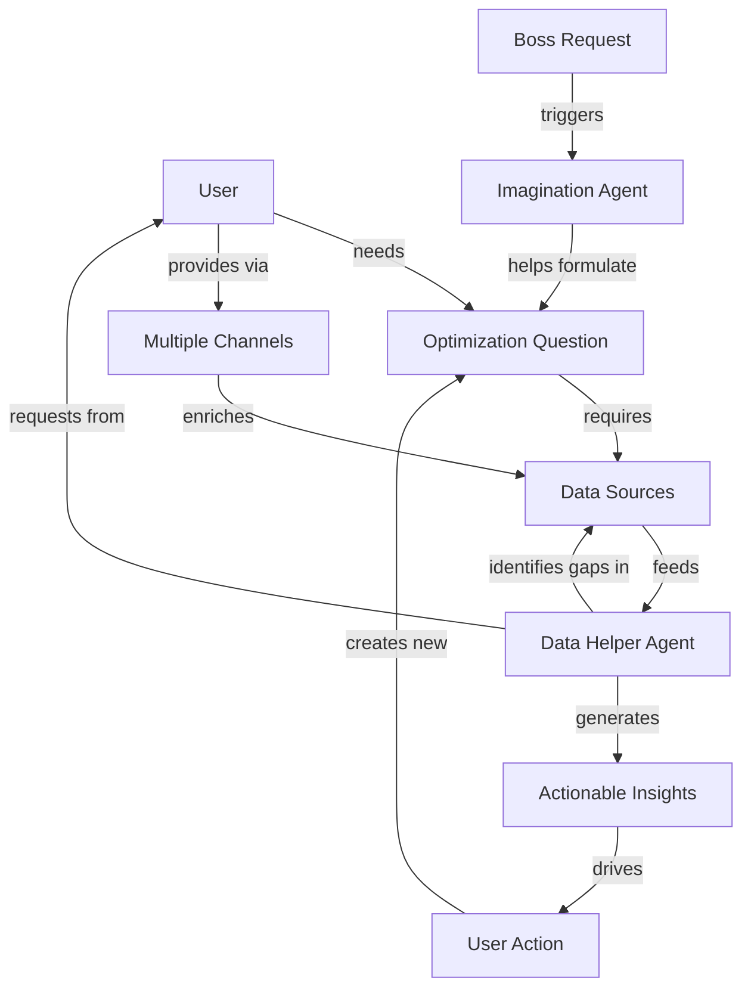

# Optimization Loop Diagram

## Core Flow: User → Question → Data → Insight → Action

## Key Relationships

1. **Boss tells User** → "Fix AI costs" → **Imagination Agent helps** → User asks better questions
2. **User has partial data** → **Data Helper identifies gaps** → User provides missing data → Loop continues
3. **Data Helper serves** → Both users and internal agents → Creates unified data access pattern

## Value Loop
- User-driven repetitive optimization cycles
- Each iteration improves question quality and data completeness
- System learns what data matters for specific optimization goals