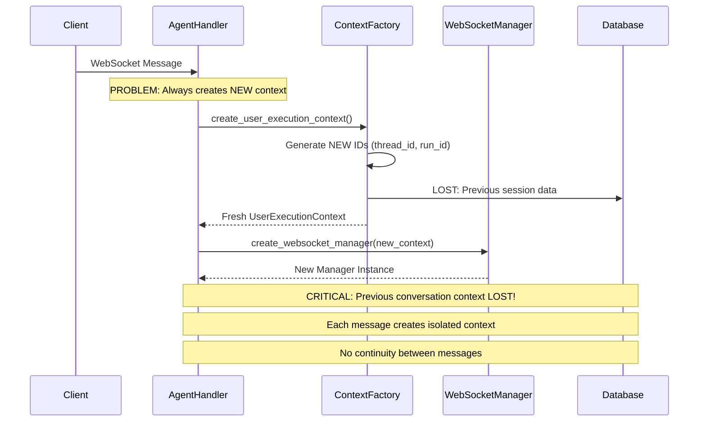
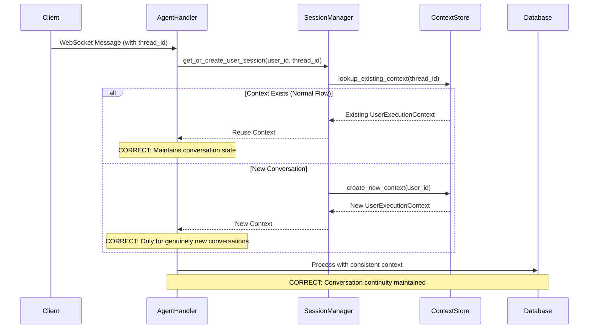
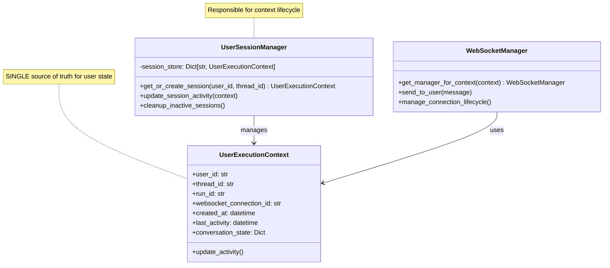

# User Context Creation Architecture Analysis

**Date:** 2025-01-08  
**Critical Issue:** Multiple context creation patterns causing confusion and potential data inconsistency  
**Root Cause:** Architectural split between WebSocketContext and UserExecutionContext  

## Executive Summary

🚨 **ARCHITECTURE PROBLEM IDENTIFIED**: The system is creating **MULTIPLE OVERLAPPING CONTEXTS** instead of using a single source of truth for user session state.

❌ **Wrong Pattern**: Creating new contexts for every WebSocket message  
✅ **Correct Pattern**: Should retrieve/reuse existing user session context  

## The Architectural Issue

### Current Problematic Flow (WRONG):



### Correct Pattern (Should Be):



## Code Evidence of the Problem

### File: `websocket_core/agent_handler.py`

**Lines 102-106 - PROBLEMATIC PATTERN:**
```python
context = create_user_execution_context(
    user_id=user_id,
    thread_id=thread_id,  # Either from message OR newly generated
    run_id=run_id         # Either from message OR newly generated  
)
```

**This creates a NEW context for EVERY message, which:**
1. Loses previous conversation state
2. Generates new IDs even for continuing conversations  
3. Cannot maintain user session persistence
4. Creates race conditions in multi-message scenarios

### File: `websocket_core/context.py`

**Lines 82-95 - CONFLICTING CONTEXT TYPES:**
```python
@classmethod
def create_for_user(cls, websocket: WebSocket, user_id: str, 
                   thread_id: str, run_id: str, connection_id: str):
    # Creates WebSocketContext - DIFFERENT from UserExecutionContext!
```

**Problem**: We have TWO different context types:
- `WebSocketContext` (connection-focused)
- `UserExecutionContext` (business logic focused)

This creates **impedance mismatch** and forces constant context conversion.

## Impact Analysis

### Business Impact
- **Lost Conversations**: Users lose context between messages
- **Poor UX**: Agents can't remember previous parts of conversation
- **Data Inconsistency**: Multiple contexts can have conflicting state

### Technical Impact
- **Memory Leaks**: Creating new contexts without cleanup
- **Performance**: Unnecessary object creation per message
- **Race Conditions**: Multiple contexts for same user/thread
- **Testing Issues**: Non-deterministic context state

## Solution Architecture

### Proposed Fix: Unified Context Management



## Correct Implementation Pattern

### 1. Session-First Approach
```python
# CORRECT: Get or create session context
async def handle_message(self, user_id: str, websocket: WebSocket, message: WebSocketMessage):
    # Extract thread_id from message (conversation identifier)
    thread_id = message.payload.get("thread_id") or message.thread_id
    
    # Get existing session or create new one ONLY if needed
    user_context = await self.session_manager.get_or_create_user_session(
        user_id=user_id,
        thread_id=thread_id
    )
    
    # Update activity (don't create new context!)
    user_context.update_activity()
    
    # Use existing WebSocket manager for this context
    ws_manager = self.websocket_factory.get_manager_for_context(user_context)
```

### 2. Context Lifecycle Management
```python
class UserSessionManager:
    def __init__(self):
        self._sessions: Dict[str, UserExecutionContext] = {}
        self._cleanup_task = None
    
    async def get_or_create_user_session(self, user_id: str, thread_id: str) -> UserExecutionContext:
        session_key = f"{user_id}:{thread_id}"
        
        # Return existing session if it exists
        if session_key in self._sessions:
            context = self._sessions[session_key]
            context.update_activity()
            return context
        
        # Create new session only if genuinely needed
        context = UserExecutionContext(
            user_id=user_id,
            thread_id=thread_id,
            run_id=UnifiedIdGenerator.generate_base_id("run"),
            websocket_connection_id=UnifiedIdGenerator.generate_websocket_connection_id(user_id)
        )
        
        self._sessions[session_key] = context
        return context
```

## Migration Strategy

### Phase 1: Immediate (Critical)
1. **Audit all `create_user_execution_context()` calls** - determine which should be "get_or_create"
2. **Fix agent_handler.py** to use session-based context retrieval
3. **Add session lifecycle management** to prevent memory leaks

### Phase 2: Architectural (Next Sprint)
1. **Implement UserSessionManager** with proper lifecycle
2. **Unify WebSocketContext and UserExecutionContext** into single pattern
3. **Add conversation state persistence** for true multi-turn support

### Phase 3: Optimization (Future)
1. **Add context caching** for high-performance scenarios
2. **Implement context cleanup strategies** for long-running sessions
3. **Add monitoring/metrics** for context lifecycle health

## Validation Tests Required

```python
# Test: Context Reuse Across Messages
async def test_context_reuse_in_conversation():
    user_id = "test_user"
    thread_id = "conversation_123"
    
    # First message
    context1 = await handler.get_user_context(user_id, thread_id)
    original_run_id = context1.run_id
    
    # Second message (same thread)
    context2 = await handler.get_user_context(user_id, thread_id)
    
    # CRITICAL: Must be same context instance
    assert context1 is context2
    assert context2.run_id == original_run_id
    
# Test: New Context for New Thread
async def test_new_context_for_new_thread():
    user_id = "test_user"
    thread1 = "conversation_123"  
    thread2 = "conversation_456"
    
    context1 = await handler.get_user_context(user_id, thread1)
    context2 = await handler.get_user_context(user_id, thread2)
    
    # CRITICAL: Different contexts for different threads
    assert context1 is not context2
    assert context1.thread_id != context2.thread_id
```

## Conclusion

**VERDICT: Current Pattern is ARCHITECTURALLY WRONG**

The system is creating new contexts for every message instead of maintaining session continuity. This breaks fundamental assumptions about:
- Conversation persistence
- User experience continuity  
- Resource management
- Multi-user isolation

**Priority**: CRITICAL - This affects core business value (chat continuity) and must be fixed immediately.

---
**Next Steps**: 
1. Implement UserSessionManager pattern
2. Migrate agent_handler.py to use session-based context retrieval
3. Add comprehensive testing for context lifecycle
4. Add monitoring for context leak detection