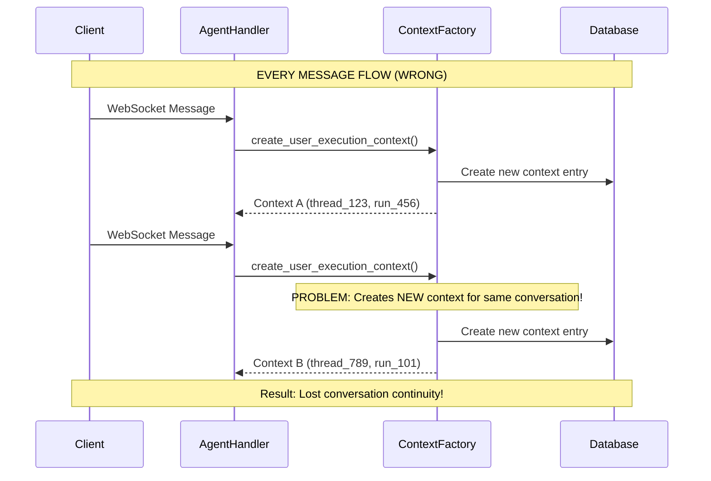
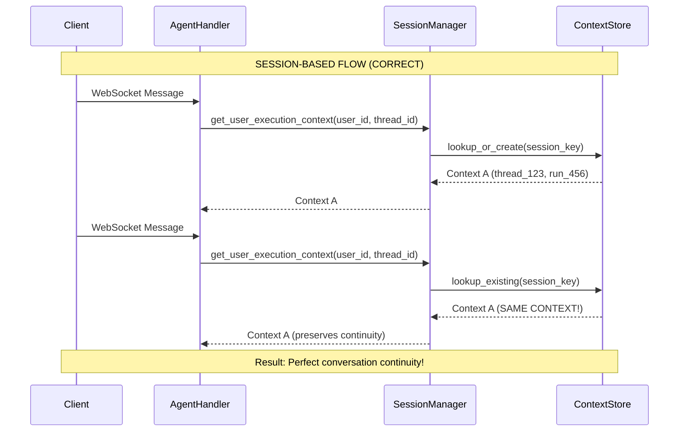

# Context Factory vs Getter - Architectural Analysis

**Date:** 2025-01-08  
**Critical Issue:** `create_user_execution_context` is fundamentally wrong architecture  
**Root Cause:** Factory pattern used where Session/Getter pattern needed  

## The Core Problem

### Current Anti-Pattern (WRONG):
```python
# EVERY message creates a NEW context
context = create_user_execution_context(
    user_id=user_id,
    thread_id=thread_id,
    run_id=run_id
)
```

### Correct Pattern (NEEDED):
```python
# Get existing session or create if genuinely new
context = get_user_execution_context(
    user_id=user_id,
    thread_id=thread_id
)
```

## Why `create_user_execution_context` Exists (Historical Analysis)

Looking at the codebase, `create_user_execution_context` exists because:

1. **Legacy HTTP Request Model** - Originally designed for stateless HTTP requests where every request needed a fresh context
2. **Lack of Session Management** - No session lifecycle management was implemented
3. **WebSocket Mismatch** - WebSocket connections are stateful but the system treats them as stateless
4. **Missing Architecture** - No UserSessionManager or context lifecycle management

## The Fundamental Architectural Error

### Current Flow:


### Correct Flow:


## The Fix Strategy

### Step 1: Replace Factory with Getter
```python
# OLD (WRONG):
def create_user_execution_context(user_id, thread_id, run_id=None):
    """Always creates NEW context - BREAKS CONTINUITY"""
    return UserExecutionContext(
        user_id=user_id,
        thread_id=thread_id,
        run_id=run_id or generate_new_run_id()  # ALWAYS NEW!
    )

# NEW (CORRECT):
def get_user_execution_context(user_id, thread_id):
    """Gets existing context or creates if genuinely new"""
    return UnifiedIdGenerator.get_or_create_user_session(
        user_id=user_id,
        thread_id=thread_id
    )
```

### Step 2: Update All Callers
**Files requiring changes:**
1. `websocket_core/agent_handler.py` - Replace create with get
2. `services/websocket/quality_*.py` - Replace create with get  
3. Any other files using `create_user_execution_context`

### Step 3: Deprecation Path
```python
def create_user_execution_context(user_id, thread_id, run_id=None, **kwargs):
    """DEPRECATED: Use get_user_execution_context instead.
    
    This function breaks session continuity and should not be used.
    """
    import warnings
    warnings.warn(
        "create_user_execution_context is deprecated. "
        "Use get_user_execution_context for proper session management.",
        DeprecationWarning,
        stacklevel=2
    )
    
    # For backward compatibility, fall back to session management
    return get_user_execution_context(user_id, thread_id)
```

## Why This Matters

### Business Impact
- **Lost Conversations** - Users can't maintain multi-turn conversations
- **Poor UX** - Agents forget context between messages
- **Memory Waste** - Creating unnecessary objects instead of reusing

### Technical Impact  
- **Race Conditions** - Multiple contexts for same conversation
- **Memory Leaks** - Unreferenced contexts accumulating
- **Testing Issues** - Inconsistent state makes testing difficult

## Implementation Plan

### Phase 1: Add Session Management (Done ✅)
- Added `get_or_create_user_session` to UnifiedIdGenerator
- Added session lifecycle management methods

### Phase 2: Create Getter Function
```python
def get_user_execution_context(user_id: str, thread_id: str) -> UserExecutionContext:
    """Get existing user execution context or create if needed.
    
    This is the correct SSOT pattern for context management.
    """
    session_data = UnifiedIdGenerator.get_or_create_user_session(user_id, thread_id)
    
    return UserExecutionContext(
        user_id=user_id,
        thread_id=session_data["thread_id"],
        run_id=session_data["run_id"],
        request_id=session_data["request_id"]
    )
```

### Phase 3: Replace All Usage
- Update all `create_user_execution_context` calls to use `get_user_execution_context`
- Add deprecation warnings to old function
- Test conversation continuity

### Phase 4: Cleanup
- Remove deprecated `create_user_execution_context` function
- Add proper session cleanup background tasks
- Add monitoring for session health

## Validation Tests Needed

```python
def test_context_continuity():
    """Test that context is preserved across messages"""
    user_id = "test_user"
    thread_id = "conversation_123"
    
    # First message
    context1 = get_user_execution_context(user_id, thread_id)
    original_run_id = context1.run_id
    
    # Second message (same conversation)
    context2 = get_user_execution_context(user_id, thread_id)
    
    # CRITICAL: Must preserve conversation context
    assert context1.thread_id == context2.thread_id
    assert context1.run_id == context2.run_id  # Same session
    assert context1.user_id == context2.user_id
```

## Conclusion

The existence of `create_user_execution_context` represents a fundamental architectural mistake - using a factory pattern where a session/getter pattern is needed. This breaks the most basic requirement of conversational AI systems: **continuity**.

**Priority: CRITICAL** - This affects core business value and must be addressed immediately.

**Impact: HIGH** - Every WebSocket conversation is broken by this anti-pattern.

**Solution: ARCHITECTURAL** - Replace factory with session management as implemented in UnifiedIdGenerator.