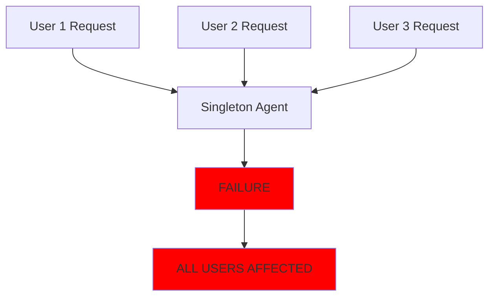
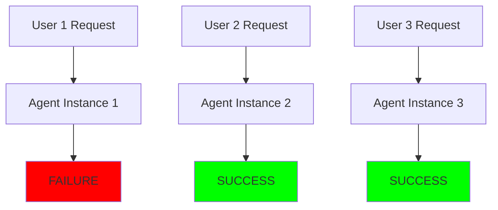
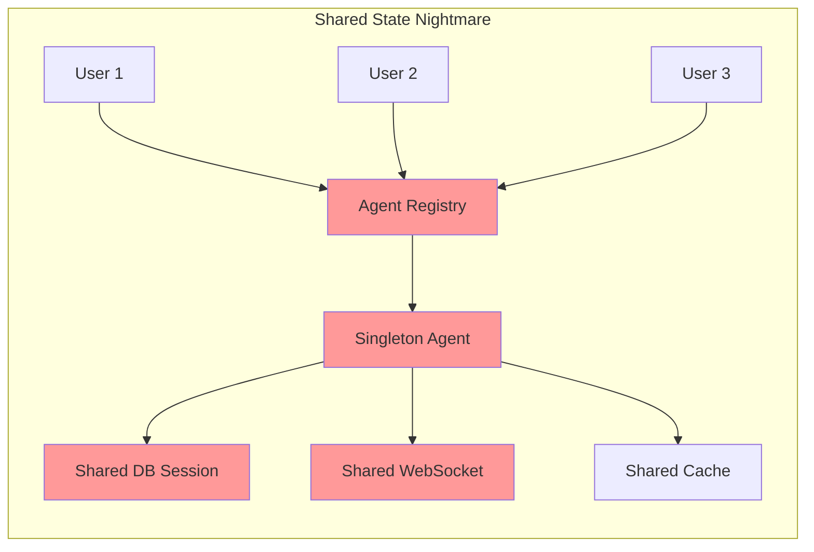
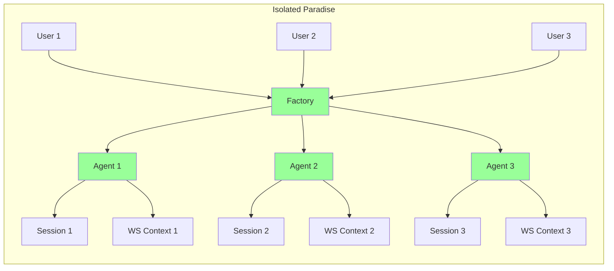

# CRITICAL: Complete Request Isolation Architecture

## Executive Summary
**ZERO FAILURE PROPAGATION**: Each agent failure, run failure, WebSocket failure, or thread failure MUST have absolutely ZERO impact on other requests and the system. Every request must be completely independent.

## Core Principle: Total Isolation
```
ONE REQUEST FAILURE = ZERO SYSTEM IMPACT
```

## Current Problem: Singleton Pattern Causes Cascade Failures

### What's Happening Now (BROKEN):


### What MUST Happen (ISOLATED):


## The Five Pillars of Request Isolation

### 1. Instance Isolation (Per-Request Instances)
**NEVER share agent instances between requests**

```python
# ❌ WRONG - Singleton Pattern (Current Problem)
class AgentRegistry:
    def __init__(self):
        self.agents = {}  # Shared instances!
    
    def get_agent(self, name):
        return self.agents[name]  # Same instance for all!

# ✅ CORRECT - Factory Pattern (Required Solution)
class AgentInstanceFactory:
    def create_agent_instance(self, name, context):
        # Fresh instance every time
        agent_class = self.get_agent_class(name)
        return agent_class()  # NEW instance per request
```

### 2. Context Isolation (UserExecutionContext)
**Each request gets its own isolated context**

```python
# Every request MUST have:
context = UserExecutionContext(
    user_id=unique_user,
    thread_id=unique_thread,
    run_id=unique_run,
    # NO shared state
    # NO global references
    # NO singleton dependencies
)
```

### 3. Database Session Isolation
**NEVER share database sessions**

```python
# ❌ WRONG - Shared Session
class Agent:
    def __init__(self, db_session):
        self.db_session = db_session  # NEVER DO THIS

# ✅ CORRECT - Request-Scoped Session
class Agent:
    async def execute(self, context):
        async with get_request_scoped_db_session() as session:
            # Session lives only for this request
            pass
```

### 4. WebSocket Isolation
**Each user gets isolated WebSocket state**

```python
# ❌ WRONG - Shared WebSocket Manager
websocket_manager = WebSocketManager()  # Global!
all_agents_use_same_manager()  # Cross-contamination!

# ✅ CORRECT - Per-Connection Isolation
class WebSocketConnectionManager:
    def get_connection_context(self, connection_id):
        return ConnectionContext(
            connection_id=connection_id,
            user_id=user_id,
            # Isolated message queue
            # Isolated event handlers
            # No cross-connection state
        )
```

### 5. Error Containment
**Failures MUST be contained to their request**

```python
class IsolatedExecutor:
    async def execute_request(self, request):
        try:
            # Create isolated context
            context = self.create_isolated_context(request)
            
            # Create fresh agent instance
            agent = self.factory.create_agent(context)
            
            # Execute with timeout and containment
            result = await asyncio.wait_for(
                agent.execute(context),
                timeout=30.0
            )
            return result
            
        except Exception as e:
            # Log error for THIS request only
            logger.error(f"Request {context.run_id} failed: {e}")
            
            # Return error for THIS request only
            return {"error": str(e), "run_id": context.run_id}
            
        finally:
            # CRITICAL: Cleanup THIS request's resources
            await self.cleanup_request_resources(context)
            # No impact on other requests!
```

## Implementation Requirements

### Phase 1: Immediate Fixes (4 hours)
1. ✅ Add `reset_state()` to BaseAgent
2. ⏳ Update AgentRegistry to call reset_state() before returning agents
3. ⏳ Add request isolation wrapper

### Phase 2: Factory Pattern Migration (8 hours)
1. ⏳ Complete AgentInstanceFactory implementation
2. ⏳ Update all agent creation to use factory
3. ⏳ Remove singleton storage from AgentRegistry
4. ⏳ Implement proper cleanup after each request

### Phase 3: WebSocket Isolation (4 hours)
1. ⏳ Implement per-connection WebSocket contexts
2. ⏳ Isolate WebSocket event queues per user
3. ⏳ Prevent cross-user event leakage

### Phase 4: Database Session Isolation (2 hours)
1. ⏳ Audit all database session usage
2. ⏳ Ensure no sessions stored in instance variables
3. ⏳ Implement request-scoped session pattern everywhere

### Phase 5: Testing & Validation (4 hours)
1. ⏳ Test concurrent request isolation
2. ⏳ Test failure containment
3. ⏳ Test resource cleanup
4. ⏳ Load test with failures

## Critical Code Locations

### Files That MUST Be Fixed:
1. **`netra_backend/app/agents/supervisor/agent_registry.py`**
   - Line 39-52: Deprecated singleton pattern
   - Line 172-198: Singleton agent storage
   - Must migrate to factory pattern

2. **`netra_backend/app/agents/supervisor/agent_instance_factory.py`**
   - Must ensure creates fresh instances
   - Must handle cleanup properly

3. **`netra_backend/app/websocket_core/agent_handler.py`**
   - Must use factory instead of registry
   - Must isolate per connection

4. **`netra_backend/app/orchestration/agent_execution_registry.py`**
   - Line 88-92: Singleton pattern
   - Must support per-request isolation

## Testing for Isolation

### Test 1: Concurrent Request Independence
```python
async def test_concurrent_isolation():
    """Prove requests are completely independent."""
    
    async def make_request(user_id, should_fail=False):
        if should_fail:
            # Force this request to fail
            raise Exception("Intentional failure")
        return {"user": user_id, "status": "success"}
    
    # Run mixed success/failure requests
    results = await asyncio.gather(
        make_request("user1", should_fail=True),  # FAILS
        make_request("user2"),  # MUST SUCCEED
        make_request("user3"),  # MUST SUCCEED
        return_exceptions=True
    )
    
    # Verify isolation
    assert isinstance(results[0], Exception)  # User 1 failed
    assert results[1]["status"] == "success"  # User 2 unaffected
    assert results[2]["status"] == "success"  # User 3 unaffected
```

### Test 2: Resource Cleanup
```python
async def test_resource_cleanup():
    """Prove resources are cleaned up per request."""
    
    # Make request that creates resources
    context1 = create_context("user1")
    agent1 = factory.create_agent(context1)
    await agent1.execute(context1)
    
    # Verify cleanup
    assert agent1 not in active_instances
    assert context1 not in active_contexts
    assert no_leaked_db_sessions()
    assert no_leaked_websocket_connections()
```

### Test 3: State Isolation
```python
async def test_state_isolation():
    """Prove no state leakage between requests."""
    
    # User 1 sets some state
    context1 = create_context("user1")
    agent1 = factory.create_agent(context1)
    agent1.some_state = "user1_data"
    
    # User 2 gets fresh instance
    context2 = create_context("user2")
    agent2 = factory.create_agent(context2)
    
    # Verify complete isolation
    assert agent1 is not agent2
    assert not hasattr(agent2, 'some_state')
    assert agent2 has clean initial state
```

## Monitoring & Alerts

### Key Metrics to Track:
1. **Request Isolation Score**: % of requests with zero cross-contamination
2. **Failure Containment Rate**: % of failures that don't affect other requests
3. **Resource Leak Detection**: Count of uncleaned resources
4. **Singleton Usage Alerts**: Warn when singleton pattern detected

### Alert Conditions:
- CRITICAL: Any cross-request state leakage detected
- WARNING: Resource cleanup taking > 5 seconds
- WARNING: More than 10 concurrent contexts active
- ERROR: Singleton agent instance reused across requests

## Architecture Diagrams

### Current Problem: Shared Everything


### Target: Complete Isolation


## Success Criteria Checklist

### Must Have (Non-Negotiable):
- [ ] Zero state sharing between requests
- [ ] Zero database session sharing
- [ ] Zero WebSocket event leakage
- [ ] Every request gets fresh agent instance
- [ ] Failures contained to single request
- [ ] Proper cleanup after every request
- [ ] No singleton agents in production code

### Should Have:
- [ ] Request timeout enforcement
- [ ] Resource usage limits per request
- [ ] Automatic recovery from failures
- [ ] Graceful degradation under load

### Nice to Have:
- [ ] Request replay capability
- [ ] Isolation metrics dashboard
- [ ] Automatic isolation testing

## Implementation Timeline

**Day 1 (Today)**:
- Morning: Complete BaseAgent reset_state() ✅
- Afternoon: Update AgentRegistry cleanup
- Evening: Test isolation with concurrent requests

**Day 2**:
- Morning: Complete factory pattern migration
- Afternoon: WebSocket isolation implementation
- Evening: Integration testing

**Day 3**:
- Morning: Database session audit and fixes
- Afternoon: Comprehensive testing
- Evening: Deploy to staging

**Day 4**:
- Monitor staging environment
- Fix any isolation violations
- Prepare for production deployment

## Risk Mitigation

### Risk: Incomplete Migration
**Mitigation**: Use feature flags to gradually migrate from singleton to factory pattern

### Risk: Performance Impact
**Mitigation**: Pool agent classes (not instances), optimize instance creation

### Risk: Breaking Changes
**Mitigation**: Maintain backward compatibility layer during transition

## Conclusion

**CRITICAL REQUIREMENT**: The chat application MUST be robust. Each failure - whether agent, run, WebSocket, or thread - MUST have ZERO impact on other requests. Complete isolation is not optional; it's essential for system stability and user experience.

**Current State**: Singleton pattern causes cascade failures
**Target State**: Complete per-request isolation with factory pattern
**Timeline**: 4 days to complete implementation
**Business Impact**: Eliminates system-wide failures, ensures robustness

## Next Steps

1. ✅ BaseAgent reset_state() implemented
2. ⏳ Update AgentRegistry to use reset_state()
3. ⏳ Complete factory pattern migration
4. ⏳ Implement WebSocket isolation
5. ⏳ Audit and fix database sessions
6. ⏳ Comprehensive testing
7. ⏳ Deploy to staging
8. ⏳ Monitor and validate
9. ⏳ Production deployment

---

**Remember**: Every request is an island. No request should know about or affect any other request. This is the path to true system robustness.