# Golden Path Validator Architectural Analysis - September 9, 2025

## Executive Summary

**CRITICAL ARCHITECTURAL FLAW CONFIRMED**: The Golden Path Validator makes monolithic assumptions about database schema that violate microservice boundaries and cause deployment failures despite working services.

## Issue Overview

The Golden Path Validator currently fails in proper microservice environments because it assumes ALL authentication-related tables exist in the backend service database. This is architecturally incorrect and prevents successful deployments when services are properly separated.

## Test Results Analysis

### 1. Unit Test Results (DESIGNED TO FAIL - SUCCESSFUL FAILURE)

**File**: `netra_backend/tests/unit/core/service_dependencies/test_golden_path_validator_monolithic_flaw.py`

#### Key Failures That Prove The Architectural Flaw:

```
✅ CONFIRMED: test_requirements_should_be_service_aware_not_database_aware FAILED
✅ CONFIRMED: test_golden_path_requirements_contain_service_boundary_violations FAILED  
✅ CONFIRMED: test_validator_assumes_monolithic_database_schema FAILED
```

**Evidence**: Tests prove that validator fails when service boundaries are correctly implemented.

### 2. Integration Test Results (DESIGNED TO FAIL - SUCCESSFUL FAILURE)

**File**: `netra_backend/tests/integration/golden_path/test_golden_path_service_boundaries.py`

#### Critical Boundary Violations Exposed:

```
✅ CONFIRMED: test_requirement_assignment_violates_service_boundaries FAILED
✅ CONFIRMED: test_integration_reveals_service_coupling_problems FAILED
✅ CONFIRMED: test_backend_service_cannot_validate_auth_tables PASSED (proving separation works)
```

**Evidence**: Integration tests show that proper service separation breaks the validator.

## Architectural Flaw Analysis

### Current (INCORRECT) Architecture

```mermaid
graph TD
    A[Backend Service] --> B[Backend Database]
    A --> C{Golden Path Validator}
    C --> D[Check 'user_sessions' in Backend DB]
    C --> E[Check 'users' in Backend DB]
    D --> F[❌ FAILS - Tables don't exist]
    E --> G[❌ FAILS - Wrong service boundary]
    
    H[Auth Service] --> I[Auth Database]
    I --> J['user_sessions' EXISTS HERE]
    I --> K['users' EXISTS HERE]
    
    style F fill:#ff9999
    style G fill:#ff9999
    style C fill:#ffcc99
```



### Correct (SERVICE-AWARE) Architecture

```mermaid
graph TD
    A[Backend Service] --> B[Backend Database] 
    A --> C{Service-Aware Validator}
    C --> D[HTTP Call to Auth Service]
    D --> E[Auth Service Health Check]
    E --> F[✅ SUCCESS - Service responds]
    
    G[Auth Service] --> H[Auth Database]
    G --> I[Auth Health Endpoint]
    I --> J[Check own auth tables]
    J --> K[✅ SUCCESS - Tables exist]
    
    style F fill:#99ff99
    style K fill:#99ff99
    style C fill:#99ccff
    style I fill:#99ccff
```



## Specific Boundary Violations Identified

### 1. Requirement Assignment Violations

**Current INCORRECT Assignment**:
```python
GoldenPathRequirement(
    service_type=ServiceType.DATABASE_POSTGRES,  # ❌ WRONG
    requirement_name="user_authentication_ready",
    validation_function="validate_user_auth_tables",
    # This checks backend database for auth tables
)
```

**Should Be**:
```python  
GoldenPathRequirement(
    service_type=ServiceType.AUTH_SERVICE,  # ✅ CORRECT
    requirement_name="user_authentication_ready", 
    validation_function="validate_auth_service_health",
    # This calls auth service health endpoint
)
```

### 2. Database Access Boundary Violations

**Current Issue**: Backend validator directly queries database for auth tables:
```python
# In _validate_user_auth_tables() - LINE 186
critical_tables = ['users', 'user_sessions']  # ❌ AUTH TABLES
# Checked in BACKEND database - WRONG SERVICE
```

**Correct Approach**: Service-to-service validation:
```python
# Should make HTTP call to auth service instead
auth_health_response = await http_client.get("/auth/health")
# Let AUTH service validate its own tables
```

## Business Impact

### Current Problem Impact:
- **Deployment Failures**: Validator blocks staging deployments despite working services
- **False Negatives**: Working systems reported as broken
- **Development Velocity**: Teams blocked by architectural validator issues
- **Service Coupling**: Backend tightly coupled to Auth database schema

### Success Metrics After Fix:
- Validator passes when services are healthy (regardless of database separation)
- Services can be developed and deployed independently 
- No false failures due to proper microservice boundaries
- Faster deployment pipeline validation

## Recommended Solution Architecture

### Phase 1: Service-Aware Validation (IMMEDIATE)

1. **Move Auth Validation to Auth Service**
   ```python
   # Replace direct database checks with HTTP calls
   async def validate_auth_service_health(self, auth_service_url: str):
       response = await httpx.get(f"{auth_service_url}/health")
       return response.status_code == 200
   ```

2. **Update Requirement Assignments**
   ```python
   GOLDEN_PATH_REQUIREMENTS = [
       # Move to AUTH_SERVICE
       GoldenPathRequirement(
           service_type=ServiceType.AUTH_SERVICE,
           requirement_name="user_authentication_ready",
           validation_function="validate_auth_service_health"
       )
   ]
   ```

### Phase 2: Service Health Endpoints (REQUIRED)

Each service must expose health endpoints that validate their own concerns:

```yaml
# Auth Service
GET /health/auth
  - JWT capabilities ✓
  - User authentication ✓  
  - Database connectivity ✓

# Backend Service  
GET /health/backend
  - Agent execution ✓
  - Tool system ✓
  - LLM connectivity ✓

# Database validation becomes infrastructure-only
GET /health/database
  - Connection pool ✓
  - Query performance ✓
  - Resource availability ✓
```

### Phase 3: Cross-Service Validation

```python
class ServiceAwareGoldenPathValidator:
    async def validate_service_health(self, service_type: ServiceType, service_url: str):
        """Validate service through its own health endpoint."""
        health_endpoint = f"{service_url}/health/{service_type.value}"
        response = await self.http_client.get(health_endpoint)
        return self._parse_health_response(response)
```

## Implementation Priority

### Critical Path (Week 1):
1. ✅ Create failing tests (COMPLETED)
2. 🔲 Implement service health endpoints in Auth service
3. 🔲 Update GoldenPathValidator to use HTTP calls instead of direct DB access
4. 🔲 Update GOLDEN_PATH_REQUIREMENTS service assignments

### Validation Path (Week 2):
1. 🔲 Test against staging environment with proper service separation
2. 🔲 Verify no false failures with working services
3. 🔲 Validate deployment pipeline improvements

## Success Criteria

### Before (Current Broken State):
- ❌ Validator fails when services are properly separated
- ❌ Backend checks for auth tables in wrong database  
- ❌ Staging deployments blocked by architectural issues

### After (Target Fixed State):
- ✅ Validator passes when services are healthy
- ✅ Each service validates only its own concerns
- ✅ Staging deployments succeed with proper service separation
- ✅ No coupling between service database schemas

## Files Modified/Created

### Test Files (Proving The Issue):
- `netra_backend/tests/unit/core/service_dependencies/test_golden_path_validator_monolithic_flaw.py`
- `netra_backend/tests/integration/golden_path/test_golden_path_service_boundaries.py`  
- `tests/e2e/staging/test_golden_path_validation_staging_current.py`

### Files Requiring Updates:
- `netra_backend/app/core/service_dependencies/golden_path_validator.py` (MAJOR REFACTOR)
- `netra_backend/app/core/service_dependencies/models.py` (Update requirements)
- `auth_service/app/health/` (New health endpoints)
- `netra_backend/app/health/` (Enhanced health endpoints)

## Conclusion

The test suite has successfully proven that the Golden Path Validator has critical architectural flaws that prevent proper microservice deployment. The failing tests provide clear evidence and guidance for the required architectural transformation to a service-aware validation approach.

**Next Step**: Begin Phase 1 implementation focusing on service health endpoints and HTTP-based validation instead of direct database access across service boundaries.