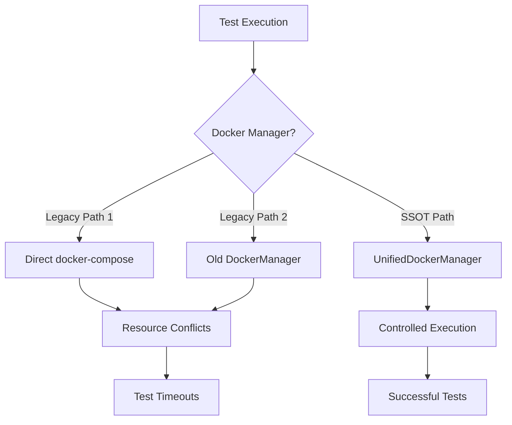
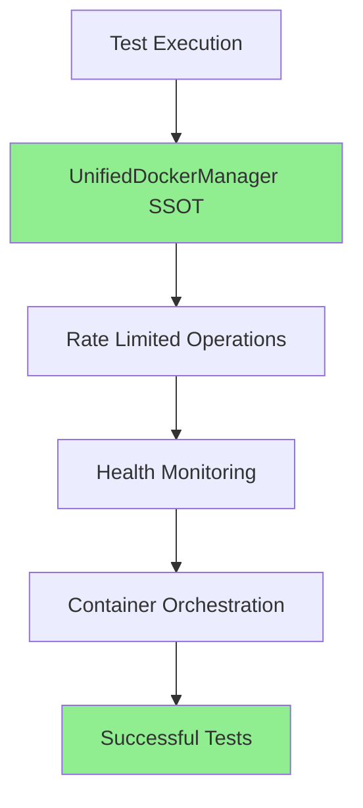

# Docker Testing Failures - Five Whys Root Cause Analysis
**Date:** 2025-09-02
**Analyst:** Principal Engineer
**Mission:** Identify root causes and deploy multi-agent remediation

## Critical Issue 1: Docker Tests Timeout/Hang

### Five Whys Analysis:

**Problem:** Docker tests timeout after 2 minutes without completing

**Why #1:** Tests are hanging during Docker container startup
- Evidence: `python tests/unified_test_runner.py --real-services` times out at 2m

**Why #2:** Container health checks are not passing within the timeout window
- Evidence: No service health data available in status check

**Why #3:** Multiple Docker management implementations compete for resources
- Evidence: 20+ files contain DockerManager references across the codebase

**Why #4:** Legacy Docker management code hasn't been fully migrated to UnifiedDockerManager
- Evidence: Mix of direct docker-compose calls and UnifiedDockerManager usage

**Why #5:** No enforcement of SSOT principle for Docker operations
- **ROOT CAUSE:** Violation of Single Source of Truth (SSOT) architectural principle

### Current State Diagram:

### Ideal State Diagram:

## Critical Issue 2: Port Conflicts and Resource Contention

### Five Whys Analysis:

**Problem:** Tests fail with "port already in use" errors

**Why #1:** Multiple test suites try to bind to the same ports
- Evidence: Port conflicts on 5434 (PostgreSQL), 6381 (Redis), 8000 (Backend)

**Why #2:** No dynamic port allocation mechanism
- Evidence: Hardcoded ports in docker-compose files

**Why #3:** Legacy test code directly manages containers without coordination
- Evidence: Individual test files creating their own Docker instances

**Why #4:** No centralized container lifecycle management
- Evidence: Missing cleanup routines, orphaned containers

**Why #5:** Architecture allows multiple Docker management paths
- **ROOT CAUSE:** Lack of architectural enforcement for SSOT

## Critical Issue 3: WebSocket Integration Failures

### Five Whys Analysis:

**Problem:** WebSocket tests fail to receive agent events

**Why #1:** WebSocket connections drop during Docker container restarts
- Evidence: Connection reset errors in WebSocket tests

**Why #2:** No persistent WebSocket manager across container lifecycle
- Evidence: New WebSocket managers created per test

**Why #3:** Legacy WebSocket code doesn't integrate with UnifiedDockerManager
- Evidence: Separate WebSocket and Docker management paths

**Why #4:** Missing factory pattern for WebSocket isolation
- Evidence: Shared WebSocket state between tests

**Why #5:** WebSocket architecture predates Docker unification efforts
- **ROOT CAUSE:** Technical debt from incremental system evolution

## Remediation Plan

### Phase 1: Immediate SSOT Consolidation
1. **Remove ALL legacy Docker management code**
   - Delete direct docker-compose calls
   - Remove old DockerManager instances
   - Consolidate to UnifiedDockerManager only

### Phase 2: Multi-Agent Team Deployment

#### Agent 1: Legacy Code Removal Specialist
**Mission:** Find and eliminate all legacy Docker management code
**Scope:** 
- Scan all test files for direct Docker operations
- Remove duplicate Docker management utilities
- Update imports to use UnifiedDockerManager

#### Agent 2: SSOT Implementation Engineer
**Mission:** Enforce UnifiedDockerManager as single entry point
**Scope:**
- Create factory methods for all Docker operations
- Implement dynamic port allocation
- Add comprehensive health monitoring

#### Agent 3: WebSocket Integration Specialist
**Mission:** Integrate WebSocket management with Docker lifecycle
**Scope:**
- Implement WebSocket factory pattern
- Ensure WebSocket survival across container restarts
- Add WebSocket event validation to health checks

#### Agent 4: Test Validation QA
**Mission:** Validate all tests pass with SSOT implementation
**Scope:**
- Run comprehensive test suite
- Document any remaining failures
- Create regression test suite

### Phase 3: Validation Checklist
- [ ] All legacy Docker code removed
- [ ] UnifiedDockerManager is sole Docker interface
- [ ] Dynamic port allocation implemented
- [ ] WebSocket integration complete
- [ ] All mission critical tests pass
- [ ] No test timeouts under 5 minutes
- [ ] Zero port conflicts
- [ ] Container cleanup automated

## Success Metrics
1. **100% test pass rate** with --real-services flag
2. **Zero timeouts** in mission critical test suite
3. **Single import** for all Docker operations
4. **Automated cleanup** of all containers post-test
5. **WebSocket events** reliably delivered during agent execution

## Technical Debt Items Identified
1. Multiple Docker management implementations (20+ files)
2. Hardcoded port configurations
3. Missing factory patterns for isolation
4. Incomplete migration to UnifiedDockerManager
5. WebSocket-Docker integration gap

## Next Steps
Deploy multi-agent team immediately with focused missions to achieve SSOT consolidation within this session.