# Execution Pattern Migration: Comprehensive Technical Design
**For Humanity's Last-Hope Spacecraft**

**Document Version**: 1.0  
**Created**: 2025-09-03  
**Author**: Design Agent  
**Business Impact**: CRITICAL - Platform Stability & Revenue Protection  

---

## Executive Summary

This document provides a bulletproof technical architecture for migrating from legacy singleton execution patterns to modern UserExecutionContext patterns. The design ensures complete user isolation, eliminates cross-user data contamination, and enables reliable concurrent execution for 10+ users while maintaining backward compatibility during the transition.

**CRITICAL SUCCESS CRITERIA**: Zero possibility of user data contamination, sub-100ms execution overhead, support for 10+ concurrent users.

---

## 1. Complete UserExecutionContext Integration Design

### 1.1. Core Architecture Overview


### 1.2. UserExecutionContext Class Diagram


### 1.3. Request Lifecycle Sequence Diagram


### 1.4. State Transition Diagrams


---

## 2. WebSocketBridgeFactory Implementation Blueprint

### 2.1. Factory Pattern Architecture


### 2.2. Per-User Emitter Lifecycle Management


### 2.3. Event Queue Isolation Strategy


### 2.4. Backward Compatibility Layer Design


---

## 3. Agent Migration Patterns and Templates

### 3.1. Step-by-Step Migration Guide

#### Phase 1: Context-Aware Agent Pattern

```python
# BEFORE: Legacy singleton pattern
class LegacyAgent(BaseAgent):
    def __init__(self, tool_dispatcher: ToolDispatcher):
        super().__init__()
        self.tool_dispatcher = tool_dispatcher  # Singleton instance
        self.websocket_bridge = get_websocket_manager()  # Singleton
        
    async def execute(self, request: str) -> str:
        # Direct tool execution - no isolation
        result = await self.tool_dispatcher.execute_tool("analyze", {"data": request})
        # Broadcast to all users - cross-contamination risk
        await self.websocket_bridge.broadcast_message({"type": "thinking", "content": "Processing..."})
        return result
```

```python
# AFTER: Modern context-aware pattern  
class ModernAgent(BaseAgent):
    def __init__(self):
        super().__init__()
        # No singleton dependencies
        
    async def execute_with_context(
        self, 
        context: UserExecutionContext, 
        request: str
    ) -> str:
        # Get per-user tool dispatcher from context
        tool_dispatcher = context.get_tool_dispatcher()
        websocket_emitter = context.get_websocket_emitter()
        
        # Isolated tool execution
        result = await tool_dispatcher.execute_tool("analyze", {"data": request})
        
        # User-specific WebSocket events
        await websocket_emitter.notify_agent_thinking("Processing user-specific data...")
        
        return result
```

#### Phase 2: Factory Integration Pattern

```python
# MIGRATION TEMPLATE: Factory-based agent creation
class AgentMigrationTemplate:
    """Template for migrating agents to factory pattern."""
    
    @classmethod
    def create_with_context(
        cls, 
        context: UserExecutionContext,
        agent_config: Optional[Dict[str, Any]] = None
    ) -> 'BaseAgent':
        """Factory method for creating context-aware agent instances."""
        
        # Create agent instance without singleton dependencies
        agent = cls()
        
        # Inject context-scoped dependencies
        agent._user_context = context
        agent._tool_dispatcher = context.get_tool_dispatcher()
        agent._websocket_emitter = context.get_websocket_emitter()
        agent._database_session = context.get_database_session()
        
        # Apply agent-specific configuration
        if agent_config:
            agent.apply_config(agent_config)
            
        return agent
    
    async def execute_with_isolation(
        self, 
        request: Any,
        execution_metadata: Optional[Dict[str, Any]] = None
    ) -> ExecutionResult:
        """Execute agent with full user isolation."""
        
        async with self._user_context.acquire_execution_lock():
            try:
                # Record execution start
                run_id = self._user_context.record_run_start(
                    agent_type=self.__class__.__name__,
                    metadata=execution_metadata
                )
                
                # Emit WebSocket events for transparency
                await self._websocket_emitter.notify_agent_started(
                    agent_type=self.__class__.__name__,
                    metadata={"run_id": run_id}
                )
                
                # Execute agent logic with isolated context
                result = await self._execute_agent_logic(request)
                
                # Record successful completion
                self._user_context.record_run_success(run_id, result)
                await self._websocket_emitter.notify_agent_completed(
                    result=result,
                    metadata={"run_id": run_id}
                )
                
                return ExecutionResult(
                    success=True,
                    result=result,
                    run_id=run_id,
                    execution_time=self._user_context.get_run_duration(run_id)
                )
                
            except Exception as e:
                # Record failure with context
                self._user_context.record_run_failure(run_id, e)
                await self._websocket_emitter.notify_agent_error(
                    error=e,
                    metadata={"run_id": run_id}
                )
                
                return ExecutionResult(
                    success=False,
                    error=e,
                    run_id=run_id
                )
    
    @abstractmethod
    async def _execute_agent_logic(self, request: Any) -> Any:
        """Implement agent-specific logic here."""
        pass
```

### 3.2. Code Templates for Common Patterns

#### Template 1: Data Processing Agent

```python
class DataProcessingAgent(AgentMigrationTemplate):
    """Template for data processing agents with context isolation."""
    
    async def _execute_agent_logic(self, request: DataRequest) -> DataResult:
        # Emit thinking event for user visibility
        await self._websocket_emitter.notify_agent_thinking(
            "Analyzing data patterns..."
        )
        
        # Use context-scoped database session
        async with self._database_session.begin():
            # Fetch user-specific data only
            data = await self._database_session.execute(
                select(UserData).where(
                    and_(
                        UserData.user_id == self._user_context.user_id,
                        UserData.request_id == request.id
                    )
                )
            )
            
            # Process data with user-scoped tool dispatcher
            await self._websocket_emitter.notify_tool_executing(
                tool_name="data_analyzer",
                params={"data_size": len(data)}
            )
            
            analysis_result = await self._tool_dispatcher.execute_tool(
                "data_analyzer",
                {
                    "data": data,
                    "user_context": self._user_context.get_metadata()
                }
            )
            
            await self._websocket_emitter.notify_tool_completed(
                tool_name="data_analyzer", 
                result={"status": "completed", "insights": len(analysis_result.insights)}
            )
            
            return DataResult(
                analysis=analysis_result,
                processed_at=datetime.utcnow(),
                user_id=self._user_context.user_id
            )
```

#### Template 2: Multi-Agent Collaboration

```python
class CollaborativeAgent(AgentMigrationTemplate):
    """Template for agents that spawn sub-agents with context inheritance."""
    
    async def _execute_agent_logic(self, request: CollaborationRequest) -> CollaborationResult:
        # Create child context for sub-agent isolation
        child_context = self._user_context.create_child_context(
            agent_name="SubAnalyzer"
        )
        
        try:
            # Emit collaboration start event
            await self._websocket_emitter.notify_agent_thinking(
                "Initiating collaborative analysis..."
            )
            
            # Spawn sub-agent with inherited context
            sub_agent = SubAnalyzerAgent.create_with_context(child_context)
            
            # Execute sub-agent with isolated context
            sub_result = await sub_agent.execute_with_isolation(
                request.sub_request,
                execution_metadata={"parent_run_id": self._user_context.current_run_id}
            )
            
            # Process sub-agent results in parent context
            final_result = await self._process_collaborative_result(
                request, sub_result.result
            )
            
            return CollaborationResult(
                primary_result=final_result,
                sub_agent_results=[sub_result],
                collaboration_metadata={
                    "child_contexts": [child_context.context_id],
                    "total_execution_time": sub_result.execution_time
                }
            )
            
        finally:
            # Always cleanup child context
            await child_context.cleanup()
```

### 3.3. Deprecation Strategy for DeepAgentState


#### Deprecation Implementation

```python
class BaseAgent:
    """Base agent supporting both legacy and modern execution contexts."""
    
    def __init__(self, **kwargs):
        super().__init__()
        
        # Support both legacy and modern initialization
        self._deep_agent_state = kwargs.get('deep_agent_state')  # Legacy
        self._user_execution_context = kwargs.get('user_execution_context')  # Modern
        
        if self._deep_agent_state and self._user_execution_context:
            raise ValueError("Cannot specify both legacy and modern contexts")
        
        if self._deep_agent_state:
            warnings.warn(
                f"{self.__class__.__name__} initialized with DeepAgentState. "
                "This is deprecated and will be removed in v2.0. "
                "Use UserExecutionContext instead.",
                DeprecationWarning,
                stacklevel=2
            )
    
    async def execute(self, request: Any) -> Any:
        """Execute agent with appropriate context pattern."""
        
        if self._user_execution_context:
            # Modern execution path
            return await self.execute_with_context(self._user_execution_context, request)
        elif self._deep_agent_state:
            # Legacy execution path with migration adapter
            return await self._execute_legacy_with_warnings(request)
        else:
            raise RuntimeError("Agent must be initialized with execution context")
    
    async def _execute_legacy_with_warnings(self, request: Any) -> Any:
        """Execute with legacy pattern while issuing deprecation warnings."""
        logger.warning(
            f"Agent {self.__class__.__name__} executing with deprecated DeepAgentState. "
            "Migrate to UserExecutionContext for better isolation and performance."
        )
        
        # Create temporary adapter for legacy support
        adapter = LegacyExecutionAdapter(self._deep_agent_state)
        temp_context = adapter.create_temporary_context()
        
        try:
            return await self.execute_with_context(temp_context, request)
        finally:
            await temp_context.cleanup()
```

---

## 4. State Transition Diagrams

### 4.1. Current State (Mixed Patterns)

```mermaid
stateDiagram-v2
    [*] --> RequestReceived
    RequestReceived --> LegacyPath: DeepAgentState detected
    RequestReceived --> ModernPath: UserExecutionContext detected
    RequestReceived --> ErrorState: Neither context type
    
    state LegacyPath {
        [*] --> SingletonLookup
        SingletonLookup --> SharedExecution
        SharedExecution --> CrossUserContamination
        CrossUserContamination --> UnpredictableResults
        UnpredictableResults --> [*]
    }
    
    state ModernPath {
        [*] --> ContextCreation
        ContextCreation --> IsolatedExecution
        IsolatedExecution --> CleanResults
        CleanResults --> [*]
    }
    
    ErrorState --> [*]: Request failed
    
    note right of CrossUserContamination
        DANGER: User data mixing
        Performance bottlenecks
        Race conditions
    end note
    
    note right of CleanResults
        SUCCESS: Perfect isolation
        Predictable performance
        No cross-user issues
    end note
```



### 4.2. Intermediate States During Migration


### 4.3. Target State (Fully Modernized)


### 4.4. Rollback Scenarios


---

## 5. Performance Optimization Strategy

### 5.1. Resource Pooling Design


```python
class ResourcePoolManager:
    """Manages per-user and shared resource pools with optimization."""
    
    def __init__(self):
        self.user_pools: Dict[str, UserResourcePool] = {}
        self.shared_pools = SharedResourcePools()
        self.pool_stats = PoolStatistics()
        self.health_monitor = PoolHealthMonitor()
        
    async def get_user_pool(self, user_id: str) -> UserResourcePool:
        """Get or create optimized pool for user."""
        if user_id not in self.user_pools:
            self.user_pools[user_id] = UserResourcePool(
                user_id=user_id,
                max_connections=3,  # Optimized for <2s response
                connection_timeout=1.0,  # Fast timeout
                health_check_interval=30.0
            )
            await self.user_pools[user_id].initialize()
            
        return self.user_pools[user_id]
    
    async def optimize_pool_sizes(self) -> None:
        """Dynamically optimize pool sizes based on usage patterns."""
        usage_stats = await self.pool_stats.get_usage_patterns()
        
        for user_id, stats in usage_stats.items():
            if user_id in self.user_pools:
                pool = self.user_pools[user_id]
                
                # Optimize based on usage patterns
                if stats.avg_concurrent_requests > 2:
                    await pool.increase_capacity(min(5, stats.avg_concurrent_requests))
                elif stats.avg_concurrent_requests < 1:
                    await pool.reduce_capacity(max(1, stats.avg_concurrent_requests))
```

### 5.2. Semaphore Management Patterns


```python
class OptimizedSemaphoreManager:
    """High-performance semaphore management for <2s response times."""
    
    def __init__(self):
        self.user_semaphores: Dict[str, AdaptiveSemaphore] = {}
        self.global_semaphore = asyncio.Semaphore(10)  # Global limit
        self.stats_collector = SemaphoreStatsCollector()
        
    @asynccontextmanager
    async def acquire_execution_slot(
        self, 
        user_id: str, 
        priority: int = 1,
        timeout: float = 2.0  # Optimized for <2s requirement
    ) -> AsyncIterator[None]:
        """Acquire execution slot with adaptive capacity management."""
        
        # Get or create user-specific semaphore
        if user_id not in self.user_semaphores:
            self.user_semaphores[user_id] = AdaptiveSemaphore(
                base_capacity=5,  # Start with 5 concurrent per user
                adaptation_enabled=True
            )
        
        user_semaphore = self.user_semaphores[user_id]
        
        # Try to acquire both global and user semaphores
        start_time = time.time()
        
        try:
            # Fast path: try immediate acquisition
            global_acquired = self.global_semaphore.acquire_nowait()
            user_acquired = await asyncio.wait_for(
                user_semaphore.acquire_adaptive(), 
                timeout=timeout
            )
            
            if not global_acquired:
                # Fallback to timeout-based global acquisition
                await asyncio.wait_for(
                    self.global_semaphore.acquire(),
                    timeout=max(0.1, timeout - 0.1)  # Reserve 100ms for user semaphore
                )
            
            # Record successful acquisition
            wait_time = time.time() - start_time
            self.stats_collector.record_acquisition(user_id, wait_time)
            
            yield
            
        except asyncio.TimeoutError:
            self.stats_collector.record_timeout(user_id)
            raise ResourceTimeoutError(
                f"Could not acquire execution slot for user {user_id} within {timeout}s"
            )
            
        finally:
            # Always release resources
            try:
                user_semaphore.release_adaptive()
                self.global_semaphore.release()
                
                hold_time = time.time() - start_time
                self.stats_collector.record_release(user_id, hold_time)
                
            except Exception as e:
                logger.error(f"Error releasing semaphores for user {user_id}: {e}")
```

### 5.3. Memory Optimization Techniques


```python
class MemoryOptimizationManager:
    """Aggressive memory optimization for high-throughput execution."""
    
    def __init__(self):
        self.memory_tracker = MemoryTracker()
        self.cleanup_scheduler = CleanupScheduler()
        self.cache_manager = OptimizedCacheManager()
        
        # Memory limits per user (MB)
        self.user_memory_limit = 256  # 256MB per user context
        self.global_memory_limit = 2048  # 2GB total system limit
        
    async def create_memory_optimized_context(
        self, 
        user_id: str
    ) -> UserExecutionContext:
        """Create context with aggressive memory optimization."""
        
        # Pre-cleanup to ensure memory availability
        await self.cleanup_scheduler.run_immediate_cleanup()
        
        # Check memory limits before creation
        if not await self.memory_tracker.can_allocate_user_context(user_id):
            await self.force_memory_reclamation()
            
        # Create context with memory-optimized settings
        context = UserExecutionContext(
            user_id=user_id,
            cache_settings={
                "max_size": 1000,  # Small cache for memory efficiency
                "ttl_seconds": 300,  # 5-minute TTL
                "use_weak_refs": True,  # Allow garbage collection
                "compress_data": True  # Compress cached data
            },
            memory_settings={
                "max_memory_mb": self.user_memory_limit,
                "cleanup_threshold": 0.8,  # Cleanup at 80% usage
                "force_cleanup_threshold": 0.95  # Force cleanup at 95%
            }
        )
        
        # Register context for memory monitoring
        await self.memory_tracker.register_context(context)
        
        return context
    
    async def optimize_context_memory(
        self, 
        context: UserExecutionContext
    ) -> None:
        """Continuously optimize context memory usage."""
        
        current_usage = await self.memory_tracker.get_context_memory_usage(context)
        
        if current_usage.percentage > context.memory_settings["cleanup_threshold"]:
            # Aggressive cleanup
            await context.cleanup_large_objects()
            await context.compress_cache_data()
            await context.release_idle_connections()
            
        if current_usage.percentage > context.memory_settings["force_cleanup_threshold"]:
            # Emergency memory reclamation
            await context.force_memory_cleanup()
            await self.cache_manager.emergency_cache_clear(context.user_id)
            
            # If still over limit, fail gracefully
            if await self.memory_tracker.is_over_limit(context):
                raise MemoryLimitExceededError(
                    f"User {context.user_id} exceeded memory limit: {current_usage.mb}MB"
                )
```

### 5.4. Monitoring Integration Points


```python
class PerformanceMonitoringIntegration:
    """Integration points for comprehensive performance monitoring."""
    
    def __init__(self):
        self.metrics_collector = MetricsCollector()
        self.alert_manager = AlertManager()
        self.dashboard_streamer = DashboardStreamer()
        
        # Performance thresholds for <2s response requirement
        self.thresholds = {
            "max_response_time_ms": 2000,  # Hard requirement
            "avg_response_time_ms": 1500,  # Target average
            "concurrent_users": 10,        # Minimum support
            "memory_usage_per_user_mb": 256,  # Memory limit
            "websocket_event_latency_ms": 50,  # Real-time requirement
            "error_rate_percent": 0.1      # Error tolerance
        }
    
    async def monitor_execution_performance(
        self, 
        context: UserExecutionContext,
        execution_func: Callable,
        *args, **kwargs
    ) -> Any:
        """Monitor performance during execution with real-time alerts."""
        
        start_time = time.time()
        memory_start = await self.get_memory_usage(context.user_id)
        
        try:
            # Start performance monitoring
            monitor_task = asyncio.create_task(
                self.continuous_performance_monitoring(context)
            )
            
            # Execute with performance tracking
            result = await execution_func(*args, **kwargs)
            
            # Calculate final metrics
            execution_time = (time.time() - start_time) * 1000  # Convert to ms
            memory_peak = await self.get_peak_memory_usage(context.user_id)
            
            # Record performance metrics
            await self.record_performance_metrics(
                user_id=context.user_id,
                execution_time_ms=execution_time,
                memory_peak_mb=memory_peak,
                success=True
            )
            
            # Check performance thresholds
            await self.validate_performance_thresholds(
                execution_time_ms=execution_time,
                memory_peak_mb=memory_peak
            )
            
            return result
            
        except Exception as e:
            execution_time = (time.time() - start_time) * 1000
            
            # Record failure metrics
            await self.record_performance_metrics(
                user_id=context.user_id,
                execution_time_ms=execution_time,
                memory_peak_mb=await self.get_peak_memory_usage(context.user_id),
                success=False,
                error_type=type(e).__name__
            )
            
            raise
            
        finally:
            # Stop monitoring task
            monitor_task.cancel()
            try:
                await monitor_task
            except asyncio.CancelledError:
                pass
    
    async def validate_performance_thresholds(
        self, 
        execution_time_ms: float,
        memory_peak_mb: float
    ) -> None:
        """Validate performance against thresholds and trigger alerts."""
        
        violations = []
        
        if execution_time_ms > self.thresholds["max_response_time_ms"]:
            violations.append({
                "metric": "response_time",
                "value": execution_time_ms,
                "threshold": self.thresholds["max_response_time_ms"],
                "severity": "critical"
            })
        
        if memory_peak_mb > self.thresholds["memory_usage_per_user_mb"]:
            violations.append({
                "metric": "memory_usage",
                "value": memory_peak_mb,
                "threshold": self.thresholds["memory_usage_per_user_mb"],
                "severity": "high"
            })
        
        if violations:
            await self.alert_manager.trigger_performance_alerts(violations)
```

---

## 6. Security & Isolation Boundaries

### 6.1. User Context Isolation Mechanisms


### 6.2. Data Sanitization Layers


### 6.3. Permission Boundaries

```python
class PermissionBoundarySystem:
    """Comprehensive permission system ensuring perfect user isolation."""
    
    def __init__(self):
        self.permission_engine = PermissionEngine()
        self.context_validator = ContextValidator()
        self.violation_detector = ViolationDetector()
        
    async def validate_execution_permissions(
        self, 
        context: UserExecutionContext,
        requested_action: str,
        target_resources: List[str]
    ) -> PermissionValidationResult:
        """Validate user permissions before execution with comprehensive boundary checking."""
        
        validation_result = PermissionValidationResult()
        
        try:
            # 1. Validate user context integrity
            context_valid = await self.context_validator.validate_context_integrity(context)
            if not context_valid:
                validation_result.add_violation(
                    ViolationType.CONTEXT_INTEGRITY_FAILURE,
                    "User context failed integrity validation"
                )
                return validation_result
            
            # 2. Check user permissions for requested action
            action_permitted = await self.permission_engine.check_user_permission(
                user_id=context.user_id,
                action=requested_action,
                context_data=context.get_metadata()
            )
            
            if not action_permitted:
                validation_result.add_violation(
                    ViolationType.INSUFFICIENT_PERMISSIONS,
                    f"User {context.user_id} lacks permission for action: {requested_action}"
                )
            
            # 3. Validate resource access boundaries
            for resource in target_resources:
                resource_access = await self.permission_engine.validate_resource_access(
                    user_id=context.user_id,
                    resource_id=resource,
                    access_type=requested_action
                )
                
                if not resource_access.permitted:
                    validation_result.add_violation(
                        ViolationType.RESOURCE_ACCESS_DENIED,
                        f"Access denied to resource {resource}: {resource_access.reason}"
                    )
            
            # 4. Check cross-user isolation boundaries
            isolation_check = await self.validate_isolation_boundaries(
                context, requested_action, target_resources
            )
            
            if not isolation_check.isolated:
                validation_result.add_violations(isolation_check.violations)
            
            # 5. Validate against security policies
            policy_check = await self.permission_engine.validate_security_policies(
                context, requested_action, target_resources
            )
            
            if not policy_check.compliant:
                validation_result.add_violations(policy_check.violations)
            
            validation_result.set_result(
                permitted=len(validation_result.violations) == 0,
                confidence_score=self.calculate_confidence_score(validation_result)
            )
            
        except Exception as e:
            validation_result.add_violation(
                ViolationType.VALIDATION_ERROR,
                f"Permission validation failed: {str(e)}"
            )
            validation_result.set_result(permitted=False, confidence_score=0.0)
        
        # Always audit permission checks
        await self.audit_permission_check(context, validation_result)
        
        return validation_result
    
    async def validate_isolation_boundaries(
        self,
        context: UserExecutionContext, 
        action: str,
        resources: List[str]
    ) -> IsolationValidationResult:
        """Comprehensive validation of user isolation boundaries."""
        
        result = IsolationValidationResult()
        
        # Check for potential cross-user data access
        for resource in resources:
            cross_user_risk = await self.violation_detector.analyze_cross_user_risk(
                requesting_user=context.user_id,
                resource_id=resource,
                action=action
            )
            
            if cross_user_risk.risk_level > RiskLevel.ACCEPTABLE:
                result.add_violation(IsolationViolation(
                    type=ViolationType.CROSS_USER_ACCESS_RISK,
                    resource=resource,
                    risk_level=cross_user_risk.risk_level,
                    description=cross_user_risk.description
                ))
        
        # Validate memory isolation boundaries
        memory_isolation = await self.validate_memory_isolation(context)
        if not memory_isolation.secure:
            result.add_violations(memory_isolation.violations)
        
        # Validate WebSocket event isolation
        websocket_isolation = await self.validate_websocket_isolation(context)
        if not websocket_isolation.secure:
            result.add_violations(websocket_isolation.violations)
        
        # Validate execution context boundaries
        execution_isolation = await self.validate_execution_isolation(context)
        if not execution_isolation.secure:
            result.add_violations(execution_isolation.violations)
        
        result.set_isolation_status(isolated=len(result.violations) == 0)
        return result
```

### 6.4. Audit Logging Integration


```python
class SecurityAuditIntegration:
    """Comprehensive audit logging for security events and violations."""
    
    def __init__(self):
        self.audit_logger = EncryptedAuditLogger()
        self.security_monitor = SecurityMonitor()
        self.alert_system = SecurityAlertSystem()
        
    async def audit_context_lifecycle(
        self, 
        context: UserExecutionContext,
        lifecycle_event: str,
        additional_metadata: Optional[Dict[str, Any]] = None
    ) -> None:
        """Audit user context lifecycle events with comprehensive logging."""
        
        audit_event = SecurityAuditEvent(
            event_type="context_lifecycle",
            user_id=context.user_id,
            context_id=context.context_id,
            lifecycle_stage=lifecycle_event,
            timestamp=datetime.utcnow(),
            metadata={
                "request_id": context.request_id,
                "thread_id": context.thread_id,
                "session_id": context.session_id,
                "created_at": context.created_at,
                "status": context.status.value,
                **(additional_metadata or {})
            },
            security_attributes={
                "ip_address": context.get_client_ip(),
                "user_agent": context.get_user_agent(),
                "authentication_method": context.get_auth_method(),
                "permission_level": context.get_permission_level()
            }
        )
        
        # Encrypt and store audit event
        await self.audit_logger.log_encrypted_event(audit_event)
        
        # Stream to security monitoring
        await self.security_monitor.process_security_event(audit_event)
        
        # Check for suspicious patterns
        if lifecycle_event in ["created", "failed", "cleanup_forced"]:
            await self.analyze_lifecycle_patterns(context.user_id, lifecycle_event)
    
    async def audit_isolation_validation(
        self, 
        context: UserExecutionContext,
        validation_result: IsolationValidationResult
    ) -> None:
        """Audit isolation validation results with detailed violation tracking."""
        
        audit_event = SecurityAuditEvent(
            event_type="isolation_validation",
            user_id=context.user_id,
            context_id=context.context_id,
            timestamp=datetime.utcnow(),
            metadata={
                "validation_passed": validation_result.isolated,
                "violation_count": len(validation_result.violations),
                "confidence_score": validation_result.confidence_score
            },
            security_attributes={
                "isolation_boundaries_checked": validation_result.boundaries_checked,
                "risk_assessments": validation_result.risk_assessments,
                "policy_evaluations": validation_result.policy_evaluations
            }
        )
        
        # Log detailed violation information
        if validation_result.violations:
            for violation in validation_result.violations:
                violation_event = SecurityAuditEvent(
                    event_type="isolation_violation",
                    user_id=context.user_id,
                    context_id=context.context_id,
                    timestamp=datetime.utcnow(),
                    metadata={
                        "violation_type": violation.type.value,
                        "severity": violation.severity.value,
                        "resource_affected": violation.resource,
                        "description": violation.description
                    },
                    security_attributes={
                        "automatic_remediation": violation.auto_remediation_applied,
                        "risk_level": violation.risk_level.value,
                        "impact_scope": violation.impact_scope
                    }
                )
                
                await self.audit_logger.log_encrypted_event(violation_event)
                
                # Trigger immediate alert for critical violations
                if violation.severity == ViolationSeverity.CRITICAL:
                    await self.alert_system.trigger_critical_security_alert(
                        violation_event,
                        immediate_response_required=True
                    )
        
        await self.audit_logger.log_encrypted_event(audit_event)
```

---

## 7. Implementation Timeline & Rollout Strategy

### 7.1. Phased Implementation Timeline

```mermaid
gantt
    title Execution Pattern Migration Timeline
    dateFormat  YYYY-MM-DD
    section Phase 1: Foundation
    UserExecutionContext Core       :crit, p1a, 2025-09-03, 3d
    WebSocketBridgeFactory          :crit, p1b, 2025-09-05, 4d
    Security Boundaries             :p1c, 2025-09-07, 3d
    
    section Phase 2: Agent Migration
    BaseAgent Modernization         :p2a, after p1a, 5d
    Tool Dispatcher Migration       :p2b, after p1b, 4d
    Execution Engine Factory        :p2c, after p1c, 3d
    
    section Phase 3: Integration
    End-to-End Testing              :p3a, after p2a, 4d
    Performance Optimization        :p3b, after p2b, 3d
    Security Validation             :p3c, after p2c, 3d
    
    section Phase 4: Deployment
    Staging Deployment              :p4a, after p3a, 2d
    Production Rollout              :p4b, after p4a, 3d
    Legacy Code Removal             :p4c, after p4b, 2d
```

### 7.2. Risk Mitigation Strategies

```mermaid
graph TB
    subgraph "Risk Categories"
        subgraph "Technical Risks"
            TR1[Performance Regression]
            TR2[Memory Leaks]
            TR3[Race Conditions]
            TR4[Integration Failures]
        end
        
        subgraph "Business Risks"
            BR1[User Experience Degradation]
            BR2[Revenue Impact]
            BR3[Customer Churn]
            BR4[Enterprise Deal Loss]
        end
        
        subgraph "Operational Risks"
            OR1[Deployment Failures]
            OR2[Rollback Complexity]
            OR3[Monitoring Gaps]
            OR4[Staff Training Needs]
        end
    end
    
    subgraph "Mitigation Strategies"
        subgraph "Technical Mitigations"
            TM1[Comprehensive Testing]
            TM2[Memory Monitoring]
            TM3[Deadlock Detection]
            TM4[Circuit Breakers]
        end
        
        subgraph "Business Mitigations"
            BM1[User Communication]
            BM2[Feature Flags]
            BM3[SLA Monitoring]
            BM4[Customer Success Engagement]
        end
        
        subgraph "Operational Mitigations"
            OM1[Blue-Green Deployment]
            OM2[Automated Rollback]
            OM3[Real-time Dashboards]
            OM4[Training Programs]
        end
    end
    
    TR1 --> TM1
    TR2 --> TM2
    TR3 --> TM3
    TR4 --> TM4
    
    BR1 --> BM1
    BR2 --> BM2
    BR3 --> BM3
    BR4 --> BM4
    
    OR1 --> OM1
    OR2 --> OM2
    OR3 --> OM3
    OR4 --> OM4
    
    style TR1 fill:#FF6B6B
    style BR2 fill:#FF4500
    style OR2 fill:#FF8C00
    style TM1 fill:#90EE90
    style BM2 fill:#98FB98
    style OM2 fill:#87CEEB
```

### 7.3. Feature Flag Strategy

```python
class MigrationFeatureFlags:
    """Feature flag system for safe migration rollout."""
    
    def __init__(self):
        self.flag_manager = FeatureFlagManager()
        self.user_bucketing = UserBucketingService()
        self.metrics_collector = MigrationMetricsCollector()
        
    async def should_use_modern_execution(self, user_id: str) -> bool:
        """Determine if user should use modern execution pattern."""
        
        # Check global rollout percentage
        global_rollout = await self.flag_manager.get_flag_value(
            "modern_execution_rollout_percentage"
        )
        
        if global_rollout >= 100:
            return True
        
        # Check user bucketing
        user_bucket = await self.user_bucketing.get_user_bucket(user_id)
        
        # Enterprise users get priority access
        if user_bucket.tier == "enterprise":
            enterprise_rollout = await self.flag_manager.get_flag_value(
                "enterprise_modern_execution_rollout"
            )
            return enterprise_rollout
        
        # Gradual rollout for other users
        user_hash = hash(user_id) % 100
        return user_hash < global_rollout
    
    async def get_websocket_bridge_mode(self, user_id: str) -> str:
        """Get WebSocket bridge mode (legacy/modern/hybrid)."""
        
        # Check if user is in modern execution cohort
        if await self.should_use_modern_execution(user_id):
            return "modern"
        
        # Check hybrid mode flag
        hybrid_enabled = await self.flag_manager.get_flag_value(
            "hybrid_websocket_mode_enabled"
        )
        
        if hybrid_enabled:
            return "hybrid"
        
        return "legacy"
```

### 7.4. Rollback Procedures

```mermaid
stateDiagram-v2
    [*] --> HealthMonitoring
    
    HealthMonitoring --> Healthy: All metrics normal
    HealthMonitoring --> Warning: Performance degradation
    HealthMonitoring --> Critical: User isolation failures
    
    Healthy --> [*]: Continue operation
    
    state Warning {
        [*] --> InvestigateDegradation
        InvestigateDegradation --> AutoOptimize
        AutoOptimize --> Recovered: Success
        AutoOptimize --> EscalateToManual: Auto-fix failed
        EscalateToManual --> ManualIntervention
        ManualIntervention --> Recovered: Fixed
        ManualIntervention --> EscalateToCritical: Cannot fix
        Recovered --> [*]
        EscalateToCritical --> Critical
    }
    
    state Critical {
        [*] --> ImmediateContainment
        ImmediateContainment --> AssessDataIntegrity
        AssessDataIntegrity --> EmergencyRollback: Data corruption
        AssessDataIntegrity --> ControlledRollback: Data safe
        
        EmergencyRollback --> [*]
        ControlledRollback --> [*]
    }
    
    note right of EmergencyRollback
        - Immediate traffic redirect
        - Activate legacy patterns
        - Preserve user data
        - Alert all stakeholders
    end note
```

---

## 8. Success Metrics & Validation Criteria

### 8.1. Technical Success Metrics

| Metric Category | Success Criteria | Measurement Method | Alert Threshold |
|----------------|------------------|-------------------|-----------------|
| **User Isolation** | 0 cross-user data events | Real-time monitoring | Any violation |
| **Performance** | <2s average response time | End-to-end timing | >2.5s |
| **Concurrency** | 10+ simultaneous users | Load testing | <8 users |
| **Memory Usage** | <1GB per user context | Resource monitoring | >1.2GB |
| **Event Latency** | <50ms WebSocket events | Event timing | >100ms |
| **Error Rate** | <0.1% system errors | Error tracking | >0.5% |
| **Availability** | 99.9% uptime | Health checks | <99.5% |

### 8.2. Business Impact Validation

```mermaid
graph LR
    subgraph "Revenue Metrics"
        RM1[Enterprise Deal Closure Rate]
        RM2[Customer Churn Reduction]
        RM3[Free-to-Paid Conversion]
        RM4[Support Cost Reduction]
    end
    
    subgraph "User Experience Metrics"
        UEM1[Session Duration Increase]
        UEM2[Feature Adoption Rate]
        UEM3[User Satisfaction Score]
        UEM4[Error Report Volume]
    end
    
    subgraph "Operational Metrics"
        OM1[Development Velocity]
        OM2[Bug Resolution Time]
        OM3[System Stability Score]
        OM4[Infrastructure Cost]
    end
    
    RM1 --> Target1[+500K ARR]
    RM2 --> Target2[-60% churn]
    RM3 --> Target3[+25% conversion]
    RM4 --> Target4[-50% tickets]
    
    UEM1 --> Target5[+40% duration]
    UEM2 --> Target6[+30% adoption]
    UEM3 --> Target7[>95% satisfaction]
    UEM4 --> Target8[-80% error reports]
    
    OM1 --> Target9[+30% velocity]
    OM2 --> Target10[-70% resolution time]
    OM3 --> Target11[99.9% stability]
    OM4 --> Target12[-20% infrastructure cost]
    
    style Target1 fill:#90EE90
    style Target4 fill:#90EE90
    style Target7 fill:#90EE90
    style Target11 fill:#90EE90
```

### 8.3. Acceptance Testing Framework

```python
class ExecutionPatternAcceptanceTests:
    """Comprehensive acceptance testing for execution pattern migration."""
    
    def __init__(self):
        self.test_executor = AcceptanceTestExecutor()
        self.metrics_validator = MetricsValidator()
        self.isolation_tester = IsolationTester()
        
    async def run_full_acceptance_suite(self) -> AcceptanceTestResult:
        """Run complete acceptance test suite for execution pattern migration."""
        
        test_results = AcceptanceTestResult()
        
        # Test 1: User Isolation Validation
        isolation_result = await self.test_user_isolation_boundaries()
        test_results.add_test_result("user_isolation", isolation_result)
        
        # Test 2: Performance Requirements  
        performance_result = await self.test_performance_requirements()
        test_results.add_test_result("performance", performance_result)
        
        # Test 3: Concurrent User Support
        concurrency_result = await self.test_concurrent_user_support()
        test_results.add_test_result("concurrency", concurrency_result)
        
        # Test 4: WebSocket Event Isolation
        websocket_result = await self.test_websocket_event_isolation()
        test_results.add_test_result("websocket_isolation", websocket_result)
        
        # Test 5: Resource Management
        resource_result = await self.test_resource_management()
        test_results.add_test_result("resource_management", resource_result)
        
        # Test 6: Error Handling & Recovery
        error_handling_result = await self.test_error_handling_recovery()
        test_results.add_test_result("error_handling", error_handling_result)
        
        # Test 7: Security Boundaries
        security_result = await self.test_security_boundaries()
        test_results.add_test_result("security", security_result)
        
        # Test 8: Legacy Compatibility
        compatibility_result = await self.test_legacy_compatibility()
        test_results.add_test_result("legacy_compatibility", compatibility_result)
        
        return test_results
    
    async def test_user_isolation_boundaries(self) -> TestResult:
        """Test complete user isolation with no cross-user data contamination."""
        
        test_result = TestResult("User Isolation Boundaries")
        
        try:
            # Create multiple user contexts simultaneously
            user_contexts = []
            for i in range(5):
                context = await self.create_test_user_context(f"test_user_{i}")
                user_contexts.append(context)
            
            # Execute concurrent operations
            tasks = []
            for i, context in enumerate(user_contexts):
                task = asyncio.create_task(
                    self.execute_isolated_operation(context, f"operation_{i}")
                )
                tasks.append(task)
            
            # Wait for all operations to complete
            results = await asyncio.gather(*tasks, return_exceptions=True)
            
            # Validate isolation
            isolation_violations = []
            
            for i, result in enumerate(results):
                if isinstance(result, Exception):
                    test_result.add_failure(f"Operation {i} failed: {result}")
                    continue
                
                # Check for cross-user data contamination
                contamination = await self.isolation_tester.detect_data_contamination(
                    user_contexts[i], result
                )
                
                if contamination.violations:
                    isolation_violations.extend(contamination.violations)
            
            if isolation_violations:
                test_result.add_failure(
                    f"User isolation violations detected: {isolation_violations}"
                )
            else:
                test_result.set_success("Perfect user isolation achieved")
                
        except Exception as e:
            test_result.add_failure(f"Isolation test failed with exception: {e}")
        
        finally:
            # Cleanup test contexts
            for context in user_contexts:
                await context.cleanup()
        
        return test_result
    
    async def test_performance_requirements(self) -> TestResult:
        """Test <2s response time requirement under load."""
        
        test_result = TestResult("Performance Requirements")
        
        try:
            # Test single-user performance
            single_user_times = []
            for _ in range(10):
                start_time = time.time()
                
                context = await self.create_test_user_context("perf_test_user")
                await self.execute_standard_agent_pipeline(context)
                await context.cleanup()
                
                execution_time = (time.time() - start_time) * 1000  # ms
                single_user_times.append(execution_time)
            
            avg_single_user_time = sum(single_user_times) / len(single_user_times)
            
            # Validate single-user performance
            if avg_single_user_time > 2000:  # 2 seconds
                test_result.add_failure(
                    f"Single-user average response time {avg_single_user_time:.1f}ms exceeds 2000ms limit"
                )
            
            # Test multi-user performance
            concurrent_times = []
            contexts = []
            
            try:
                # Create 10 concurrent users
                for i in range(10):
                    context = await self.create_test_user_context(f"concurrent_user_{i}")
                    contexts.append(context)
                
                # Execute concurrent operations
                start_time = time.time()
                
                tasks = [
                    self.execute_standard_agent_pipeline(context) 
                    for context in contexts
                ]
                
                await asyncio.gather(*tasks)
                
                total_time = (time.time() - start_time) * 1000  # ms
                
                # Validate concurrent performance
                if total_time > 3000:  # Allow 50% overhead for concurrent execution
                    test_result.add_failure(
                        f"Concurrent execution time {total_time:.1f}ms exceeds 3000ms limit"
                    )
                else:
                    test_result.set_success(
                        f"Performance requirements met: "
                        f"Single-user: {avg_single_user_time:.1f}ms, "
                        f"Concurrent (10 users): {total_time:.1f}ms"
                    )
                    
            finally:
                # Cleanup concurrent contexts
                for context in contexts:
                    await context.cleanup()
                
        except Exception as e:
            test_result.add_failure(f"Performance test failed: {e}")
        
        return test_result
```

---

## 9. Conclusion & Next Steps

### 9.1. Architecture Summary

This technical design provides a bulletproof migration path from legacy singleton execution patterns to modern UserExecutionContext patterns. The architecture ensures:

- **Perfect User Isolation**: Zero cross-user data contamination through comprehensive boundary enforcement
- **High Performance**: Sub-2s response times with optimized resource pooling and semaphore management  
- **Scalability**: Support for 10+ concurrent users with linear performance scaling
- **Security**: Multi-layer security boundaries with comprehensive audit logging
- **Maintainability**: Clean factory patterns and single source of truth principles

### 9.2. Critical Success Factors

1. **Aggressive Testing**: Comprehensive test coverage at all levels with real service integration
2. **Performance Monitoring**: Real-time metrics with immediate alerting for threshold violations
3. **Gradual Rollout**: Feature flag-driven deployment with immediate rollback capability
4. **Security First**: Security boundary validation at every integration point
5. **Documentation**: Complete developer documentation and migration guides

### 9.3. Implementation Readiness Checklist

- [ ] UserExecutionContext core implementation complete
- [ ] WebSocketBridgeFactory factory pattern implemented
- [ ] Security boundary validation system active
- [ ] Comprehensive test suite passing (unit, integration, E2E)
- [ ] Performance benchmarks meeting requirements
- [ ] Feature flag system configured
- [ ] Rollback procedures tested and validated
- [ ] Monitoring and alerting systems deployed
- [ ] Developer documentation complete
- [ ] Migration guides available

### 9.4. Post-Migration Optimization

Following successful migration, the system will be positioned for:

- **Enterprise Scale**: Support for 100+ concurrent users
- **Advanced Security**: SOC2 compliance and enterprise security features
- **AI Optimization**: ML-based performance optimization and resource allocation
- **Global Deployment**: Multi-region deployment with user context replication

**Remember: This is for humanity's last-hope spacecraft. Every component must be bulletproof, every boundary must be secure, and every performance requirement must be met. Failure is not an option.**

---

*Document prepared by Design Agent for CRITICAL execution pattern migration*  
*Next Review: Upon implementation completion*  
*Implementation Priority: IMMEDIATE - Business survival depends on success*