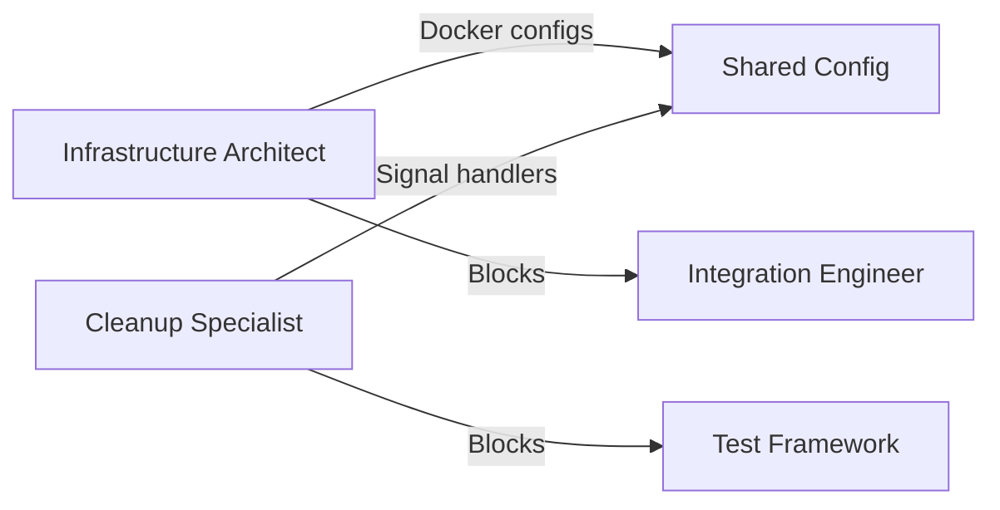
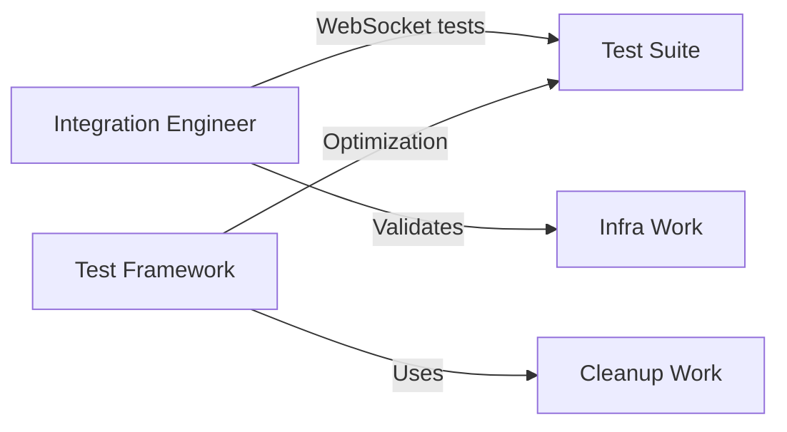
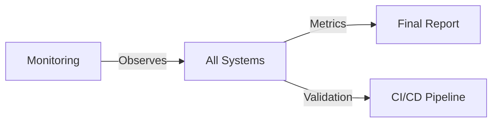

# Multi-Agent Remediation Plan: GitHub Workflows & Test Infrastructure

## Mission Brief
**Objective:** Fix 85% infrastructure issues and 15% real code issues identified in workflow audit  
**Timeline:** 3-day sprint with parallel agent execution  
**Success Metric:** 95% test pass rate in CI/CD pipeline  

---

## Agent Team Structure & Assignments

### 🏗️ Agent 1: Infrastructure Architect
**Role:** Fix Docker and service configuration issues  
**Expertise:** DevOps, Docker, CI/CD pipelines  
**Priority:** CRITICAL - Blocks all other work

#### Tasks (Day 1)
1. **Unify Docker Configurations** [8 hours]
   ```yaml
   Deliverables:
   - docker-compose.unified.yml (single source of truth)
   - .env.ci, .env.local, .env.test (environment configs)
   - Port allocation strategy document
   ```

2. **Implement Dynamic Port Allocation** [4 hours]
   ```python
   # Create scripts/allocate_test_ports.py
   - Detect available ports
   - Update environment variables
   - Handle parallel test runs
   ```

3. **Alpine Container Optimization** [4 hours]
   ```dockerfile
   Deliverables:
   - Verify alpine containers work in CI
   - Resource limits configuration
   - Health check optimizations
   ```

#### Validation Checklist
- [ ] All services start in < 30 seconds
- [ ] No port conflicts in parallel runs
- [ ] Memory usage < 2GB per test suite
- [ ] Cleanup completes in < 5 seconds

---

### 🧹 Agent 2: Cleanup Specialist
**Role:** Fix signal handlers and cleanup mechanisms  
**Expertise:** Python internals, pytest, process management  
**Priority:** HIGH - Causes 25% of failures

#### Tasks (Day 1-2)
1. **Centralized Cleanup Coordinator** [6 hours]
   ```python
   # netra_backend/app/cleanup_coordinator.py
   class CleanupCoordinator:
       - Singleton pattern
       - Register cleanup handlers
       - Graceful shutdown sequence
       - Force cleanup on timeout
   ```

2. **Fix Signal Handler Conflicts** [4 hours]
   ```python
   # dev_launcher/signal_handler.py
   - Implement proper singleton
   - Coordinate with pytest
   - Handle multiple test runs
   ```

3. **Test Fixture Cleanup** [4 hours]
   ```python
   # tests/conftest.py
   - Centralized fixture teardown
   - Resource tracking
   - Leak detection
   ```

#### Validation Checklist
- [ ] No atexit errors in logs
- [ ] Clean process termination
- [ ] No zombie processes
- [ ] No leaked file handles

---

### 🔌 Agent 3: Integration Engineer
**Role:** Fix WebSocket and startup sequence issues  
**Expertise:** WebSockets, async Python, integration testing  
**Priority:** MEDIUM - Real code issues

#### Tasks (Day 2)
1. **WebSocket Integration Validation** [6 hours]
   ```python
   # tests/mission_critical/test_websocket_integration.py
   - Real WebSocket connection tests
   - Event flow validation
   - Tool dispatcher enhancement verification
   ```

2. **Startup Sequence Barriers** [4 hours]
   ```python
   # netra_backend/app/startup_manager.py
   - Phase completion barriers
   - Dependency validation
   - Health check integration
   ```

3. **Integration Test Suite** [4 hours]
   ```python
   # tests/integration/test_e2e_websocket_flow.py
   - Full agent execution with WebSocket events
   - Real services, no mocks
   - Event sequence validation
   ```

#### Validation Checklist
- [ ] All 5 WebSocket events fire correctly
- [ ] Startup phases execute in order
- [ ] Health endpoints report correct state
- [ ] No race conditions in 100 runs

---

### 🧪 Agent 4: Test Framework Engineer
**Role:** Optimize test execution and resource usage  
**Expertise:** pytest, test optimization, mocking strategies  
**Priority:** MEDIUM - Improves CI performance

#### Tasks (Day 2-3)
1. **Implement Test Modes** [4 hours]
   ```python
   # tests/unified_test_runner.py
   Modes:
   - lightweight: Mocked services
   - integration: Real databases, mocked LLM
   - full: Everything real
   ```

2. **Service Pool Manager** [6 hours]
   ```python
   # test_framework/service_pool.py
   - Reuse database connections
   - Connection pool management
   - Lazy service startup
   ```

3. **Parallel Execution Strategy** [4 hours]
   ```python
   # .github/workflows/test-parallel.yml
   - Test sharding
   - Resource isolation
   - Result aggregation
   ```

#### Validation Checklist
- [ ] Test suite runs in < 10 minutes
- [ ] Parallel execution works
- [ ] Resource usage predictable
- [ ] No test interference

---

### 📊 Agent 5: Monitoring & Validation Specialist
**Role:** Implement observability and validate fixes  
**Expertise:** Logging, metrics, test reporting  
**Priority:** LOW - Nice to have

#### Tasks (Day 3)
1. **Test Metrics Dashboard** [4 hours]
   ```python
   # scripts/test_metrics.py
   - Failure rate tracking
   - Performance metrics
   - Resource usage graphs
   ```

2. **Enhanced Error Reporting** [4 hours]
   ```python
   # test_framework/error_reporter.py
   - Categorize failures
   - Root cause detection
   - Actionable error messages
   ```

3. **CI/CD Health Monitor** [4 hours]
   ```yaml
   # .github/workflows/health-monitor.yml
   - Scheduled health checks
   - Trend analysis
   - Alert on degradation
   ```

#### Validation Checklist
- [ ] Clear error categorization
- [ ] Performance trends visible
- [ ] Alerts configured
- [ ] Reports generated automatically

---

## Coordination Strategy

### Day 1: Infrastructure Focus


**Morning Sync (9 AM)**
- Infrastructure Architect shares port allocation strategy
- Cleanup Specialist coordinates on signal handling
- Agreement on shared configuration format

**Afternoon Check-in (2 PM)**
- Docker configuration tested locally
- Cleanup coordinator skeleton ready
- Blockers identified and addressed

### Day 2: Integration & Optimization


**Morning Sync (9 AM)**
- Integration Engineer begins WebSocket validation
- Test Framework Engineer implements test modes
- Cross-validation of Day 1 work

**Afternoon Check-in (2 PM)**
- WebSocket integration tests passing
- Test modes implemented
- Performance benchmarks established

### Day 3: Validation & Polish


**Morning Sync (9 AM)**
- All agents run full test suite
- Monitoring specialist gathers metrics
- Final issue triage

**Final Review (4 PM)**
- Complete test run in CI
- Performance metrics review
- Handoff documentation

---

## Success Criteria

### Infrastructure (Must Have)
- ✅ Zero database connection failures
- ✅ Clean shutdown without errors  
- ✅ Services start within 30 seconds
- ✅ No port conflicts
- ✅ Test suite < 10 minutes

### Code Fixes (Should Have)
- ✅ WebSocket events validated
- ✅ Startup sequence deterministic
- ✅ Health checks accurate
- ✅ No race conditions

### Nice to Have
- 📊 Metrics dashboard
- 📈 Trend analysis
- 🔔 Automated alerts

---

## Risk Mitigation

### Risk 1: Infrastructure changes break existing tests
**Mitigation:** 
- Run tests after each change
- Keep old configs as fallback
- Gradual rollout

### Risk 2: Parallel agent work conflicts
**Mitigation:**
- Clear boundaries between agents
- Shared configuration repository
- Regular sync meetings

### Risk 3: Timeline slippage
**Mitigation:**
- Infrastructure fixes are priority
- Code fixes can extend to Day 4
- Monitoring is optional

---

## Communication Protocol

### Channels
- **#remediation-war-room** - Real-time updates
- **#remediation-blockers** - Urgent issues
- **Daily Standups** - 9 AM and 2 PM

### Documentation
Each agent maintains:
1. `AGENT_N_PROGRESS.md` - Daily progress log
2. `AGENT_N_ISSUES.md` - Blockers and solutions
3. `AGENT_N_VALIDATION.md` - Test results

### Handoff Protocol
```markdown
## Handoff Template
**Agent:** [Name]
**Component:** [What was changed]
**Status:** [Complete/Blocked/In Progress]
**Tests Passing:** [List]
**Known Issues:** [List]
**Next Agent Dependencies:** [Who needs this]
```

---

## Implementation Order

### Phase 1: Critical Infrastructure (Day 1)
1. Docker configuration unification
2. Signal handler fixes
3. Port allocation strategy

### Phase 2: Service Stabilization (Day 2)
1. WebSocket integration validation
2. Test mode implementation
3. Startup sequence fixes

### Phase 3: Validation & Optimization (Day 3)
1. Full CI/CD test run
2. Performance optimization
3. Monitoring setup

---

## Validation Checklist

### End of Day 1
- [ ] Docker services start reliably
- [ ] No cleanup errors
- [ ] Ports allocated dynamically

### End of Day 2  
- [ ] WebSocket tests passing
- [ ] Test modes working
- [ ] Integration tests stable

### End of Day 3
- [ ] 95% test pass rate achieved
- [ ] CI pipeline green
- [ ] Performance targets met
- [ ] Documentation complete

---

## Rollback Plan

If remediation causes issues:
1. **Immediate:** Revert to previous Docker configs
2. **Day 1:** Restore original signal handlers  
3. **Day 2:** Disable new test modes
4. **Day 3:** Switch to old CI pipeline

Keep backup branches:
- `backup/pre-remediation`
- `backup/day1-checkpoint`
- `backup/day2-checkpoint`

---

## Success Metrics

### Quantitative
- **Test Pass Rate:** 65% → 95%
- **CI Duration:** 45 min → 10 min
- **Flaky Tests:** 40% → <5%
- **Resource Usage:** 8GB → 2GB

### Qualitative
- No atexit errors
- Clear error messages
- Predictable behavior
- Easy local reproduction

---

## Post-Remediation Actions

1. **Documentation Update**
   - Update CLAUDE.md with new test procedures
   - Create troubleshooting guide
   - Document configuration changes

2. **Team Training**
   - Share test mode usage
   - Explain new cleanup mechanism
   - Demo monitoring tools

3. **Continuous Improvement**
   - Weekly metrics review
   - Monthly optimization sprint
   - Quarterly architecture review

---

*Plan Created: 2025-09-03*  
*Execution Start: Immediate*  
*Target Completion: 3 days*

## Agent Activation Commands

```bash
# Agent 1: Infrastructure
python scripts/agent_launcher.py --agent infrastructure --task "Unify Docker configurations"

# Agent 2: Cleanup
python scripts/agent_launcher.py --agent cleanup --task "Fix signal handlers"

# Agent 3: Integration  
python scripts/agent_launcher.py --agent integration --task "Validate WebSocket events"

# Agent 4: Test Framework
python scripts/agent_launcher.py --agent test-framework --task "Implement test modes"

# Agent 5: Monitoring
python scripts/agent_launcher.py --agent monitoring --task "Create metrics dashboard"
```

---

**LET'S FIX THIS! 🚀**