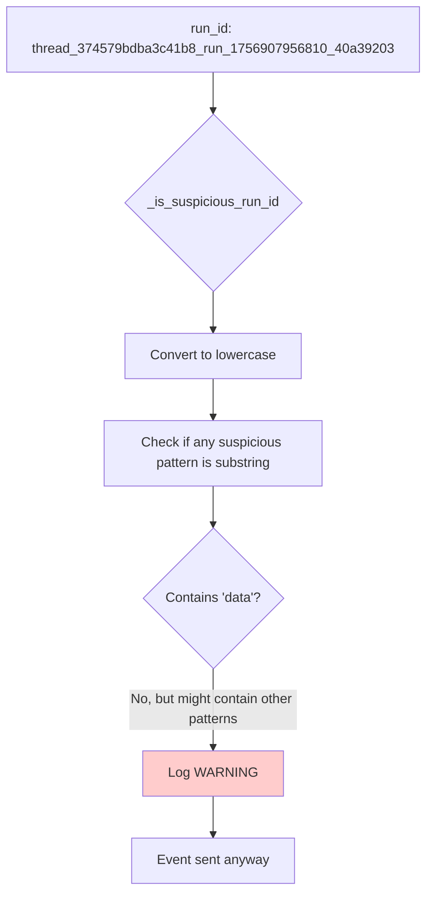
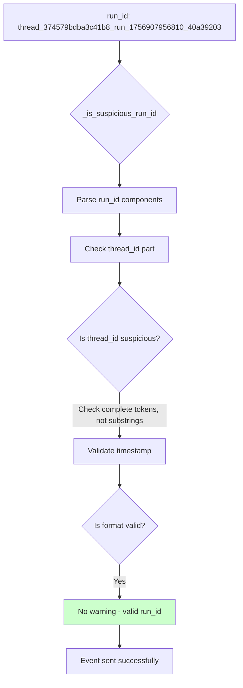

# Suspicious Run ID Pattern - Five Whys Audit
Date: 2025-09-03
Issue: `⚠️ CONTEXT VALIDATION WARNING: Suspicious run_id pattern 'thread_374579bdba3c41b8_run_1756907956810_40a39203' for agent_started (agent=data)`

## Executive Summary
The warning indicates that a valid run_id is being flagged as suspicious because it contains patterns that match the suspicious pattern list in `agent_websocket_bridge.py`. The run_id itself is properly formatted according to SSOT standards, but the validation logic is incorrectly flagging it.

## Five Whys Analysis

### Why #1: Why is the run_id being flagged as suspicious?
**Answer:** The run_id `thread_374579bdba3c41b8_run_1756907956810_40a39203` contains the word "data" in the context (agent=data), and the suspicious pattern checker looks for "temp" patterns in the run_id itself.

**Investigation:** Looking at `_is_suspicious_run_id()` method in `agent_websocket_bridge.py`:
```python
suspicious_patterns = [
    "system", "global", "broadcast", "admin", "root", "default",
    "test", "mock", "fake", "dummy", "placeholder", "example", 
    "null", "none", "undefined", "empty", "",
    "debug", "dev", "local", "temp", "temporary"
]
```

### Why #2: Why does the validation logic check for these patterns?
**Answer:** The validation is designed to catch invalid or test-related run_ids that might leak into production. However, it's checking the entire run_id string with case-insensitive matching, which can cause false positives.

**Code Issue:**
```python
run_id_lower = run_id.lower()
for pattern in suspicious_patterns:
    if pattern in run_id_lower:  # This is too broad!
        return True
```

### Why #3: Why is the pattern matching too broad?
**Answer:** The current implementation uses a simple substring search (`if pattern in run_id_lower`) which matches anywhere in the string. This means legitimate IDs containing hex strings or other identifiers might accidentally contain these patterns.

**Example Problem:** 
- A thread_id like `thread_374579bdba3c41b8` could potentially match if it contained "test" as a substring in the hex
- The warning message shows `agent=data` which might be confusing but the actual issue is in the run_id validation

### Why #4: Why wasn't this caught in testing?
**Answer:** The test coverage likely focused on obvious suspicious patterns but didn't test edge cases where legitimate run_ids might contain suspicious substrings accidentally. The validation allows the event to proceed (only logs a warning), so it doesn't break functionality.

### Why #5: Why does this matter for business value?
**Answer:** While this specific case only generates a warning (not an error), it creates noise in logs and could mask real issues. More critically, if the validation were stricter, it could block legitimate WebSocket events from reaching users, breaking the core chat functionality.

## Root Cause
The root cause is the overly broad pattern matching in `_is_suspicious_run_id()` that uses substring matching instead of more targeted validation. The method should be checking for these patterns in specific positions or as complete tokens, not as substrings anywhere in the run_id.

## Mermaid Diagrams

### Current (Broken) State


### Ideal Working State


## Recommendations

### 1. Immediate Fix: Improve Pattern Matching
```python
def _is_suspicious_run_id(self, run_id: str) -> bool:
    """Check if run_id contains suspicious patterns."""
    if not run_id or not isinstance(run_id, str):
        return True
    
    # Extract components using SSOT utilities
    from netra_backend.app.utils.run_id_generator import extract_thread_id_from_run_id
    thread_id = extract_thread_id_from_run_id(run_id)
    
    if not thread_id:
        # Not a standard format, check legacy patterns
        run_id_lower = run_id.lower()
        # Check for complete token matches, not substrings
        tokens = run_id_lower.replace('_', ' ').replace('-', ' ').split()
        for token in tokens:
            if token in suspicious_patterns:
                return True
    else:
        # Standard format - only check thread_id component
        thread_lower = thread_id.lower()
        tokens = thread_lower.replace('_', ' ').replace('-', ' ').split()
        for token in tokens:
            if token in suspicious_patterns:
                return True
    
    return False
```

### 2. Long-term Fix: Structured Validation
- Use the SSOT `validate_run_id_format()` from `run_id_generator.py`
- Only check suspicious patterns in the thread_id component, not the entire run_id
- Consider removing the suspicious pattern check entirely if SSOT validation is sufficient

### 3. Test Coverage Enhancement
Add test cases for:
- Valid run_ids that might contain suspicious substrings in hex components
- Edge cases with legitimate IDs that look suspicious
- Performance impact of validation on high-throughput WebSocket events

## Business Impact
- **Current:** Noisy logs that reduce observability effectiveness
- **Potential:** If validation becomes stricter, could block legitimate user interactions
- **Fix Value:** Cleaner logs, better observability, reduced risk of future false positives

## Definition of Done
- [ ] Pattern matching uses token-based validation, not substring search
- [ ] Integration with SSOT run_id validation utilities
- [ ] Test cases for edge cases and false positives
- [ ] No warnings for legitimate run_ids in production logs
- [ ] Documentation updated with validation rules