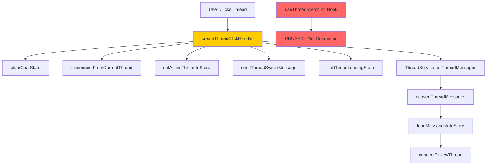
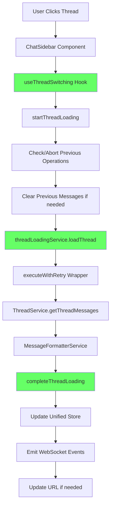

# Thread Switching Bug Fix Report

## Issue: Frontend Thread Switching is Broken

**Date**: 2025-09-03  
**Severity**: CRITICAL  
**Impact**: Users cannot switch between chat threads, breaking core functionality

---

## 1. WHY Analysis (Five Whys Method)

### Why #1: Why is thread switching broken?
**Answer**: There are two competing thread switching implementations:
- `ChatSidebarHandlers.ts::createThreadClickHandler` (lines 111-139) 
- `useThreadSwitching.ts` hook (lines 74-142)

The sidebar directly calls its own handler that doesn't use the proper hook.

### Why #2: Why are there two competing implementations?
**Answer**: The codebase has a mix of legacy direct handlers and newer hook-based architecture. The sidebar handler (`createThreadClickHandler`) manually manages WebSocket events, store updates, and thread loading without using the centralized `useThreadSwitching` hook.

### Why #3: Why doesn't the sidebar use the proper hook?
**Answer**: The `ChatSidebar.tsx` component (line 49) creates its handler using `createThreadClickHandler` instead of using `useThreadSwitching`. The import for `useThreadSwitching` is not even present in the file.

### Why #4: Why wasn't the sidebar migrated to use the hook?
**Answer**: Incomplete refactoring - when `useThreadSwitching` was introduced as the SSOT for thread switching, the sidebar component was not updated. The refactoring violated the SSOT principle defined in CLAUDE.md.

### Why #5: Why did existing tests miss this?
**Answer**: Tests likely mock the store directly or test components in isolation without verifying the actual integration between the sidebar click handler and the thread switching logic. The tests don't verify that clicking a thread in the sidebar actually triggers the proper hook-based switching flow.

---

## 2. Current vs Ideal State Diagrams

### Current (Broken) State

### Ideal Working State

---

## 3. System-Wide Fix Plan

### Phase 1: Immediate Fix - Connect Sidebar to Hook
1. **File**: `frontend/components/chat/ChatSidebar.tsx`
   - Import `useThreadSwitching` hook
   - Replace `createThreadClickHandler` usage with hook's `switchToThread`

2. **File**: `frontend/components/chat/ChatSidebarHandlers.ts`
   - Mark `createThreadClickHandler` as deprecated
   - Create adapter function that uses the hook

### Phase 2: Consolidate Thread Operations
3. **File**: `frontend/hooks/useThreadSwitching.ts`
   - Ensure all WebSocket events are properly emitted
   - Add logging for debugging

4. **File**: `frontend/services/threadLoadingService.ts`
   - Verify WebSocket integration is complete
   - Ensure proper error handling

### Phase 3: Clean Up Legacy Code
5. **File**: `frontend/components/chat/ChatSidebarHandlers.ts`
   - Remove deprecated direct thread switching logic
   - Keep only UI-specific handlers (create new chat, etc.)

### Phase 4: Testing
6. **New Test File**: `frontend/__tests__/integration/thread-switching-e2e.test.tsx`
   - Test clicking sidebar thread triggers `useThreadSwitching`
   - Verify WebSocket events are sent
   - Verify store state updates correctly
   - Verify URL updates

---

## 4. Root Cause Summary

**Primary Issue**: Violation of Single Source of Truth (SSOT) principle. The codebase has two separate implementations for thread switching:
1. Legacy: Direct handler in `ChatSidebarHandlers.ts`  
2. Modern: Hook-based in `useThreadSwitching.ts`

The sidebar uses the legacy implementation, bypassing the modern centralized hook that properly manages loading states, retries, timeouts, and cleanup.

**Secondary Issues**:
- Missing integration tests that verify the complete flow
- Incomplete refactoring migration
- No deprecation warnings on legacy code

---

## 5. Prevention Measures

1. **Enforce SSOT**: One implementation per feature across the service
2. **Complete Refactoring**: When introducing new patterns, migrate ALL consumers
3. **Integration Tests**: Test actual user flows, not just isolated units
4. **Deprecation Process**: Mark old code as deprecated with migration path
5. **Architecture Compliance**: Run `python scripts/check_architecture_compliance.py` after changes

---

## Status: Ready for Implementation

Next steps:
1. Implement Phase 1 fix immediately to restore functionality
2. Add integration tests to prevent regression
3. Complete remaining phases to clean up technical debt