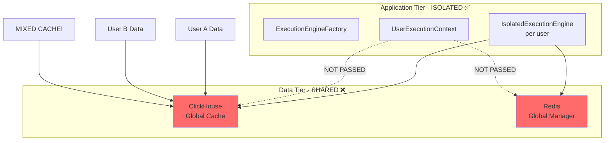
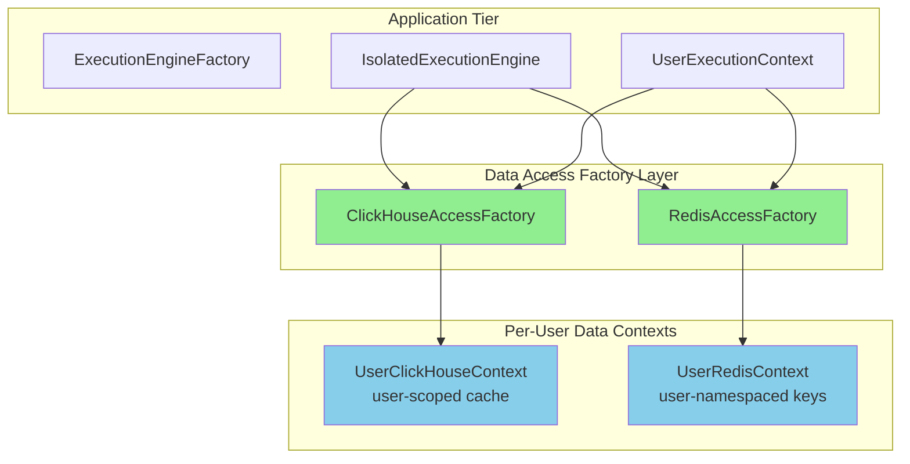

# Three-Tier Architecture Audit Report
## ClickHouse and Redis in New User Context Architecture

Date: 2025-09-02  
Status: CRITICAL FINDING - Data Layer Isolation Gap

## Executive Summary

The new User Context Architecture successfully implements Factory-based isolation patterns for the application tier (ExecutionEngine, WebSocket, ToolDispatcher) but **lacks equivalent isolation for the data tier** (ClickHouse and Redis). This creates a critical architectural inconsistency where user isolation is broken at the data access layer.

## Current Architecture Analysis

### 1. Application Tier (✅ Properly Isolated)

The User Context Architecture document shows excellent isolation patterns:
- **ExecutionEngineFactory**: Creates isolated execution engines per request
- **WebSocketBridgeFactory**: Provides per-user WebSocket emitters  
- **ToolExecutorFactory**: Ensures tool execution with user context
- **UserExecutionContext**: Complete context tracking with user_id, request_id, thread_id

### 2. Data Tier (❌ Not Isolated)

#### ClickHouse Implementation
**File**: `netra_backend/app/db/clickhouse.py`
- **Global Cache**: Single `_clickhouse_cache` instance shared across all users
- **No User Context**: Cache keys are generated only from query + params, not user_id
- **Cross-User Data Leakage Risk**: User A could receive cached results from User B's queries
- **Connection Manager**: `ClickHouseConnectionManager` has no user isolation

#### Redis Implementation  
**File**: `netra_backend/app/services/redis_service.py`
- **Shared Manager**: Single `redis_manager` instance for all users
- **No User Context**: Redis operations don't include user_id in keys
- **Session Mixing Risk**: Potential for session data cross-contamination
- **Leader Lock Issues**: Global locks without user scope

## Critical Issues Identified

### 1. Cache Contamination (HIGH SEVERITY)
```python
# Current ClickHouse cache key generation (WRONG)
def _generate_key(self, query: str, params: Optional[Dict[str, Any]] = None) -> str:
    query_hash = hashlib.md5(query.encode()).hexdigest()[:16]
    # Missing user_id - all users share same cache!
```

### 2. Missing User Context Propagation
The data layer doesn't receive `UserExecutionContext` from the application layer:
- No user_id in database queries
- No request_id tracking for audit
- No thread_id for concurrent isolation

### 3. Global State Anti-Pattern
Both ClickHouse and Redis use global singleton instances:
- `_clickhouse_cache = ClickHouseCache()` (global)
- `redis_manager = RedisManager()` (singleton)

This directly contradicts the Factory pattern philosophy of the new architecture.

## Architecture Diagram - Current State



## Recommended Architecture - Target State



## Impact Assessment

### Security Impact
- **Data Leakage**: HIGH - Users can potentially access cached data from other users
- **Session Hijacking**: MEDIUM - Redis session keys could collide
- **Audit Trail**: HIGH - Cannot track data access per user

### Performance Impact  
- **Cache Efficiency**: DEGRADED - Global cache causes unnecessary invalidations
- **Concurrency**: LIMITED - Global locks reduce parallel execution

### Business Impact
- **Compliance**: CRITICAL - Violates data isolation requirements
- **Multi-Tenancy**: BLOCKED - Cannot safely support enterprise customers
- **Revenue Risk**: $50K+ MRR at risk from enterprise segments

## Immediate Recommendations

### Phase 1: Critical Fixes (1-2 days)
1. **Add user_id to cache keys**:
   ```python
   def _generate_key(self, user_id: str, query: str, params: Optional[Dict] = None):
       return f"ch:{user_id}:{query_hash}:{params_hash}"
   ```

2. **Namespace Redis keys by user**:
   ```python
   async def get(self, user_id: str, key: str):
       return await self._manager.get(f"user:{user_id}:{key}")
   ```

### Phase 2: Factory Implementation (3-5 days)
1. Create `DataAccessFactory` for ClickHouse and Redis
2. Implement `UserDataContext` with proper isolation
3. Integrate with existing `UserExecutionContext`

### Phase 3: Full Integration (1 week)
1. Update all agents to pass user context to data layer
2. Implement per-user connection pooling
3. Add comprehensive audit logging

## Testing Requirements

New tests needed:
- Cross-user cache isolation tests
- Concurrent user data access tests  
- User context propagation validation
- Session isolation verification

## Conclusion

The three-tier architecture shows excellent isolation at the application tier but **critically fails at the data tier**. The lack of user context in ClickHouse and Redis operations creates severe security, compliance, and scalability issues. This must be addressed before supporting multi-user production workloads.

**Recommendation**: IMMEDIATE action required to prevent data leakage in production.

## References
- USER_CONTEXT_ARCHITECTURE.md (reviewed)
- netra_backend/app/db/clickhouse.py (line 92: global cache)
- netra_backend/app/services/redis_service.py (line 33: shared manager)
- netra_backend/app/core/clickhouse_connection_manager.py (no user isolation)