# User Context Architecture - Factory-Based Isolation Patterns

## Overview
This document serves as the authoritative guide to Netra's Factory-based isolation patterns that ensure complete user isolation, eliminate shared state, and enable reliable concurrent execution for 10+ users.

**Business Impact:** $500K+ ARR depends on this architecture working correctly - it enables the core chat functionality that delivers AI value to users.

**Key Principles:**
- **Factory Pattern Enforcement:** No direct instantiation of execution engines, WebSocket emitters, or tool dispatchers
- **Request-Scoped Isolation:** Every request gets its own isolated execution context and components
- **User-Specific Resource Limits:** Per-user concurrency control and automatic cleanup
- **Real-Time WebSocket Events:** Critical events (agent_started, tool_executing, etc.) enable chat UX
- **Immutable Context Design:** UserExecutionContext is frozen to prevent accidental state modification
- **Comprehensive Validation:** Fail-fast validation prevents placeholder values and data corruption

## Related Documentation
- **[Documentation Hub](../docs/index.md)** - Central documentation index
- **[Agent Architecture Disambiguation Guide](../docs/AGENT_ARCHITECTURE_DISAMBIGUATION_GUIDE.md)** - Clarifies component relationships
- **[Golden Agent Index](../docs/GOLDEN_AGENT_INDEX.md)** - Definitive agent implementation patterns
- **[WebSocket Thread Association Learning](../SPEC/learnings/websocket_thread_association_critical_20250903.xml)** - Critical thread routing patterns
- **[Tool Dispatcher Migration Guide](./TOOL_DISPATCHER_MIGRATION_GUIDE.md)** - Migration to request-scoped dispatchers
- **[Configuration Architecture](../docs/configuration_architecture.md)** - Environment and configuration management
- **[String Literals Index](../docs/STRING_LITERALS_USAGE_GUIDE.md)** - Critical configuration values protection

## High-Level Architecture Overview

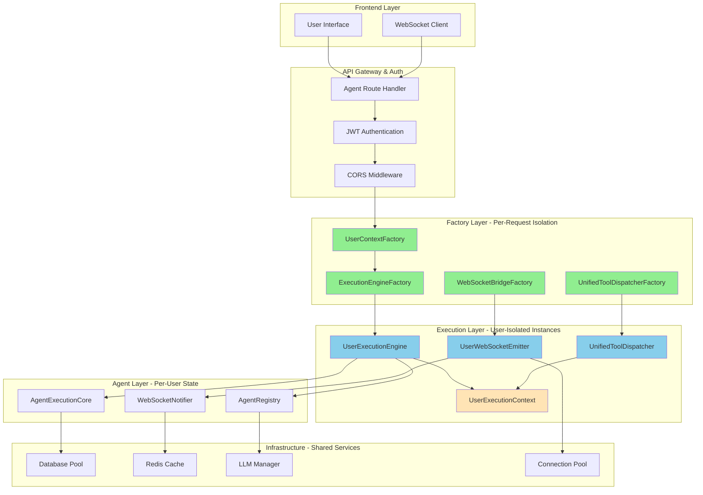

## Detailed Factory Pattern Architecture

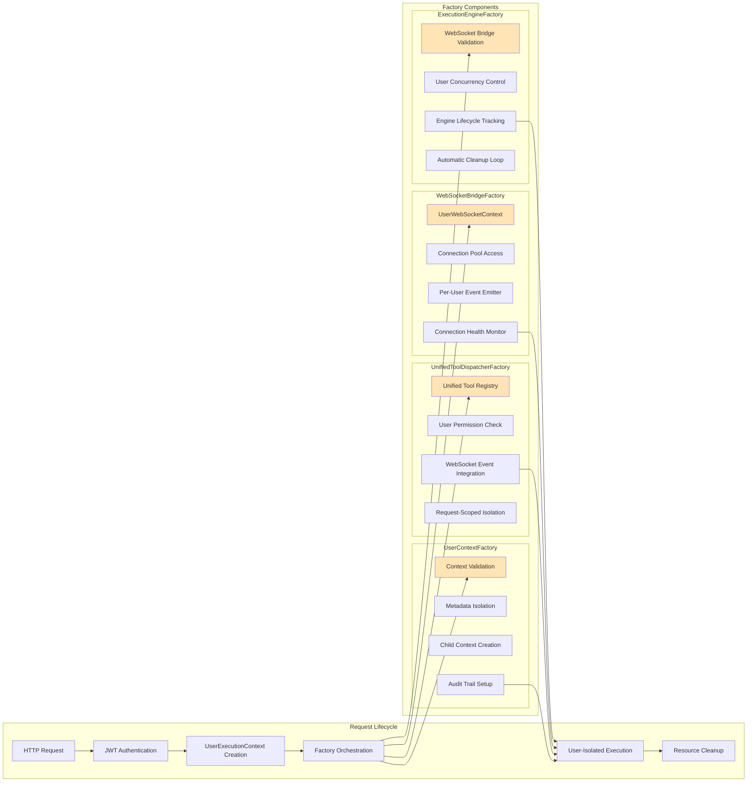

## UserExecutionContext Deep Dive

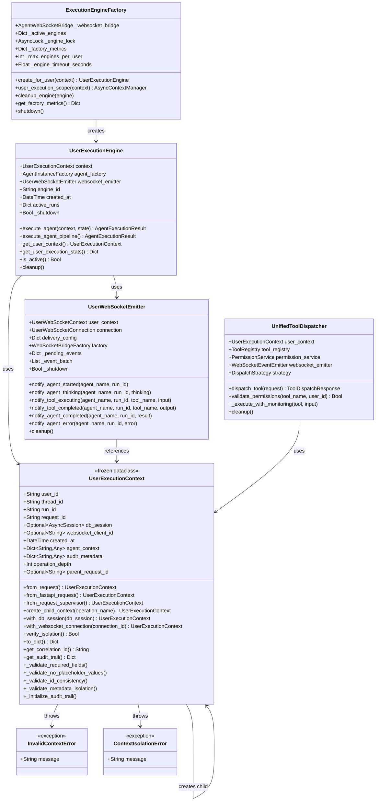

## Context Hierarchy and Child Context Flow

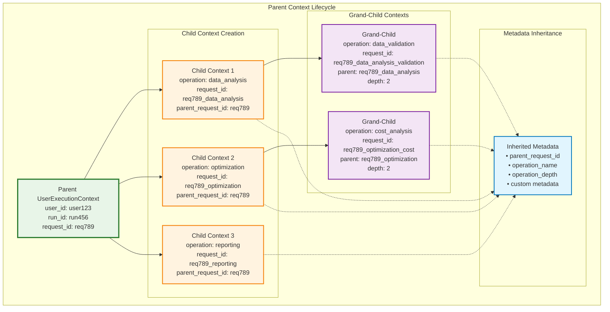

## Child Context Creation Flow

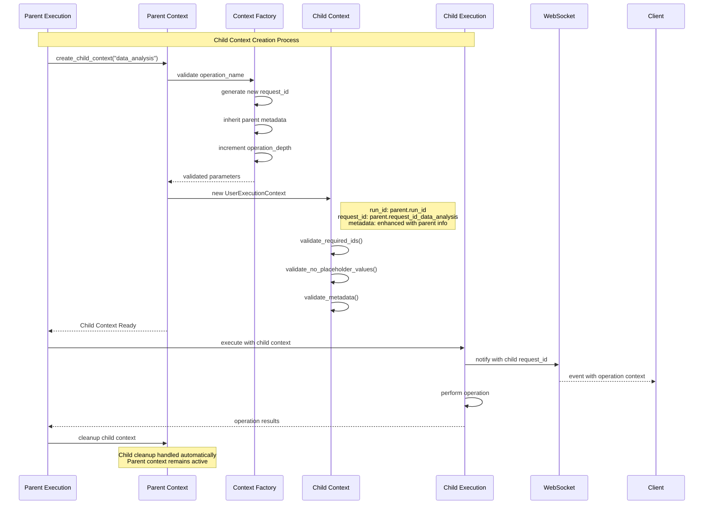

## Request Flow with User Isolation

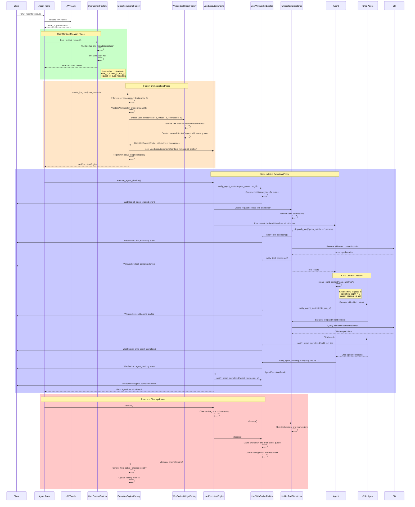

## Tool Dispatcher Integration

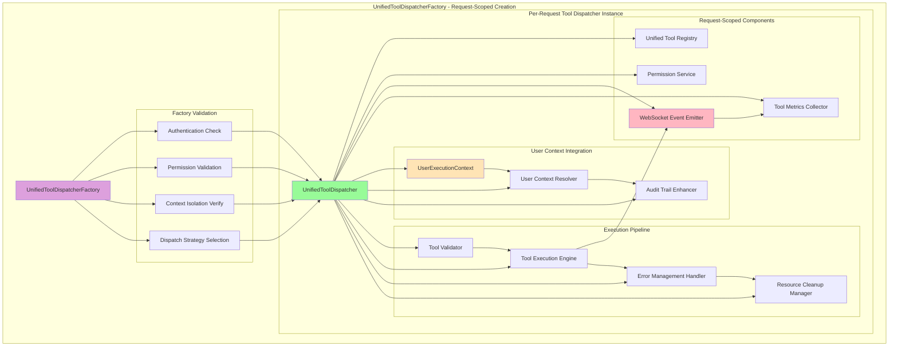

## Resource Management & Lifecycle

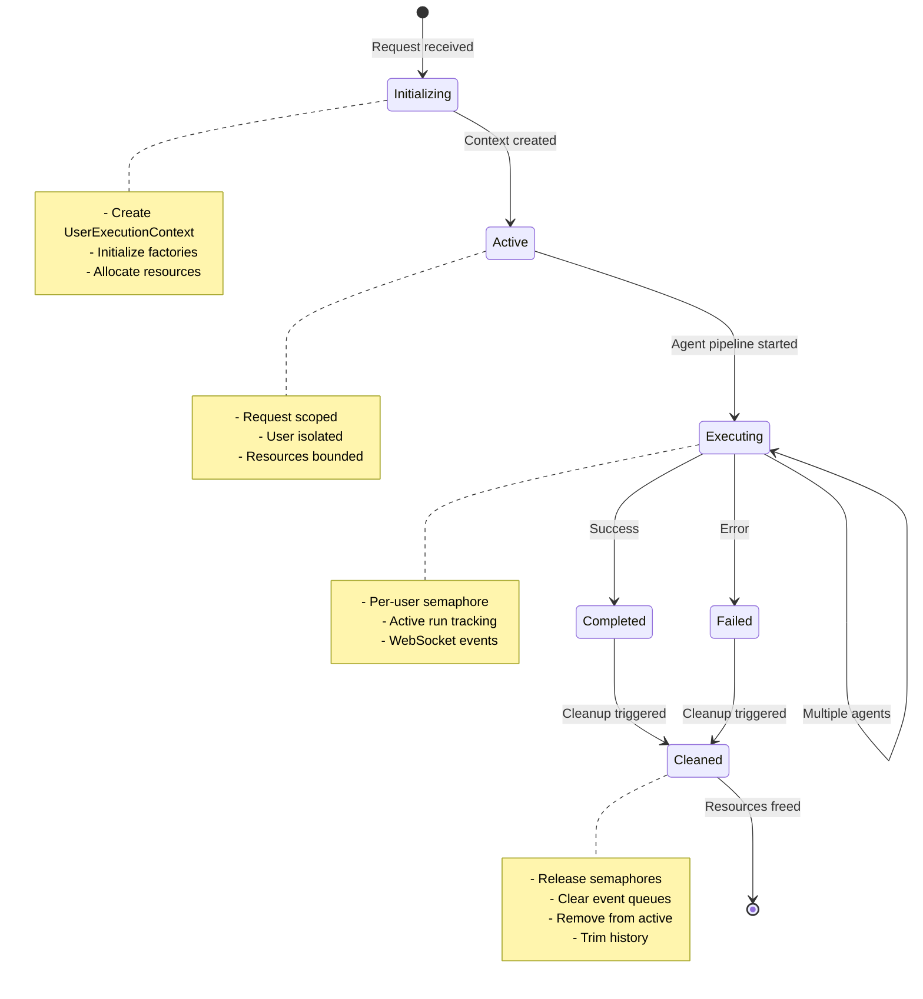

## Factory Metrics & Monitoring

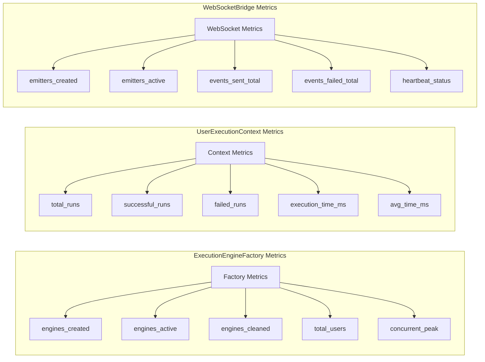

## Multi-User Concurrent Execution Patterns

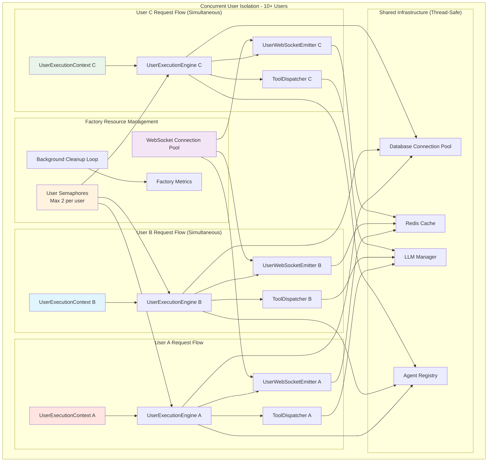

## Agent Execution Order and WebSocket Event Flow

```mermaid
sequenceDiagram
    participant User
    participant WS as WebSocket
    participant API
    participant UEE as UserExecutionEngine
    participant Data as DataAgent
    participant Opt as OptimizationAgent
    participant Rep as ReportAgent
    
    Note over User,Rep: CRITICAL: Agent Execution Order - Data BEFORE Optimization
    
    User->>API: Execute multi-agent workflow
    API->>UEE: execute_agent_pipeline(["data", "optimization", "report"])
    
    rect rgb(200, 255, 200)
        Note over UEE,Data: Phase 1: Data Analysis (Required First)
        UEE->>WS: agent_started("DataAgent")
        WS->>User: "Data analysis starting..."
        
        UEE->>Data: execute() with UserExecutionContext
        Data->>WS: agent_thinking("Analyzing data patterns...")
        WS->>User: "DataAgent is analyzing patterns"
        
        Data->>WS: tool_executing("database_query")
        WS->>User: "DataAgent is querying database"
        Data->>WS: tool_completed("database_query", results)
        WS->>User: "Database query completed"
        
        Data-->>UEE: DataAnalysisResult
        UEE->>WS: agent_completed("DataAgent", results)
        WS->>User: "Data analysis complete"
    end
    
    rect rgb(255, 230, 200)
        Note over UEE,Opt: Phase 2: Optimization (Depends on Data)
        UEE->>WS: agent_started("OptimizationAgent")
        WS->>User: "Optimization starting..."
        
        UEE->>Opt: execute() with data results + UserExecutionContext
        Opt->>WS: agent_thinking("Optimizing based on data...")
        WS->>User: "OptimizationAgent is optimizing"
        
        Opt->>WS: tool_executing("optimization_engine")
        WS->>User: "Running optimization algorithms"
        Opt->>WS: tool_completed("optimization_engine", optimizations)
        WS->>User: "Optimization complete"
        
        Opt-->>UEE: OptimizationResult
        UEE->>WS: agent_completed("OptimizationAgent", optimizations)
        WS->>User: "Optimization analysis complete"
    end
    
    rect rgb(200, 200, 255)
        Note over UEE,Rep: Phase 3: Report Generation (Final Phase)
        UEE->>WS: agent_started("ReportAgent")
        WS->>User: "Report generation starting..."
        
        UEE->>Rep: execute() with data + optimization results + UserExecutionContext
        Rep->>WS: agent_thinking("Generating comprehensive report...")
        WS->>User: "ReportAgent is generating report"
        
        Rep->>WS: tool_executing("report_generator")
        WS->>User: "Creating final report"
        Rep->>WS: tool_completed("report_generator", report)
        WS->>User: "Report generation complete"
        
        Rep-->>UEE: ComprehensiveReport
        UEE->>WS: agent_completed("ReportAgent", final_report)
        WS->>User: "Complete workflow finished"
    end
    
    UEE-->>API: Final workflow results
    API-->>User: Complete response with all results
```

## Security & Isolation Boundaries

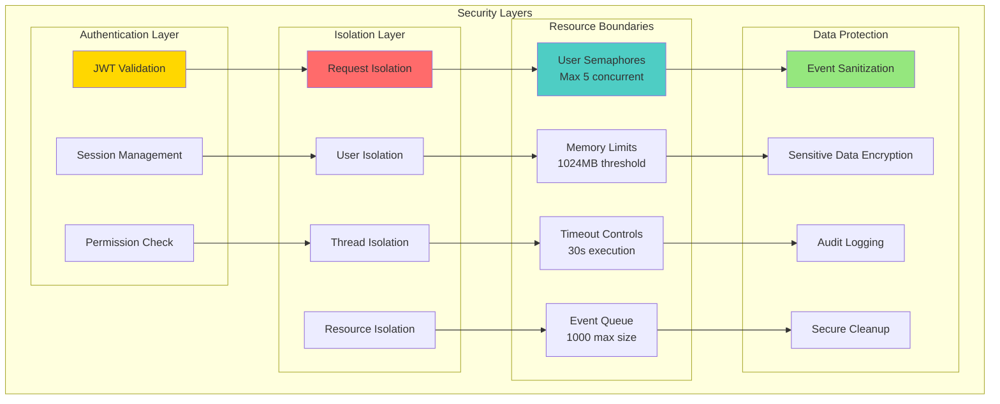

## Critical WebSocket Events for Chat Business Value

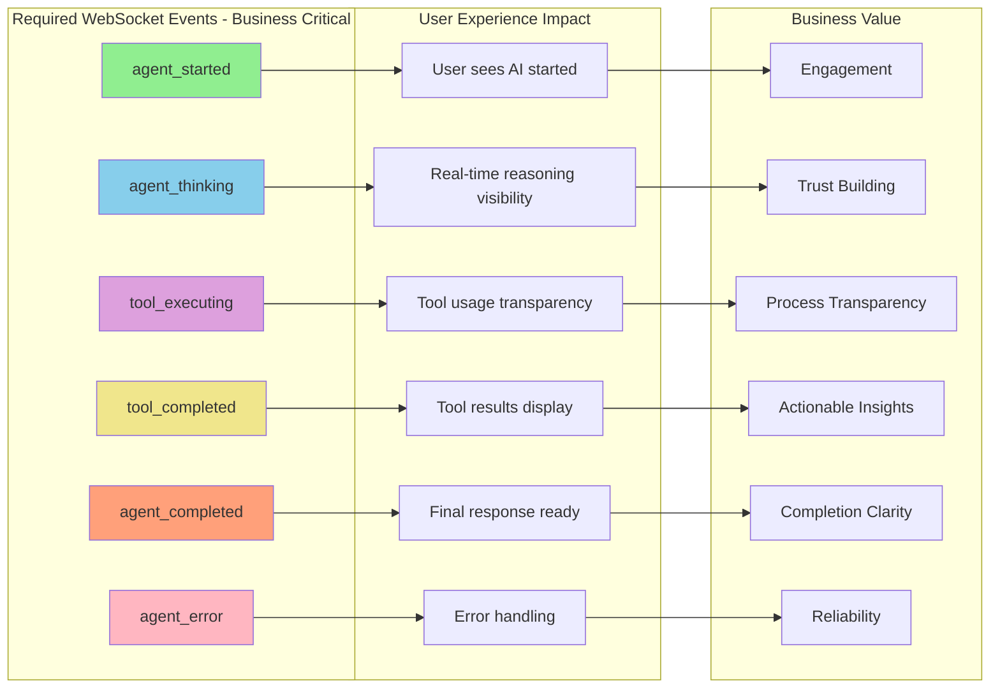

**MISSION CRITICAL:** These WebSocket events MUST be sent during agent execution or chat functionality is broken. Missing events = lost $500K+ ARR.

## Key Benefits of Factory-Based Architecture

1. **Complete User Isolation**: Each request gets its own UserExecutionContext and execution engine
2. **No Shared State**: Factory pattern eliminates singleton-based race conditions and cross-user data leakage
3. **Resource Management**: Per-user concurrency limits (max 2 engines per user) prevent resource exhaustion
4. **Clean Lifecycle**: ExecutionEngineFactory automatic cleanup loop prevents memory leaks
5. **Observable**: Comprehensive factory metrics and WebSocket event monitoring
6. **Scalable**: Supports 10+ concurrent users with bounded resource usage
7. **Secure**: Multiple isolation boundaries, request-scoped permission checks, and audit trails
8. **Maintainable**: Single source of truth factories, clear separation of concerns
9. **Hierarchical Context Management**: Child contexts enable sub-agent isolation while maintaining traceability
10. **Operation Traceability**: Full parent-child relationship tracking with metadata inheritance and audit trails
11. **Flexible Agent Orchestration**: Supports complex multi-level agent workflows with proper isolation
12. **Real-time User Feedback**: Per-user WebSocket emitters ensure correct event delivery
13. **Request-Scoped Tools**: UnifiedToolDispatcherFactory ensures tool execution isolation
14. **Fail-Fast Validation**: Comprehensive context validation prevents placeholder values and data corruption

## Migration from Singleton Pattern

The factory-based architecture replaces dangerous singleton patterns:
- `ExecutionEngine` singleton → `UserExecutionEngine` per request via `ExecutionEngineFactory`
- `WebSocketBridge` singleton → `UserWebSocketEmitter` per user via `WebSocketBridgeFactory`
- Global tool dispatcher → Request-scoped `UnifiedToolDispatcher` via `UnifiedToolDispatcherFactory`
- Shared state dictionaries → Immutable frozen `UserExecutionContext` with deep-copy isolation
- Global agent registry → Per-request agent instances with user context integration

## Factory Configuration

All factories support environment-based configuration:

### ExecutionEngineFactory Configuration
- `max_engines_per_user`: User concurrency limit (default: 2)
- `engine_timeout_seconds`: Engine lifetime limit (default: 300s / 5 minutes)
- `cleanup_interval`: Background cleanup frequency (default: 60s)

### WebSocketBridgeFactory Configuration
- `WEBSOCKET_MAX_EVENTS_PER_USER`: Event queue size (default: 1000)
- `WEBSOCKET_EVENT_TIMEOUT`: Event timeout (default: 30.0s)
- `WEBSOCKET_HEARTBEAT_INTERVAL`: Connection health check (default: 30.0s)
- `WEBSOCKET_MAX_RECONNECT_ATTEMPTS`: Max reconnection attempts (default: 3)
- `WEBSOCKET_DELIVERY_RETRIES`: Event delivery retries (default: 3)
- `WEBSOCKET_DELIVERY_TIMEOUT`: Delivery timeout (default: 5.0s)
- `WEBSOCKET_ENABLE_COMPRESSION`: Event compression (default: true)
- `WEBSOCKET_ENABLE_BATCHING`: Event batching (default: true)

### UnifiedToolDispatcherFactory Configuration
- Request-scoped instances (no global configuration needed)
- Per-request permission validation
- User context-based security boundaries

### UserExecutionContext Validation
- Forbidden placeholder values: `registry`, `placeholder`, `default`, `temp`, `none`, `null`, etc.
- Forbidden patterns: `placeholder_`, `registry_`, `default_`, `temp_`, `example_`, etc.
- ID format validation using UnifiedIDManager
- Metadata isolation with deep-copy protection