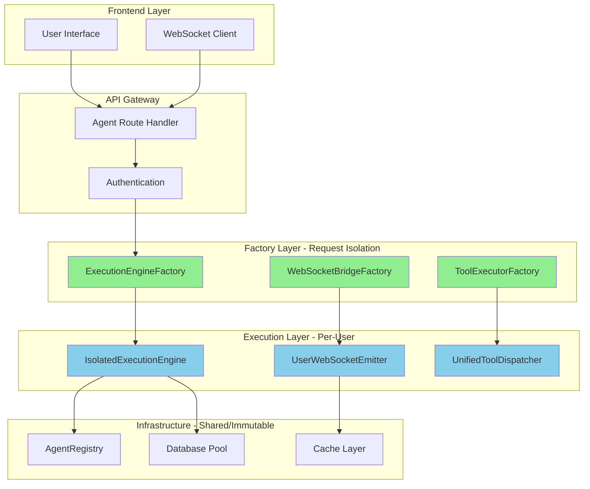
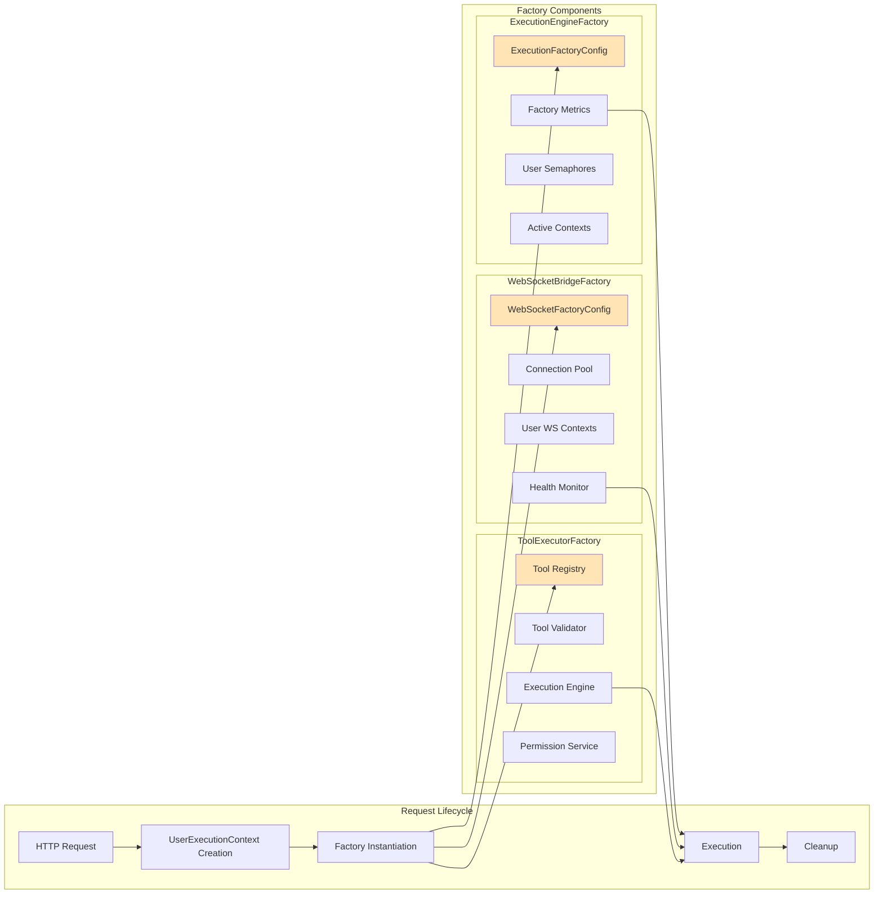
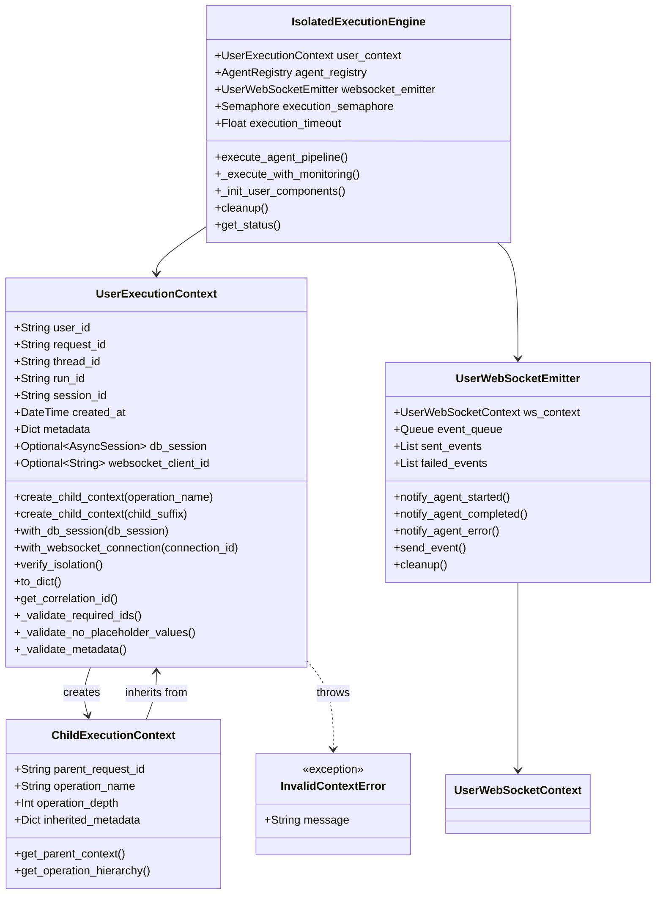
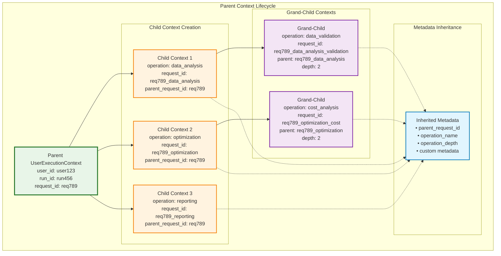
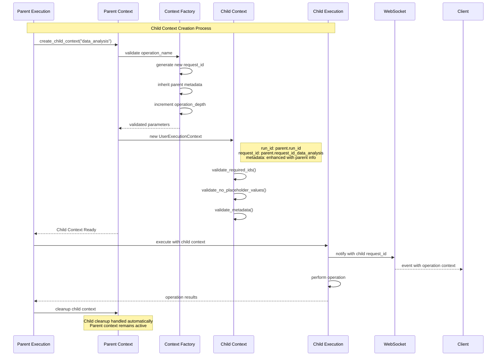
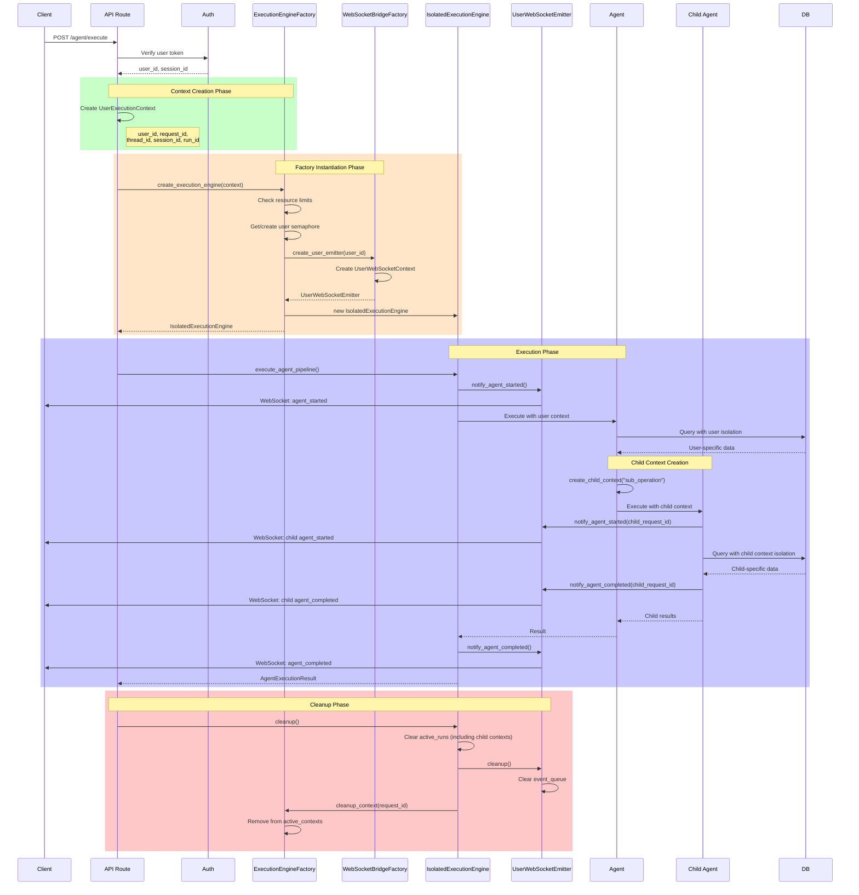
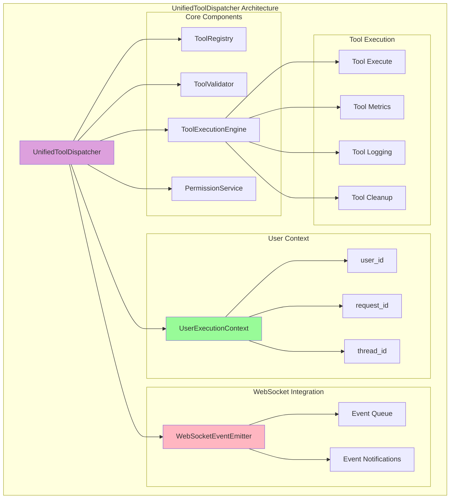
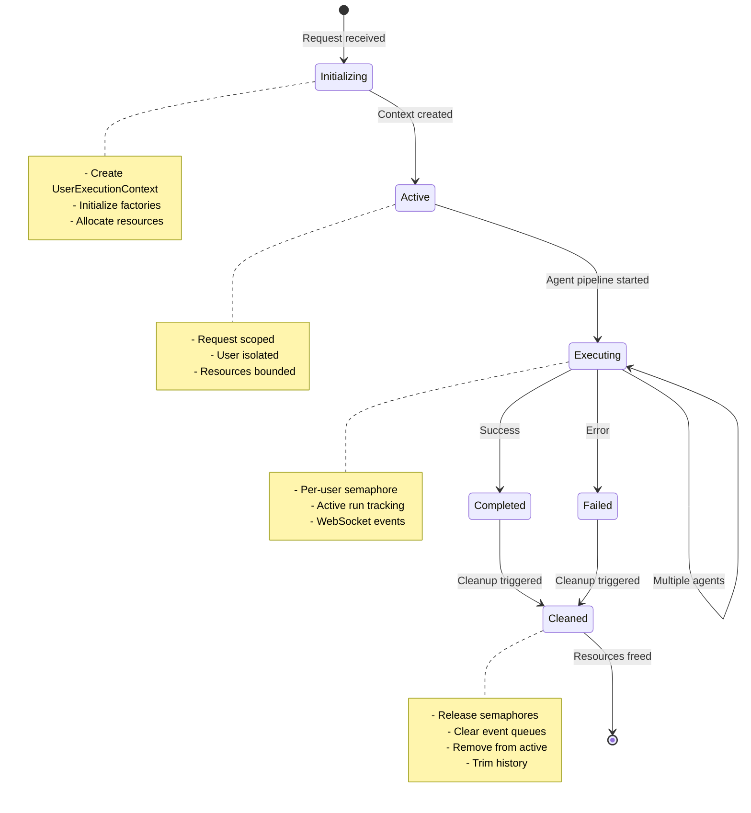
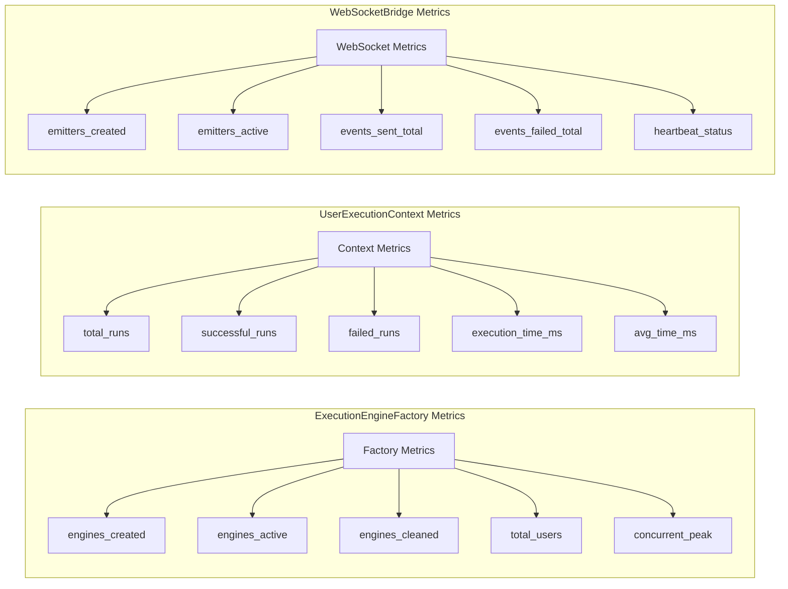
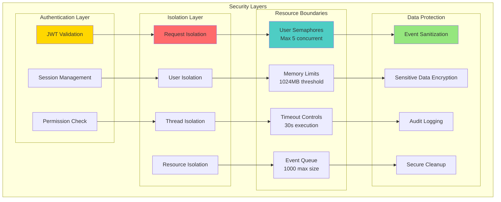

# User Context Architecture - Multi-Level Diagram

## Overview
This document presents the new user context architecture with Factory patterns and execution isolation at multiple levels of detail.

## Related Documentation
- **[Documentation Hub](./docs/index.md)** - Central documentation index
- **[Agent Architecture Disambiguation Guide](./docs/AGENT_ARCHITECTURE_DISAMBIGUATION_GUIDE.md)** - Clarifies component relationships
- **[Golden Agent Index](./docs/GOLDEN_AGENT_INDEX.md)** - Definitive agent implementation patterns
- **[WebSocket Thread Association Learning](./SPEC/learnings/websocket_thread_association_critical_20250903.xml)** - Critical thread routing patterns
- **[Tool Dispatcher Migration Guide](./TOOL_DISPATCHER_MIGRATION_GUIDE.md)** - Migration to request-scoped dispatchers

## High-Level Architecture Overview

## Detailed Factory Pattern Architecture

## UserExecutionContext Deep Dive

## Context Hierarchy and Child Context Flow

## Child Context Creation Flow

## Request Flow with User Isolation

## Tool Dispatcher Integration

## Resource Management & Lifecycle

## Factory Metrics & Monitoring

## Security & Isolation Boundaries

## Key Benefits of New Architecture

1. **Complete User Isolation**: Each request gets its own execution context
2. **No Shared State**: Eliminates race conditions and cross-user data leakage
3. **Resource Management**: Per-user limits prevent resource exhaustion
4. **Clean Lifecycle**: Automatic cleanup prevents memory leaks
5. **Observable**: Comprehensive metrics for monitoring
6. **Scalable**: Supports 10+ concurrent users reliably
7. **Secure**: Multiple isolation boundaries and permission checks
8. **Maintainable**: Single source of truth, clear separation of concerns
9. **Hierarchical Context Management**: Child contexts enable sub-agent isolation while maintaining traceability
10. **Operation Traceability**: Full parent-child relationship tracking with metadata inheritance
11. **Flexible Agent Orchestration**: Supports complex multi-level agent workflows with proper isolation

## Migration from Singleton Pattern

The new architecture replaces dangerous singleton patterns:
- `ExecutionEngine` singleton → `IsolatedExecutionEngine` per request
- `WebSocketBridge` singleton → `UserWebSocketEmitter` per user
- Global tool dispatcher → `UnifiedToolDispatcher` with user context
- Shared state dictionaries → Isolated `UserExecutionContext`

## Factory Configuration

All factories support environment-based configuration:
- `EXECUTION_MAX_CONCURRENT_PER_USER`: User concurrency limit (default: 5)
- `EXECUTION_TIMEOUT_SECONDS`: Execution timeout (default: 30s)
- `WEBSOCKET_MAX_EVENTS_PER_USER`: Event queue size (default: 1000)
- `WEBSOCKET_HEARTBEAT_INTERVAL`: Connection health check (default: 30s)