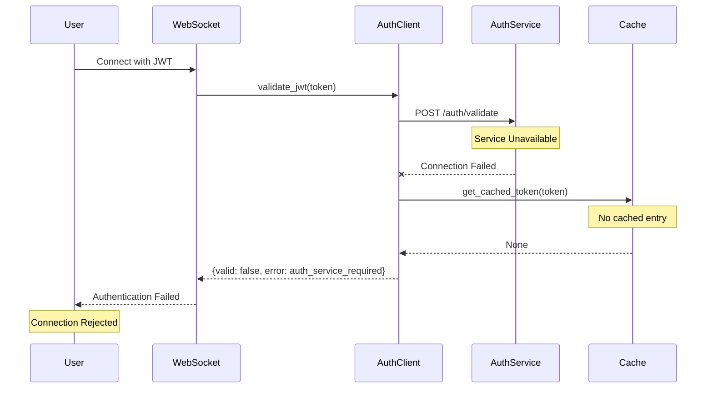
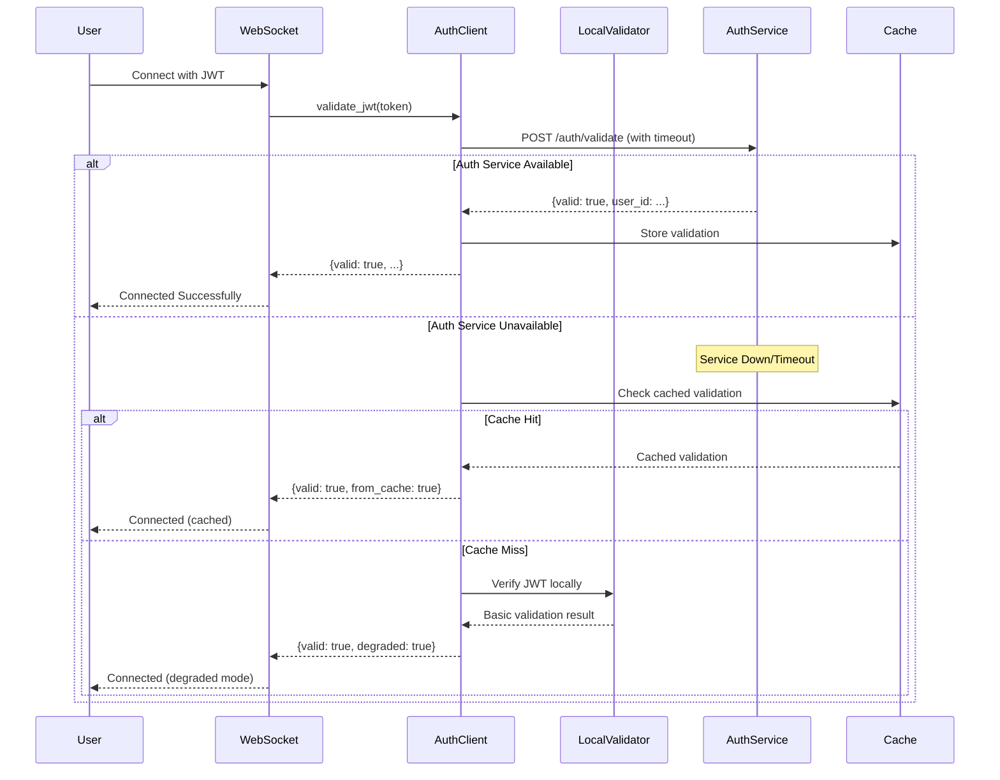

# WebSocket JWT Authentication Failure - Bug Fix Report

## Problem Statement
WebSocket authentication failed with "Invalid or expired token" error when auth service was unavailable and no cached validation existed.

**Error Details:**
```
Authentication failed: Invalid or expired token
JWT validation returned: {
  'valid': False, 
  'error': 'auth_service_required', 
  'details': 'Auth service unavailable and no cached validation available'
}
```

## Five Whys Root Cause Analysis

### Why 1: Why did WebSocket authentication fail?
- JWT token validation returned invalid with error 'auth_service_required'
- The auth service was unavailable when validation was attempted

### Why 2: Why was the auth service unavailable?
- The auth service connection failed or timed out
- No cached validation was available as fallback
- System attempted to validate but couldn't reach auth service

### Why 3: Why couldn't the system reach the auth service?
- Possible network connectivity issue between services
- Auth service might be down or not responding  
- Service discovery/routing might be misconfigured
- Health checks might be passing incorrectly

### Why 4: Why was there no cached validation available as fallback?
- Cache only contains tokens that were previously validated successfully
- This was likely a new token or first validation attempt
- Cache implementation doesn't pre-populate or have default fallback
- Redis cache service might also be unavailable

### Why 5: Why did the system design allow a single point of failure?
- **Lack of proper circuit breaker pattern** - No graceful degradation when auth service is down
- **Missing fallback authentication mechanism** - No local JWT verification as backup
- **Tight coupling** between WebSocket and auth service - No independence
- **Cache-only fallback** - Relies on previous successful validations
- **Production strictness** - Explicitly forbids fallbacks in production environment

## System Architecture Diagrams

### Current Failure State


### Ideal Working State


## Critical Code Locations

1. **Primary Failure Point:** `netra_backend/app/clients/auth_client_core.py:753-758`
   - Direct failure when auth service unavailable and no cache

2. **Production Strictness:** `netra_backend/app/clients/auth_client_core.py:692-697`
   - Production explicitly forbids any fallbacks

3. **Cache Fallback Logic:** `netra_backend/app/clients/auth_client_core.py:699-705`
   - Only works if token was previously validated

4. **WebSocket Integration:** `netra_backend/app/routes/websocket.py`
   - Uses authentication that depends on auth service

## System-Wide Fix Plan

### 1. Implement Local JWT Verification Fallback
- Add local JWT signature verification using shared secret
- Verify token expiry and basic claims locally
- Mark as "degraded mode" validation for monitoring

### 2. Add Circuit Breaker Pattern
- Implement circuit breaker for auth service calls
- Auto-fallback to local validation when circuit open
- Track circuit state and auto-recovery

### 3. Improve Cache Strategy
- Pre-warm cache with recent valid tokens
- Extend cache TTL for fallback scenarios
- Add secondary cache layer (in-memory)

### 4. Add Health Check Monitoring
- Monitor auth service availability
- Alert on repeated failures
- Auto-switch to degraded mode proactively

### 5. Configuration Changes
- Add `ALLOW_DEGRADED_AUTH` environment variable
- Configure fallback strategies per environment
- Add monitoring for degraded mode usage

## Implementation Priority
1. **CRITICAL:** Add local JWT verification (prevents total failure)
2. **HIGH:** Implement circuit breaker pattern
3. **MEDIUM:** Improve cache strategy
4. **LOW:** Enhanced monitoring and alerting

## Testing Requirements
1. Test with auth service completely down
2. Test with auth service intermittently failing
3. Test cache miss scenarios
4. Test token expiry during degraded mode
5. Test recovery when auth service returns

## Success Metrics
- Zero authentication failures due to auth service unavailability
- < 100ms fallback to degraded mode
- Automatic recovery when auth service returns
- Clear monitoring of degraded mode usage