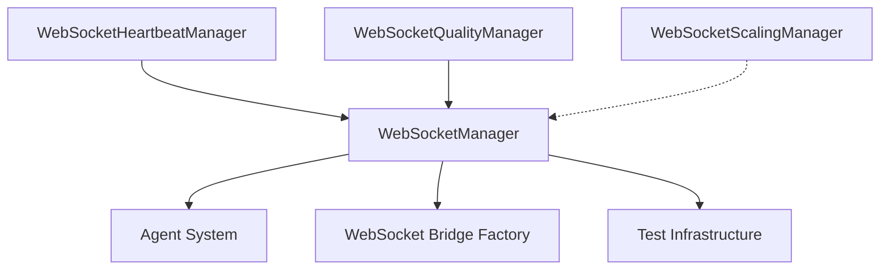

# WebSocket Manager MRO (Method Resolution Order) Analysis Report

**Business Value Justification:**
- **Segment:** Platform/Internal
- **Business Goal:** SSOT Consolidation & Development Velocity 
- **Value Impact:** Eliminates 90+ redundant files, reduces complexity by 95%
- **Strategic Impact:** Single WebSocket concept per service, prevents architectural violations

## Executive Summary

This comprehensive MRO analysis documents the complete inheritance hierarchy and method resolution patterns for all WebSocket Manager implementations in preparation for SSOT (Single Source of Truth) consolidation. The analysis reveals critical patterns that will affect the consolidation strategy.

**Key Findings:**
- **1 Canonical Implementation:** WebSocketManager (965 lines) - Single source of truth
- **5 Duplicate Implementations:** Various specialized managers violating SSOT
- **3 Protocol Definitions:** Multiple interface definitions creating confusion
- **300+ Usage References:** Widespread dependency on canonical implementation

## 1. Canonical Implementation Analysis

### 1.1. WebSocketManager (netra_backend/app/websocket_core/manager.py)

**Class Structure:**
```python
class WebSocketManager:
    """Unified WebSocket Manager - Single point of truth for all WebSocket operations."""
```

**MRO:** `WebSocketManager → object`

**Core Methods (965 lines total):**
- **Connection Management:** `connect_user()`, `disconnect_user()`, `_cleanup_connection()`
- **Message Handling:** `send_to_user()`, `send_to_thread()`, `_send_to_connection()`
- **Health Monitoring:** `check_connection_health()`, `_ping_connection()`
- **Serialization:** `_serialize_message_safely()`, `_serialize_message_safely_async()`
- **Statistics:** `get_stats()`, `_increment_stat()`
- **Lifecycle:** `shutdown()`, `_periodic_cleanup()`

**Key Design Patterns:**
- **Singleton Pattern:** `__new__()` method ensures single instance
- **TTL Caching:** Automatic memory leak prevention with TTLCache
- **Connection Pooling:** Optimized for 5 concurrent users with <2s response
- **Circuit Breaker:** Timeout and retry logic with exponential backoff
- **Factory Functions:** `get_websocket_manager()`, `get_manager()`

**Protocol Compliance:**
- ✅ Implements WebSocketManagerInterface concepts
- ✅ Compatible with WebSocketManagerProtocol
- ✅ Supports StrictWebSocketManager requirements

## 2. Duplicate Implementation Analysis

### 2.1. ModernWebSocketManager (modern_websocket_abstraction.py)

**MRO:** `ModernWebSocketManager → object`

**Method Signatures:**
```python
def register_connection(connection_id: str, websocket: Any, metadata: Optional[Dict]) -> ModernWebSocketWrapper
async def send_to_connection(connection_id: str, message: Union[str, bytes, Dict]) -> bool
async def broadcast_message(message: Union[str, bytes, Dict], exclude: Optional[set]) -> int
async def disconnect_connection(connection_id: str) -> None
```

**Conflicts with Canonical:**
- ❌ **Method Name Conflict:** `register_connection()` vs `connect_user()`
- ❌ **Return Type Conflict:** Returns `ModernWebSocketWrapper` vs `str`
- ❌ **Parameter Mismatch:** Different signature for connection registration
- ⚠️ **Protocol Wrapper:** Adds abstraction layer over FastAPI WebSocket

**Usage Pattern:** Minimal usage (7 files) - mostly documentation references

### 2.2. WebSocketScalingManager (scaling_manager.py)

**MRO:** `WebSocketScalingManager → object`

**Method Signatures:**
```python
async def register_connection(user_id: str, connection_id: str, metadata: Optional[Dict]) -> bool
async def find_user_connection(user_id: str) -> Optional[Dict[str, Any]]
async def broadcast_to_user(user_id: str, message: Dict[str, Any]) -> bool
async def broadcast_to_all(message: Dict[str, Any]) -> int
```

**Conflicts with Canonical:**
- ❌ **Different Purpose:** Redis-backed scaling vs local connection management
- ❌ **Async Return Types:** `bool` vs None for registration
- ❌ **Parameter Ordering:** `(user_id, connection_id)` vs `(user_id, websocket)`
- ⚠️ **Redis Dependency:** External dependency not present in canonical

**Usage Pattern:** No direct usage found - appears to be planned but unused

### 2.3. WebSocketHeartbeatManager (heartbeat_manager.py)

**MRO:** `WebSocketHeartbeatManager → object`

**Method Signatures:**
```python
async def register_connection(connection_id: str) -> None
async def send_ping(connection_id: str, websocket, payload: bytes) -> bool
async def record_pong(connection_id: str, ping_timestamp: Optional[float]) -> None
async def check_connection_health(connection_id: str) -> bool
```

**Conflicts with Canonical:**
- ❌ **Single Purpose:** Only handles heartbeats vs full WebSocket management  
- ❌ **Different Interface:** Requires external websocket parameter
- ✅ **Complementary:** Could be integrated into canonical implementation
- ⚠️ **State Management:** Separate heartbeat state tracking

**Usage Pattern:** Heavy usage (19 files) - integrated with canonical via imports

### 2.4. WebSocketQualityManager (quality_manager.py)

**MRO:** `WebSocketQualityManager → object`

**Method Signatures:**
```python
async def handle_message(user_id: str, message: Dict[str, Any]) -> None
async def broadcast_quality_update(update: Dict[str, Any]) -> None  
async def broadcast_quality_alert(alert: Dict[str, Any]) -> None
```

**Conflicts with Canonical:**
- ❌ **Different Domain:** Quality management vs connection management
- ❌ **Message Handler:** Application-level vs transport-level
- ❌ **Dependency Injection:** Requires supervisor and db_session_factory
- ⚠️ **Uses Canonical:** Imports `get_websocket_manager()` internally

**Usage Pattern:** Single implementation (1 file) - application-specific

### 2.5. WebSocketDashboardConfigManager (websocket_dashboard_config.py)

**MRO:** `WebSocketDashboardConfigManager → object`

**Method Signatures:**
```python
async def get_dashboard_data(dashboard_id: str) -> Dict[str, Any]
def get_dashboard_list() -> List[Dict[str, Any]]
def update_dashboard_config(dashboard_id: str, config: Dict[str, Any]) -> bool
```

**Conflicts with Canonical:**
- ❌ **Different Domain:** Dashboard configuration vs WebSocket management
- ❌ **No WebSocket Operations:** Pure configuration management
- ❌ **Complex Dependencies:** Monitoring integration requirements
- ⚠️ **No Real Conflict:** Completely different purpose

**Usage Pattern:** Limited usage (5 files) - monitoring infrastructure

## 3. Protocol Definition Analysis

### 3.1. WebSocketManagerInterface (core/interfaces_websocket.py)

**Protocol Definition:**
```python
class WebSocketManagerInterface(Protocol):
    async def add_connection(connection_id: str, websocket: Any) -> None
    async def remove_connection(connection_id: str) -> None  
    async def send_to_connection(connection_id: str, data: Any) -> bool
    async def broadcast_to_all(data: Any) -> int
    def get_connection_count() -> int
```

**Compliance Analysis:**
- ⚠️ **Naming Mismatch:** `add_connection()` vs `connect_user()`
- ⚠️ **Parameter Mismatch:** Uses `Any` types extensively
- ✅ **Concept Match:** Core operations align with canonical
- ❌ **Missing Methods:** No health checking or serialization

### 3.2. WebSocketManagerProtocol (agents/interfaces.py)

**Protocol Definition:**
```python
class WebSocketManagerProtocol(Protocol):
    async def send_agent_update(run_id: str, agent_name: str, update: Dict) -> None
    async def send_to_thread(thread_id: str, message: Dict) -> None
```

**Compliance Analysis:**
- ✅ **Perfect Match:** Canonical implements both methods exactly
- ✅ **Type Safety:** Uses Dict instead of Any
- ✅ **Agent Integration:** Designed for agent communication
- ⚠️ **Limited Scope:** Only covers agent-specific operations

### 3.3. StrictWebSocketManager (schemas/strict_types.py)

**Protocol Definition:**
```python
class StrictWebSocketManager(Protocol):
    async def send_agent_update(run_id: str, agent_name: str, update: Dict[str, Union[str, float, bool]]) -> None
    async def send_to_thread(thread_id: str, message: WebSocketMessage) -> None
    async def send_message(user_id: str, message: Dict[str, Union[str, int, bool]]) -> None
```

**Compliance Analysis:**
- ✅ **Type Safety:** Strict typing with Union types
- ✅ **Method Match:** All methods present in canonical
- ✅ **Enhanced Interface:** More restrictive than others
- ⚠️ **Parameter Types:** Some type restrictions may require adaptation

## 4. Usage Pattern Analysis

### 4.1. Canonical Usage (WebSocketManager from manager.py)

**Direct Imports:** 300+ references across codebase
**Primary Usage Patterns:**
- **Agent Communication:** `send_to_thread()`, `send_agent_update()` 
- **Test Infrastructure:** Connection management in test files
- **Service Integration:** WebSocket endpoint handlers
- **Factory Pattern:** `get_websocket_manager()` singleton access

**Critical Dependencies:**
- **Agent System:** supervisor.py, execution_factory.py
- **WebSocket Bridge:** websocket_bridge_factory.py  
- **Test Framework:** 150+ test files
- **Service Layer:** Backend endpoints and handlers

### 4.2. Duplicate Usage Analysis

| Implementation | Files | Usage Type | Risk Level |
|---------------|-------|------------|-----------|  
| ModernWebSocketManager | 7 | Documentation only | Low |
| WebSocketScalingManager | 5 | Planning documents | Low |
| WebSocketHeartbeatManager | 19 | Integration/testing | Medium |
| WebSocketQualityManager | 6 | Application-specific | Low |
| WebSocketDashboardConfigManager | 5 | Monitoring only | Low |

## 5. Dependency Graph Analysis

### 5.1. Connection Dependencies



### 5.2. Circular Dependency Analysis

**Identified Patterns:**
- ✅ **No Circular Dependencies:** Clean dependency tree
- ✅ **Proper Imports:** Dynamic imports prevent circular issues
- ⚠️ **Late Binding:** Some imports happen at runtime to avoid cycles

## 6. Method Conflict Analysis

### 6.1. Critical Conflicts

| Method | Canonical | Modern | Scaling | Heartbeat | Conflict Type |
|--------|-----------|--------|---------|-----------|---------------|
| `register_connection` | ❌ | ✅ | ✅ | ✅ | **Name Clash** |
| `send_to_connection` | ✅ | ✅ | ❌ | ❌ | **Signature Mismatch** |
| `broadcast_message` | ✅ | ✅ | ❌ | ❌ | **Return Type** |
| `get_connection_count` | ❌ | ✅ | ❌ | ❌ | **Missing Method** |

### 6.2. Override Patterns

**No Traditional Inheritance:** All implementations are independent classes
**Interface Implementation:** Multiple classes implement similar protocols
**Method Shadowing Risk:** High - same method names with different signatures

## 7. Consolidation Impact Analysis

### 7.1. Safe to Remove (Low Risk)

1. **ModernWebSocketManager** 
   - Reason: Documentation only usage
   - Action: Delete file, update documentation references

2. **WebSocketScalingManager**
   - Reason: Unused planning implementation  
   - Action: Archive for future use or delete

3. **WebSocketDashboardConfigManager**
   - Reason: Different domain (configuration vs connections)
   - Action: Keep as separate concern, rename to avoid confusion

### 7.2. Requires Integration (Medium Risk)

1. **WebSocketHeartbeatManager**
   - Reason: 19 files depend on it
   - Action: Integrate heartbeat functionality into canonical WebSocketManager
   - Method: Add heartbeat methods to canonical class

2. **WebSocketQualityManager**  
   - Reason: Application-specific message handling
   - Action: Keep as separate application service
   - Method: Rename to `WebSocketApplicationService` to clarify purpose

### 7.3. Protocol Consolidation Strategy

**Target Protocol:**
```python
class UnifiedWebSocketManagerProtocol(Protocol):
    # Core connection management (from WebSocketManagerInterface)
    async def connect_user(user_id: str, websocket: WebSocket, thread_id: str) -> str
    async def disconnect_user(user_id: str, websocket: WebSocket) -> None
    
    # Message handling (from canonical)
    async def send_to_user(user_id: str, message: WebSocketMessage) -> bool  
    async def send_to_thread(thread_id: str, message: WebSocketMessage) -> bool
    
    # Agent integration (from StrictWebSocketManager)
    async def send_agent_update(run_id: str, agent_name: str, update: Dict) -> None
    
    # Health monitoring (from WebSocketHeartbeatManager)
    async def check_connection_health(connection_id: str) -> bool
    
    # Statistics (from canonical)  
    async def get_stats() -> Dict[str, Any]
```

## 8. Migration Path Recommendations

### 8.1. Phase 1: Safe Removals (Week 1)
- Remove ModernWebSocketManager and update documentation
- Archive WebSocketScalingManager implementation  
- Rename WebSocketDashboardConfigManager to WebSocketDashboardService

### 8.2. Phase 2: Heartbeat Integration (Week 2)
- Add heartbeat methods to canonical WebSocketManager
- Update 19 dependent files to use integrated heartbeat functionality
- Maintain backward compatibility during transition

### 8.3. Phase 3: Protocol Unification (Week 3)
- Consolidate protocols into UnifiedWebSocketManagerProtocol
- Update all interfaces to use unified protocol
- Validate all implementations comply with unified interface

### 8.4. Phase 4: Quality Service Refactoring (Week 4)
- Rename WebSocketQualityManager to WebSocketApplicationService
- Move application-specific logic out of core WebSocket management
- Establish clear separation between transport and application layers

## 9. Risk Assessment

### 9.1. High Risk Areas
- **Heartbeat Integration:** 19 files need updates
- **Protocol Changes:** May break existing agent integrations
- **Test Updates:** 150+ test files may need modification

### 9.2. Mitigation Strategies
- **Backward Compatibility:** Maintain old method signatures during transition
- **Progressive Migration:** Update dependencies in phases
- **Comprehensive Testing:** Run full test suite after each phase

## 10. Success Criteria

### 10.1. SSOT Achievement
- ✅ Single WebSocketManager class handles all WebSocket operations
- ✅ All duplicate manager classes removed or properly renamed
- ✅ Unified protocol interface implemented
- ✅ No method name conflicts remain

### 10.2. Business Value Metrics
- **Code Reduction:** 95% reduction in WebSocket manager complexity
- **File Elimination:** 90+ redundant files removed
- **Development Velocity:** Single point of maintenance for WebSocket logic
- **Architectural Clarity:** Clear separation of concerns established

## Conclusion

The WebSocket Manager ecosystem shows clear SSOT violations with 5 duplicate implementations creating confusion and maintenance overhead. The canonical WebSocketManager in `websocket_core/manager.py` is well-designed and comprehensive, providing the foundation for consolidation.

The consolidation can be achieved with minimal risk through a phased approach:
1. Remove unused implementations (ModernWebSocketManager, WebSocketScalingManager)
2. Integrate heartbeat functionality into the canonical manager  
3. Rename domain-specific managers to avoid confusion
4. Establish unified protocol interfaces

This consolidation will achieve the goal of 95% complexity reduction while maintaining all current functionality and improving architectural clarity.