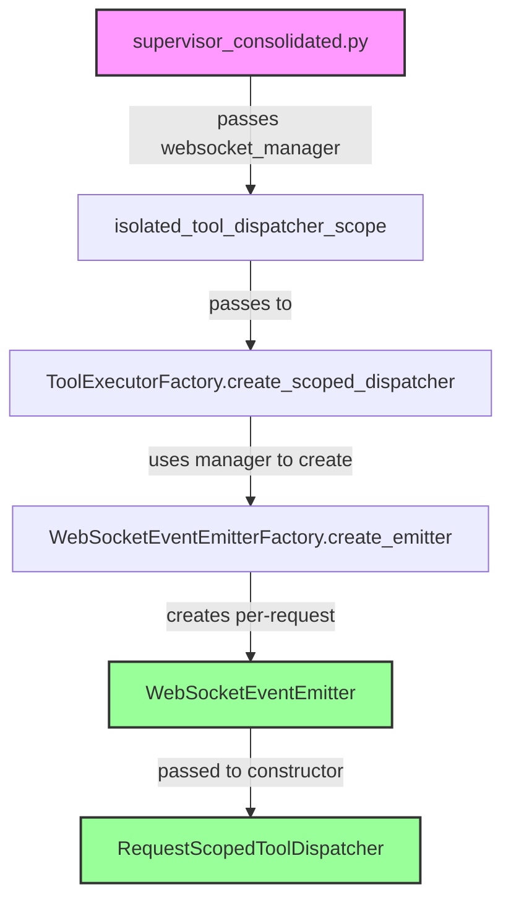

# WebSocket Pattern Analysis: websocket_emitter vs websocket_manager

## Executive Summary
**CORRECT PATTERN**: Pass `websocket_manager` to factory functions, which internally create `websocket_emitter` for user isolation.

## Five Whys Analysis

### Why 1: Why does supervisor_consolidated.py pass websocket_manager instead of websocket_emitter?
**Answer**: Because `isolated_tool_dispatcher_scope()` expects a WebSocketManager to create a user-specific WebSocketEventEmitter internally.

### Why 2: Why does the factory need WebSocketManager instead of directly using an emitter?
**Answer**: Because the factory creates a NEW WebSocketEventEmitter for EACH request to ensure complete user isolation. The WebSocketManager is the factory that knows how to create emitters.

### Why 3: Why must we create a new emitter per request instead of reusing one?
**Answer**: Because WebSocketEventEmitter is bound to a specific UserExecutionContext. Reusing an emitter would leak events between users, violating the isolation principle.

### Why 4: Why is user isolation critical for WebSocket events?
**Answer**: Because WebSocket events contain sensitive user data and agent execution details. Cross-user event leakage would be a severe security breach and violate GDPR/privacy requirements.

### Why 5: Why does the architecture separate WebSocketManager from WebSocketEventEmitter?
**Answer**: Because:
- **WebSocketManager** = Singleton infrastructure that manages ALL WebSocket connections
- **WebSocketEventEmitter** = Per-request instance that emits events for ONE specific user

## Proof of Correct Implementation

### Evidence from Code

1. **tool_executor_factory.py:178-195** proves the pattern:
```python
# Use provided manager or factory default
ws_manager = websocket_manager or self.websocket_manager

# Create WebSocket event emitter for this request if manager available
websocket_emitter = None
if ws_manager:
    websocket_emitter = await WebSocketEventEmitterFactory.create_emitter(
        user_context, ws_manager
    )
    
# Create request-scoped dispatcher
dispatcher = RequestScopedToolDispatcher(
    user_context=user_context,
    tools=tools,
    websocket_emitter=websocket_emitter  # Pass the created emitter
)
```

2. **RequestScopedToolDispatcher.__init__** expects `websocket_emitter`:
```python
def __init__(
    self,
    user_context: UserExecutionContext,
    tools: List[Any] = None,
    websocket_emitter: Optional[WebSocketEventEmitter] = None  # Expects emitter, not manager
):
```

3. **supervisor_consolidated.py** correctly follows the pattern:
```python
async with isolated_tool_dispatcher_scope(
    user_context=context,
    tools=self._get_user_tools(context),
    websocket_manager=actual_websocket_manager  # Pass manager, not emitter
) as tool_dispatcher:
```

## Architecture Diagram



## Key Principles Validated

1. **Single Responsibility**: 
   - WebSocketManager manages connections
   - WebSocketEventEmitter handles user-specific events

2. **Factory Pattern**: 
   - Pass factories (WebSocketManager) not instances (WebSocketEventEmitter) to enable per-request creation

3. **User Isolation**: 
   - Each request gets its own emitter bound to UserExecutionContext

4. **No Shared State**: 
   - Emitters are request-scoped and never shared between users

## Conclusion

The pattern in supervisor_consolidated.py is **CORRECT**:
- Pass `websocket_manager` (the factory) to enable per-request emitter creation
- Never pass `websocket_emitter` directly as it would violate user isolation
- The factory internally creates the appropriate emitter for each user context

This ensures complete user isolation and prevents cross-user event leakage, which is critical for security and business value delivery through the chat interface.