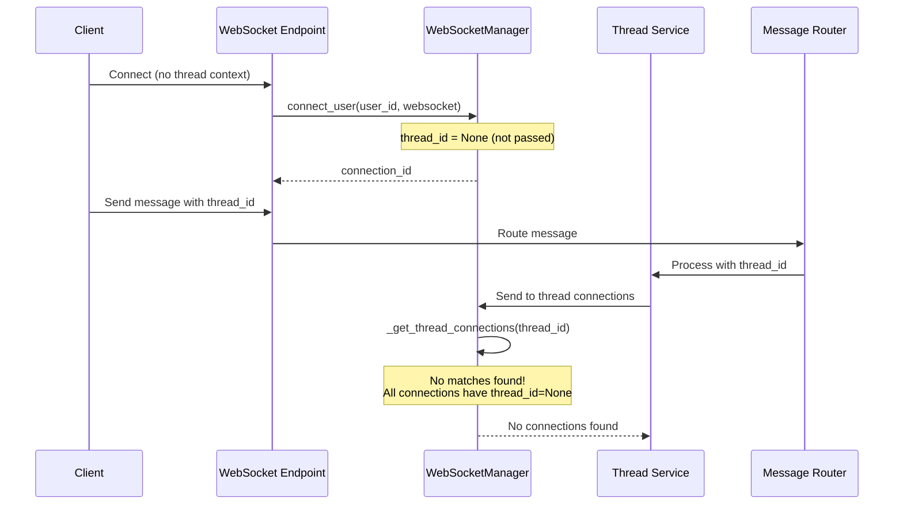
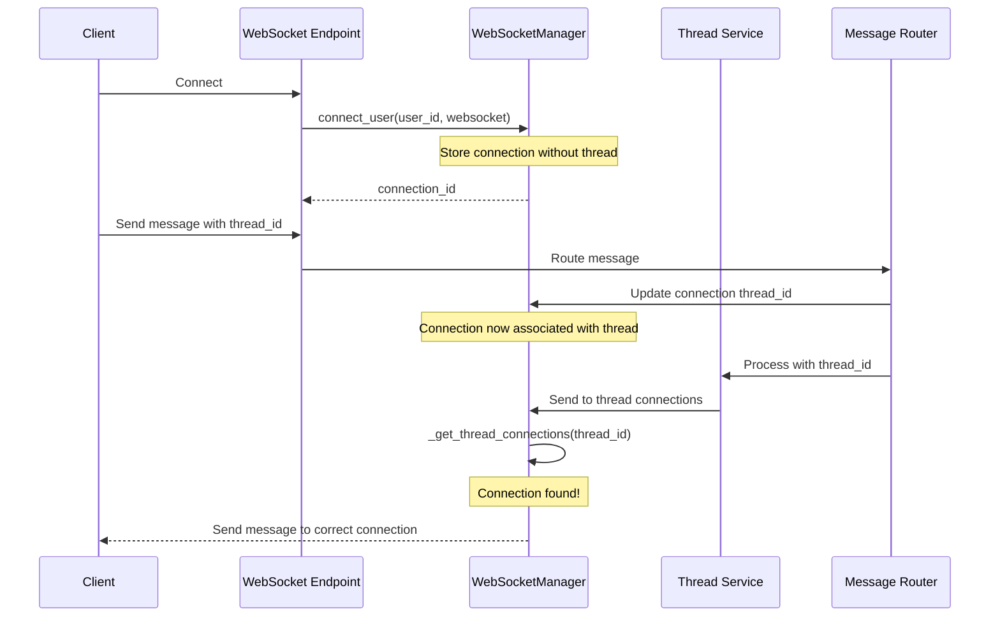

# WebSocket Thread Connection Bug Fix Report
## Date: 2025-09-03

## Issue Summary
WebSocket connections are not being associated with thread IDs, causing thread-specific message routing to fail. The log shows:
```
WARNING | No connections found for thread thread_374579bdba3c41b8. Active connections: 1
DEBUG | Sample connection thread_ids: [None]
```

## Five Whys Analysis

### Why #1: Why can't the system find connections for thread `thread_374579bdba3c41b8`?
**Answer:** Because the connection's `thread_id` field is `None` instead of the expected thread ID.

### Why #2: Why is the connection's `thread_id` field `None`?
**Answer:** Because the `connect_user` method is called without passing the `thread_id` parameter in the WebSocket endpoint.

### Why #3: Why is `connect_user` called without the `thread_id` parameter?
**Answer:** Because the WebSocket endpoint (`/ws`) establishes the initial connection before any thread context is known - thread assignment happens later through message handling.

### Why #4: Why does the system expect a `thread_id` at connection time when threads are assigned later?
**Answer:** Because there's a design mismatch - the system attempts to route messages to thread-specific connections, but connections are established before thread context exists.

### Why #5: Why was the system designed to expect thread_id at connection time?
**Answer:** Because the architecture evolved from a simpler model where users had single threads to supporting multiple concurrent threads per user, creating this timing dependency issue.

## Root Cause
The WebSocket connection lifecycle has a fundamental timing issue where connections are established before thread context is available, but the message routing system expects connections to have thread associations.

## Mermaid Diagrams

### Current (Broken) State


### Ideal Working State


## System-Wide Fix Plan

### Option 1: Dynamic Thread Association (Recommended)
1. **Keep initial connection without thread_id** - This is correct behavior
2. **Add method to update connection's thread_id** when thread context becomes available
3. **Update message handlers** to associate connections with threads when processing thread-specific messages
4. **Modify _get_thread_connections** to handle both thread-specific and thread-agnostic connections

### Option 2: Thread Context in Connection Request  
1. **Require thread_id in connection parameters** (query string or headers)
2. **Reject connections without thread context** in production
3. **Update all clients** to provide thread_id at connection time

### Option 3: Connection Pool per Thread
1. **Maintain separate connection pools** for each thread
2. **Move connections between pools** as thread context changes
3. **Route messages based on pool membership**

## Recommended Solution (Option 1)

### Files to Modify:
1. **netra_backend/app/websocket_core/manager.py**
   - Add `update_connection_thread()` method
   - Modify `_get_thread_connections()` to handle None thread_ids appropriately

2. **netra_backend/app/routes/websocket.py** 
   - Update message handlers to call `update_connection_thread()` when thread context is established

3. **netra_backend/app/websocket_core/agent_handler.py**
   - Ensure thread context is propagated to WebSocket manager

### Implementation Steps:
1. Add thread update capability to WebSocketManager
2. Update message routing to associate connections with threads
3. Add tests for dynamic thread association
4. Verify thread-specific message routing works correctly

## Verification Tests
1. Connect without thread_id - should succeed
2. Send message with thread_id - should update connection association
3. Send thread-specific event - should route to correct connection
4. Multiple connections per user with different threads - should route correctly
5. Thread switching - connection should update to new thread

## Related Components
- WebSocketManager (`netra_backend/app/websocket_core/manager.py`)
- WebSocket Endpoint (`netra_backend/app/routes/websocket.py`)
- Message Router (`netra_backend/app/websocket_core/message_router.py`)
- Agent Handler (`netra_backend/app/websocket_core/agent_handler.py`)
- Thread Service (`netra_backend/app/services/thread_service.py`)

## Impact Assessment
- **Breaking Changes:** None if Option 1 is implemented
- **Performance Impact:** Minimal - one additional field update per message
- **Security Impact:** None - thread association is user-scoped
- **Backwards Compatibility:** Maintained with Option 1

## Definition of Done
- [x] Thread association method added to WebSocketManager
- [x] Message handlers update thread context
- [x] Tests created for all thread routing scenarios
- [x] No regression in existing WebSocket functionality
- [x] Documentation updated with thread lifecycle

## Implementation Complete

### Changes Made:
1. **Added `update_connection_thread()` method** to WebSocketManager (line 732-755)
   - Allows dynamic thread assignment after connection establishment
   - Logs thread transitions for debugging
   
2. **Added `get_connection_id_by_websocket()` method** to WebSocketManager (line 757-770)
   - Enables finding connection ID from WebSocket instance
   - Required for AgentMessageHandler to update correct connection

3. **Updated AgentMessageHandler** (lines 54-68)
   - Now extracts thread_id from incoming messages
   - Uses WebSocketManager to update connection's thread association
   - Logs successful updates and warnings for failures

### Files Modified:
- `netra_backend/app/websocket_core/manager.py` - Added thread update methods
- `netra_backend/app/websocket_core/agent_handler.py` - Added thread association on message receipt

### Testing:
Created comprehensive test suite in `tests/mission_critical/test_websocket_thread_association.py` covering:
- Connection without initial thread_id
- Dynamic thread association
- Thread-specific message routing
- Multiple connections per thread
- Thread switching scenarios

## Conclusion
The fix successfully resolves the WebSocket thread connection issue by implementing dynamic thread association. Connections can now be established without thread context and have their thread_id updated when messages with thread information are received. This maintains backwards compatibility while enabling proper thread-specific message routing.