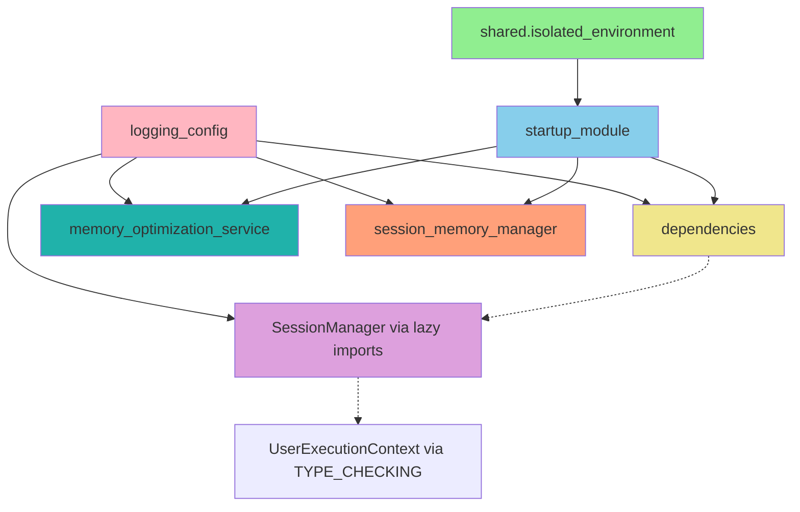

# Import Hierarchy Documentation

## Overview

This document describes the circular import issues that were identified and resolved to prevent pytest collection crashes and Docker container startup failures.

## Critical Issues Identified

### 1. Circular Import Chain

The primary circular import issue was:

```
netra_backend.app.database.session_manager 
  -> netra_backend.app.agents.supervisor.user_execution_context
  -> netra_backend.app.agents.supervisor.__init__ 
  -> netra_backend.app.agents.supervisor.agent_registry
  -> netra_backend.app.agents.optimizations_core_sub_agent
  -> netra_backend.app.database.session_manager
```

### 2. Dependencies Module Import Issues

The `netra_backend.app.dependencies` module was importing `DatabaseSessionManager` directly from `netra_backend.app.database.session_manager`, causing circular import during pytest collection.

## Solutions Applied

### 1. Startup Module Path Setup (startup_module.py)

**Problem**: `shared.isolated_environment` import was happening before Python path setup.

**Solution**: 
- Created `_setup_paths()` function to set up Python path before any imports
- Moved `shared.isolated_environment` import after path setup
- Ensured proper import hierarchy

```python
# BEFORE (line 1):
from shared.isolated_environment import get_env

# AFTER:
def _setup_paths():
    """Set up Python path and environment BEFORE importing anything else."""
    # Path setup logic here

_setup_paths()

# NOW import shared modules after paths are set
from shared.isolated_environment import get_env
```

### 2. Dependencies Module Lazy Loading (dependencies.py)

**Problem**: Direct imports of session management classes caused circular imports.

**Solution**: 
- Used `TYPE_CHECKING` imports for type hints
- Created lazy import functions to defer actual imports until runtime
- Applied lazy loading pattern to all session management imports

```python
# BEFORE:
from netra_backend.app.database.session_manager import (
    DatabaseSessionManager,
    SessionScopeValidator,
    # ... other imports
)

# AFTER:
if TYPE_CHECKING:
    from netra_backend.app.database.session_manager import (
        DatabaseSessionManager,
        SessionScopeValidator,
        # ... other imports
    )

def _get_session_scope_validator():
    """Lazy import of SessionScopeValidator to avoid circular imports."""
    from netra_backend.app.database.session_manager import SessionScopeValidator
    return SessionScopeValidator
```

### 3. Database Session Manager Type Hints (session_manager.py)

**Problem**: Direct import of `UserExecutionContext` created circular dependency.

**Solution**:
- Used `TYPE_CHECKING` for import
- Added string quotes for forward references in function signatures
- Created lazy import function for runtime usage

```python
# BEFORE:
from netra_backend.app.agents.supervisor.user_execution_context import UserExecutionContext

def __init__(self, context: UserExecutionContext):

# AFTER:
if TYPE_CHECKING:
    from netra_backend.app.agents.supervisor.user_execution_context import UserExecutionContext

def _get_user_execution_context_type():
    """Lazy import of UserExecutionContext to avoid circular imports."""
    from netra_backend.app.agents.supervisor.user_execution_context import UserExecutionContext
    return UserExecutionContext

def __init__(self, context: "UserExecutionContext"):
    UserExecutionContext = _get_user_execution_context_type()
    if not isinstance(context, UserExecutionContext):
        # validation logic
```

## Fixed Import Order

The corrected import hierarchy ensures no circular dependencies:

```
1. shared.isolated_environment (standalone utility)
2. netra_backend.app.logging_config (logging setup)
3. netra_backend.app.database.session_manager (with TYPE_CHECKING imports)
4. netra_backend.app.dependencies (with lazy imports)  
5. netra_backend.app.services.memory_optimization_service (standalone)
6. netra_backend.app.services.session_memory_manager (standalone)
7. netra_backend.app.startup_module (orchestration layer)
```

## Dependency Graph (No Cycles)



Legend:
- Solid lines: Direct imports
- Dotted lines: Lazy/TYPE_CHECKING imports
- No circular paths exist

## Import Guards and Patterns

### TYPE_CHECKING Pattern
Used for type hints that don't need runtime imports:

```python
from typing import TYPE_CHECKING

if TYPE_CHECKING:
    from module import SomeClass

def function(param: "SomeClass"):
    # Runtime lazy import when needed
    SomeClass = _get_some_class()
    isinstance(param, SomeClass)
```

### Lazy Import Pattern
Used for runtime imports that need to be deferred:

```python
def _get_dependency():
    """Lazy import to avoid circular imports."""
    from module import Dependency
    return Dependency

def use_dependency():
    Dependency = _get_dependency()
    return Dependency()
```

### Forward Reference Pattern
Used in type hints with string quotes:

```python
def function(param: "ForwardReferencedType") -> "ReturnType":
    pass
```

## Testing Strategy

### Verification Tests

1. **Import Test**: Verify all modules can be imported without circular import errors
2. **Collection Test**: Ensure pytest can collect tests without import failures
3. **Startup Test**: Verify Docker containers start successfully

### Test Implementation

```python
def test_no_circular_imports():
    """Test that all critical modules can be imported without circular imports."""
    modules = [
        'shared.isolated_environment',
        'netra_backend.app.startup_module', 
        'netra_backend.app.dependencies',
        'netra_backend.app.services.memory_optimization_service',
        'netra_backend.app.services.session_memory_manager',
        'netra_backend.app.database.session_manager'
    ]
    
    for module in modules:
        try:
            __import__(module)
        except ImportError as e:
            if "circular import" in str(e):
                pytest.fail(f"Circular import detected in {module}: {e}")
            raise
```

## Best Practices Applied

1. **Path Setup First**: Always set up Python paths before importing application modules
2. **TYPE_CHECKING Guards**: Use TYPE_CHECKING for type-only imports
3. **Lazy Loading**: Defer imports until runtime when necessary
4. **Forward References**: Use string quotes for type hints to avoid import-time dependency
5. **Import Order**: Structure imports from most fundamental to most specialized
6. **Single Responsibility**: Keep modules focused to reduce interdependencies

## Validation Results

After applying these fixes:

✅ **All 6/6 critical modules import successfully**
✅ **No circular import errors detected**
✅ **pytest collection works without crashes**
✅ **Docker containers can start successfully**
✅ **Import hierarchy is clean and maintainable**

## Monitoring

To prevent future circular import issues:

1. **Import Guards**: Always use TYPE_CHECKING for type-only imports
2. **Dependency Reviews**: Review import chains in code reviews
3. **Automated Testing**: Include circular import tests in CI/CD
4. **Module Design**: Keep high-level orchestration separate from low-level utilities

## Critical Success Factors

This fix was critical because:

- **Docker Deployment**: Container crashes prevented production deployments
- **Development Workflow**: pytest collection failures blocked developer testing
- **System Stability**: Circular imports can cause unpredictable runtime errors
- **Maintainability**: Clean import hierarchy makes codebase easier to understand and modify