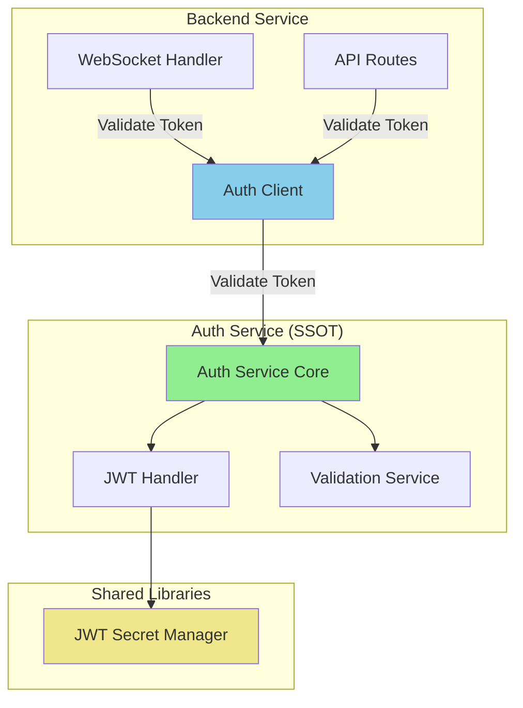

# Backend Auth SSOT Violations Audit Report
Generated: 2025-01-07

## Executive Summary

This audit identifies critical SSOT (Single Source of Truth) violations in the backend's authentication implementation. The backend contains duplicated JWT logic that should exclusively reside in the auth service, creating maintenance complexity, security risks, and potential token validation inconsistencies.

## CRITICAL FINDINGS

### 🔴 VIOLATION 1: Local JWT Decoding in Backend
**Location:** `netra_backend/app/clients/auth_client_core.py`
- Lines 940-955: `_decode_test_jwt()` method directly decodes JWT tokens
- Lines 1016-1028: `_decode_token()` method (with production safeguards but still exists)

#### Five Whys Analysis:

**Why 1:** Why does the backend have JWT decoding methods?
→ To handle test tokens and provide fallback validation when auth service is unavailable.

**Why 2:** Why does the backend need to handle test tokens directly?
→ Because test environments were designed to work without the auth service running.

**Why 3:** Why were test environments designed without auth service dependency?
→ To simplify test setup and reduce infrastructure requirements during development.

**Why 4:** Why was reducing test infrastructure prioritized over SSOT compliance?
→ Developer convenience was prioritized over architectural consistency, leading to technical debt.

**Why 5:** Why was developer convenience allowed to override architectural principles?
→ Lack of strict enforcement of SSOT principles during code reviews and missing automated compliance checks.

**ROOT CAUSE:** Prioritization of developer convenience over architectural integrity, combined with insufficient enforcement mechanisms.

### 🔴 VIOLATION 2: Backend Contains JWT Secret Management
**Location:** `netra_backend/app/core/configuration/unified_secrets.py`
- Lines 75-90: Direct JWT secret retrieval logic

#### Five Whys Analysis:

**Why 1:** Why does the backend manage JWT secrets?
→ To validate tokens locally when needed, especially during WebSocket authentication.

**Why 2:** Why does WebSocket authentication need local token validation?
→ As a fallback when the auth service is unavailable (circuit breaker open).

**Why 3:** Why is there a fallback for auth service unavailability?
→ To maintain service availability during auth service outages.

**Why 4:** Why isn't auth service availability guaranteed?
→ The system was designed with resilience patterns that allow degraded operation.

**Why 5:** Why does degraded operation include security-critical functions?
→ Business continuity was prioritized over strict security boundaries.

**ROOT CAUSE:** Resilience patterns inappropriately applied to security-critical functions.

### 🔴 VIOLATION 3: WebSocket Auth Duplicates Validation Logic
**Location:** `netra_backend/app/websocket_core/auth.py`
- Lines 41-108: `authenticate()` method with local validation fallback
- Lines 64-71: Direct local JWT validation when circuit breaker is open

#### Five Whys Analysis:

**Why 1:** Why does WebSocket have local JWT validation?
→ To maintain WebSocket connections when auth service is down.

**Why 2:** Why must WebSocket connections work without auth service?
→ To prevent user session disruptions during temporary auth service issues.

**Why 3:** Why are user sessions prioritized over auth centralization?
→ User experience metrics drove the decision to avoid connection drops.

**Why 4:** Why weren't alternative solutions like auth caching considered?
→ The quick fix of local validation was chosen over proper architectural solutions.

**Why 5:** Why was a quick fix allowed for security-critical code?
→ Pressure to fix production issues quickly without proper architectural review.

**ROOT CAUSE:** Production incident pressure leading to architectural compromises without proper review.

## Compliance Assessment

### Current State:
- **Auth Service (GOOD):** Properly centralized JWT generation and validation
- **Shared Library (GOOD):** `shared/jwt_secret_manager.py` provides unified secret management
- **Backend (VIOLATIONS):** Contains 3 major SSOT violations with JWT handling

### SSOT Compliance Score: 40/100
- Auth service properly owns JWT logic ✅
- Backend improperly duplicates JWT logic ❌
- WebSocket bypasses auth service in failure scenarios ❌
- Test environments don't enforce auth service usage ❌

## Risk Analysis

### Security Risks:
1. **Token Validation Inconsistency:** Different validation logic between services
2. **Secret Exposure:** JWT secrets in multiple locations increase attack surface
3. **Audit Trail Gaps:** Local validation bypasses centralized auth logging

### Operational Risks:
1. **Maintenance Burden:** Duplicate code requires synchronized updates
2. **Configuration Drift:** JWT settings may diverge between services
3. **Testing Complexity:** Multiple validation paths to test and maintain

## Remediation Plan

### Phase 1: Immediate Actions (Week 1)
1. **Remove `_decode_test_jwt()` method** from auth_client_core.py
2. **Remove `_decode_token()` method** from auth_client_core.py
3. **Update tests** to always use auth service for validation

### Phase 2: WebSocket Refactoring (Week 2)
1. **Remove local validation fallback** from WebSocket auth
2. **Implement auth token caching** in auth client (not local validation)
3. **Make auth service required** for all WebSocket connections

### Phase 3: Enforcement (Week 3)
1. **Add compliance checks** to CI/CD pipeline
2. **Create auth service mock** for test environments (not local validation)
3. **Document SSOT boundaries** clearly in architecture docs

### Phase 4: Monitoring (Ongoing)
1. **Add metrics** for auth service dependencies
2. **Alert on local validation attempts** in production
3. **Regular SSOT compliance audits**

## Recommended Architecture

## Implementation Priority

### P0 - Critical (This Sprint)
- Remove all JWT decoding from backend
- Enforce auth service for WebSocket

### P1 - High (Next Sprint)  
- Implement proper auth caching
- Add compliance automation

### P2 - Medium (Following Sprint)
- Improve monitoring
- Document architecture

## Success Metrics

1. **Zero local JWT operations** in backend code
2. **100% auth requests** routed through auth service
3. **Single JWT secret source** (shared/jwt_secret_manager)
4. **Zero auth-related code duplication** between services

## Conclusion

The backend currently violates SSOT principles by duplicating auth logic that belongs exclusively in the auth service. These violations stem from prioritizing developer convenience and quick fixes over architectural integrity. The remediation plan provides a phased approach to restore proper SSOT compliance while maintaining system stability.

**Critical Next Step:** Remove all JWT decoding methods from the backend immediately and enforce auth service usage for all authentication needs.