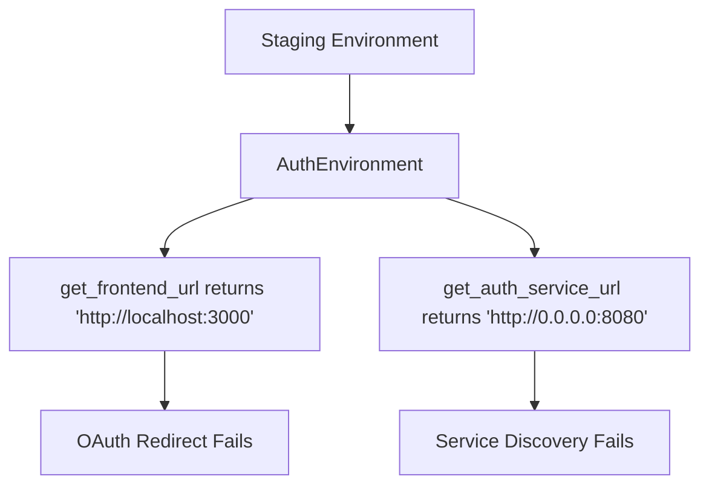
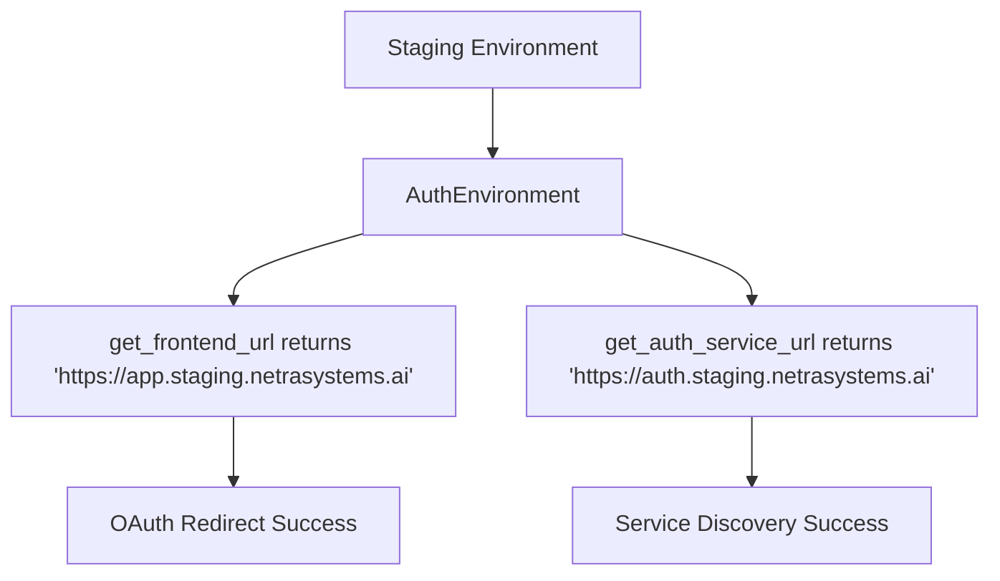

# Auth URL Configuration Regression - Bug Fix Report
Date: 2025-09-05

## Executive Summary
Auth URL configuration has regressed in staging due to inconsistent URL generation patterns and missing environment-specific OAuth redirect URLs. This causes auth failures in staging deployment.

## Five Whys Analysis

### Problem: Auth URLs are misconfigured in staging, causing authentication failures

**Why #1: Why are auth URLs misconfigured in staging?**
- Auth service is returning incorrect frontend URLs (missing "app." subdomain)
- OAuth redirect URIs don't match staging environment expectations

**Why #2: Why is the auth service returning incorrect frontend URLs?**
- `AuthEnvironment.get_frontend_url()` returns raw `FRONTEND_URL` env var without environment-specific logic
- Backend's `auth_client_config.py` has hardcoded staging URLs that don't match auth service

**Why #3: Why doesn't AuthEnvironment have environment-specific URL logic?**
- Recent SSOT consolidation moved all config to AuthEnvironment but removed environment-aware URL generation
- The consolidation focused on eliminating duplication but lost critical staging-specific logic

**Why #4: Why was staging-specific logic removed during SSOT consolidation?**
- The refactoring prioritized single source of truth over environment-specific behaviors
- No comprehensive staging tests were run to catch the regression

**Why #5: Why weren't staging tests run to catch this?**
- Staging deployment validation is manual and not part of the automated test suite
- The deployment process relies on production secrets but doesn't validate URL configurations

## Root Cause
The SSOT consolidation in AuthEnvironment removed critical environment-specific URL generation logic. The `get_frontend_url()` and OAuth configuration methods now return raw environment variables without proper staging URL transformation.

## Current State vs Expected State

### Current State (BROKEN)


### Expected State (WORKING)


## Affected Components

1. **auth_service/auth_core/auth_environment.py**
   - Lines 635-637: `get_frontend_url()` - Missing staging URL logic
   - Lines 631-633: `get_backend_url()` - Missing staging URL logic

2. **auth_service/auth_core/config.py**
   - Lines 104-121: `get_auth_service_url()` - Has logic but depends on AuthEnvironment

3. **netra_backend/app/clients/auth_client_config.py**
   - Lines 86-91: Hardcoded URLs that may not match auth service

4. **deployment/secrets_config.py**
   - OAuth secrets properly configured but URLs are misaligned

## Required Fixes

### 1. Fix AuthEnvironment URL Methods
Update `get_frontend_url()` and `get_backend_url()` to return correct staging URLs:

```python
def get_frontend_url(self) -> str:
    """Get frontend URL with environment-specific defaults."""
    env = self.get_environment()
    
    # Check for explicit override first
    url = self.env.get("FRONTEND_URL")
    if url:
        return url
    
    # Environment-specific defaults
    if env == "production":
        return "https://app.netrasystems.ai"
    elif env == "staging":
        return "https://app.staging.netrasystems.ai"
    elif env == "development":
        return "http://localhost:3000"
    elif env == "test":
        return "http://localhost:3001"
    else:
        return "http://localhost:3000"

def get_backend_url(self) -> str:
    """Get backend service URL with environment-specific defaults."""
    env = self.get_environment()
    
    # Check for explicit override first
    url = self.env.get("BACKEND_URL")
    if url:
        return url
    
    # Environment-specific defaults
    if env == "production":
        return "https://backend.netrasystems.ai"
    elif env == "staging":
        return "https://backend.staging.netrasystems.ai"
    elif env == "development":
        return "http://localhost:8000"
    elif env == "test":
        return "http://localhost:8001"
    else:
        return "http://localhost:8000"
```

### 2. Add OAuth Redirect URI Logic
Add method to generate correct OAuth redirect URIs:

```python
def get_oauth_redirect_uri(self) -> str:
    """Get OAuth redirect URI with environment-specific defaults."""
    env = self.get_environment()
    
    # Check for explicit override first
    uri = self.env.get("OAUTH_REDIRECT_URI")
    if uri:
        return uri
    
    # Build from frontend URL
    frontend_url = self.get_frontend_url()
    return f"{frontend_url}/auth/callback"
```

### 3. Update Backend Auth Client Config
Ensure backend's auth client uses consistent URL generation.

## Test Plan
- [ ] Verify `get_frontend_url()` returns correct URL for each environment
- [ ] Verify `get_backend_url()` returns correct URL for each environment  
- [ ] Verify OAuth redirect URI matches frontend URL + /auth/callback
- [ ] Test auth flow in development environment
- [ ] Deploy to staging and verify auth URLs are correct
- [ ] Test OAuth login flow in staging
- [ ] Verify backend can communicate with auth service in staging

## Prevention Measures
1. Add environment-specific URL validation tests
2. Include staging deployment tests in CI/CD
3. Create staging environment smoke tests
4. Document environment-specific URL patterns in SPEC/
5. Add URL configuration to MASTER_WIP_STATUS monitoring

## Impact Assessment
- **Severity**: CRITICAL - Auth is completely broken in staging
- **Affected Users**: All staging environment users
- **Business Impact**: Cannot test auth features in staging before production
- **Risk**: High - Could affect production if deployed without fix