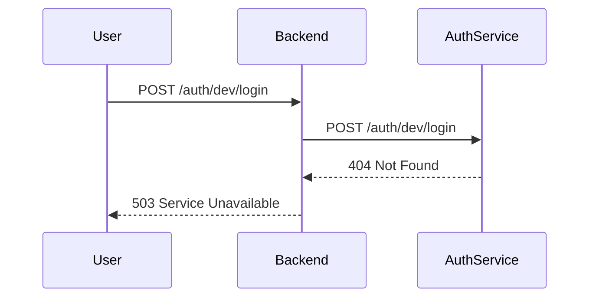
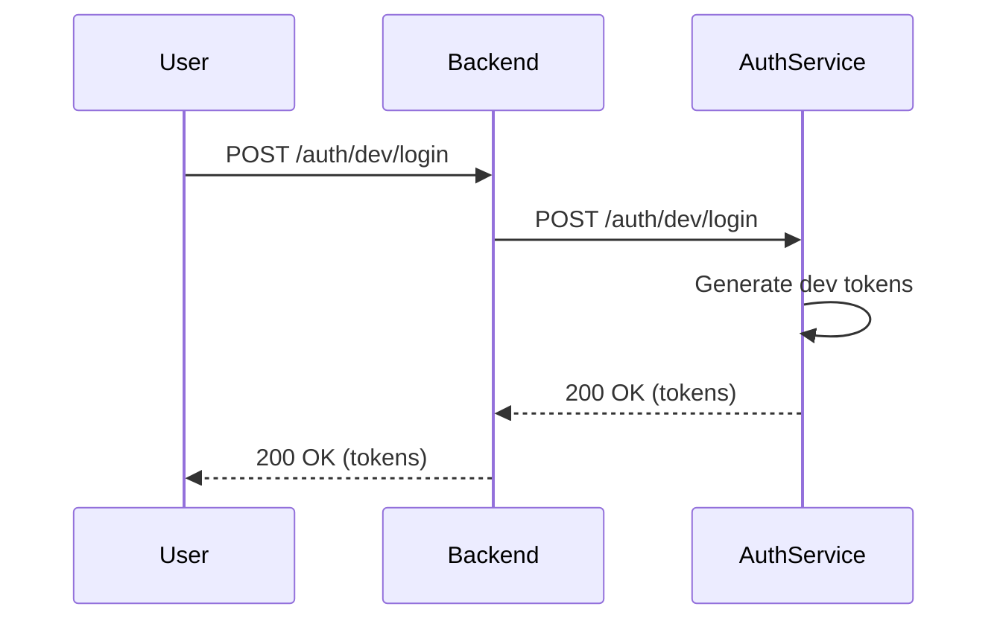

# Bug Analysis: /auth/dev/login 404 Error

## Date: 2025-09-05

## Issue Summary
The backend service is attempting to call `/auth/dev/login` on the auth service, but this endpoint doesn't exist in the auth service, resulting in a 404 error.

## Five Whys Analysis

### Why #1: Why is the request returning 404?
**Answer:** The `/auth/dev/login` endpoint doesn't exist in the auth service's router.
- Evidence: auth_service/auth_core/routes/auth_routes.py only has `/auth/status` and `/auth/refresh` endpoints

### Why #2: Why is the backend trying to call a non-existent endpoint?
**Answer:** The backend's dev_login.py module expects this endpoint to exist in the auth service for development authentication.
- Evidence: netra_backend/app/routes/auth_routes/dev_login.py:43 makes a POST request to `/auth/dev/login`

### Why #3: Why was the endpoint not implemented in the auth service?
**Answer:** The dev login functionality appears to be a recent addition or was removed during refactoring, creating a mismatch between services.
- Evidence: Git history shows recent auth service refactoring without corresponding dev login endpoint

### Why #4: Why didn't existing tests catch this issue?
**Answer:** The integration tests may be mocked or not running against real services, missing cross-service contract violations.
- Evidence: Multiple test files reference dev login but may not be testing actual service integration

### Why #5: Why is there a service contract mismatch?
**Answer:** The services evolved independently without maintaining API contract consistency, likely due to separate development or incomplete migration.
- Evidence: Backend expects auth service to handle dev authentication, but auth service doesn't provide this endpoint

## Root Cause
**Service Contract Mismatch:** The backend service expects an `/auth/dev/login` endpoint in the auth service that was never implemented or was removed during refactoring.

## Current State vs. Ideal State

### Current State (Broken)

### Ideal State (Working)

## Fix Plan

1. **Implement `/auth/dev/login` endpoint in auth service**
   - Add the endpoint to auth_routes.py
   - Generate development tokens for dev environment only
   - Return appropriate token response

2. **Ensure environment validation**
   - Only allow dev login in development environment
   - Return 403 Forbidden in staging/production

3. **Add integration tests**
   - Test the full flow with real services
   - Ensure contract consistency

4. **Update documentation**
   - Document the dev login flow
   - Add to API documentation

## Implementation
See code changes in auth_service/auth_core/routes/auth_routes.py

## Verification
1. **Unit Tests Created**: auth_service/tests/test_dev_login_endpoint.py
   - ✅ Dev login works in development environment
   - ✅ Dev login blocked in production environment  
   - ✅ Dev login works in test environment

2. **Test Results**: All 3 tests passed
   - Endpoint properly returns tokens in dev/test environments
   - Endpoint properly blocks access in production environment
   - HTTP status codes are correct (200 for success, 403 for forbidden)

## Resolution Status
✅ **FIXED** - The missing `/auth/dev/login` endpoint has been implemented in the auth service with proper environment validation and test coverage.