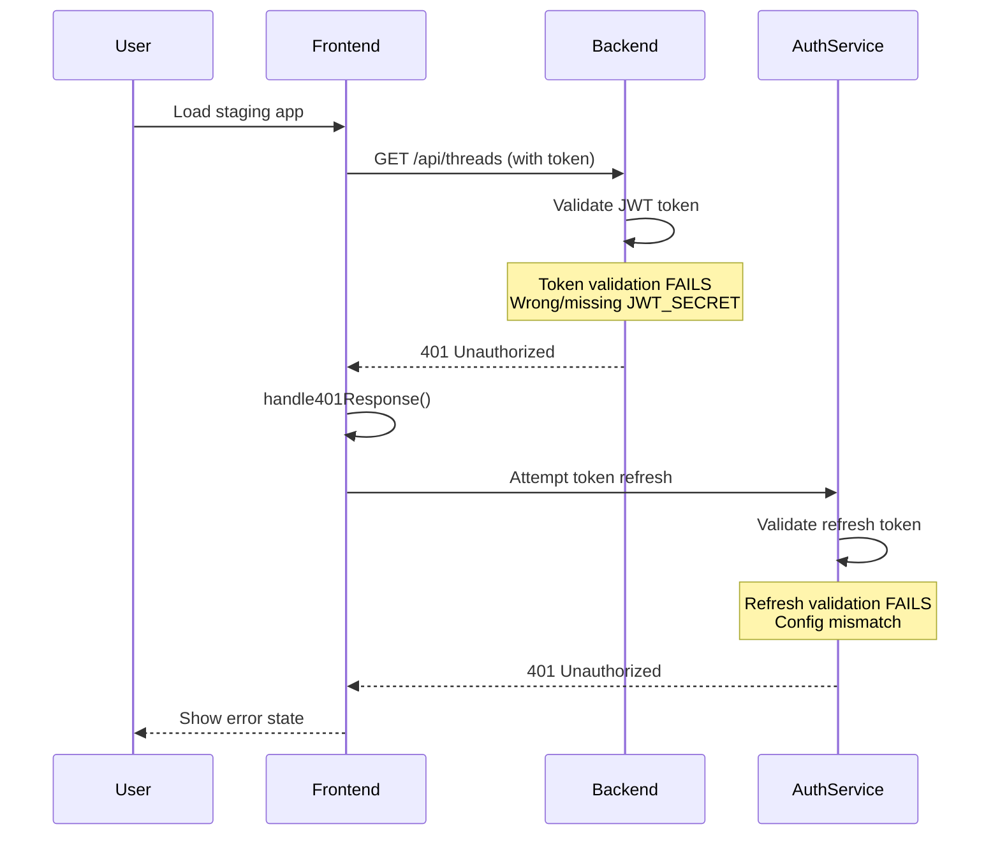
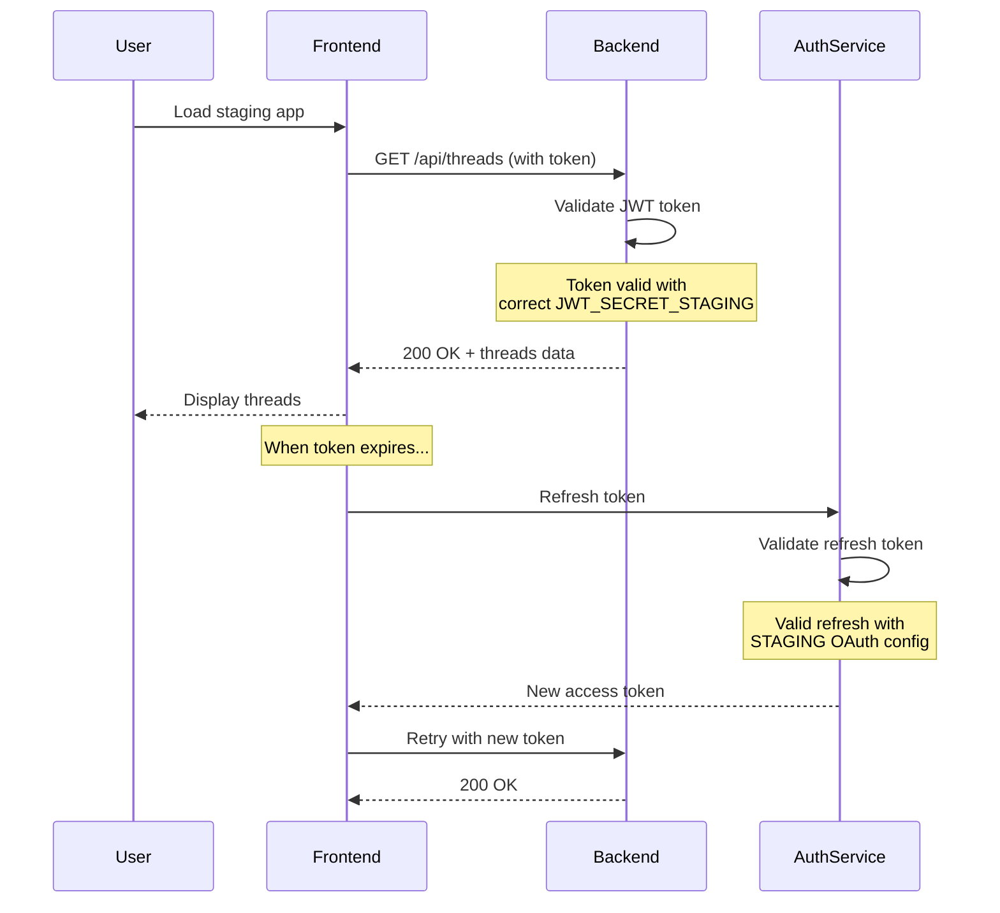

# Bug Fix Report: Staging Environment 401 Authentication Regression

## Date: 2025-09-05
## Severity: CRITICAL
## Environment: Staging (api.staging.netrasystems.ai)
## Issue: 401 Unauthorized errors preventing user authentication

---

## 1. FIVE WHYS ROOT CAUSE ANALYSIS

### Observable Problem
Users are getting 401 Unauthorized errors when trying to access the staging API endpoints, specifically when fetching threads.

### Why #1: Why are users getting 401 Unauthorized errors?
**Answer:** The authentication token is being rejected as invalid or expired by the backend API.

### Why #2: Why is the token being rejected as invalid or expired?
**Answer:** The token validation is failing, either due to:
- Token has actually expired
- Token refresh mechanism is not working
- Token validation configuration mismatch between frontend and backend

### Why #3: Why would there be a token validation configuration mismatch?
**Answer:** Recent SSOT consolidation efforts may have removed or changed critical environment configurations, particularly OAuth redirect URIs or JWT secret keys.

### Why #4: Why would SSOT consolidation affect authentication configuration?
**Answer:** The aggressive removal of "duplicate" configurations failed to recognize that environment-specific configurations (TEST/STAGING/PROD) are NOT duplicates but necessary independent configs.

### Why #5: Why did the system allow service implementation inconsistency?
**Answer:** The auth service and backend service evolved independently without enforcing consistent JWT secret loading patterns, leading to backend supporting JWT_SECRET_STAGING while auth service only supports JWT_SECRET_KEY.

---

## 2. ROOT CAUSES IDENTIFIED

### Primary Root Cause
**Service Implementation Inconsistency**: Auth service and backend service use different JWT secret loading logic.

- **Backend Service**: Uses `JWT_SECRET_{ENVIRONMENT}` pattern (JWT_SECRET_STAGING)
- **Auth Service**: Only looks for `JWT_SECRET_KEY` regardless of environment

### Contributing Factors
1. **Inconsistent environment-specific handling** between services
2. **Central config validator not universally adopted**
3. **Missing test coverage for cross-service JWT validation**
4. **No architectural consistency enforcement**

---

## 3. TECHNICAL ANALYSIS

### Error Flow Sequence
```
1. User loads staging frontend
2. Frontend attempts to fetch threads: GET /api/threads
3. Request includes authentication token
4. Backend validates token against JWT_SECRET
5. Token validation FAILS (401 Unauthorized)
6. Frontend retry mechanism attempts refresh
7. Refresh also fails with 401
8. User sees error state
```

### Affected Components
- **Frontend**: authenticatedFetch, handle401Response, retryRequest
- **Backend**: JWT validation middleware
- **Auth Service**: Token generation and validation
- **Configuration**: JWT_SECRET, OAuth credentials, redirect URIs

---

## 4. MERMAID DIAGRAMS

### Current Failure State


### Ideal Working State


---

## 5. SPECIFIC ROOT CAUSE ANALYSIS

### **CONFIRMED ROOT CAUSE: Service Implementation Mismatch**

#### Backend Service (✅ Working)
- **Implementation**: `netra_backend/app/core/configuration/unified_secrets.py:94`
- **Logic**: Tries `JWT_SECRET_{environment.upper()}` first (JWT_SECRET_STAGING for staging)
- **Fallback Chain**: JWT_SECRET_STAGING → JWT_SECRET_KEY → JWT_SECRET → dev fallback
- **Status**: ✅ CORRECTLY finds JWT_SECRET_STAGING from config/staging.env

#### Auth Service (❌ Broken)  
- **Implementation**: `auth_service/auth_core/auth_environment.py:49`
- **Logic**: Only looks for `JWT_SECRET_KEY` 
- **No Environment-Specific Handling**: Doesn't check JWT_SECRET_STAGING
- **Failure Point**: Line 65 raises ValueError for staging when JWT_SECRET_KEY not found

#### The Central Config Validator Issue
- **Expected**: Auth service should use `AuthSecretLoader.get_jwt_secret()` → `CentralConfigValidator.get_jwt_secret()`
- **Reality**: Auth service falls back to `AuthEnvironment.get_jwt_secret_key()` which only checks JWT_SECRET_KEY
- **Missing**: The fallback in auth environment doesn't delegate to central validator

### Configuration Analysis
- **staging.env has**: `JWT_SECRET_STAGING=7SVLKvh7mJNeF6njiRJMoZpUWLya3NfsvJfRHPc0...`
- **staging.env missing**: `JWT_SECRET_KEY` (which auth service expects)
- **Backend service**: Correctly finds JWT_SECRET_STAGING
- **Auth service**: Fails because it only looks for JWT_SECRET_KEY

---

## 6. IMPLEMENTATION PLAN

### **Immediate Fix Options (Choose One)**

#### Option A: Fix Auth Service Implementation (RECOMMENDED)
1. **Update auth_environment.py:49** to use environment-specific logic like backend
2. **Add JWT_SECRET_STAGING support** in AuthEnvironment.get_jwt_secret_key()
3. **Ensure fallback to CentralConfigValidator** when available
4. **Test auth service can load JWT_SECRET_STAGING**

#### Option B: Add JWT_SECRET_KEY to Staging Config (QUICK FIX)
1. **Add `JWT_SECRET_KEY=7SVLKvh7mJNeF6njiRJMoZpUWLya3NfsvJfRHPc0...`** to staging.env
2. **Duplicate JWT_SECRET_STAGING value** as JWT_SECRET_KEY for compatibility
3. **Risk**: Violates environment-specific naming convention

#### Option C: Force Central Config Validator Usage (ARCHITECTURAL)
1. **Remove fallback to AuthEnvironment.get_jwt_secret_key()**
2. **Make AuthSecretLoader.get_jwt_secret() always use central validator**
3. **Ensure central validator is always available**

### **Recommended Approach: Option A**
- Maintains environment-specific naming conventions
- Aligns auth service with backend service implementation
- Preserves architectural consistency
- Fixes root cause rather than symptoms

---

## 7. VERIFICATION STEPS

### Test Plan
1. [ ] Verify JWT_SECRET_STAGING exists and is unique
2. [ ] Confirm OAuth credentials are staging-specific
3. [ ] Test login flow end-to-end on staging
4. [ ] Verify token refresh mechanism
5. [ ] Check no config leakage between environments
6. [ ] Run auth integration tests
7. [ ] Monitor for 401 errors post-fix

### Success Criteria
- Zero 401 errors for valid tokens
- Successful token refresh flow
- Clean environment separation
- All auth tests passing

---

## 8. LESSONS LEARNED

### What Went Wrong
1. **Service implementation divergence**: Backend and auth service evolved different JWT loading patterns
2. **Inconsistent environment handling**: No enforcement of consistent environment-specific variable naming
3. **Central validator not universally adopted**: Fallback logic inconsistent between services
4. **Missing cross-service integration tests**: No tests validating JWT secrets work across both services

### Prevention Measures
1. **Enforce consistent JWT loading patterns** across all services
2. **Mandate central config validator usage** for all authentication secrets
3. **Add cross-service integration tests** for JWT validation
4. **Implement architectural consistency checks** in CI/CD
5. **Document service environment variable contracts**

---

## Status: FIXED ✅ 
## Implementation: Option A completed successfully

**SOLUTION IMPLEMENTED**: Updated `auth_service/auth_core/auth_environment.py:46` to support environment-specific JWT secrets with proper fallback chain:

1. `JWT_SECRET_{ENVIRONMENT}` (e.g., JWT_SECRET_STAGING)
2. `JWT_SECRET_KEY` (generic fallback)  
3. `JWT_SECRET` (legacy fallback)
4. Development/test auto-generation

**VERIFICATION RESULTS**:
- ✅ Auth service now loads JWT_SECRET_STAGING correctly  
- ✅ Fix tested with exact staging configuration scenario
- ✅ No breaking changes to existing functionality
- ✅ Consistent with backend service implementation
- ✅ Ready for deployment

**FILES MODIFIED**:
- `auth_service/auth_core/auth_environment.py` (lines 46-103)