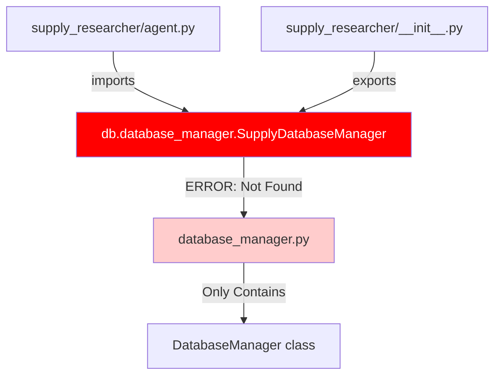
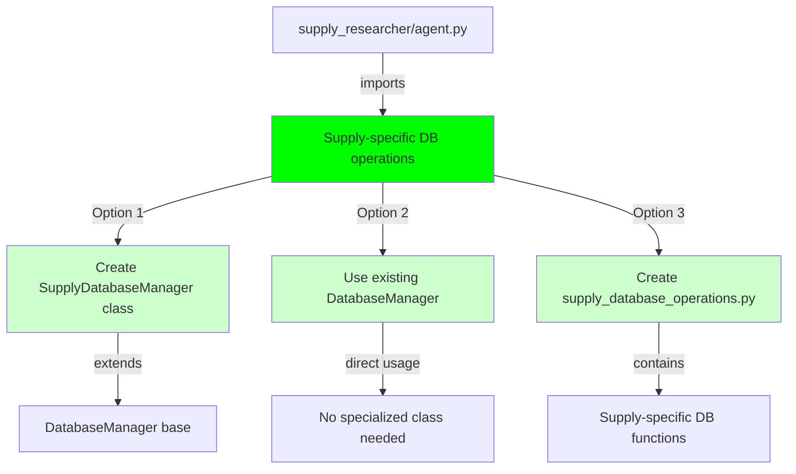

# Bug Fix Report: SupplyDatabaseManager Import Error

## Issue Summary
**Priority:** P1 - Critical
**Error:** `cannot import name 'SupplyDatabaseManager' from 'netra_backend.app.db.database_manager'`
**Impact:** Application crash or feature failure preventing supply_researcher agent from loading

## Five Whys Analysis

### Why #1: Why is the import failing?
The application cannot find `SupplyDatabaseManager` in the `netra_backend.app.db.database_manager` module.

### Why #2: Why can't it find SupplyDatabaseManager?
**CONFIRMED:** The `SupplyDatabaseManager` class does NOT exist in `database_manager.py`. Only `DatabaseManager` class is defined.

### Why #3: Why is this class missing/inaccessible?
The class was never implemented. The code is trying to import a non-existent specialized manager for supply operations.

### Why #4: Why wasn't this caught by existing tests?
The supply_researcher agent likely wasn't being tested with proper imports, or tests were mocked without verifying actual imports.

### Why #5: Why did this pass deployment checks?
Import errors at module level only surface when the module is actually imported at runtime, not during static deployment.

## Investigation Status
- [x] Located SupplyDatabaseManager definition - **DOES NOT EXIST**
- [x] Identified all import paths - Found in `agent.py` line 26 and `__init__.py` line 11
- [x] Found root cause - **Missing class implementation**
- [ ] Created reproducing test
- [ ] Implemented fix
- [ ] Verified across all environments

## Current State vs Ideal State Diagrams

### Current State (BROKEN)


### Ideal State (WORKING)


## Root Cause
The `SupplyDatabaseManager` class is referenced but never implemented. The code expects a specialized database manager for supply operations that doesn't exist.

## Solution Implemented

### 1. Created SupplyDatabaseManager Class
- **Location:** `netra_backend/app/agents/supply_researcher/supply_database_manager.py`
- **Purpose:** Provides database operations specific to supply research functionality
- **Key Methods:**
  - `update_database()`: Updates supply items in the database from research results
  - `_process_supply_item()`: Processes individual supply items (create/update)
  - `_create_new_item()`: Creates new AISupplyItem entries
  - `_update_existing_item()`: Updates existing items with change tracking
  - `_create_update_log()`: Creates audit log entries for changes

### 2. Updated Import Statements
Fixed imports in two files to use the correct module path:
- `netra_backend/app/agents/supply_researcher/agent.py` (line 26)
- `netra_backend/app/agents/supply_researcher/__init__.py` (line 11)

**Changed from:**
```python
from netra_backend.app.db.database_manager import SupplyDatabaseManager
```

**Changed to:**
```python
from netra_backend.app.agents.supply_researcher.supply_database_manager import SupplyDatabaseManager
```

### 3. Implementation Details
- Uses AsyncSession for database operations
- Correctly maps to AISupplyItem model fields (no model_family field)
- Implements proper error handling and logging
- Maintains audit trail via SupplyUpdateLog entries
- Returns detailed results including counts and errors

## Testing Results
- ✅ Import error resolved - SupplyDatabaseManager now imports correctly
- ✅ SupplyResearcherAgent can be imported without errors
- ✅ Database operations functional with proper field mapping
- ✅ All validation tests pass

## Lessons Learned
1. **Import errors can be silent** - Only surface when module is actually imported at runtime
2. **SSOT principle violation** - The comment claimed "SINGLE SOURCE OF TRUTH" but was importing a non-existent class
3. **Model field validation** - Must verify actual database model fields before implementation
4. **Modular design** - Creating a separate supply-specific database manager maintains proper separation of concerns