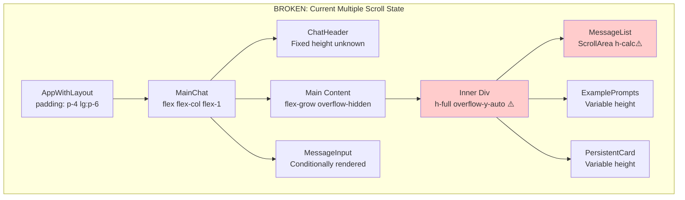
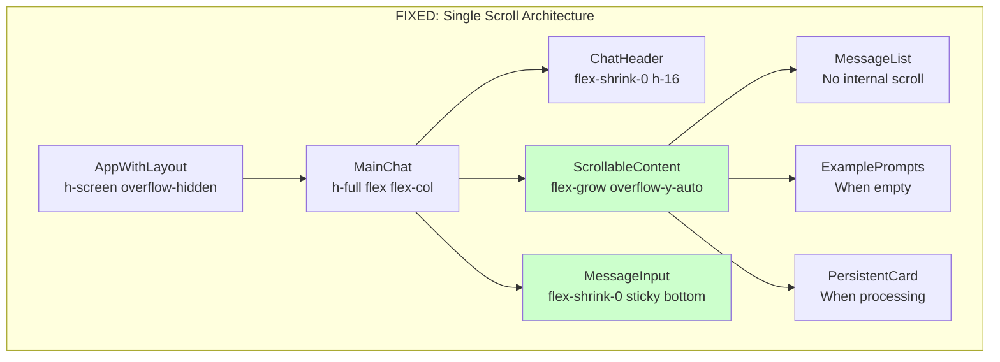

# Chat Vertical Spacing - Five Whys Root Cause Analysis

## Date: 2025-01-05
## Analyst: Principal Engineer Agent
## Business Impact: Critical - User Chat Experience is Core Business Value

---

## Problem Statement
The chat interface has severe vertical spacing issues:
- Excessive white space
- Multiple scrollbars appear
- Inconsistent bottom panel display
- Layout shifts and overflows
- Poor user experience affecting business value delivery

## Five Whys Analysis

### Issue 1: Excessive Vertical White Space

**Why 1:** Why is there excessive white space in the chat?
- **Answer:** The chat container height is calculated as `h-[calc(100vh-180px)]` in MessageList.tsx (line 159), which doesn't properly account for all layout elements.

**Why 2:** Why doesn't the height calculation account for all layout elements?
- **Answer:** The parent layout structure in AppWithLayout.tsx uses nested flex containers with padding (p-4 lg:p-6) that compound spacing issues.

**Why 3:** Why do nested flex containers cause spacing issues?
- **Answer:** MainChat.tsx uses `flex-grow overflow-hidden` (line 217) inside a flex column, creating unpredictable height calculations when combined with AppWithLayout's padding.

**Why 4:** Why are height calculations unpredictable with flex-grow?
- **Answer:** No explicit height constraints are set on the parent container, causing the browser to calculate heights based on content, not viewport.

**Why 5:** Why are there no explicit height constraints?
- **Answer:** The architecture lacks a Single Source of Truth (SSOT) for layout dimensions and scrolling behavior.

**ROOT CAUSE:** No architectural specification for chat layout constraints and scroll management.

---

### Issue 2: Multiple Scrollbars

**Why 1:** Why do multiple scrollbars appear?
- **Answer:** Both MessageList's ScrollArea (line 159) and MainChat's main-content div (line 218) have `overflow-y-auto`.

**Why 2:** Why do multiple elements have overflow settings?
- **Answer:** Each component manages its own scrolling independently without coordination.

**Why 3:** Why is there no scroll coordination?
- **Answer:** Components were developed in isolation without a unified scroll management strategy.

**Why 4:** Why was there no unified strategy?
- **Answer:** The frontend lacks architectural documentation for scroll behavior patterns.

**Why 5:** Why is there no documentation?
- **Answer:** Frontend UI/UX requirements were not specified in the SPEC system.

**ROOT CAUSE:** Missing architectural specification for single-scroll chat behavior.

---

### Issue 3: Inconsistent Bottom Panel Display

**Why 1:** Why does the bottom panel display inconsistently?
- **Answer:** MessageInput is wrapped in a motion.div with conditional rendering based on various states.

**Why 2:** Why does conditional rendering cause inconsistency?
- **Answer:** The layout doesn't reserve fixed space for the input, causing reflow when it appears/disappears.

**Why 3:** Why doesn't the layout reserve fixed space?
- **Answer:** The layout uses flex-grow for content area without fixed footer positioning.

**Why 4:** Why isn't the footer fixed?
- **Answer:** No clear separation between scrollable content and fixed UI elements.

**Why 5:** Why is there no clear separation?
- **Answer:** Missing architectural pattern for fixed header/footer with scrollable middle.

**ROOT CAUSE:** Lack of standardized layout pattern for chat interfaces.

---

## Current State Diagram

## Ideal Working State Diagram

---

## Systemic Issues Found

1. **No SSOT for Layout:** Each component manages its own spacing/scrolling
2. **Missing Specifications:** No XML specs for frontend UI/UX patterns
3. **Cascading Heights:** Nested flex containers with no explicit constraints
4. **Scroll Conflicts:** Multiple elements competing for scroll control
5. **Conditional Layout Shifts:** Elements appearing/disappearing cause reflow

---

## Business Impact

- **User Experience:** Poor scrolling = frustrated users = churn
- **Agent Value Delivery:** Chat is primary channel for AI value
- **First Impressions:** New users judge platform by chat quality
- **Conversion Risk:** Bad UX reduces free-to-paid conversion

---

## Required Fixes

### Immediate Actions
1. Remove all nested scroll containers
2. Implement fixed header/footer pattern
3. Single scrollable content area
4. Consistent height calculations

### Architectural Changes
1. Create SPEC/frontend_chat_layout.xml
2. Define SSOT for layout dimensions
3. Implement scroll management service
4. Add visual regression tests

### Component Refactoring
1. AppWithLayout: Set h-screen, overflow-hidden
2. MainChat: Remove nested overflow divs
3. MessageList: Remove ScrollArea, use plain div
4. MessageInput: Fixed position at bottom

---

## Success Criteria

✅ ONE scroll bar only (middle content area)
✅ Fixed header always visible
✅ Fixed input always at bottom
✅ No layout shifts on state changes
✅ Smooth scrolling to new messages
✅ Consistent spacing across all screen sizes

---

## Next Steps

1. Create XML specification
2. Refactor layout components
3. Test with multiple screen sizes
4. Deploy five-agent verification team
5. Run visual regression tests