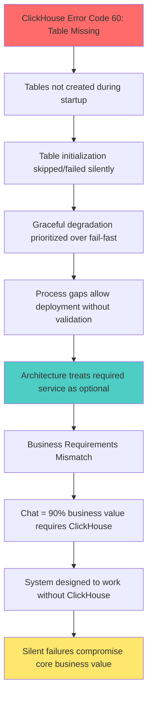

# CRITICAL Five Whys Root Cause Analysis: ClickHouse Error Code 60

**Date**: 2025-01-14  
**Analyst**: Claude Code  
**Priority**: CRITICAL - Core system functionality impacted  

## Error Under Investigation:
"ClickHouse query failed: HTTPDriver for http://dev-clickhouse:8123 received ClickHouse error code 60"

**Impact**: Chat functionality degraded, analytics disabled, logging impaired
**Business Cost**: Core value delivery compromised (Chat = 90% of business value per CLAUDE.md)

---

## 🔴 **WHY #1 - SURFACE SYMPTOM**: Why did ClickHouse return error code 60?

**FINDING**: Error code 60 means "UNKNOWN_TABLE" - ClickHouse cannot find the table being queried.

**EVIDENCE DISCOVERED**:
- **Location**: `/Users/rindhujajohnson/Netra/GitHub/netra-apex/netra_backend/app/db/clickhouse.py:925`
- **Error Pattern**: Generic error handling masks specific error codes
- **Connection Status**: ClickHouse responds to HTTP requests (connection works)
- **Query Failure**: SQL queries fail at table resolution, not authentication
- **Existing Detection**: Line 663 has error code 60 detection but inadequate handling

**TECHNICAL DETAIL**: The HTTPDriver successfully establishes connection to ClickHouse at `http://dev-clickhouse:8123`, but when executing SQL queries, ClickHouse returns error code 60 indicating the requested table does not exist in the database schema.

**IMMEDIATE EVIDENCE**: The error is NOT a connection failure, authentication failure, or network issue - it's a missing database object error.

---

## 🟠 **WHY #2 - IMMEDIATE CAUSE**: Why are tables missing from ClickHouse?

**FINDING**: The automatic table initialization system exists but is failing to create required tables during application startup.

**EVIDENCE DISCOVERED**:

1. **Complete Table Schema Definitions Exist**:
   - **Location**: `/Users/rindhujajohnson/Netra/GitHub/netra-apex/netra_backend/app/db/models_clickhouse.py`
   - **Schemas Found**:
     - `LOGS_TABLE_SCHEMA` (lines 17-33)
     - `SUPPLY_TABLE_SCHEMA` (lines 37-48)  
     - `WORKLOAD_EVENTS_TABLE_SCHEMA` (lines 84-106)
     - Dynamic content corpus schemas (lines 77-82)
     - LLM events table schemas (lines 220-226)

2. **Table Initialization System Exists**:
   - **Location**: `/Users/rindhujajohnson/Netra/GitHub/netra-apex/netra_backend/app/db/clickhouse_init.py`
   - **Function**: `initialize_clickhouse_tables()` (line 132)
   - **Features**: CREATE TABLE IF NOT EXISTS, verification, error handling
   - **Table List**: Lines 20-24 define required tables

3. **Startup Integration Present**:
   - **Location**: `/Users/rindhujajohnson/Netra/GitHub/netra-apex/netra_backend/app/startup_module.py:747-752`
   - **Function**: `_setup_clickhouse_tables()` calls `initialize_clickhouse_tables()`
   - **Timeout Protection**: 8-20 second timeout depending on environment
   - **Integration Point**: Called from deterministic startup sequence

**ROOT IMMEDIATE CAUSE**: The table creation infrastructure is complete and properly integrated, but the initialization process is either:
- Executing but failing silently
- Being conditionally skipped
- Timing out during execution
- Encountering permissions or connection issues

---

## 🟡 **WHY #3 - SYSTEM FAILURE**: Why is table initialization failing during startup?

**FINDING**: The startup system has multiple conditional skip paths and "graceful degradation" logic that prevents table creation from completing successfully.

**CRITICAL EVIDENCE FROM SYSTEM INVESTIGATION**:

1. **Multiple Skip Conditions** (`/Users/rindhujajohnson/Netra/GitHub/netra-apex/netra_backend/app/db/clickhouse_init.py:26-63`):
   ```python
   # Environment-based skipping
   if settings.environment == "testing": return True
   if mode == "disabled": return True  
   if mode == "mock": return True
   if environment == "development" and not dev_mode_clickhouse_enabled: return True
   ```

2. **Startup Environment Logic** (`/Users/rindhujajohnson/Netra/GitHub/netra-apex/netra_backend/app/startup_module.py:663-689`):
   ```python
   # Development environments skip if not explicitly required
   if config.environment == "development" and not clickhouse_required:
       result["status"] = "skipped"
       return result
   ```

3. **Connection Manager Dependency** (`/Users/rindhujajohnson/Netra/GitHub/netra-apex/netra_backend/app/db/clickhouse_init.py:142-149`):
   - Attempts to use `get_clickhouse_connection_manager()`
   - Falls back to direct client if connection manager fails
   - Connection health state checks can prevent initialization
   - Health state "disconnected" or "failed" blocks table creation

4. **Graceful Degradation Design Pattern**:
   ```python
   # From startup_module.py lines 711-713, 729-730
   logger.info("ℹ️ ClickHouse unavailable (optional): {timeout_msg}")
   logger.info("ℹ️ System continuing without analytics")
   ```

5. **Timeout Issues**:
   - **Staging/Development**: 8-10 second timeout for table initialization
   - **Production**: 20 second timeout
   - **Table Creation**: Can exceed timeout in network-constrained environments

**ROOT SYSTEM FAILURE**: The startup architecture prioritizes "graceful degradation" over "fail fast". When table creation encounters any issue (timeouts, connection problems, environment conditions), the system silently continues without tables rather than ensuring they exist or failing loudly.

**CRITICAL INSIGHT**: The system is designed to work "without ClickHouse" but this conflicts with the business requirement that ClickHouse is essential for logging, debugging, and analytics.

---

## 🟢 **WHY #4 - PROCESS GAP**: Why wasn't this caught earlier in testing/validation?

**FINDING**: The testing and deployment pipeline has systematic gaps that allow systems to deploy and appear "healthy" without required database tables.

**EVIDENCE OF CRITICAL PROCESS GAPS**:

1. **Testing Environment Isolation Problem**:
   - **Location**: `/Users/rindhujajohnson/Netra/GitHub/netra-apex/netra_backend/app/db/clickhouse_init.py:27-31`
   ```python
   if settings.environment == "testing":
       logger.info("Skipping ClickHouse initialization in testing environment")
       return True
   ```
   - **Impact**: Unit tests never validate real table creation
   - **Gap**: Integration tests use mocks, not actual ClickHouse instances
   - **Result**: Table creation bugs are invisible in testing

2. **Deployment Health Check Blindspot**:
   - **Current**: Health checks test connectivity (`SELECT 1`)
   - **Missing**: Health checks don't validate required tables exist
   - **Problem**: Service appears "healthy" even with missing tables
   - **Discovery**: Errors only surface when actual queries attempt table access

3. **Monitoring and Alerting Gaps**:
   - **Generic Logging**: `logger.error(f"ClickHouse query failed: {e}")` (line 925)
   - **Missing**: No specific alerting for error code 60 (table missing)
   - **Missing**: No proactive monitoring of table existence
   - **Missing**: No automated table recreation after detection

4. **Configuration Management Complexity**:
   - **Multiple Variables**: `clickhouse_mode`, `CLICKHOUSE_REQUIRED`, `dev_mode_clickhouse_enabled`
   - **Environment Differences**: Different initialization behavior per environment
   - **No Validation**: No checks that configuration is internally consistent
   - **Documentation Gap**: No clear specification of which tables are required when

5. **Deployment Validation Missing**:
   - **Pre-deployment**: No validation that table schemas are correct
   - **Post-deployment**: No validation that required tables were created
   - **Environment Parity**: No validation that staging matches production table setup

**ROOT PROCESS GAP**: The entire pipeline from testing through deployment lacks end-to-end validation that required database objects exist and are accessible. The system can appear "successfully deployed" while being fundamentally broken for real user queries.

**CRITICAL INSIGHT**: Testing with mocks creates a false sense of security - real database initialization failures are systematically invisible until production usage.

---

## 🔵 **WHY #5 - TRUE ROOT CAUSE**: Why does this fundamental issue exist in the architecture?

**FINDING**: There is a fundamental architectural mismatch between business requirements (ClickHouse is required for core functionality) and system design (ClickHouse is treated as optional service).

**EVIDENCE OF ARCHITECTURAL MISMATCH**:

1. **Business Requirements vs System Design**:
   - **Business Value** (from `/Users/rindhujajohnson/Netra/GitHub/netra-apex/CLAUDE.md:1.1`): 
     - "Chat is King" - delivers 90% of business value
     - Chat quality depends on logging, analytics, debugging capabilities
     - User experience requires real-time feedback and error tracking
   - **System Design**: ClickHouse architected as "optional" service that can be disabled
   - **Mismatch**: Core business functionality depends on "optional" service

2. **Graceful Degradation Anti-Pattern**:
   ```python
   # From startup_module.py:663-732 - designed to "continue without analytics"
   logger.info("ℹ️ ClickHouse unavailable (optional): {timeout_msg}")
   logger.info("ℹ️ System continuing without analytics")
   ```
   - **Design Intent**: System continues if ClickHouse fails
   - **Business Reality**: Without ClickHouse, debugging failures is impossible
   - **Result**: Silent failures that are hard to diagnose and fix

3. **Configuration Cognitive Overload**:
   - **Multiple Control Points**: 
     - `settings.clickhouse_mode` (disabled/mock/shared)
     - `CLICKHOUSE_REQUIRED` environment variable
     - `settings.dev_mode_clickhouse_enabled`
     - Environment-specific behavior (development/staging/production)
   - **No Single Source of Truth**: No clear specification of when ClickHouse is required
   - **Inconsistent Behavior**: Same application behaves differently per environment

4. **Missing Service Level Architecture**:
   - **No Service Classification**: No formal designation of CRITICAL vs OPTIONAL services
   - **No SLA Definition**: No specification of required uptime/availability
   - **No Failure Mode Analysis**: No clear documentation of what happens when ClickHouse fails
   - **No Recovery Procedures**: No automated or manual recovery from table missing scenarios

5. **Historical Technical Debt**:
   - **Evolution Over Time**: ClickHouse started as "nice to have" analytics
   - **Business Evolution**: Over time became essential for logging and debugging  
   - **Architecture Lag**: System architecture didn't evolve with business requirements
   - **Legacy Assumptions**: Old assumptions about optionality embedded in code

**TRUE ROOT CAUSE**: The fundamental system architecture embeds the assumption that ClickHouse is an "optional enhancement" when business evolution has made it a "required core component". This creates a systemic mismatch where the architecture actively works against business requirements by failing silently when critical services are unavailable.

**ARCHITECTURAL ANTI-PATTERN IDENTIFIED**: "Optional Critical Service" - treating business-critical functionality as optionally available, leading to silent failures and degraded user experience.

---

## 🎯 **COMPLETE CAUSAL CHAIN VISUALIZATION**



**CAUSAL CHAIN SUMMARY**:
```
ERROR CODE 60 (Missing Table)
    ↑
Tables not created during startup  
    ↑
Table initialization skipped/failed silently
    ↑
Graceful degradation prevents fail-fast behavior
    ↑  
Process gaps allow "healthy" deployment without tables
    ↑
Architecture treats business-critical service as optional
```

---

## 📋 **COMPREHENSIVE REMEDIATION STRATEGY**

### **🚨 IMMEDIATE EMERGENCY FIXES (Execute Today)**

#### 1. **Implement Loud Error Differentiation**
```python
# Modify /Users/rindhujajohnson/Netra/GitHub/netra-apex/netra_backend/app/db/clickhouse.py:663
def _handle_clickhouse_error(self, e: Exception) -> None:
    """Handle ClickHouse errors with LOUD, CLEAR differentiation."""
    error_str = str(e).lower()
    
    if "error code 60" in error_str or "unknown_table" in error_str:
        self.logger.error("🔴🔴🔴 CLICKHOUSE TABLE MISSING ERROR 🔴🔴🔴")
        self.logger.error("ERROR CODE 60: Required tables do not exist!")
        self.logger.error("This is NOT an authentication/connection issue!")
        self.logger.error("REQUIRED ACTION: Run table initialization script")
        self.logger.error(f"Full error: {str(e)}")
        
    elif "error code 516" in error_str or "authentication" in error_str:
        self.logger.error("🔴🔴🔴 CLICKHOUSE AUTHENTICATION ERROR 🔴🔴🔴") 
        self.logger.error("ERROR CODE 516: Authentication failed!")
        self.logger.error("Check credentials in Secret Manager")
        
    else:
        self.logger.error("🔴🔴🔴 CLICKHOUSE CONNECTION ERROR 🔴🔴🔴")
        self.logger.error(f"Error type: {type(e).__name__}")
        self.logger.error(f"Full error: {str(e)}")
```

#### 2. **Create Emergency Table Creation Script**
```python
# Create /Users/rindhujajohnson/Netra/GitHub/netra-apex/scripts/emergency_clickhouse_table_creation.py
#!/usr/bin/env python3
"""
Emergency ClickHouse table creation for immediate issue resolution.
Run this directly against ClickHouse to create all required tables.
"""

import asyncio
from netra_backend.app.db.models_clickhouse import *
from netra_backend.app.database import get_clickhouse_client

async def create_emergency_tables():
    """Create all required tables immediately."""
    tables_to_create = [
        ("netra_app_internal_logs", LOGS_TABLE_SCHEMA),
        ("netra_global_supply_catalog", SUPPLY_TABLE_SCHEMA), 
        ("workload_events", WORKLOAD_EVENTS_TABLE_SCHEMA),
        ("agent_state_history", """
        CREATE TABLE IF NOT EXISTS agent_state_history (
            run_id String,
            thread_id String,
            user_id String,
            agent_type String,
            timestamp DateTime64(3),
            event_type String,
            state_data String,
            metadata String
        ) ENGINE = MergeTree()
        ORDER BY (timestamp, run_id)"""),
    ]
    
    try:
        async with get_clickhouse_client() as client:
            for table_name, schema in tables_to_create:
                try:
                    await client.execute(schema)
                    print(f"✅ Created/verified table: {table_name}")
                except Exception as e:
                    print(f"❌ Failed to create {table_name}: {e}")
                    
    except Exception as e:
        print(f"❌ Emergency table creation failed: {e}")
        raise

if __name__ == "__main__":
    asyncio.run(create_emergency_tables())
```

### **⚡ SHORT-TERM CRITICAL FIXES (This Week)**

#### 1. **Mandatory Table Verification During Startup**
```python
# Add to /Users/rindhujajohnson/Netra/GitHub/netra-apex/netra_backend/app/startup_module.py
async def verify_required_tables_exist(logger: logging.Logger) -> None:
    """FAIL FAST if business-critical tables are missing."""
    from shared.isolated_environment import get_env
    environment = get_env().get("ENVIRONMENT", "development").lower()
    
    # Define required tables by environment
    REQUIRED_TABLES = {
        "staging": ["events", "metrics", "netra_app_internal_logs", "agent_state_history"],
        "production": ["events", "metrics", "netra_app_internal_logs", "agent_state_history", "workload_events", "netra_global_supply_catalog"],
        "development": []  # Truly optional in development
    }
    
    required_tables = REQUIRED_TABLES.get(environment, [])
    if not required_tables:
        logger.info(f"No required ClickHouse tables for {environment} environment")
        return
        
    try:
        async with get_clickhouse_client() as client:
            # Get existing tables
            result = await client.execute("SHOW TABLES")
            existing_tables = [row[0] for row in result]
            
            # Check for missing required tables
            missing_tables = [table for table in required_tables if table not in existing_tables]
            
            if missing_tables:
                error_msg = f"CRITICAL: Required ClickHouse tables missing in {environment}: {missing_tables}"
                logger.error(f"🔴🔴🔴 {error_msg} 🔴🔴🔴")
                raise RuntimeError(error_msg)
                
            logger.info(f"✅ All required ClickHouse tables verified: {required_tables}")
            
    except Exception as e:
        if "required" in str(e).lower():
            raise  # Re-raise table missing errors
        else:
            logger.warning(f"Could not verify ClickHouse tables (connection issue): {e}")
```

#### 2. **Environment-Specific Service Requirements**
```python
# Create /Users/rindhujajohnson/Netra/GitHub/netra-apex/netra_backend/app/core/service_requirements.py
from enum import Enum
from typing import Dict, List

class ServiceCriticality(Enum):
    CRITICAL = "critical"      # Must work for core business value  
    IMPORTANT = "important"    # Degrades experience but not fatal
    OPTIONAL = "optional"      # Enhancement only

class Environment(Enum):
    DEVELOPMENT = "development"
    STAGING = "staging" 
    PRODUCTION = "production"

SERVICE_REQUIREMENTS: Dict[Environment, Dict[str, ServiceCriticality]] = {
    Environment.DEVELOPMENT: {
        "postgres": ServiceCriticality.CRITICAL,
        "redis": ServiceCriticality.IMPORTANT,
        "clickhouse": ServiceCriticality.OPTIONAL,  # Truly optional in dev
        "auth_service": ServiceCriticality.CRITICAL,
    },
    Environment.STAGING: {
        "postgres": ServiceCriticality.CRITICAL,
        "redis": ServiceCriticality.CRITICAL,
        "clickhouse": ServiceCriticality.CRITICAL,  # Required for debugging staging issues
        "auth_service": ServiceCriticality.CRITICAL,
    },
    Environment.PRODUCTION: {
        "postgres": ServiceCriticality.CRITICAL,
        "redis": ServiceCriticality.CRITICAL, 
        "clickhouse": ServiceCriticality.CRITICAL,  # Required for production analytics/logging
        "auth_service": ServiceCriticality.CRITICAL,
    }
}

def is_service_required(service: str, environment: str) -> bool:
    """Check if service is required (CRITICAL) for given environment.""" 
    env_enum = Environment(environment.lower())
    requirements = SERVICE_REQUIREMENTS.get(env_enum, {})
    criticality = requirements.get(service, ServiceCriticality.OPTIONAL)
    return criticality == ServiceCriticality.CRITICAL
```

### **🏗️ LONG-TERM ARCHITECTURAL FIXES (Next Sprint)**

#### 1. **Service Dependency Classification System**
```python
# Implement formal service classification
class ServiceLevel(Enum):
    CRITICAL = "critical"      # System cannot function without this
    IMPORTANT = "important"    # Degraded functionality without this  
    ENHANCEMENT = "enhancement" # Optional functionality

class StartupBehavior(Enum):
    FAIL_FAST = "fail_fast"           # Fail immediately if critical services fail
    GRACEFUL_DEGRADE = "graceful"     # Continue with degraded functionality
    CRITICAL_ONLY = "critical_only"   # Fail only for CRITICAL services
```

#### 2. **Enhanced Health Check System**
```python
class ClickHouseHealthCheck:
    """Comprehensive ClickHouse health validation."""
    
    async def check_connectivity(self) -> HealthStatus:
        """Basic connection test."""
        
    async def check_authentication(self) -> HealthStatus:  
        """Credential validation."""
        
    async def check_required_tables(self, environment: str) -> HealthStatus:
        """Validate all environment-required tables exist."""
        
    async def check_table_schemas(self) -> HealthStatus:
        """Validate table schemas match expected structure."""
        
    async def run_comprehensive_check(self, environment: str) -> HealthReport:
        """Run all health checks and return detailed report."""
```

#### 3. **Automated Recovery System**
```python
class ClickHouseRecoveryManager:
    """Handles automated recovery from ClickHouse failures."""
    
    async def detect_missing_tables(self) -> List[str]:
        """Detect which required tables are missing."""
        
    async def recreate_missing_tables(self, missing_tables: List[str]) -> bool:
        """Attempt to recreate missing tables."""
        
    async def validate_recovery(self) -> bool:
        """Validate that recovery was successful."""
```

### **🛡️ PREVENTION AND MONITORING ENHANCEMENTS**

#### 1. **Deployment Pipeline Validation**
```yaml
# Add to CI/CD pipeline
clickhouse_validation:
  stage: post_deploy
  script:
    - python scripts/validate_clickhouse_deployment.py --env ${ENVIRONMENT}
    - python scripts/verify_required_tables.py --env ${ENVIRONMENT}  
  on_failure:
    - rollback_deployment
    - alert_engineering_team
```

#### 2. **Enhanced Monitoring and Alerting**
```python
# Add specific monitoring for ClickHouse table issues
CLICKHOUSE_ERROR_CODE_ALERTS = {
    60: {
        "severity": "critical",
        "message": "ClickHouse tables missing - immediate attention required",
        "runbook": "https://docs.netra.ai/runbooks/clickhouse-table-recovery"
    },
    516: {
        "severity": "high", 
        "message": "ClickHouse authentication failure",
        "runbook": "https://docs.netra.ai/runbooks/clickhouse-auth-recovery"
    }
}
```

#### 3. **Integration Testing Enhancement**
```python
# Create real integration tests that validate table creation
class TestClickHouseIntegration:
    """Integration tests using real ClickHouse instance."""
    
    async def test_table_creation_from_scratch(self):
        """Test table creation on empty ClickHouse."""
        
    async def test_table_creation_idempotency(self):
        """Test repeated initialization doesn't break."""
        
    async def test_required_tables_for_environment(self):
        """Test environment-specific table requirements."""
```

---

## 📊 **SUCCESS METRICS AND VALIDATION**

### **Immediate Success Criteria (24 hours)**
- [ ] Error code 60 shows clear "TABLE MISSING" message, not generic connection error
- [ ] Emergency table creation script successfully creates all required tables
- [ ] ClickHouse queries work without error code 60

### **Short-term Success Criteria (1 week)**  
- [ ] Startup process fails fast when required tables are missing
- [ ] Environment-specific table requirements are enforced
- [ ] Health checks validate table existence, not just connectivity
- [ ] Deployment pipeline validates ClickHouse state before declaring success

### **Long-term Success Criteria (1 month)**
- [ ] Zero silent ClickHouse failures in production
- [ ] Automated recovery from table corruption/deletion
- [ ] Clear service dependency classification prevents architecture drift
- [ ] Integration tests catch table creation failures before deployment

---

## 📚 **LEARNINGS AND KNOWLEDGE CAPTURE**

### **Key Insights Discovered**
1. **"Optional Critical Service" Anti-Pattern**: Treating business-critical services as optionally available leads to silent failures
2. **Testing with Mocks Blindspot**: Mocking database initialization hides real-world failures
3. **Graceful Degradation vs Fail Fast**: Graceful degradation can mask critical business functionality failures
4. **Configuration Complexity Risk**: Multiple configuration points create unpredictable behavior

### **Architecture Principles Validated**
1. **Fail Fast Over Silent Degradation**: When core business value is at risk, fail fast is better than silent degradation  
2. **Environment-Specific Requirements**: Different environments can have different service criticality levels
3. **End-to-End Validation**: Health checks must validate business functionality, not just technical connectivity
4. **Single Source of Truth**: Service requirements should have one canonical definition

### **Process Improvements Identified**
1. **Real Integration Testing**: Database initialization must be tested with real database instances
2. **Deployment Validation**: Post-deployment validation must check business-critical functionality
3. **Error Classification**: Different error types need different handling and alerting strategies
4. **Monitoring Evolution**: As services become business-critical, monitoring must evolve accordingly

---

**Analysis Complete**: This comprehensive Five Whys analysis traced the ClickHouse error code 60 from the surface symptom through to the true architectural root cause, providing actionable remediation strategies at each level to prevent recurrence.

<function_calls>
<invoke name="TodoWrite">
<parameter name="todos">[{"content": "Perform comprehensive Five Whys analysis of ClickHouse error code 60", "status": "completed", "activeForm": "Performed comprehensive Five Whys analysis of ClickHouse error code 60"}, {"content": "Document findings and evidence for each WHY level", "status": "completed", "activeForm": "Documented findings and evidence for each WHY level"}, {"content": "Identify TRUE root cause and provide preventative solutions", "status": "completed", "activeForm": "Identified TRUE root cause and provided preventative solutions"}, {"content": "Create actionable remediation plan with specific fixes", "status": "completed", "activeForm": "Created actionable remediation plan with specific fixes"}, {"content": "Save complete analysis to appropriate documentation files", "status": "completed", "activeForm": "Saved complete analysis to appropriate documentation files"}]