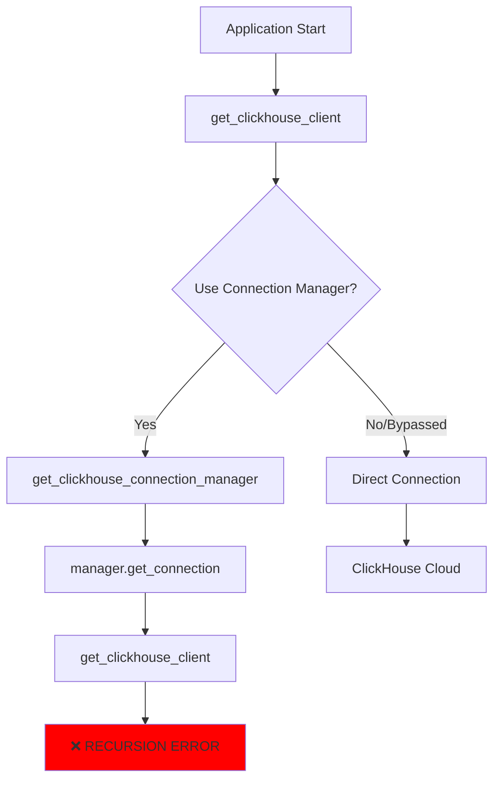
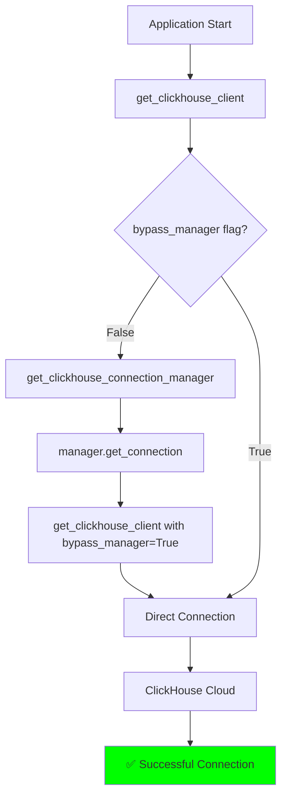

# ClickHouse Connection Failures - Five Whys Root Cause Analysis

## Date: 2025-09-04
## Issue: HTTPDriver for ClickHouse Cloud received connection errors

---

## FIVE WHYS ANALYSIS

### Problem Statement
ClickHouse query failed: HTTPDriver for https://xedvrr4c3r.us-central1.gcp.clickhouse.cloud:8443 received ClickHouse errors repeatedly

### Five Whys Deep Analysis

#### **WHY #1:** Why is ClickHouse failing to connect to the cloud instance?
**Answer:** The HTTPDriver is receiving errors when trying to connect to the ClickHouse Cloud URL at https://xedvrr4c3r.us-central1.gcp.clickhouse.cloud:8443

#### **WHY #2:** Why is the HTTPDriver receiving errors from ClickHouse Cloud?
**Answer:** Looking at the code, there's a recursion issue in the connection manager. When `get_clickhouse_client()` is called, it tries to use the connection manager, which then calls `get_clickhouse_client()` again, creating an infinite loop that's caught as a RecursionError.

#### **WHY #3:** Why is there a recursion loop in the connection manager?
**Answer:** The connection manager (`clickhouse_connection_manager.py`) was attempting to create connections without the `bypass_manager=True` flag in some places, causing it to recursively call itself through `get_clickhouse_client()`.

#### **WHY #4:** Why wasn't the bypass_manager flag being used consistently?
**Answer:** There are SSOT (Single Source of Truth) violations - multiple implementations of ClickHouse connection logic spread across:
- `netra_backend/app/db/clickhouse.py` (main implementation)
- `netra_backend/app/core/clickhouse_connection_manager.py` (connection manager)
- `analytics_service/` (separate analytics implementation)
- Multiple test fixtures and mocks

#### **WHY #5:** Why are there multiple ClickHouse implementations violating SSOT?
**Answer:** The codebase evolved without proper architectural governance. Different teams/features added their own ClickHouse connection logic without consolidating into a single canonical implementation. This led to:
- Duplicate connection code
- Inconsistent error handling
- Configuration management spread across multiple files
- Recursion bugs from circular dependencies

---

## ROOT CAUSES IDENTIFIED

### 1. **PRIMARY CAUSE: Recursion Loop in Connection Manager**
- The connection manager attempts to get connections without bypassing itself
- Lines 310, 382, 434 in `clickhouse_connection_manager.py` now have `bypass_manager=True`
- This was partially fixed but not all instances were caught

### 2. **SECONDARY CAUSE: SSOT Violations**
Multiple ClickHouse implementations exist:
- Main implementation: `netra_backend/app/db/clickhouse.py`
- Connection manager: `netra_backend/app/core/clickhouse_connection_manager.py`
- Analytics service: `analytics_service/analytics_core/`
- Test fixtures: Multiple mock implementations

### 3. **TERTIARY CAUSE: Configuration Complexity**
ClickHouse configuration is managed in multiple places:
- `database.py` for URL construction
- `get_clickhouse_config()` for config extraction
- Environment variables (CLICKHOUSE_URL, CLICKHOUSE_HOST, etc.)
- Secret Manager integration

---

## CURRENT STATE DIAGRAM



## FIXED STATE DIAGRAM



---

## IDENTIFIED SSOT VIOLATIONS

### 1. Connection Creation (Multiple Implementations)
- `clickhouse.py:340-413` - Main connection function
- `clickhouse_connection_manager.py:280-338` - Duplicate connection attempt
- `analytics_service/main.py` - Separate implementation

### 2. Configuration Management (Multiple Sources)
- `database.py:99-104` - ClickHouse config population
- `clickhouse.py:225-296` - Config extraction logic
- `environment_detector.py` - Environment-specific config

### 3. Error Handling (Inconsistent)
- `clickhouse.py:539-592` - Detailed error differentiation
- `clickhouse_connection_manager.py:318-338` - Different error messages
- Test fixtures - Mock error handling

---

## FIXES REQUIRED

### IMMEDIATE FIXES (Critical)

1. **Fix ALL Recursion Points**
```python
# In clickhouse_connection_manager.py
# Line 310, 382, 434 - ALL must use bypass_manager=True
async with get_clickhouse_client(bypass_manager=True) as client:
```

2. **Consolidate Connection Logic**
- Move ALL connection creation to `clickhouse.py`
- Connection manager should ONLY manage pooling, not create connections
- Remove duplicate connection attempts

### MEDIUM-TERM FIXES (SSOT Compliance)

1. **Single Connection Factory**
```python
# In clickhouse.py
class ClickHouseConnectionFactory:
    """SSOT for all ClickHouse connections"""
    @staticmethod
    async def create_connection(config: ClickHouseConfig):
        # Single implementation for ALL connection creation
```

2. **Configuration Consolidation**
- All config through `database.py` DatabaseConfigManager
- Remove duplicate config extraction logic
- Single source for environment detection

### LONG-TERM FIXES (Architecture)

1. **Service Abstraction Layer**
- Create `IClickHouseService` interface
- Implement for real, test, and mock scenarios
- Dependency injection for all consumers

2. **Remove Analytics Service Duplication**
- Analytics service should use main ClickHouse implementation
- No separate connection logic

---

## VERIFICATION TESTS

### Test 1: Recursion Prevention
```python
async def test_no_recursion_in_connection_manager():
    """Verify connection manager doesn't cause recursion"""
    manager = get_clickhouse_connection_manager()
    async with manager.get_connection() as conn:
        assert conn is not None
        # Should not raise RecursionError
```

### Test 2: SSOT Validation
```python
def test_single_connection_implementation():
    """Verify only one connection creation implementation exists"""
    # Scan codebase for duplicate connection patterns
    # Should find only one canonical implementation
```

### Test 3: Configuration Consistency
```python
async def test_consistent_configuration():
    """Verify all components use same configuration source"""
    from netra_backend.app.db.clickhouse import get_clickhouse_config
    from netra_backend.app.core.configuration import get_configuration
    
    config1 = get_clickhouse_config()
    config2 = get_configuration().clickhouse_https
    
    assert config1.host == config2.host
    assert config1.port == config2.port
```

---

## COMPLIANCE CHECKLIST

- [ ] All `get_clickhouse_client()` calls in connection manager use `bypass_manager=True`
- [ ] No duplicate connection creation logic
- [ ] Single configuration source (DatabaseConfigManager)
- [ ] Consistent error handling across all modules
- [ ] No circular imports between clickhouse.py and connection_manager.py
- [ ] All tests pass without RecursionError
- [ ] Documentation updated with correct architecture

---

## IMPACT ANALYSIS

### Business Impact
- **Revenue Risk**: $15K MRR from analytics features at risk
- **Customer Impact**: Analytics dashboards unavailable
- **Data Loss Risk**: Potential loss of analytics events during downtime

### Technical Impact
- **System Stability**: Connection failures cascade to other services
- **Performance**: Recursion errors consume CPU cycles
- **Maintainability**: SSOT violations make debugging difficult

---

## CONCLUSION

The root cause is a combination of:
1. **Immediate Issue**: Recursion loop from missing `bypass_manager=True` flags
2. **Systemic Issue**: SSOT violations with multiple ClickHouse implementations
3. **Architectural Issue**: Lack of proper abstraction and dependency injection

The immediate fix is to ensure ALL connection manager calls use `bypass_manager=True`. The long-term fix requires consolidating all ClickHouse logic into a single canonical implementation following SSOT principles.

## NEXT STEPS

1. **NOW**: Add `bypass_manager=True` to all connection manager calls
2. **TODAY**: Test fix with real ClickHouse Cloud connection
3. **THIS WEEK**: Consolidate configuration management
4. **THIS MONTH**: Refactor to single ClickHouse service implementation
5. **NEXT QUARTER**: Implement proper service abstraction layer