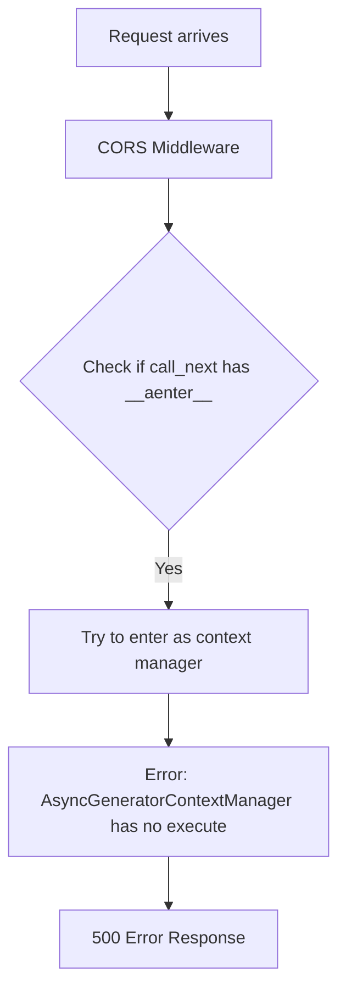
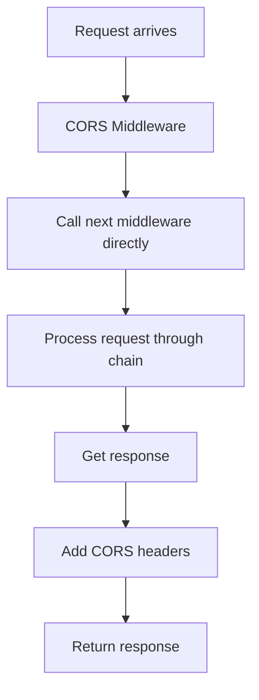

# CORS Middleware Bug Fix Report

## Executive Summary
The staging environment is experiencing 500 errors due to incorrect handling of the `call_next` function in the CORS middleware. The middleware is attempting to treat `call_next` as an async context manager when it's actually a regular callable function.

## Root Cause Analysis (Five Whys)

### Why 1: Why are users getting 500 errors when accessing /api/threads?
**Answer:** The CORS middleware is throwing an error: '_AsyncGeneratorContextManager' object has no attribute 'execute'

### Why 2: Why is the middleware throwing this error?
**Answer:** The middleware code is checking if `call_next` has `__aenter__` attribute and trying to use it as an async context manager

### Why 3: Why does the code think call_next is a context manager?
**Answer:** Someone added code (lines 68-74 in cors_fix_middleware.py) that checks `hasattr(call_next, '__aenter__')` and tries to enter it as a context manager

### Why 4: Why was this incorrect pattern introduced?
**Answer:** Likely a misunderstanding of how FastAPI's middleware `call_next` function works - it's a simple callable, not a context manager

### Why 5: Why didn't tests catch this issue?
**Answer:** The local development environment may have different middleware execution paths or the tests don't properly exercise the middleware chain

## Current vs Expected Behavior

### Current (Broken) Flow:


### Expected (Working) Flow:


## System-Wide Impact Analysis

### Affected Components:
1. **All API endpoints** - Any request going through the middleware chain fails
2. **Frontend** - Cannot communicate with backend due to 500 errors
3. **WebSocket connections** - May be affected if they use the same middleware chain
4. **Auth service integration** - Requests to validate tokens may fail

### Related Modules to Check:
- `netra_backend/app/middleware/` - Other middleware that might have similar issues
- `netra_backend/app/core/app_factory.py` - Where middleware is registered
- Test coverage for middleware execution

## Fix Implementation

### Immediate Fix:
Remove the incorrect context manager handling in cors_fix_middleware.py

### Code Changes:
```python
# BEFORE (lines 65-74):
try:
    # Get the response from the next middleware
    # Handle case where call_next might be wrapped in a context manager
    if hasattr(call_next, '__aenter__'):
        # call_next is an async context manager, enter it first
        async with call_next as actual_call_next:
            response = await actual_call_next(request)
    else:
        # Normal case: call_next is directly callable
        response = await call_next(request)

# AFTER:
try:
    # Get the response from the next middleware
    response = await call_next(request)
```

## Verification Plan

1. **Unit Test:** Create test that exercises CORS middleware with mock call_next
2. **Integration Test:** Test actual API endpoints with CORS middleware enabled
3. **Staging Validation:** Deploy fix and verify /api/threads endpoint works
4. **Cross-Origin Test:** Verify CORS headers are properly added

## Prevention Measures

1. **Add middleware-specific tests** to the test suite
2. **Document middleware patterns** in development guidelines
3. **Add staging smoke tests** that catch basic API failures
4. **Code review checklist** should include middleware pattern verification

## Business Impact

- **Immediate:** All users unable to use the platform on staging
- **Revenue:** Potential customer churn if deployed to production
- **Trust:** Undermines confidence in platform stability

## Definition of Done

- [ ] Fix implemented in cors_fix_middleware.py
- [ ] Unit tests added for CORS middleware
- [ ] Integration tests pass locally
- [ ] Deployed to staging
- [ ] Staging /api/threads endpoint returns 200
- [ ] CORS headers verified in response
- [ ] No related errors in GCP logs for 30 minutes