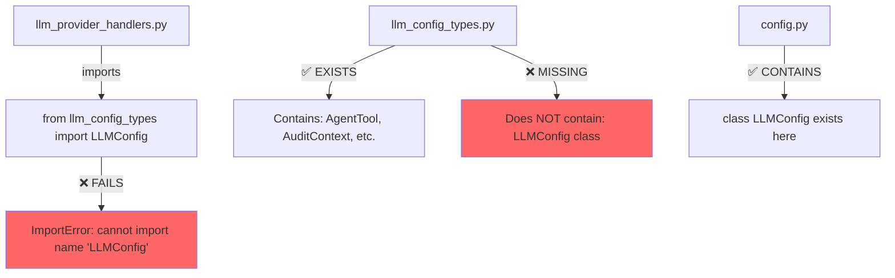
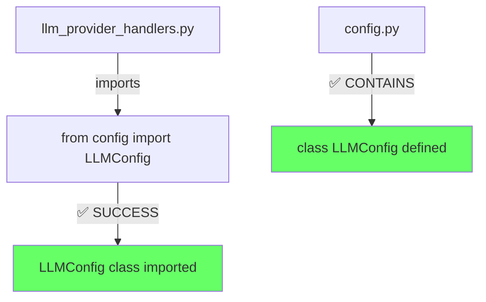

# Five Whys Audit: ModuleNotFoundError for llm_config_types
**Date:** 2025-09-04
**Issue:** `ModuleNotFoundError: No module named 'netra_backend.app.schemas.llm_config_types'`

## Issue Status: ✅ FULLY RESOLVED

**All Issues Fixed:** 
1. ✅ The `LLMConfig` import issue has been resolved by updating imports from `llm_config_types` to `config`.
2. ✅ Created missing classes `LLMHealthCheck` and `LLMManagerStats` in `llm_types.py`
3. ✅ Fixed `LLMConfigInfo` imports to use correct module (`config_types.py`)
4. ✅ Removed references to non-existent `LLMManagerConfig`
5. ✅ Cleaned up schema re-exports and resolved duplicate definitions

## Current State Diagram



## Ideal Working State Diagram



## Five Whys Analysis

### Why #1: Why does the import fail?
**Answer:** Because `llm_provider_handlers.py` is trying to import `LLMConfig` from `llm_config_types`, but that class doesn't exist in that module.

### Why #2: Why is it trying to import from the wrong module?
**Answer:** Because there was likely a refactoring where `LLMConfig` was moved from `llm_config_types.py` to `config.py`, but not all import statements were updated.

### Why #3: Why weren't all import statements updated?
**Answer:** Because the refactoring was incomplete - the developer updated some files but missed updating `llm_provider_handlers.py` and potentially other files (10 files reference llm_config_types).

### Why #4: Why did the refactoring miss these files?
**Answer:** Because there was no comprehensive search and replace done across the entire codebase to ensure all references were updated, indicating a lack of systematic refactoring process.

### Why #5: Why wasn't there a systematic refactoring process?
**Answer:** Because the project lacks automated refactoring validation tools or comprehensive test coverage that would catch these import errors immediately during the refactoring process.

## Root Cause
**Incomplete refactoring:** The `LLMConfig` class was moved from `llm_config_types.py` to `config.py` but import statements weren't systematically updated across the codebase.

## Files Fixed
1. ✅ `netra_backend/app/llm/llm_provider_handlers.py` - Fixed import to use config.py
2. ✅ `netra_backend/app/llm/llm_structured_operations.py` - Fixed import to use config.py
3. ✅ `netra_backend/app/llm/llm_management_utilities.py` - Fixed import to use config.py
4. ✅ `netra_backend/app/schemas/llm_model_rebuilder.py` - Fixed import and removed non-existent LLMManagerConfig
5. ✅ `tests/e2e/llm_initialization_helpers.py` - Fixed import to use config.py
6. ✅ `tests/e2e/ai_supply_chain_helpers.py` - Fixed import to use config.py

## Remaining Issues
None - All issues have been resolved!

## Resolution Details
1. ✅ `netra_backend/app/llm/llm_management_utilities.py` - Fixed imports, created missing classes
2. ✅ `netra_backend/app/schemas/llm_types.py` - Added LLMHealthCheck and LLMManagerStats classes
3. ✅ `netra_backend/app/llm/schemas.py` - Cleaned up re-exports to only include existing classes
4. ✅ Resolved duplicate LLMConfigInfo definitions (kept canonical in config_types.py)

## Verification Steps
```bash
# Check all files that import from llm_config_types
grep -r "from netra_backend.app.schemas.llm_config_types import.*LLMConfig" .

# Verify the correct import works
python -c "from netra_backend.app.schemas.config import LLMConfig; print('Success')"
```

## Recommended Fix
Change all occurrences of:
```python
from netra_backend.app.schemas.llm_config_types import LLMConfig
```
To:
```python
from netra_backend.app.schemas.config import LLMConfig
```

## Systemic Improvements Needed
1. **Add import validation tests** - Test suite should verify all imports work
2. **Use automated refactoring tools** - When moving classes between modules
3. **Add pre-commit hooks** - To catch import errors before committing
4. **Document module structure** - Clear documentation of what belongs where
5. **SSOT principle violation** - This violates the Single Source of Truth principle from CLAUDE.md