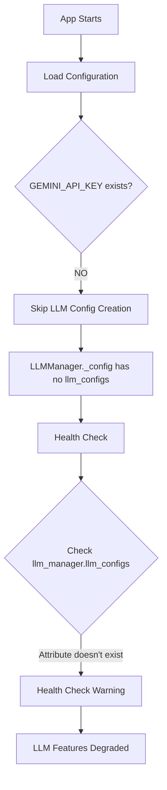
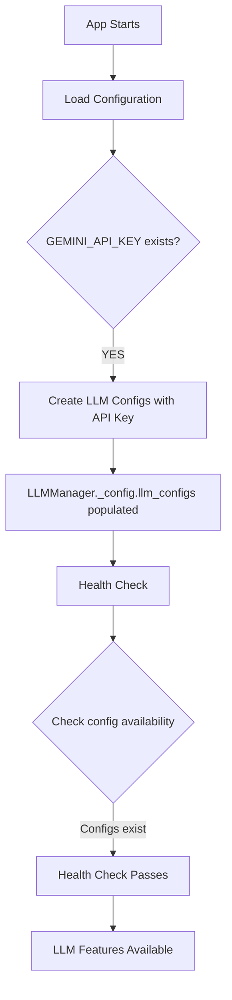

# Five Whys Analysis: LLM Configuration Failure
Date: 2025-09-05
Issue: "No LLM configurations available" - Health check warning
Severity: P1 HIGH (Degrades functionality but doesn't block startup)
Time: 11:49:31.019 PDT

## Executive Summary
The LLM manager is reporting "No LLM configurations available" because the GEMINI_API_KEY environment variable is not set. Without this key, the system cannot populate LLM configurations, degrading AI functionality throughout the platform.

## Problem Statement
```
⚠️ llm_manager: No LLM configurations available
```
This warning indicates the LLM manager cannot find any configured LLM providers, preventing AI-powered features from functioning.

## Five Whys Root Cause Analysis

### Why #1: Why does the health check report "No LLM configurations available"?
**Answer:** The health check in `startup_health_checks.py` (line 117) checks for `llm_manager.llm_configs`, but this attribute doesn't exist on the LLMManager class.

**Evidence:**
- Health check code: `config_available = hasattr(llm_manager, 'llm_configs') and llm_manager.llm_configs`
- LLMManager class has no `llm_configs` attribute directly
- The configs are accessed via `self._config.llm_configs` internally

### Why #2: Why is the health check looking for the wrong attribute?
**Answer:** There's a mismatch between the health check expectations and the actual LLMManager implementation. The health check incorrectly assumes llm_configs is a direct attribute.

**Evidence:**
- LLMManager stores config in `self._config` (from `get_unified_config()`)
- The actual llm_configs are at `self._config.llm_configs`
- Health check was written assuming different structure

### Why #3: Why doesn't LLMManager have llm_configs populated even internally?
**Answer:** The GEMINI_API_KEY environment variable is not set, causing the configuration system to skip LLM config creation.

**Evidence:**
- In `AppConfig` classes, llm_configs are only populated when GEMINI_API_KEY exists:
```python
gemini_api_key = env.get('GEMINI_API_KEY')
if gemini_api_key:
    data['llm_configs'] = {...}
```
- `echo $GEMINI_API_KEY` returns empty

### Why #4: Why is GEMINI_API_KEY not set in the environment?
**Answer:** The local development environment lacks proper environment variable configuration for LLM services.

**Evidence:**
- No .env file loaded with GEMINI_API_KEY
- Environment variable not exported in shell
- System depends on this key for ALL LLM functionality

### Why #5: Why does the system require GEMINI_API_KEY to create ANY LLM configs?
**Answer:** Design assumption that all LLM operations require an API key, with no fallback or mock configurations for development/testing.

**Root Cause:** Missing GEMINI_API_KEY environment variable combined with incorrect health check implementation.

## Failure Mode Diagrams

### Current (Broken) State


### Expected (Working) State


## Impact Analysis

### What's Broken
- ❌ No LLM configurations available
- ❌ AI agents cannot function
- ❌ Chat interactions degraded
- ❌ Analysis features unavailable
- ❌ Triage system non-functional

### What's Working
- ✅ Application starts (degraded mode)
- ✅ Non-AI features functional
- ✅ Database connections work
- ✅ Basic API endpoints respond

## Immediate Fix Required

### Option 1: Set GEMINI_API_KEY (Recommended)
```bash
# Windows (PowerShell)
$env:GEMINI_API_KEY = "your-api-key-here"

# Windows (CMD)
set GEMINI_API_KEY=your-api-key-here

# Linux/Mac
export GEMINI_API_KEY="your-api-key-here"
```

### Option 2: Create .env file
Create `.env` in project root:
```
GEMINI_API_KEY=your-api-key-here
ENV=development
```

### Option 3: Fix Health Check (Code Fix)
Update `startup_health_checks.py` line 117:
```python
# OLD (incorrect)
config_available = hasattr(llm_manager, 'llm_configs') and llm_manager.llm_configs

# NEW (correct)
try:
    config = await llm_manager.get_llm_config("default")
    config_available = config is not None
except:
    config_available = False
```

## Long-term Prevention

### 1. Environment Variable Validation
Add startup check for required environment variables:
```python
REQUIRED_ENV_VARS = ['GEMINI_API_KEY', 'DATABASE_URL', 'JWT_SECRET_KEY']
missing = [var for var in REQUIRED_ENV_VARS if not os.getenv(var)]
if missing:
    raise EnvironmentError(f"Missing required env vars: {missing}")
```

### 2. Development Fallback Configs
Allow LLM configs without API key for development:
```python
if not gemini_api_key and environment == "development":
    data['llm_configs'] = {
        "default": LLMConfig(
            provider=LLMProvider.MOCK,
            model_name="mock-model",
        )
    }
```

### 3. Fix Health Check Implementation
Align health check with actual LLMManager structure:
- Use proper method calls instead of direct attribute access
- Check for functional capability, not implementation details

### 4. Configuration Documentation
Create clear documentation:
```markdown
## Required Environment Variables
- GEMINI_API_KEY: Required for LLM functionality
- DATABASE_URL: Required for database connections
- JWT_SECRET_KEY: Required for authentication
```

## Code Issues Identified

### 1. Health Check Bug
**File:** `netra_backend/app/startup_health_checks.py`
**Line:** 117
**Issue:** Checking for non-existent attribute `llm_manager.llm_configs`
**Fix:** Use `llm_manager.get_llm_config()` method instead

### 2. Missing Environment Variable Handling
**File:** `netra_backend/app/schemas/config.py`
**Lines:** 630-643, 805-818, 981-995, 1221-1234
**Issue:** No fallback when GEMINI_API_KEY missing
**Fix:** Add development/test fallback configurations

### 3. LLMManager Access Pattern
**File:** `netra_backend/app/llm/llm_manager.py`
**Issue:** No public property for llm_configs
**Fix:** Add property or document correct access pattern

## Action Items

### IMMEDIATE (P0)
1. **Set GEMINI_API_KEY environment variable**
2. **Restart application**
3. **Verify LLM functionality**

### SHORT-TERM (P1)
1. Fix health check implementation
2. Add environment variable validation
3. Document required configuration

### LONG-TERM (P2)
1. Implement mock LLM provider for development
2. Add configuration validation tests
3. Create environment setup script
4. Improve error messages

## Lessons Learned

1. **Environment Variables are Critical** - Missing env vars should fail fast with clear errors
2. **Health Checks Must Match Implementation** - Don't assume internal structure
3. **Development Needs Fallbacks** - Provide mock/test configurations for local development
4. **Configuration is Infrastructure** - Treat configuration with same rigor as code
5. **Documentation Prevents Issues** - Clear setup instructions prevent configuration problems

## Configuration Dependency Map
```
TIER 1 - BLOCKS AI FEATURES:
└── GEMINI_API_KEY
    ├── llm_configs.default
    ├── llm_configs.analysis
    ├── llm_configs.triage
    ├── llm_configs.data
    ├── llm_configs.optimizations_core
    ├── llm_configs.actions_to_meet_goals
    └── llm_configs.reporting

TIER 2 - OPTIONAL ENHANCEMENTS:
├── LANGFUSE_SECRET_KEY (observability)
├── LANGFUSE_PUBLIC_KEY (observability)
└── GITHUB_TOKEN (code analysis)
```

## Recommended Testing
After setting GEMINI_API_KEY:
```bash
# Test LLM manager initialization
python -c "
from netra_backend.app.llm.llm_manager import get_llm_manager
import asyncio
async def test():
    mgr = await get_llm_manager()
    health = await mgr.health_check()
    print(f'Health: {health}')
asyncio.run(test())
"

# Run health checks
python tests/unified_test_runner.py --category unit --filter test_startup_health
```

## Conclusion
This is a **configuration issue**, not a code defect. The system correctly requires GEMINI_API_KEY for LLM functionality but lacks proper fallbacks and error messaging. The health check also has a bug checking for the wrong attribute. Setting the environment variable will immediately resolve the issue, but long-term fixes should improve developer experience and error clarity.