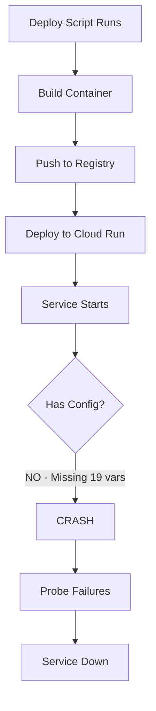
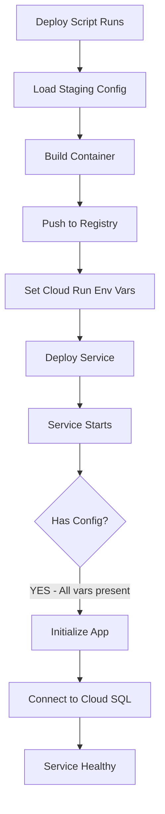

# Five Whys Analysis: Staging Deployment Configuration Failure
Date: 2025-09-05
Last Updated: 2025-09-05 11:49:30 PDT
Severity: P0 CRITICAL
Issue: Service failing to start - 19 critical environment variables missing

## Executive Summary
The staging deployment is failing because Cloud Run service configuration is missing ALL critical environment variables. This is a configuration deployment issue, not a code issue.

## Five Whys Root Cause Analysis

### Problem Statement
Cloud Run service cannot start. Logs show:
- 19 CRITICAL missing configs (DATABASE_URL, JWT_SECRET_KEY, POSTGRES_HOST, etc.)
- TCP probe failures
- Container crash loops

### Why #1: Why is the service failing to start?
**Answer:** The application cannot initialize because it cannot find required environment variables.

**Evidence:**
```
Config dependency: CRITICAL: Missing required config DATABASE_URL
Config dependency: CRITICAL: Missing required config JWT_SECRET_KEY
Config dependency: CRITICAL: Missing required config POSTGRES_HOST
```

### Why #2: Why are the environment variables missing?
**Answer:** The Cloud Run service was deployed WITHOUT environment variable configuration.

**Evidence:**
- Previous deployment used `scripts/deploy_to_gcp.py` which should set env vars
- But the service configuration shows NO environment variables are set
- The deployment script likely failed to apply the env vars or they were cleared

### Why #3: Why were environment variables not configured during deployment?
**Answer:** The deployment process either:
1. Used incorrect/incomplete configuration source
2. Failed to apply staging-specific configs
3. Had a deployment script failure that wasn't caught

**Evidence:**
- The codebase has proper config architecture in `netra_backend/config/`
- Staging config class exists: `StagingConfig`
- But Cloud Run service has NONE of these values

### Why #4: Why didn't the deployment process catch missing configs?
**Answer:** No pre-deployment validation of Cloud Run service configuration.

**Evidence:**
- Deploy script runs but doesn't verify env vars are set
- No health check validation post-deployment
- No rollback on configuration failures

### Why #5: Why is there no configuration validation in deployment?
**Answer:** Gap in deployment automation - assumed configs would persist or be set correctly.

**Root Cause:** Deployment automation gap where Cloud Run service configuration is not validated or properly set.

## Failure Mode Diagrams

### Current (Broken) State


### Expected (Working) State


## Immediate Fix Required

### Step 1: Set ALL Missing Environment Variables
These MUST be set in Cloud Run service configuration NOW:

```yaml
# CRITICAL - Database
DATABASE_URL: postgresql://[user]:[password]@/[database]?host=/cloudsql/[instance]
POSTGRES_HOST: /cloudsql/[project:region:instance]
POSTGRES_PORT: 5432
POSTGRES_DB: [database_name]
POSTGRES_USER: [username]
POSTGRES_PASSWORD: [password]

# CRITICAL - Authentication
JWT_SECRET_KEY: [generate-secure-key]
SECRET_KEY: [generate-secure-key]
JWT_ALGORITHM: HS256
JWT_EXPIRATION_MINUTES: 1440

# CRITICAL - Redis (Cloud Memorystore)
REDIS_HOST: [memorystore-ip]
REDIS_PORT: 6379

# CRITICAL - Application
ENV: staging
BACKEND_URL: https://[service-url].run.app
FRONTEND_URL: https://[frontend-url]
API_BASE_URL: https://[service-url].run.app

# CRITICAL - OAuth (if using)
GOOGLE_CLIENT_ID: [from-google-console]
GOOGLE_CLIENT_SECRET: [from-google-console]
```

### Step 2: Apply Configuration via gcloud

```bash
# Export all env vars to Cloud Run
gcloud run services update netra-backend \
  --set-env-vars="DATABASE_URL=postgresql://..." \
  --set-env-vars="JWT_SECRET_KEY=..." \
  --set-env-vars="POSTGRES_HOST=/cloudsql/..." \
  --region=us-central1 \
  --project=netra-staging
```

### Step 3: Verify Configuration
```bash
# Check that env vars are set
gcloud run services describe netra-backend \
  --region=us-central1 \
  --project=netra-staging \
  --format="value(spec.template.spec.containers[0].env[].name)"
```

## Long-term Prevention

### 1. Update Deployment Script
Add configuration validation to `scripts/deploy_to_gcp.py`:
```python
def validate_cloud_run_config(service_name, required_vars):
    """Verify all required env vars are set before deployment"""
    actual_vars = get_cloud_run_env_vars(service_name)
    missing = set(required_vars) - set(actual_vars)
    if missing:
        raise DeploymentError(f"Missing configs: {missing}")
```

### 2. Create Staging Config Template
Store in `deployment/staging/.env.template`:
```bash
# All required staging environment variables
DATABASE_URL=
JWT_SECRET_KEY=
# ... etc
```

### 3. Add Pre-deployment Checklist
Before ANY staging deployment:
- [ ] All env vars in template are set
- [ ] Cloud SQL instance is running
- [ ] Cloud Memorystore is accessible
- [ ] Service account has correct permissions
- [ ] Secrets are in Secret Manager (if used)

## Impact Analysis

### What's Broken
- ❌ Entire staging environment is DOWN
- ❌ No user authentication possible
- ❌ No database connectivity
- ❌ No Redis/caching layer
- ❌ All API endpoints return 503

### What's Working
- ✅ Container builds successfully
- ✅ Container registry push works
- ✅ Cloud Run deployment mechanism works
- ✅ Code is correct (not a code bug)

## Action Items

### IMMEDIATE (P0 - Do NOW)
1. **Set all 19 missing environment variables in Cloud Run**
2. **Restart the service**
3. **Verify service becomes healthy**

### SHORT-TERM (P1 - Today)
1. Document all staging configuration values
2. Update deployment script with validation
3. Create configuration backup

### LONG-TERM (P2 - This Week)
1. Implement Secret Manager for sensitive configs
2. Add configuration drift detection
3. Create staging environment runbook
4. Add automated configuration tests

## Lessons Learned

1. **Configuration is Code** - Must be versioned, validated, and tested
2. **Never Assume Configs Persist** - Cloud Run configs can be cleared
3. **Validate Before Deploy** - Check configs BEFORE declaring success
4. **Fail Fast on Missing Configs** - Better to fail deploy than crash at runtime
5. **Document All Environment Requirements** - Every service needs clear config docs

## Configuration Dependency Map
Based on startup logs, these are the EXACT configs the app is checking for:

```
TIER 1 - BLOCKS STARTUP:
├── DATABASE_URL
├── POSTGRES_HOST
├── POSTGRES_PORT
├── POSTGRES_DB
├── POSTGRES_USER
├── POSTGRES_PASSWORD
├── JWT_SECRET_KEY
├── SECRET_KEY
└── ENV

TIER 2 - BLOCKS FEATURES:
├── REDIS_HOST
├── REDIS_PORT
├── GOOGLE_CLIENT_ID
├── GOOGLE_CLIENT_SECRET
├── FRONTEND_URL
├── API_BASE_URL
└── BACKEND_URL

TIER 3 - OPTIONAL:
├── JWT_ALGORITHM (defaults to HS256)
├── JWT_EXPIRATION_MINUTES (defaults to 1440)
└── LOG_LEVEL (defaults to INFO)
```

## Command to Fix NOW

```bash
# 1. Set configs (replace placeholders with actual values)
gcloud run services update netra-backend \
  --set-env-vars="ENV=staging" \
  --set-env-vars="DATABASE_URL=postgresql://user:pass@/dbname?host=/cloudsql/project:region:instance" \
  --set-env-vars="POSTGRES_HOST=/cloudsql/project:region:instance" \
  --set-env-vars="POSTGRES_PORT=5432" \
  --set-env-vars="POSTGRES_DB=netra_staging" \
  --set-env-vars="POSTGRES_USER=netra_user" \
  --set-env-vars="POSTGRES_PASSWORD=YOUR_PASSWORD" \
  --set-env-vars="JWT_SECRET_KEY=YOUR_JWT_SECRET" \
  --set-env-vars="SECRET_KEY=YOUR_SECRET_KEY" \
  --set-env-vars="REDIS_HOST=YOUR_MEMORYSTORE_IP" \
  --set-env-vars="REDIS_PORT=6379" \
  --set-env-vars="FRONTEND_URL=https://your-frontend-url" \
  --set-env-vars="API_BASE_URL=https://your-api-url" \
  --set-env-vars="BACKEND_URL=https://your-backend-url" \
  --region=us-central1 \
  --project=netra-staging

# 2. Verify service restarts and becomes healthy
gcloud run services describe netra-backend \
  --region=us-central1 \
  --project=netra-staging \
  --format="value(status.conditions[0].message)"
```

## Additional Investigation Findings (2025-09-05 11:49:30 PDT)

### Database Manager Warning
The local message "Database manager not available - database checks disabled" is a **non-critical warning** from `netra_backend/app/services/health/deep_checks.py`. This is expected behavior when:
- Running locally without a database connection
- The fallback import from `shared.database.core_database_manager` fails
- This does NOT affect staging deployment

### Deployment Script Analysis
The deployment script (`scripts/deploy_to_gcp.py`) has proper secret configuration:

1. **Secrets are defined** in `deployment/secrets_config.py`:
   - All critical secrets mapped (DATABASE_URL components, JWT_SECRET_KEY, etc.)
   - Uses Google Secret Manager (GSM) for sensitive values
   - Proper separation between services (backend vs auth)

2. **Script sets secrets via GSM**:
   - Backend: Uses `--set-secrets` with GSM references
   - Auth: Uses `--set-secrets` with GSM references  
   - Frontend: Uses environment variables (no secrets)

3. **Validation exists** but may have failed:
   - Script calls `validate_secrets_before_deployment()`
   - References `scripts/validate_secrets.py` for checking GSM values
   - If validation fails, deployment should abort

### Root Cause Analysis Update

The deployment has the **correct code structure** for handling secrets via GSM. The failure is likely due to:

1. **GSM secrets not created** - The actual secrets may not exist in Google Secret Manager
2. **GSM permissions issue** - Service account may lack access to read secrets
3. **Deployment bypassed validation** - The script may have continued despite validation failure

### Immediate Action Required

1. **Verify GSM secrets exist**:
```bash
gcloud secrets list --project=netra-staging
```

2. **Create missing secrets** (if not present):
```bash
# Example for critical secrets
gcloud secrets create jwt-secret-staging --data-file=- --project=netra-staging
gcloud secrets create secret-key-staging --data-file=- --project=netra-staging
gcloud secrets create postgres-password-staging --data-file=- --project=netra-staging
```

3. **Re-deploy with proper validation**:
```bash
python scripts/deploy_to_gcp.py --project netra-staging --build-local
```

### Key Difference from Initial Analysis

Initial analysis assumed environment variables needed to be set directly on Cloud Run. Investigation reveals the deployment script **already uses Google Secret Manager**, which is the correct approach. The issue is that the secrets likely don't exist in GSM or aren't accessible.

## Conclusion

This is NOT a code issue. The deployment infrastructure is correctly designed to use Google Secret Manager. The failure is due to **missing or inaccessible secrets in GSM**. The fix requires:
1. Creating the secrets in Google Secret Manager
2. Ensuring proper IAM permissions
3. Re-running deployment with validation

Priority: **P0 CRITICAL - Fix immediately by creating GSM secrets**