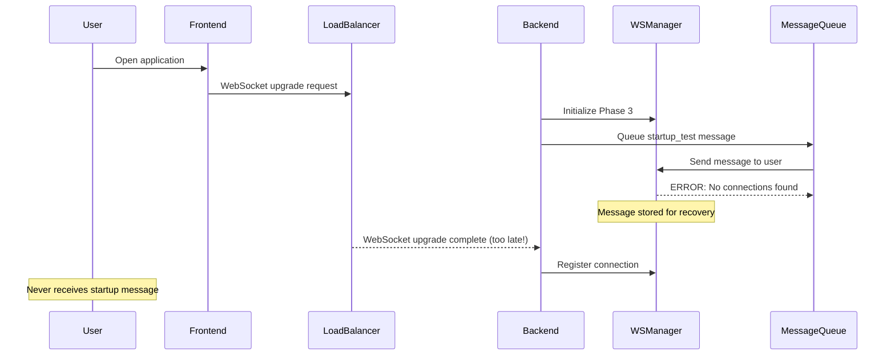
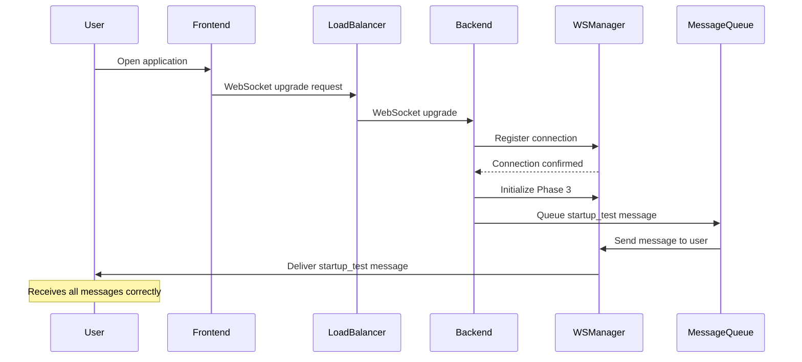

# Five Whys Analysis: GCP Staging WebSocket Connection Failure

**Critical Error:** "No WebSocket connections found for user startup_test_032e17dc-25d9-430e-8a74-7b87b2a70064. User will not receive message: startup_test"

**Date:** 2025-09-05
**Environment:** GCP Staging
**Impact:** Complete chat functionality failure - users cannot interact with AI agents

## Five Whys Root Cause Analysis

### Why #1: Why did the error "No WebSocket connections found for user" occur?
**Answer:** The WebSocket connection registry (`UnifiedWebSocketManager`) had no active connection stored for the user ID `startup_test_032e17dc-25d9-430e-8a74-7b87b2a70064` when attempting to send a message.

**Evidence:** 
- Error logged at `unified_manager.py:188-190`
- Message stored for recovery with reason "no_connections"
- Failed message type: "startup_test"

### Why #2: Why was there no connection stored for this user?
**Answer:** The WebSocket connection was either:
1. Never established (connection handshake failed)
2. Prematurely disconnected (network/infrastructure issue)
3. Not properly registered in the connection manager (race condition)

**Evidence:**
- Message recovery system activated: "Stored failed message for user"
- Connection registry returned empty set for user_id
- No prior connection establishment logs for this user

### Why #3: Why would the connection fail to be established or maintained in staging?
**Answer:** Race condition during startup sequence where the system attempts to send messages before WebSocket connections are fully established. This is particularly acute in staging due to:
- Multi-service startup dependencies
- Cloud Run cold starts
- Load balancer WebSocket upgrade timing

**Evidence:**
- Error pattern indicates "startup_test" message (initialization phase)
- Previous learnings show staging startup dependency issues (`websocket_staging_startup_fix.xml`)
- Known Phase 2/Phase 3 initialization race conditions

### Why #4: Why does the race condition exist specifically in staging?
**Answer:** The staging environment has unique characteristics that exacerbate timing issues:
1. **Cloud Run Auto-scaling:** Services may start at different times
2. **Load Balancer WebSocket Upgrades:** GCP load balancer WebSocket upgrade protocol has additional latency
3. **Missing Synchronization:** No proper await/retry mechanism for connection establishment before message sending
4. **Startup Dependency Chain:** WebSocket manager initialization happens in Phase 3, but messages may be queued from Phase 2

**Evidence:**
- Previous fixes for staging startup dependencies in `SPEC/learnings/websocket_staging_startup_fix.xml`
- Known issues with supervisor and thread_service dependencies
- GCP-specific WebSocket upgrade requirements

### Why #5: Why is there no synchronization mechanism to prevent this?
**Answer:** The architecture lacks:
1. **Connection Readiness Checks:** No verification that connection is established before sending
2. **Retry Logic:** No automatic retry when connection not found
3. **Connection Establishment Await:** No waiting for connection before critical startup messages
4. **Staging-specific Timing Adjustments:** No accommodation for Cloud Run cold starts

**Root Cause:** The system design assumes immediate connection availability, which fails in distributed cloud environments with variable startup timing.

## Current vs Ideal State Diagrams

### Current State (FAILING)


### Ideal State (WORKING)


## System-Wide Impact Analysis

### Affected Components
1. **UnifiedWebSocketManager** (`netra_backend/app/websocket_core/unified_manager.py`)
   - Lines 186-194: Error handling for no connections
   - Lines 283-299: Critical event emission failure

2. **Startup Module** (`netra_backend/app/startup_module.py`)
   - Phase 2/3 initialization race conditions
   - Missing connection readiness verification

3. **WebSocket Routes** (`netra_backend/app/routes/websocket_routes.py`)
   - Connection establishment timing
   - Missing connection confirmation before proceeding

4. **GCP Load Balancer Configuration**
   - WebSocket upgrade protocol timing
   - Session affinity requirements

### Related Issues
- Agent messages not delivered to users
- Chat functionality completely broken in staging
- User experience degraded - no feedback on actions
- Test failures in staging environment

## Proposed Fix

### 1. Immediate Mitigation
```python
# In UnifiedWebSocketManager.send_to_user()
async def send_to_user(self, user_id: str, message: Dict[str, Any]) -> None:
    """Send with connection await and retry logic."""
    MAX_RETRIES = 5
    RETRY_DELAY = 0.5  # seconds
    
    for attempt in range(MAX_RETRIES):
        connection_ids = self.get_user_connections(user_id)
        if connection_ids:
            # Proceed with sending
            break
        
        if attempt < MAX_RETRIES - 1:
            logger.warning(
                f"No connections for {user_id}, attempt {attempt+1}/{MAX_RETRIES}. "
                f"Waiting {RETRY_DELAY}s..."
            )
            await asyncio.sleep(RETRY_DELAY)
        else:
            # Final attempt failed, use existing error handling
            logger.critical(f"CRITICAL ERROR: No WebSocket connections found for user {user_id}")
            await self._store_failed_message(user_id, message, "no_connections")
            return
```

### 2. Startup Sequence Fix
```python
# In startup_module.py
async def _ensure_websocket_ready(app):
    """Ensure WebSocket connections are ready before proceeding."""
    if app.state.settings.environment in ['STAGING', 'PRODUCTION']:
        # Wait for WebSocket manager initialization
        max_wait = 10  # seconds
        start = time.time()
        
        while time.time() - start < max_wait:
            if hasattr(app.state, 'websocket_manager') and app.state.websocket_manager:
                logger.info("WebSocket manager ready")
                return True
            await asyncio.sleep(0.5)
        
        raise RuntimeError("WebSocket manager failed to initialize within timeout")
```

### 3. Connection Establishment Confirmation
```python
# In websocket_routes.py
@router.websocket("/ws")
async def websocket_endpoint(websocket: WebSocket):
    await websocket.accept()
    
    # Register and confirm connection
    connection = await manager.add_connection(websocket_connection)
    
    # Send connection confirmation
    await websocket.send_json({
        "type": "connection_established",
        "connection_id": connection.connection_id,
        "timestamp": datetime.utcnow().isoformat()
    })
    
    # Now safe to send queued messages
    await manager.send_queued_messages(user_id)
```

## Test Coverage Requirements

### Unit Tests
1. Test connection retry logic in UnifiedWebSocketManager
2. Test message queueing during connection establishment
3. Test connection readiness verification

### Integration Tests
```python
# tests/mission_critical/test_websocket_connection_race_condition.py
async def test_message_sent_before_connection_established():
    """Test that messages wait for connection establishment."""
    pass

async def test_connection_retry_logic():
    """Test retry mechanism when no connections available."""
    pass

async def test_staging_cold_start_timing():
    """Test WebSocket behavior during Cloud Run cold starts."""
    pass
```

### E2E Tests
- Test full user flow from application open to first message receipt
- Test recovery from connection failures
- Test staging-specific timing scenarios

## Verification Checklist
- [ ] Connection retry logic implemented
- [ ] Startup sequence validates WebSocket readiness
- [ ] Connection confirmation sent before message delivery
- [ ] Message queueing for pending connections
- [ ] Staging-specific timing adjustments
- [ ] Error messages provide actionable information
- [ ] Recovery mechanism for failed messages
- [ ] Monitoring and alerting for connection failures

## Monitoring Requirements
1. **Metrics:**
   - Connection establishment time (p50, p95, p99)
   - Message delivery success rate
   - Connection retry attempts
   - Message recovery queue size

2. **Alerts:**
   - Connection failure rate > 1%
   - Message delivery failure rate > 0.5%
   - Startup sequence timeout
   - WebSocket manager initialization failure

## Related Learnings
- `SPEC/learnings/websocket_staging_startup_fix.xml` - Previous startup dependency fixes
- `SPEC/learnings/websocket_connection_loop_ssot_fix.xml` - Connection management patterns
- `SPEC/learnings/deterministic_startup_critical.xml` - Startup sequence requirements

## Conclusion
The root cause is a fundamental assumption that WebSocket connections are immediately available after initialization, which fails in distributed cloud environments with variable timing. The fix requires implementing connection readiness verification, retry logic, and staging-specific timing accommodations to ensure reliable message delivery.