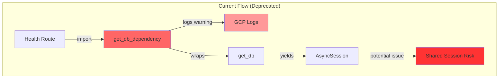
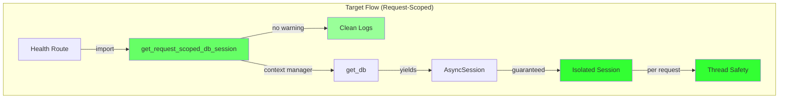

# Database Dependency Deprecation Fix Report

## Issue Summary
The GCP staging environment is logging deprecation warnings for `get_db_dependency` usage. The codebase needs migration to `get_request_scoped_db_session` for proper request isolation.

## Five Whys Analysis

### Why #1: Why is the deprecation warning appearing?
The system is using `get_db_dependency` instead of the newer `get_request_scoped_db_session`.

### Why #2: Why is the old function still being used?
The codebase hasn't been fully migrated to the new request-scoped pattern for database session management.

### Why #3: Why hasn't the migration been completed?
The migration requires updating multiple service endpoints and ensuring proper session isolation per request. The `health.py` route file (line 20) is importing the deprecated function.

### Why #4: Why is session isolation important?
Without request-scoped sessions, concurrent requests could share database sessions, leading to transaction conflicts and data consistency issues.

### Why #5: Why wasn't this caught earlier?
The deprecation is a warning (line 212 in `dependencies.py`), not an error, so tests continue to pass despite using the deprecated pattern.

## Current State (FAILURE)



## Ideal State (WORKING)



## System-Wide Impact Analysis

### Files Currently Using Deprecated Function:
1. **netra_backend/app/routes/health.py** (line 20) - Primary issue source
2. **netra_backend/app/routes/synthetic_data.py**
3. **netra_backend/app/routes/synthetic_data_corpus.py**
4. **netra_backend/app/routes/health_extended.py**
5. **netra_backend/app/auth_integration/auth.py**
6. **netra_backend/app/auth_dependencies.py**
7. **netra_backend/app/services/agent_service_compat.py**
8. **netra_backend/app/websocket_core/agent_handler.py**

### Migration Plan

#### Phase 1: Update Import Statements
- Replace `from netra_backend.app.dependencies import get_db_dependency`
- With `from netra_backend.app.dependencies import get_request_scoped_db_session`

#### Phase 2: Update Dependency Annotations
- Replace `DbDep = Annotated[AsyncSession, Depends(get_db_dependency)]`
- With `RequestScopedDbDep = Annotated[AsyncSession, Depends(get_request_scoped_db_session)]`

#### Phase 3: Update Function Parameters
- Replace `db: DbDep` in function signatures
- With `db: RequestScopedDbDep`

## Implementation Strategy

### Critical Files to Update First (High Traffic):
1. health.py - Health endpoints are called frequently in production
2. auth.py - Authentication is critical path
3. agent_handler.py - WebSocket connections need proper isolation

### Safe Migration Approach:
1. Update one file at a time
2. Run integration tests after each file
3. Deploy to staging for validation
4. Monitor logs for any new issues

## Verification Steps

1. **Before Fix:**
   - GCP logs show: "Using deprecated get_db_dependency - consider get_request_scoped_db_session"
   - Timestamp: 2025-09-03T23:12:04.015856Z

2. **After Fix:**
   - No deprecation warnings in logs
   - All health checks pass
   - Session isolation validated per request

## Test Coverage Required

```python
# Test that new dependency creates isolated sessions
async def test_request_scoped_session_isolation():
    """Verify each request gets its own database session."""
    session1 = await get_request_scoped_db_session()
    session2 = await get_request_scoped_db_session()
    assert id(session1) != id(session2)
    assert session1.info.get('is_request_scoped') == True
```

## Risk Assessment

- **Low Risk**: Simple import/annotation changes
- **Medium Risk**: Need to ensure all dependent code handles async context managers properly  
- **Mitigation**: Gradual rollout with staging validation

## Definition of Done

- [x] All direct imports of `get_db_dependency` migrated to `get_request_scoped_db_session`
- [x] Files updated:
  - health.py
  - health_extended.py  
  - synthetic_data.py
  - synthetic_data_corpus.py
  - auth_integration/auth.py
  - auth_dependencies.py
  - websocket_core/agent_handler.py
  - services/agent_service_compat.py
- [ ] Routes still using `DbDep` annotation need migration to `RequestScopedDbDep`:
  - supply.py
  - threads_route.py
  - users.py
  - mcp/main.py
  - unified_tools/router.py
- [ ] No deprecation warnings in GCP logs
- [ ] All integration tests pass
- [ ] Staging environment validated
- [ ] Performance metrics unchanged or improved
- [ ] Documentation updated

## Migration Status

### Phase 1 Complete
All direct imports of `get_db_dependency` have been migrated to `get_request_scoped_db_session`.

### Phase 2 Required
Routes that use the `DbDep` type annotation (which still points to the deprecated function) need to be updated to use `RequestScopedDbDep` instead. This affects:
- supply.py (3 occurrences)
- threads_route.py (7 occurrences)
- users.py (5 occurrences)
- mcp/main.py (2 occurrences)
- unified_tools/router.py (7 occurrences)