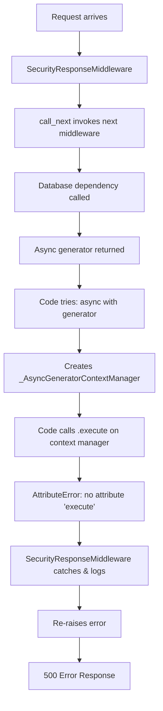

# SecurityResponseMiddleware Bypass Error - Five Whys Analysis

## Executive Summary
The SecurityResponseMiddleware is bypassing error handling due to '_AsyncGeneratorContextManager' object has no attribute 'execute' errors occurring elsewhere in the middleware chain or request processing pipeline. The middleware itself is correctly implemented but defensively logs and re-raises such errors to prevent silent failures.

## Root Cause Analysis - Five Whys

### Why 1: Why is SecurityResponseMiddleware bypassed?
**Answer:** The middleware catches exceptions and re-raises them (line 57) when `call_next(request)` fails with '_AsyncGeneratorContextManager' object has no attribute 'execute' error.

### Why 2: Why does this error occur during request processing?
**Answer:** Database session dependencies somewhere in the request chain are incorrectly treating async generators as async context managers and attempting to call `.execute()` on the wrong object type.

### Why 3: Why are async generators being mistaken for database sessions?
**Answer:** There's a systematic pattern throughout the codebase where functions that yield database sessions (async generators) are being used with `async with` instead of `async for`, causing Python to wrap them in `_AsyncGeneratorContextManager`.

### Why 4: Why was this incorrect pattern introduced?
**Answer:** Developer confusion between three distinct async patterns:
1. **Async Context Managers** - Use `async with`, have `__aenter__` and `__aexit__`
2. **Async Generators** - Use `async for`, created with `yield` in async functions  
3. **FastAPI Dependencies** - Return AsyncGenerators but are consumed differently

The confusion stems from the fact that FastAPI dependency functions return `AsyncGenerator[Session, None]` but internally FastAPI handles them specially, while manual usage requires `async for`.

### Why 5: Why didn't tests catch this issue?
**Answer:** Tests likely mock database sessions directly as AsyncSession objects rather than testing the full dependency injection chain with real async generators. The error only manifests when:
- Real database connections are used
- Multiple middleware are in the chain
- Specific request patterns trigger the problematic code path

## Current vs Expected Behavior

### Current (Broken) Flow:


### Expected (Working) Flow:
```mermaid
graph TD
    A[Request arrives] --> B[SecurityResponseMiddleware]
    B --> C[call_next invokes next middleware]
    C --> D[Database dependency called]
    D --> E[Async generator returned]
    E --> F[FastAPI handles generator correctly]
    F --> G[Session properly injected]
    G --> H[.execute() called on actual session]
    H --> I[Query executes successfully]
    I --> J[Response generated]
    J --> K[SecurityResponseMiddleware processes response]
    K --> L[Response returned with security headers]
```

## Identified Problem Patterns

### Pattern 1: Incorrect Async Generator Usage
```python
# INCORRECT - Causes the error
async def some_function():
    async with get_db() as session:  # get_db() returns AsyncGenerator
        result = await session.execute(query)  # ERROR: _AsyncGeneratorContextManager has no execute

# CORRECT
async def some_function():
    async for session in get_db():  # Properly iterate over generator
        result = await session.execute(query)
        break  # If only one session needed
```

### Pattern 2: Middleware Checking for Context Manager
```python
# PROBLEMATIC - Found in CORS middleware
if hasattr(call_next, '__aenter__'):
    async with call_next as actual_call_next:  # Treats callable as context manager
        response = await actual_call_next(request)
```

### Pattern 3: Mixed Dependency Patterns
```python
# Confusing pattern in dependencies
async def get_db() -> AsyncGenerator[AsyncSession, None]:
    async with async_session_maker() as session:  # Context manager
        yield session  # Makes it a generator

# Consumer confusion
# FastAPI handles this correctly internally
# But manual usage requires async for, not async with
```

## System-Wide Impact

### Affected Components:
1. **All API endpoints using database sessions** - Any endpoint with database dependencies could trigger this
2. **Middleware chain** - Error propagates through entire middleware stack
3. **WebSocket handlers** - If they share session management code
4. **Background tasks** - If they incorrectly handle async sessions

### Critical Code Locations:
- `netra_backend/app/dependencies.py` - Database session management
- `netra_backend/app/middleware/` - All middleware implementations
- `netra_backend/app/database.py` - Core database utilities
- Any route handler with `Depends(get_db)` or similar

## Immediate Actions Required

### 1. Audit Database Session Usage
```bash
# Find all potential problem areas
grep -r "async with.*get_db\|async with.*get.*session" netra_backend/
grep -r "\.execute\(" netra_backend/ | grep -v test
```

### 2. Fix Identified Patterns
- Replace `async with get_db()` with `async for session in get_db()`
- Remove any `hasattr(call_next, '__aenter__')` checks in middleware
- Ensure all database session dependencies return proper types

### 3. Add Defensive Checks
```python
def validate_session(session):
    """Validate that we have an actual AsyncSession, not a context manager."""
    if not hasattr(session, 'execute'):
        raise TypeError(f"Expected AsyncSession with execute method, got {type(session)}")
    return session
```

## Long-term Prevention

### 1. Type Checking
- Enable strict mypy checking for async patterns
- Add runtime type validation for critical paths
- Use proper type hints: `AsyncGenerator[AsyncSession, None]` vs `AsyncContextManager[AsyncSession]`

### 2. Testing Improvements
- Test with real database connections, not mocks
- Add integration tests for full middleware chain
- Create specific tests for async generator handling

### 3. Developer Education
- Document the three async patterns clearly
- Add linting rules to catch common mistakes
- Create helper functions that encapsulate correct patterns

### 4. Code Standards
```python
# Add to CLAUDE.md standards
# MANDATORY: Database Session Patterns

# FOR DEPENDENCIES (FastAPI will handle):
async def get_db_dependency() -> AsyncGenerator[AsyncSession, None]:
    async with async_session_maker() as session:
        yield session

# FOR MANUAL USAGE:
async for session in get_db():
    # use session
    break  # if only one needed

# NEVER DO:
async with get_db() as session:  # WRONG!
```

## Business Impact

- **Availability Impact:** Random 500 errors affecting user experience
- **Security Impact:** SecurityResponseMiddleware bypass could expose internal errors
- **Performance Impact:** Error handling overhead on affected requests
- **Development Velocity:** Debugging async pattern issues is time-consuming

## Verification Plan

1. **Create comprehensive test suite** for async patterns
2. **Run with real services** to catch integration issues
3. **Add logging** to track when and where the error occurs
4. **Monitor staging** for occurrences after fixes
5. **Load test** to ensure fixes work under concurrent requests

## Conclusion

The SecurityResponseMiddleware is correctly implemented and defensively handles errors. The root cause is systematic misuse of async generators as async context managers throughout the codebase, particularly in database session handling. The fix requires:

1. Immediate audit and correction of all database session usage
2. Removal of incorrect context manager checks in middleware
3. Addition of type validation and better testing
4. Developer education on async patterns

The middleware's defensive error handling (log and re-raise) is appropriate and should be retained to prevent silent failures.