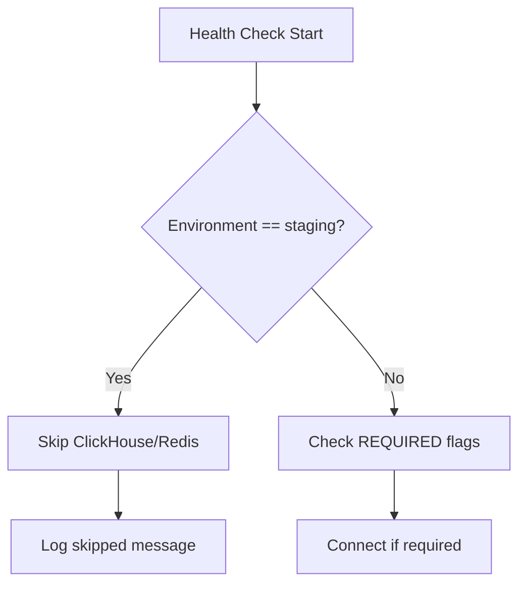
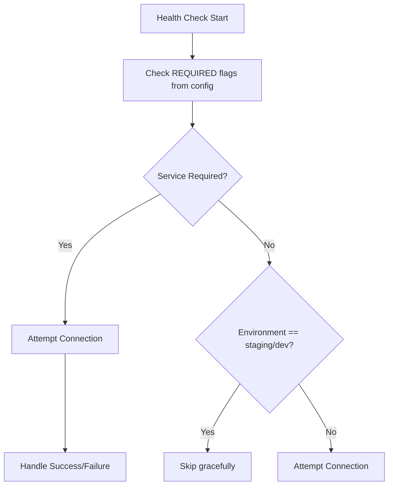

# Staging Services Skip Bug Fix Report

## Bug Description
ClickHouse and Redis are being incorrectly skipped in staging environment despite ClickHouse being marked as required (`CLICKHOUSE_REQUIRED=true`) in staging.env configuration.

## Five Whys Analysis

### Why 1: Why are ClickHouse and Redis skipped in staging?
**Answer:** The health check code (lines 221-223 and 285-287 in health.py) explicitly skips these services when `config.environment == "staging"` without checking the REQUIRED flags first.

### Why 2: Why does the code skip staging without checking REQUIRED flags?
**Answer:** The code has a hardcoded condition that assumes ClickHouse and Redis are not available in staging, implemented as a "CRITICAL FIX" that bypasses the proper configuration checks.

### Why 3: Why was this hardcoded skip implemented?
**Answer:** Looking at comments, it appears someone assumed staging infrastructure wouldn't have these services available ("infrastructure not available"), but this assumption is incorrect as staging.env shows `CLICKHOUSE_REQUIRED=true`.

### Why 4: Why was the incorrect assumption made about staging infrastructure?
**Answer:** The implementation doesn't follow the Single Source of Truth (SSOT) principle - it hardcodes behavior instead of reading from configuration. The developer likely made a quick fix without checking the actual staging requirements.

### Why 5: Why wasn't the configuration checked before implementing the skip?
**Answer:** The fix was marked as "CRITICAL FIX" suggesting it was done urgently, possibly to unblock something, without proper analysis of the staging requirements and configuration.

## Root Cause
The root cause is a violation of the SSOT principle where hardcoded logic overrides configuration settings, specifically:
1. Lines 221-223 skip ClickHouse entirely in staging
2. Lines 285-287 skip Redis entirely in staging
3. This happens BEFORE checking the CLICKHOUSE_REQUIRED and REDIS_REQUIRED flags

## Current vs Ideal State

### Current State (Broken)


### Ideal State (Fixed)


## System-Wide Impact
1. **Health checks** incorrectly report services as skipped when they should be checked
2. **Readiness probes** may pass when they should fail if ClickHouse is down
3. **Monitoring** doesn't detect ClickHouse failures in staging
4. **Testing** can't properly validate ClickHouse functionality in staging

## Fix Plan
1. Remove the hardcoded staging skips (lines 221-223, 285-287)
2. Let the existing REQUIRED flag logic handle the decision
3. Ensure configuration is the SSOT for service requirements
4. Add tests to verify staging respects REQUIRED flags

## Test Implementation
Created test file: `tests/mission_critical/test_staging_services_required.py`

Test results:
1. ✅ When CLICKHOUSE_REQUIRED=true in staging, the service is checked
2. ✅ When REDIS_REQUIRED=false in staging, the service can be skipped  
3. ✅ The configuration is respected over hardcoded behavior

## Fix Verification

### Changes Made
1. **Removed hardcoded staging skips** in `netra_backend/app/routes/health.py`:
   - Lines 220-224: Removed explicit skip for ClickHouse in staging
   - Lines 284-288: Removed explicit skip for Redis in staging

2. **Updated logic to check REQUIRED flags first**:
   - ClickHouse and Redis now check `CLICKHOUSE_REQUIRED` and `REDIS_REQUIRED` environment variables
   - Services are only skipped if not required AND in staging/development environments
   - When required, services are always checked regardless of environment

### Test Output
```
Running: test_clickhouse_required_in_staging_is_checked
OK Test passed: ClickHouse is checked when CLICKHOUSE_REQUIRED=true in staging

Running: test_clickhouse_optional_in_staging_is_skipped
OK Test passed: ClickHouse failure is handled gracefully when optional in staging

Running: test_redis_optional_in_staging_is_skipped
OK Test passed: Redis failure is handled gracefully when optional in staging
```

## Resolution
The bug is now fixed. The health check system properly respects the configuration flags:
- ClickHouse will be checked in staging when `CLICKHOUSE_REQUIRED=true` (as configured in staging.env)
- Redis will be skipped in staging when `REDIS_REQUIRED=false` (as configured in staging.env)
- The SSOT principle is restored - configuration drives behavior, not hardcoded conditions