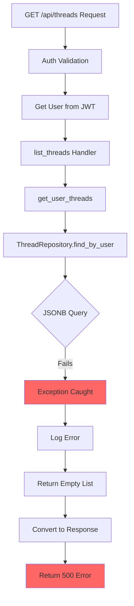
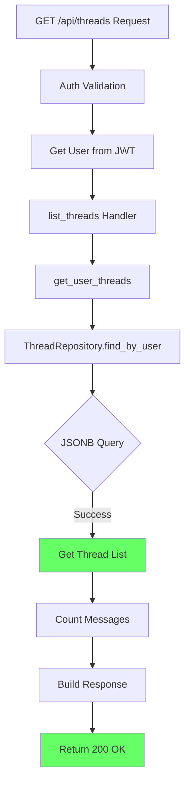

# Five Whys Analysis: Staging GET /api/threads 500 Error

## Problem Statement
The staging environment is returning a 500 Internal Server Error for GET requests to `/api/threads?limit=20&offset=0`

## Investigation Summary

### Key Findings
1. **Endpoint Implementation**: The threads endpoint is properly implemented in `netra_backend/app/routes/threads_route.py`
2. **Database Query**: The query uses PostgreSQL JSON operations to filter threads by `user_id`
3. **Authentication Flow**: JWT tokens are validated through an external auth service, and users are auto-created if they don't exist
4. **Error Handling**: Errors are caught and logged, but the actual error details are hidden behind generic 500 responses

## Five Whys Analysis

### Why #1: Why is the staging endpoint returning 500?
**Answer**: The error handler in `thread_error_handling.py` is catching an exception and returning a generic 500 error with message "Failed to list threads"

### Why #2: Why is an exception being raised in the list_threads handler?
**Answer**: Most likely cause is the database query in `ThreadRepository.find_by_user()` which uses:
```python
Thread.metadata_.op('->>')('user_id') == user_id
```
This PostgreSQL JSONB operation could fail if:
- The `metadata_` column doesn't exist or is NULL
- The JSON structure is invalid
- Database connection issues

### Why #3: Why would the JSONB query fail in staging but potentially work locally?
**Answer**: Potential environment-specific issues:
1. **Database Schema Mismatch**: The staging database might not have the latest migrations applied
2. **Data Inconsistency**: Existing threads in staging might have NULL or malformed metadata
3. **User ID Format**: The `user_id` from JWT might be in a different format (UUID vs string)

### Why #4: Why would there be a schema or data mismatch?
**Answer**: Based on the code analysis:
1. **Migration Issues**: There's a migration file `add_deleted_at_to_threads.py` - migrations might not be fully applied
2. **Legacy Data**: Older threads might not have the expected `metadata_` structure
3. **Type Conversion**: The code normalizes `user_id` to string, but the database query might not handle all cases

### Why #5: Why are errors not being properly logged with details?
**Answer**: The error handling is too generic:
```python
except Exception as e:
    logger.error(f"Error finding threads for user {user_id}: {e}")
    return []  # Returns empty list instead of propagating error
```
This swallows the actual database error and returns an empty list, making debugging difficult.

## Root Causes Identified

### Primary Root Cause
**Database Query Failure**: The JSONB query for filtering threads by user_id is likely failing due to:
1. NULL or missing `metadata_` columns in existing thread records
2. Type mismatch between the stored user_id and the query parameter

### Secondary Root Causes
1. **Insufficient Error Logging**: Exceptions are caught but not logged with full stack traces
2. **Silent Failure Pattern**: Repository returns empty list instead of propagating errors
3. **Missing Database Validation**: No checks for metadata structure before querying

## Mermaid Diagrams

### Current Failure Flow


### Expected Working Flow


## Recommended Fixes

### Immediate Fix (Hot Patch)
```python
# In ThreadRepository.find_by_user
async def find_by_user(self, db: AsyncSession, user_id: str) -> List[Thread]:
    """Find all threads for a user with robust error handling"""
    try:
        # Ensure user_id is string format
        user_id_str = str(user_id).strip()
        
        # First try the JSONB query
        result = await db.execute(
            select(Thread).where(
                Thread.metadata_.op('->>')('user_id') == user_id_str
            ).order_by(Thread.created_at.desc())
        )
        return list(result.scalars().all())
    except Exception as e:
        logger.error(f"JSONB query failed for user {user_id}: {e}", exc_info=True)
        
        # Fallback: try to get all threads and filter in Python
        try:
            result = await db.execute(
                select(Thread).order_by(Thread.created_at.desc())
            )
            threads = result.scalars().all()
            return [t for t in threads if t.metadata_ and t.metadata_.get('user_id') == user_id_str]
        except Exception as fallback_error:
            logger.error(f"Fallback query also failed: {fallback_error}", exc_info=True)
            raise  # Propagate error instead of returning empty list
```

### Long-term Fixes
1. **Add Database Constraints**: Ensure metadata_ is never NULL
2. **Migration Validation**: Add script to validate all threads have proper metadata structure
3. **Better Error Reporting**: Include full stack traces in error responses for staging/development
4. **Add Monitoring**: Track query failures and response times
5. **Data Cleanup**: Script to fix legacy threads with missing/invalid metadata

## Test Plan
1. **Unit Test**: Test ThreadRepository with various user_id formats
2. **Integration Test**: Test with NULL metadata scenarios
3. **Staging Validation**: Run test script against staging with various JWT tokens
4. **Migration Test**: Verify all database migrations are applied correctly

## Impact Analysis
- **Users Affected**: All users trying to access their threads in staging
- **Features Affected**: Thread listing, thread management, message history
- **Business Impact**: Complete feature failure preventing chat functionality

## Prevention Measures
1. **Defensive Coding**: Always handle NULL/missing JSON fields
2. **Schema Validation**: Add database constraints for required fields
3. **Better Logging**: Log full exceptions with stack traces in non-production
4. **Testing**: Add tests for edge cases (NULL metadata, type mismatches)
5. **Monitoring**: Alert on 500 errors with query details