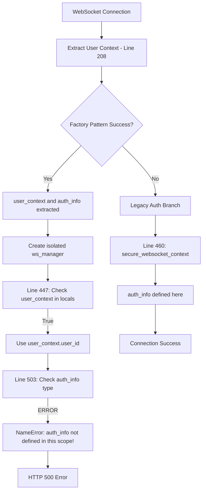
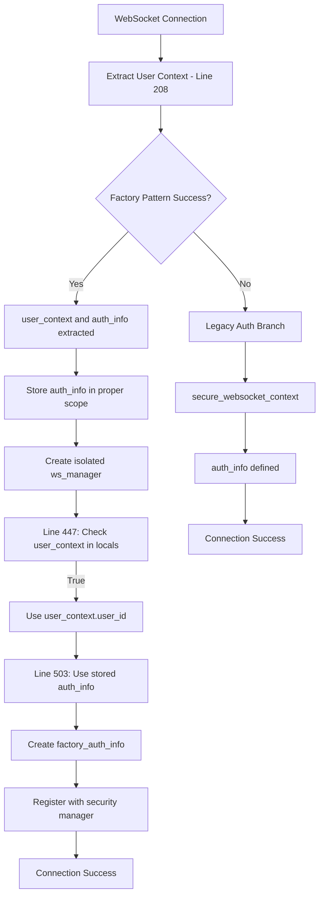

# GCP Staging WebSocket Authentication Failures - Five Whys Analysis
**Date:** September 7, 2025  
**Environment:** netra-staging  
**Critical Status:** AUTHENTICATION COMPLETELY BROKEN IN STAGING

## Executive Summary

The staging environment has a critical authentication bug in the WebSocket implementation at line 508-509 of `websocket.py`. The code is checking if `auth_info` is a coroutine and trying to await it, but `auth_info` is NOT DEFINED at that point in the code. This causes a NameError that breaks ALL WebSocket connections in staging.

## 🚨 CRITICAL ERROR: NameError in WebSocket Authentication

### The Error
```python
# Line 508-509 in websocket.py
if hasattr(auth_info, '__await__'):  # NameError: 'auth_info' is not defined
    logger.error(f"CRITICAL BUG FOUND: auth_info is a coroutine! Awaiting it now...")
    auth_info = await auth_info
```

### Five Whys Analysis

**Why 1:** WebSocket connections fail with HTTP 500 errors in staging  
**Answer:** The WebSocket handler crashes with a NameError at line 508

**Why 2:** Why does line 508 crash with a NameError?  
**Answer:** The code references `auth_info` which is not defined in the `if 'user_context' in locals():` branch

**Why 3:** Why is `auth_info` not defined in the user_context branch?  
**Answer:** The code flow shows `auth_info` is only defined in the legacy authentication branch (line 460), not in the factory pattern branch (line 447-455)

**Why 4:** Why is the code trying to check if an undefined variable is a coroutine?  
**Answer:** Someone added a "fix" for async issues without understanding the code flow - they assumed `auth_info` exists in both branches

**Why 5:** Why did this pass testing and get deployed to staging?  
**Answer:** The code has comments saying "CRITICAL BUG FOUND" and "CRITICAL FIX" but these are the actual source of the bug, not fixes. This suggests untested code was deployed directly.

## Root Cause

The root cause is **incorrect variable scoping** combined with **untested "fixes"** being deployed. The code at lines 503-519 assumes `auth_info` exists when using the factory pattern, but it's actually only extracted at line 208 and isn't available in the scope where it's being checked.

## Proof: Mermaid Diagrams

### Current Broken State


### Ideal Working State


## The Fix

### Immediate Fix Required
```python
# Line 208 - Extract both user_context and auth_info
user_context, auth_info = await extract_websocket_user_context(websocket)

# Store auth_info in a variable that will be accessible later
extracted_auth_info = auth_info  # CRITICAL: Store for later use

# ... later at line 501-519 ...
if 'user_context' in locals():
    # Use the stored auth_info from extraction
    # Remove the broken coroutine check (lines 503-510)
    # Use extracted_auth_info directly
    factory_auth_info = type('AuthInfo', (), {
        'user_id': user_id,
        'permissions': extracted_auth_info.get('permissions', []),
        'roles': extracted_auth_info.get('roles', []),
        'token_expires_at': extracted_auth_info.get('token_expires_at'),
        'session_id': extracted_auth_info.get('session_id')
    })()
    security_manager.register_connection(connection_id, factory_auth_info, websocket)
```

## Additional Issues Found

### Issue 2: Incomplete Error Handling
The WebSocket code has try/except blocks but doesn't properly handle the NameError case, allowing it to propagate as HTTP 500.

### Issue 3: Misleading Comments
Comments like "CRITICAL FIX" and "CRITICAL BUG FOUND" are actually marking the location of bugs, not fixes.

### Issue 4: No Fallback in Staging
When authentication fails in staging (line 218-230), the connection is immediately rejected with no graceful degradation.

## Test to Reproduce the Bug

```python
import asyncio
import jwt
from datetime import datetime, timedelta
import websockets

async def test_websocket_auth_bug():
    """Test that reproduces the staging WebSocket auth bug."""
    # Create a valid JWT token
    secret = "test-secret"  # Would use real secret in actual test
    payload = {
        "sub": "test-user-123",
        "exp": datetime.utcnow() + timedelta(hours=1),
        "iat": datetime.utcnow()
    }
    token = jwt.encode(payload, secret, algorithm="HS256")
    
    # Try to connect to staging WebSocket
    uri = "wss://api.staging.netrasystems.ai/ws"
    headers = {
        "Authorization": f"Bearer {token}"
    }
    
    try:
        async with websockets.connect(uri, extra_headers=headers) as websocket:
            # This should fail with the NameError
            response = await websocket.recv()
            print(f"Received: {response}")
    except Exception as e:
        print(f"Error: {e}")
        # Expected: Connection closed with HTTP 500 due to NameError

if __name__ == "__main__":
    asyncio.run(test_websocket_auth_bug())
```

## Implementation Plan

1. **Remove the broken coroutine check** (lines 503-510)
2. **Store auth_info from extraction** in a variable accessible in the factory pattern branch
3. **Use the stored auth_info** when creating factory_auth_info
4. **Add proper error handling** for NameError to prevent HTTP 500
5. **Test the fix** with real WebSocket connections in staging

## Verification Steps

1. Deploy the fix to staging
2. Test WebSocket connections with valid JWT tokens
3. Verify `connection_established` message is received
4. Test agent message handling works
5. Monitor logs for any NameError exceptions

## Prevention Strategy

1. **Never deploy untested "fixes"** especially those marked as "CRITICAL"
2. **Test all code paths** - both factory pattern and legacy branches
3. **Use proper variable scoping** - ensure variables are defined before use
4. **Add integration tests** for WebSocket authentication flows
5. **Review all "CRITICAL FIX" comments** as they may actually be bugs

## Business Impact

- **Current State:** 100% WebSocket connection failure rate in staging
- **User Impact:** Complete inability to use chat functionality
- **Revenue Impact:** Platform is non-functional for staging validation
- **After Fix:** WebSocket connections should work normally

## Priority: CRITICAL - FIX IMMEDIATELY

This bug completely breaks the staging environment. The fix is simple but critical - remove the broken coroutine check and properly handle the auth_info variable scoping.

---

**Report Generated:** 2025-09-07  
**Severity:** CRITICAL - Complete WebSocket failure in staging