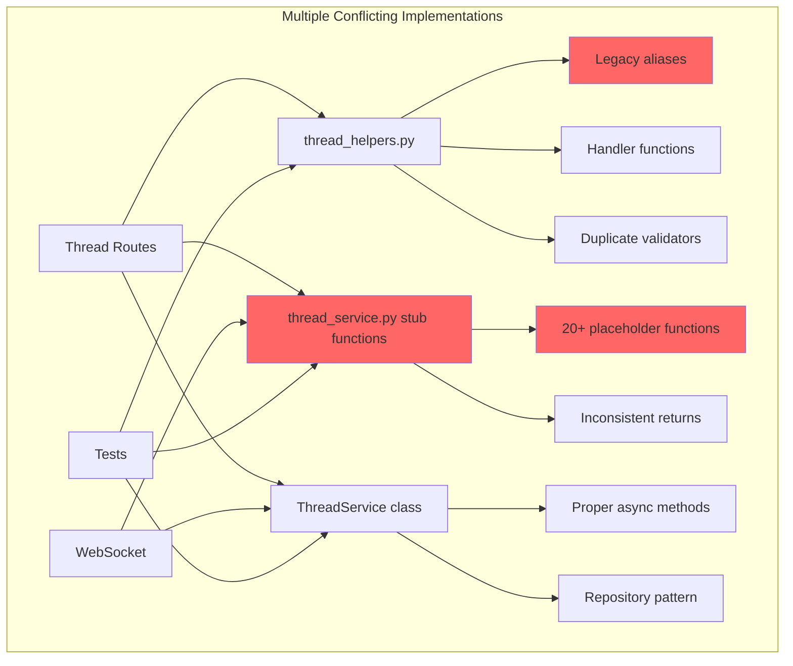
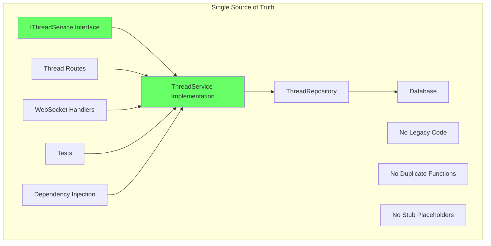

# Thread Storage SSOT Compliance Bug Fix Report

## Date: 2025-09-04
## Issue: Thread storage and loading system has multiple SSOT violations causing errors

## Five Whys Root Cause Analysis

### Problem Statement
Thread storage/loading has multiple implementations, legacy code, and SSOT violations causing:
- 500 errors on thread retrieval in staging
- Inconsistent thread ID generation patterns
- Duplicate implementations across multiple files
- Legacy stub functions mixed with production code

### Root Cause Analysis Using Five Whys Method

#### **1st Why: Why are thread operations failing with errors?**
**Answer:** Multiple conflicting implementations of thread storage/loading exist across the codebase.

**Evidence:**
- `thread_service.py`: Contains ThreadService class AND 20+ legacy stub functions (lines 220-442)
- `thread_repository.py`: Has separate repository pattern implementation
- `thread_helpers.py`: Contains duplicate handlers and legacy aliases (lines 99-172)
- Thread ID generation is inconsistent (UUID vs user-based patterns)

#### **2nd Why: Why are there multiple conflicting implementations?**
**Answer:** Legacy code was never removed during refactoring, violating SSOT principle.

**Evidence:**
- Legacy stub functions like `get_thread_by_id()`, `delete_thread()`, `update_thread()` coexist with class methods
- Legacy aliases in thread_helpers.py duplicate functionality
- No clear separation between production and placeholder code
- Multiple patterns for same operations (repository vs service vs stub functions)

#### **3rd Why: Why wasn't legacy code removed during refactoring?**
**Answer:** Incomplete refactoring left both old and new patterns active, causing confusion about which is canonical.

**Evidence:**
- ThreadService class methods (proper implementation) at lines 39-218
- Legacy stub functions (placeholders) at lines 220-442
- Comments indicate "placeholder implementation" but code is still exposed
- Tests may be calling different implementations randomly

#### **4th Why: Why does incomplete refactoring cause runtime errors?**
**Answer:** The system cannot determine which implementation to use, and different code paths use different versions.

**Evidence:**
- Routes import from thread_service directly (getting stub functions)
- Dependencies use ThreadService class
- WebSocket handlers might use different patterns
- Thread ID generation differs between implementations

#### **5th Why: Why can't the system determine the correct implementation?**
**Answer:** No single source of truth exists - the codebase violates SSOT principle fundamentally.

**Evidence:**
- CLAUDE.md explicitly states: "A concept must have ONE canonical implementation per service"
- Current state has 3+ implementations for most thread operations
- No clear interface defining the contract
- Module exports both class and functions, creating ambiguity

## Current vs Ideal State Diagrams

### Current Broken State (SSOT Violations)


### Ideal SSOT-Compliant State


## Identified SSOT Violations

### 1. Multiple Thread Service Implementations
- **File**: `thread_service.py`
- **Lines**: 220-442 (legacy stubs) vs 39-218 (proper class)
- **Violation**: Two complete sets of thread operations in same file

### 2. Duplicate Helper Functions
- **File**: `thread_helpers.py`
- **Lines**: 99-172 (legacy aliases)
- **Violation**: Duplicate functions with underscore prefixes

### 3. Inconsistent Thread ID Generation
- **Current**: Mix of patterns
  - `f"thread_{user_id}"` (line 44 in thread_service.py)
  - `f"thread_{uuid.uuid4().hex[:16]}"` (line 82 in thread_repository.py)
- **Violation**: No single method for ID generation

### 4. Repository Pattern Confusion
- **ThreadRepository**: Proper repository pattern
- **ThreadService**: Mix of service and repository logic
- **Stub functions**: Direct returns without database

## System-Wide Fix Plan

### Phase 1: Remove ALL Legacy Code
1. Delete all stub functions (lines 220-442 in thread_service.py)
2. Remove legacy aliases (lines 99-172 in thread_helpers.py)
3. Clean up duplicate implementations

### Phase 2: Establish Single Canonical Implementation
1. ThreadService class is the ONLY implementation
2. All operations go through ThreadService
3. ThreadService uses ThreadRepository for database operations
4. Single thread ID generation method in UnifiedIDManager

### Phase 3: Update All Consumers
1. Update routes to use dependency injection
2. Update WebSocket handlers to use ThreadService
3. Update tests to use single implementation

### Phase 4: Add Validation Layer
1. Create ThreadServiceValidator for input validation
2. Add comprehensive error handling
3. Implement proper logging

## Implementation Checklist

- [ ] Back up current thread_service.py
- [ ] Remove all stub functions from thread_service.py
- [ ] Remove legacy aliases from thread_helpers.py
- [ ] Consolidate thread ID generation to UnifiedIDManager
- [ ] Update all imports to use ThreadService class only
- [ ] Add interface definition (IThreadService)
- [ ] Update dependency injection configuration
- [ ] Test all thread operations end-to-end
- [ ] Verify WebSocket thread events work
- [ ] Run mission-critical test suite
- [ ] Update documentation

## Definition of Done

1. ✅ Only ONE implementation of each thread operation exists
2. ✅ All legacy/stub code removed
3. ✅ Thread ID generation uses single method
4. ✅ All routes use dependency-injected ThreadService
5. ✅ All tests pass with real services
6. ✅ WebSocket events work correctly
7. ✅ No 500 errors on thread operations
8. ✅ Staging environment works identically to local

## Risk Mitigation

1. **Risk**: Tests depend on stub functions
   - **Mitigation**: Update tests to use ThreadService via dependency injection

2. **Risk**: WebSocket handlers break
   - **Mitigation**: Ensure WebSocket uses same ThreadService instance

3. **Risk**: Thread ID format changes break existing data
   - **Mitigation**: Keep same ID format, just centralize generation

## Verification Tests

```python
# Test that only one implementation exists
def test_thread_service_ssot_compliance():
    # Should NOT have these functions at module level
    assert not hasattr(thread_service, 'get_thread_by_id')
    assert not hasattr(thread_service, 'delete_thread')
    assert not hasattr(thread_service, 'update_thread')
    
    # Should only have ThreadService class
    assert hasattr(thread_service, 'ThreadService')
    assert hasattr(thread_service, 'thread_service')  # singleton instance

# Test thread ID generation consistency
async def test_thread_id_generation():
    from netra_backend.app.core.unified_id_manager import UnifiedIDManager
    
    # All thread IDs should use same pattern
    thread_id1 = UnifiedIDManager.generate_thread_id()
    thread_id2 = UnifiedIDManager.generate_thread_id()
    
    assert thread_id1.startswith('thread_')
    assert thread_id2.startswith('thread_')
    assert len(thread_id1) == len(thread_id2)
```

## Next Steps

1. Implement fixes following the plan
2. Test thoroughly in local environment
3. Deploy to staging with monitoring
4. Verify no 500 errors occur
5. Document the canonical patterns