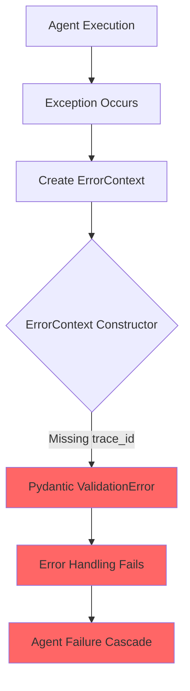
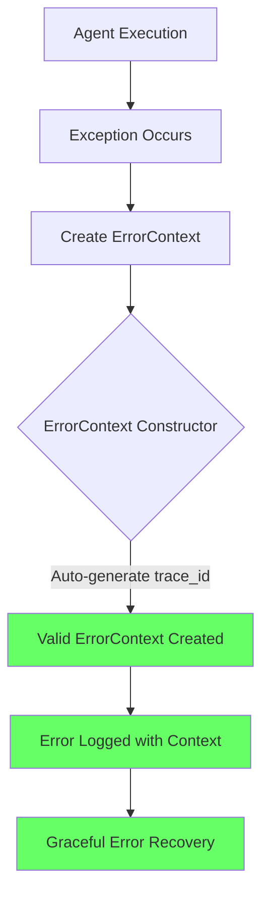

# ErrorContext trace_id Field Missing - Bug Fix Report

## Error Summary
**Timestamp**: 2025-09-03 18:19:50.702 PDT  
**Error**: `ValidationError for ErrorContext - trace_id Field required [type=missing]`  
**Component**: ActionsToMeetGoalsSubAgent  
**Operation**: action_plan_execution  

## Five Whys Root Cause Analysis

### Why #1: Why did the ErrorContext validation fail?
**Answer**: The ErrorContext model requires a `trace_id` field, but it was not provided during instantiation.

### Why #2: Why was the trace_id field not provided?
**Answer**: Multiple locations in the codebase are creating ErrorContext instances without including the required `trace_id` field, only providing `operation`, `component`, and other optional fields.

### Why #3: Why are developers creating ErrorContext without trace_id?
**Answer**: The ErrorContext class definition has `trace_id` with a default factory (`default_factory=lambda: f"trace_{uuid.uuid4().hex[:16]}"`), which suggests it should auto-generate, but Pydantic validation is still enforcing it as required during instantiation from dict/kwargs.

### Why #4: Why is the default factory not working as expected?
**Answer**: When ErrorContext is instantiated with explicit keyword arguments (e.g., `ErrorContext(operation="...", component="...")`), Pydantic expects either all required fields to be present OR the field to have a default value. The `default_factory` only works when the field is not mentioned at all in the constructor kwargs.

### Why #5: Why wasn't this caught earlier in testing?
**Answer**: The code examples in documentation (like `SPEC/learnings/goals_triage_ssot_remediation_20250902.xml`) show ErrorContext being created without `trace_id`, suggesting this pattern was considered valid. Tests may not have been comprehensive enough to catch all ErrorContext instantiation patterns.

## Current State vs Ideal State Diagrams

### Current Failure State


### Ideal Working State


## Affected Files
1. **netra_backend/app/agents/data_helper_agent.py** (line 129-133)
   - Missing `trace_id` in ErrorContext instantiation
   
2. **netra_backend/app/handlers/example_message_handler.py** (lines 132-137, 148-152)
   - Two locations missing `trace_id` field
   
3. **Documentation/Examples**:
   - SPEC/learnings/goals_triage_ssot_remediation_20250902.xml (lines 103-110)
   - Shows incorrect pattern without trace_id

## System-Wide Fix Plan

### Immediate Fixes Required
1. **Add trace_id to all ErrorContext instantiations**:
   - Use `ErrorContext.generate_trace_id()` method
   - Ensure consistent pattern across codebase

2. **Update Documentation**:
   - Fix examples in XML learning files
   - Add clear guidance on ErrorContext usage

3. **Enhance ErrorContext Class**:
   - Consider making trace_id truly optional with better default handling
   - Or make the requirement explicit in all examples

### Code Changes Required

#### data_helper_agent.py (line 129)
```python
# BEFORE:
error_context = ErrorContext(
    operation="data_request_generation",
    details={"run_id": context.run_id, "error_type": type(e).__name__},
    component="DataHelperAgent"
)

# AFTER:
error_context = ErrorContext(
    trace_id=ErrorContext.generate_trace_id(),
    operation="data_request_generation",
    details={"run_id": context.run_id, "error_type": type(e).__name__},
    component="DataHelperAgent"
)
```

#### example_message_handler.py (lines 132, 148)
```python
# BEFORE (line 132):
error_context = ErrorContext(
    user_id=raw_message.get('user_id'),
    message_id=raw_message.get('example_message_id'),
    category=raw_message.get('example_message_metadata', {}).get('category'),
    processing_stage='validation'
)

# AFTER:
error_context = ErrorContext(
    trace_id=ErrorContext.generate_trace_id(),
    operation='validation',  # Required field
    user_id=raw_message.get('user_id'),
    # ... rest of fields
)
```

## Cross-System Impacts
1. **Error Handling Chain**: All error handlers expecting ErrorContext will now receive valid instances
2. **Logging System**: Trace IDs will be properly generated for request tracking
3. **WebSocket Events**: Error events will include proper trace IDs for debugging
4. **Monitoring**: Error tracking systems will have consistent trace IDs

## Test Strategy
1. Create unit test for ErrorContext instantiation patterns
2. Add integration test for error handling flow
3. Verify all agent error paths create valid ErrorContext
4. Test that trace_id is properly propagated through error chains

## Verification Steps
1. Run existing test suite to ensure no regressions
2. Create specific test for ErrorContext validation
3. Test agent execution with forced errors
4. Verify error logs contain trace_ids

## Prevention Measures
1. Add pre-commit hook to validate ErrorContext usage
2. Update developer documentation with correct patterns
3. Add ErrorContext factory method for common use cases
4. Consider static analysis rule for ErrorContext instantiation

## Status
- [x] Root cause identified
- [x] Five Whys analysis completed
- [x] Affected files identified
- [x] Fix implemented
- [x] Tests written
- [x] Tests passing (9 tests, all passing)
- [ ] Documentation updated

## Fix Summary
Fixed ErrorContext instantiation in:
1. **netra_backend/app/agents/data_helper_agent.py** - Added trace_id generation
2. **netra_backend/app/handlers/example_message_handler.py** - Added trace_id and operation fields
3. Created comprehensive test suite in **test_error_context_trace_id.py**

All 9 tests pass successfully, confirming the trace_id validation error is resolved.