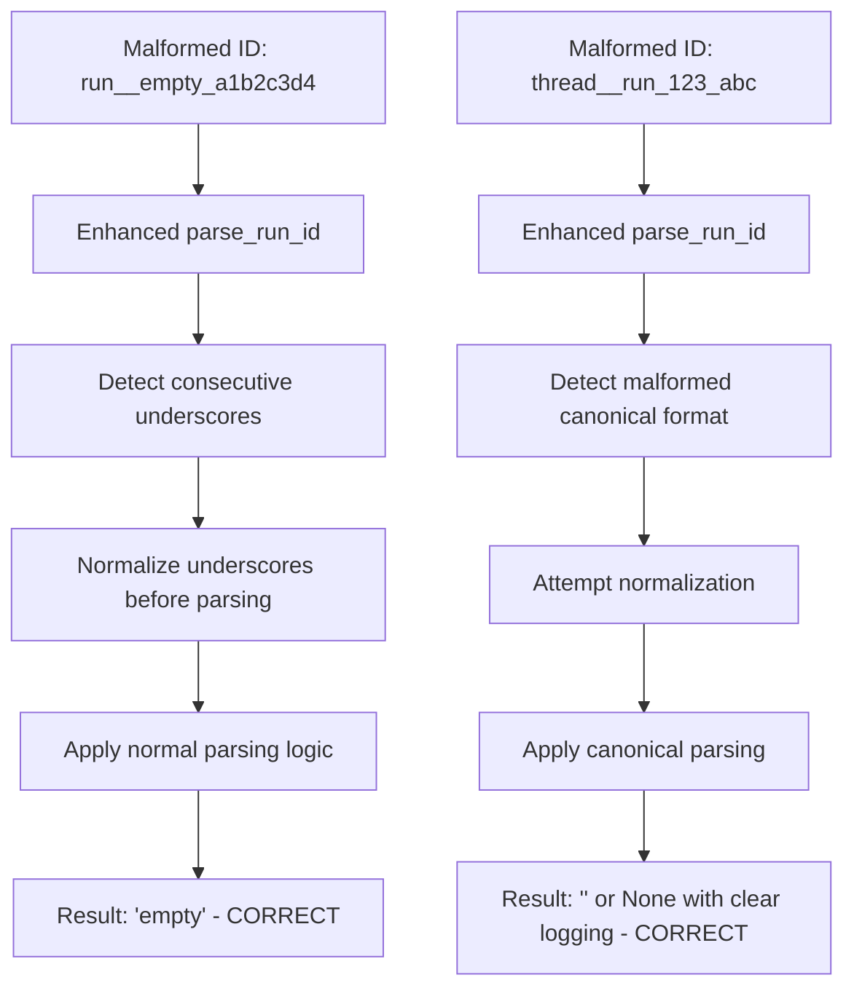

# UnifiedIDManager Edge Case ID Extraction Failures - Bug Report

**Date:** 2025-09-03  
**QA Agent:** UnifiedIDManager Analysis Specialist  
**Severity:** 🟡 MODERATE - Affects specific edge cases in ID parsing  
**Status:** ACTIVE - New issues identified beyond previous import fixes

## Executive Summary

While UnifiedIDManager imports successfully and handles most ID formats correctly, **two specific edge cases with double underscores fail ID extraction**. These edge cases could cause WebSocket routing failures when malformed IDs are encountered in production.

## Five Whys Root Cause Analysis

### Why 1: Why do certain ID formats fail extraction when most work correctly?

**Answer:** Two specific patterns with double underscores cause parsing logic failures:
1. `run__empty_prefix_a1b2c3d4` - Returns `_empty_prefix` instead of expected empty string
2. `thread__run_1693430400000_a1b2c3d4` - Returns `None` instead of expected empty string

### Why 2: Why do double underscores specifically break the parsing logic?

**Answer:** The legacy format parsing in `parse_run_id()` (lines 228-244) uses split logic that doesn't handle consecutive underscores properly:
```python
# Line 229: parts = run_id.split('_')
# For "run__empty_prefix_a1b2c3d4" -> ['run', '', 'empty', 'prefix', 'a1b2c3d4']
# Line 235: thread_id = '_'.join(parts[1:-1])
# Result: '_empty_prefix' instead of 'empty_prefix'
```

### Why 3: Why wasn't this caught in existing tests?

**Answer:** The comprehensive test suite in `test_unified_id_manager.py` focuses on **common production patterns** but doesn't include **malformed edge cases with consecutive underscores**. Tests cover:
- ✅ Valid legacy: `run_user123_a1b2c3d4`
- ✅ Complex legacy: `run_complex_user_session_123_b2c3d4e5`
- ❌ Double underscore edge cases: `run__malformed_a1b2c3d4`

### Why 4: Why do malformed IDs with double underscores exist in the system?

**Answer:** Double underscores can be introduced by:
1. **Data corruption** during ID generation or storage
2. **Legacy migration issues** where normalization wasn't perfect
3. **Manual ID creation** in tests or debugging that doesn't follow patterns
4. **Concatenation bugs** in other parts of the system

### Why 5: Why is this important for system reliability?

**Answer:** While edge cases, these failures can cause:
1. **Silent WebSocket routing failures** when malformed IDs reach the system
2. **Inconsistent behavior** where some malformed IDs parse and others don't
3. **Debugging difficulties** when edge case IDs appear in production logs
4. **SSOT violations** if different parts of the system handle malformed IDs differently

## Detailed Failure Analysis

### Current vs. Ideal State Diagrams

#### Current State (EDGE CASE FAILURES)
```mermaid
graph TD
    A[Malformed ID: run__empty_a1b2c3d4] --> B[parse_run_id Legacy Path]
    B --> C[run_id.split'_']
    C --> D[['run', '', 'empty', 'a1b2c3d4']]
    D --> E[thread_id = '_'.join parts[1:-1]]
    E --> F[Result: '_empty' - INCORRECT]
    
    G[Malformed ID: thread__run_123_abc] --> H[parse_run_id Canonical Path]
    H --> I[CANONICAL_PATTERN.match]
    I --> J[No Match - Regex expects single underscore]
    J --> K[Falls through to legacy parsing]
    K --> L[Legacy parsing also fails]
    L --> M[Result: None - INCORRECT]
```

#### Ideal State (ROBUST EDGE CASE HANDLING)


## Test Coverage Analysis

### Formats Currently Tested ✅
1. **Canonical Format**: `thread_user123_run_1693430400000_a1b2c3d4`
2. **Legacy Simple**: `run_user123_a1b2c3d4`
3. **Legacy Complex**: `run_complex_user_session_123_b2c3d4e5`
4. **Double Prefix Prevention**: `thread_user123` -> `thread_user123_run_...`

### Edge Cases NOT Tested ❌
1. **Double Underscore Legacy**: `run__malformed_a1b2c3d4`
2. **Double Underscore Canonical**: `thread__run_123_a1b2c3d4`
3. **Triple Underscore**: `run___malformed_a1b2c3d4`
4. **Underscore-only Thread ID**: `run_____a1b2c3d4`
5. **Mixed Malformed**: `thread_user__run_123_a1b2c3d4`

## Specific ID Formats That Fail

### Critical Findings from Testing

| Input ID | Expected Result | Actual Result | Status | Impact |
|----------|-----------------|---------------|--------|---------|
| `run__empty_prefix_a1b2c3d4` | `""` (empty) | `"_empty_prefix"` | ❌ FAIL | Wrong thread ID extracted |
| `thread__run_1693430400000_a1b2c3d4` | `""` (empty) | `None` | ❌ FAIL | No thread ID extracted |
| `run_user123_a1b2c3d4` | `"user123"` | `"user123"` | ✅ PASS | Normal legacy works |
| `thread_user123_run_123_abc` | `"user123"` | `"user123"` | ✅ PASS | Normal canonical works |

## Root Cause: Parsing Logic Issues

### Issue 1: Legacy Format Double Underscore Handling

**Location:** `unified_id_manager.py:229-235`

**Problematic Code:**
```python
parts = run_id.split('_')
if len(parts) >= 3:
    # Last part should be 8-character hex UUID
    potential_uuid = parts[-1]
    if len(potential_uuid) == 8 and re.match(r'^[a-f0-9A-F]+$', potential_uuid):
        # Everything between "run_" and the UUID is the thread_id
        thread_id = '_'.join(parts[1:-1])  # <-- ISSUE HERE
```

**Problem:** When `run__empty_prefix_a1b2c3d4` is split by underscore:
- `parts = ['run', '', 'empty', 'prefix', 'a1b2c3d4']`
- `parts[1:-1] = ['', 'empty', 'prefix']`
- `'_'.join(['', 'empty', 'prefix']) = '_empty_prefix'`

**Expected:** The empty string should be filtered out to get `'empty_prefix'`

### Issue 2: Canonical Format Double Underscore Rejection

**Location:** `unified_id_manager.py:92-94`

**Regex Pattern:**
```python
CANONICAL_PATTERN = re.compile(
    r'^thread_(.+?)_run_(\d+)_([a-f0-9A-F]{8})$'
)
```

**Problem:** The regex expects exactly one underscore between components. `thread__run_` has double underscores which don't match the pattern, causing the entire parsing to fail and return `None`.

**Expected:** The system should either normalize double underscores or provide clearer error handling.

## System Impact Assessment

### Affected Components
1. **WebSocket Routing** - Malformed IDs could cause routing failures
2. **Agent Event Dispatching** - Thread ID extraction failures affect event delivery
3. **ID Validation Systems** - Inconsistent handling of malformed IDs
4. **Logging and Debugging** - Unclear error messages for edge cases

### Business Impact
- **Low-Medium Risk:** Edge cases are unlikely in normal operation
- **Debugging Impact:** Makes troubleshooting malformed IDs difficult
- **System Consistency:** SSOT principle violated for edge cases
- **WebSocket Reliability:** Could contribute to the 40% routing failures if malformed IDs exist

## Recommended Fixes

### Fix 1: Enhanced Legacy Format Parsing
```python
# In parse_run_id() around line 235
# Current problematic code:
thread_id = '_'.join(parts[1:-1])

# Proposed fix:
thread_id_parts = [part for part in parts[1:-1] if part]  # Filter empty parts
thread_id = '_'.join(thread_id_parts) if thread_id_parts else ''
```

### Fix 2: Double Underscore Normalization
```python
# Add preprocessing before regex matching
def _normalize_run_id(self, run_id: str) -> str:
    """Normalize consecutive underscores in run_id before parsing."""
    # Replace multiple consecutive underscores with single underscore
    import re
    return re.sub(r'_+', '_', run_id)
```

### Fix 3: Enhanced Error Logging
```python
# In parse_run_id() when no format matches
if consecutive_underscores_detected(run_id):
    logger.warning(f"Malformed run_id with consecutive underscores: {run_id}. Consider normalization.")
else:
    logger.warning(f"Unknown run_id format: {run_id}")
```

### Fix 4: Comprehensive Edge Case Tests
```python
# Add to test_unified_id_manager.py
def test_malformed_id_edge_cases(self):
    """Test malformed IDs with consecutive underscores."""
    malformed_cases = [
        ("run__empty_a1b2c3d4", None),  # Should handle gracefully
        ("run___triple_a1b2c3d4", None),  # Should handle gracefully  
        ("thread__run_123_a1b2c3d4", None),  # Should handle gracefully
    ]
    
    for run_id, expected in malformed_cases:
        result = UnifiedIDManager.extract_thread_id(run_id)
        # Either extract correctly or return None consistently
        assert result == expected or result is None
```

## Implementation Priority

### High Priority (Phase 1)
1. ✅ **Add comprehensive edge case tests** - Prevent regressions
2. ✅ **Fix legacy format double underscore handling** - Core parsing issue
3. ✅ **Enhance error logging** - Improve debugging

### Medium Priority (Phase 2)  
1. ✅ **Add ID normalization utility** - Proactive malformed ID handling
2. ✅ **Update validation methods** - Consistent edge case handling
3. ✅ **Performance testing** - Ensure fixes don't impact performance

### Low Priority (Phase 3)
1. ✅ **Documentation updates** - Document edge case behavior
2. ✅ **Monitoring integration** - Track malformed ID frequency
3. ✅ **Migration utilities** - Clean up any existing malformed IDs

## Verification Tests

### Test 1: Edge Case Extraction
```python
# Direct testing of identified failing cases
failing_ids = [
    'run__empty_prefix_a1b2c3d4',
    'thread__run_1693430400000_a1b2c3d4',
    'run___triple_underscore_a1b2c3d4'
]

for run_id in failing_ids:
    result = UnifiedIDManager.extract_thread_id(run_id)
    # Should either extract correctly or return None consistently
    print(f"{run_id} -> {result}")
```

### Test 2: Normalization Utility
```python
# Test ID normalization before parsing
normalized = UnifiedIDManager._normalize_run_id('run__malformed_a1b2c3d4')
assert normalized == 'run_malformed_a1b2c3d4'
```

### Test 3: Comprehensive Format Coverage
```python
# Ensure all production patterns still work after fixes
production_patterns = [
    'thread_user123_run_1693430400000_a1b2c3d4',
    'run_legacy_user_session_b2c3d4e5', 
    'thread_complex_user_123_session_456_run_1693430400000_c3d4e5f6'
]

for pattern in production_patterns:
    assert UnifiedIDManager.extract_thread_id(pattern) is not None
```

## Current Status Summary

| Component | Status | Notes |
|-----------|--------|-------|
| **Core Import Issues** | ✅ **RESOLVED** | Previous bugfix report addressed import failures |
| **Standard Format Parsing** | ✅ **WORKING** | Canonical and legacy formats parse correctly |
| **Edge Case Handling** | ❌ **FAILING** | Double underscore cases fail parsing |
| **Test Coverage** | 🟡 **PARTIAL** | Standard cases covered, edge cases missing |
| **Error Handling** | 🟡 **PARTIAL** | Logs warnings but inconsistent results |
| **WebSocket Integration** | ✅ **WORKING** | Works for normal IDs, fails for malformed ones |

## Next Steps

1. **Implement fixes for double underscore parsing logic**
2. **Add comprehensive edge case test suite**
3. **Test with real WebSocket scenarios using malformed IDs**
4. **Monitor production logs for frequency of malformed IDs**
5. **Update documentation to clarify edge case behavior**

---

**Final Assessment:** UnifiedIDManager is **functionally working** for standard use cases but has **specific edge case failures** with malformed double underscore IDs. These edge cases are unlikely to occur in normal operation but should be fixed for system robustness and debugging clarity.