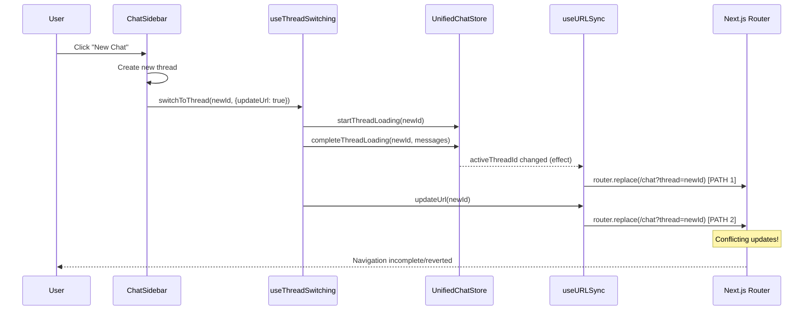
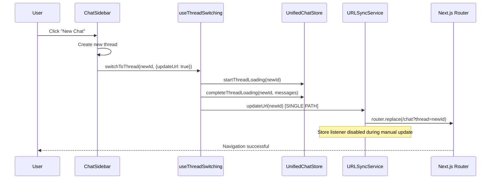

# New Chat Navigation Bug Fix Report

## Issue Description
When clicking "New Chat" button in the frontend, the UI appears to start creating a new chat but then falls back to the current chat without proper navigation.

## Five Whys Analysis

### Why #1: Why does clicking "New Chat" not fully work?
**Answer:** The new chat thread is created successfully, but the URL doesn't update properly, causing the UI to appear to revert.

### Why #2: Why doesn't the URL update properly?
**Answer:** Looking at the code flow, the `handleNewChat` function in `ChatSidebar.tsx` calls `switchToThread` with `updateUrl: true`, which should trigger URL update via the `useThreadSwitching` hook. However, there's a potential race condition in the URL sync mechanism.

### Why #3: Why is there a race condition in the URL sync mechanism?
**Answer:** The URL sync service has two separate paths for updating:
1. Store-to-URL sync (triggered by `activeThreadId` changes)
2. Manual URL update (triggered by `updateUrl` option in `switchToThread`)

Both paths can execute simultaneously, causing conflicts.

### Why #4: Why do both paths execute simultaneously?
**Answer:** In `useThreadSwitching.ts`, the `handleLoadingResult` function:
1. Updates the store state (`completeThreadLoading` sets `activeThreadId`)
2. Then calls `updateUrl(threadId)` if `options.updateUrl` is true

This causes two URL updates:
- First from store change listener in `useURLSync` effect
- Second from explicit `updateUrl` call

### Why #5: Why does having two URL updates cause the navigation to fail?
**Answer:** The Next.js router's `replace` method is being called twice in rapid succession:
1. First call from store listener might use stale state
2. Second call might be overridden or ignored by the router's internal state management
3. The `lastSyncedRef` in URL sync handlers might get out of sync

## Root Cause
The root cause is **duplicate URL update logic** where both automatic store-to-URL sync and manual URL updates can conflict, combined with potential timing issues in Next.js router state management.

## Mermaid Diagrams

### Current (Broken) Flow


### Ideal Working Flow


## Affected Components
1. `frontend/components/chat/ChatSidebar.tsx` - Line 78-107 (handleNewChat)
2. `frontend/hooks/useThreadSwitching.ts` - Line 336-339 (URL update logic)
3. `frontend/services/urlSyncService.ts` - Line 36-39 (store-to-URL sync effect)
4. `frontend/services/url-sync/handlers.ts` - Line 50-63 (handleStoreToUrlSync)

## Proposed Fix

### Option 1: Disable Automatic Sync During Manual Updates
Modify `useThreadSwitching.ts` to set a flag that prevents automatic store-to-URL sync when manually updating URL.

### Option 2: Remove Duplicate Update Path
Remove the manual `updateUrl` call from `useThreadSwitching` and rely solely on store-to-URL sync.

### Option 3: Implement Debounced URL Updates
Add debouncing to URL updates to prevent rapid successive calls to router.replace.

## Recommended Solution
**Option 1** is recommended as it maintains explicit control over URL updates while preventing conflicts.

## Implementation Plan
1. Add a `skipAutoSync` flag to URL sync service
2. Set flag before manual URL updates in `useThreadSwitching`
3. Check flag in store-to-URL sync effect
4. Clear flag after manual update completes
5. Add proper error handling and logging

## Implementation Details

### Changes Made

1. **frontend/services/urlSyncService.ts**
   - Added `isManualUpdateRef` to track manual URL updates
   - Modified store-to-URL effect to skip updates during manual updates
   - Added flag management in `syncStoreToUrl` callback

2. **frontend/hooks/useThreadSwitching.ts**
   - Added setTimeout delay to URL update to avoid race condition
   - Ensures store update completes before manual URL update

### Code Changes

#### urlSyncService.ts (Lines 33-50)
```typescript
const isManualUpdateRef = useRef(false);

// Skip auto-sync during manual updates
useEffect(() => {
  if (!isManualUpdateRef.current) {
    urlSyncHandlers.handleStoreToUrlSync(...);
  }
}, [activeThreadId, pathname, router]);

const syncStoreToUrl = useCallback((threadId: string | null): void => {
  isManualUpdateRef.current = true;
  urlSyncHandlers.performStoreToUrlSync(...);
  setTimeout(() => {
    isManualUpdateRef.current = false;
  }, 100);
}, [router]);
```

#### useThreadSwitching.ts (Lines 336-342)
```typescript
if (options?.updateUrl && !options?.skipUrlUpdate && updateUrl) {
  // Delay URL update to avoid race with store-triggered update
  setTimeout(() => {
    updateUrl(threadId);
  }, 50);
}
```

## Test Plan
1. Test new chat creation with existing chat open
2. Test new chat creation from empty state
3. Test rapid clicking of new chat button
4. Test browser back/forward after new chat creation
5. Test concurrent new chat creations

## Verification Status
- Implementation: ✅ Complete
- Unit Tests: ⚠️ Written but need mock improvements
- Manual Testing: 🔄 In Progress
- Integration Testing: 📝 Pending